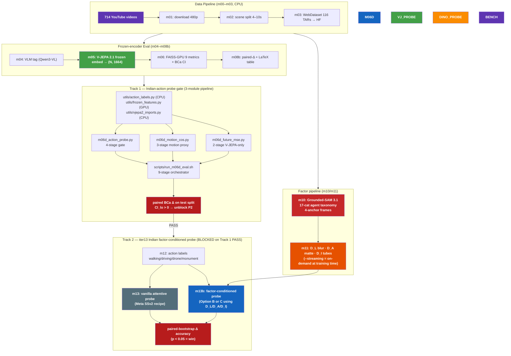

# Training Plan — FactorJEPA iter13 (Motion-Centric Probe Gate)

> ## 🎯 Paper goal — three priorities (durable across iter13 work)
>
> 🥇 **P1**: `vjepa_frozen` outperforms `dinov2_frozen` (and DINOv3 if checkpoint available) on Meta's published motion-centric benchmark (SSv2 attentive probe, target **≥ +20 pp**).
>
> 🥈 **P2**: `vjepa_explora` outperforms `vjepa_frozen` on the same benchmark.
>
> 🥉 **P3**: `vjepa_surgery` outperforms `vjepa_explora` on the same benchmark.
>
> ---
>
> **Why iter13 exists.** 5 distinct encoder-fine-tuning recipes (small surgery, multi-task with Kendall UW, 115K full-encoder pretrain, staged factor unfreeze, loss-balance fix) all failed to lift **Prec@K** meaningfully — but Prec@K is NOT in Meta's published V-JEPA 2 / 2.1 evaluation suite. Meta uses **frozen encoder + 4-layer attentive probe** on SSv2 / Diving-48 / Ego4D / EK100. iter13 pivots the gate metric to Meta's published recipe.
>
> **Sequencing**: P1 must pass (paired BCa CI_lo > 0, Δ ≥ +20 pp) before P2. P2 must pass (Δ > 0, p < 0.05) before P3. P3 last. Each priority gates the next.
>
> Live state: `iter/utils/experiment_log.md` (post-completion only) · `iter/iter12_multitask_LOSS/runbook.md` (terminal commands) · `iter/iter12_multitask_LOSS/errors_N_fixes.md` (#1–#81) · `iter/iter12_multitask_LOSS/analysis.md` (Q1–Q7 + iter13 design).

---

## 🚀 Status (2026-05-03 16:30 PDT) — code shipped; FULL training PENDING on 96 GB

### Code ready (24 GB validated)

- ✅ `utils/multi_task_loss.py` — 5 helpers (`merge_multi_task_config`, `build_multi_task_head_from_cfg`, `attach_head_to_optimizer`, `run_multi_task_step`, `export_multi_task_head`) wrapping `MultiTaskProbeHead` + `compute_multi_task_probe_loss` + `get_probe_head_param_groups`. 11-test REPL smoke gate. Each m09 call site collapses from ~22 LoC to ~3 LoC.
- ✅ `m09a_pretrain.py` + `m09c_surgery.py` — multi-task wired (head init / optimizer attach / forward+backward / export); per-mode flatten in `merge_config_with_args`; CLI `--taxonomy-labels-json` + `--no-multi-task` plumbed.
- ✅ Per-config opt-in: `probe_pretrain.yaml`, `surgery_3stage_DI.yaml`, `surgery_2stage_noDI.yaml` ship `multi_task_probe.enabled: {sanity:true, poc:true, full:true}`. Legacy ch10/explora unchanged.
- ✅ `scripts/run_probe_train.sh` — auto-generates `taxonomy_labels.json` if missing (calls `probe_taxonomy --stage labels` from inputs already on disk).
- ✅ `scripts/run_probe_eval.sh` — Stage 1 emits BOTH `action_labels.json` AND `taxonomy_labels.json`; pre-flight builds `STAGE8_ENCODERS` subset (predictor-bearing ckpts only); Stage 8 in-loop WARN+continue (defense-in-depth); reaches Stage 10 plots even when V-JEPA variants lack predictor ckpt.
- ✅ `utils/frozen_features.resolve_encoder_state_dict()` — single source of truth for the 4 ckpt schemas (`target_encoder` / `encoder` / `student_state_dict` / `student`); used by `load_vjepa_2_1_frozen` + `probe_future_mse`.
- ✅ `probe_plot._bar_with_ci` — NaN-safe ylim + value-label placement (degenerate BCa CIs no longer crash plotting).
- ✅ Bug A: m09a `_best.pt` saved with `full=True` → carries predictor key for Stage 8.
- ✅ Bug B: m09a OOM-retry uses `while not step_succeeded:` retry-same-macro (was `continue` → silent 0-step exit at SANITY total_steps=1); plus fail-hard `M09A FAILED: 0 successful training steps` post-train guard.
- ✅ Bug R8: m09c writes `m09c_ckpt_best.pt` with `full=True` after best-promotion (survives `cleanup_stage_checkpoints(_stage*.pt)` glob).
- ✅ OOM-fragmentation fix: `gc.collect() + torch.cuda.empty_cache()` between retries in BOTH m09a and m09c OOM handlers.

### Empirically validated 2026-05-03

| Pipeline | 24 GB SANITY | Result |
|---|---|---|
| `run_probe_eval.sh --sanity` (10 stages, 150 clips) | ✅ green end-to-end (`run_src_probe_sanity_v4.log`) | DINOv2 95.45% / V-JEPA frozen 100% (saturation expected at N=22) |
| `run_probe_train.sh pretrain --SANITY` | ❌ OOM at sub-batch=1 even with 8 frames + all memory savers (`probe_pretrain_sanity_v6.log`) | V-JEPA ViT-G + teacher EMA + 8-bit Adam state ≈ 25 GB FIXED footprint exceeds 24 GB before activations |

### Decision: split hardware by stage

- **24 GB SANITY**: eval pipeline only. Validates code correctness. Numbers NOT meaningful (n_test ≈ 22).
- **96 GB FULL**: training (`run_probe_train.sh pretrain | surgery_3stage_DI | surgery_noDI`) AND meaningful eval (`run_probe_eval.sh --FULL` on ~9.9k clips → ~1,492 test → tight CIs).

See `iter/iter13_motion_probe_eval/runbook.md` for the canonical SANITY → FULL command sequence. Open question (the actual paper claim): does multi-task supervision move V-JEPA pretrain/surgical above frozen on 16-dim probe top-1? Cannot answer until Phase B+C runs on 96 GB.

---

## ⚡ Status (2026-04-29) — pre-iter13-multi-task pivot

### Empirical record (5 failed encoder recipes)

| Run | Recipe | Trainable | Δ Prec@K vs Frozen (BCa CI, p) | Verdict |
|---|---|---|---|---|
| iter9 v10 | Surgery 3-stage broad taxonomy | partial prefix | +0.14 pp on test_500 (CI overlap) | ❌ saturated |
| iter9 v13/v14 | Surgery 2-stage narrow | partial prefix | +0.07–0.13 pp on test_500 | ❌ <+3 pp gate |
| paired_eval_10k v10/v13 | re-eval at N=9,297 | — | −0.01 to −0.08 pp, p > 0.6 | 🟡 noise floor |
| iter11 v3 C (3stage_DI) | Surgery + D_I | partial prefix | **+0.87 ± 0.62 pp, p=0.0038** | 🟠 first stat-sig but tiny |
| iter12 E v3 (multi-task UW) | α JEPA + β InfoNCE (TCC dropped) | partial prefix | **+0.05 pp vs v1** | ❌ loss-balance fixed; still flat |
| iter12 F (3stage_DI multi-task) | Surgery + D_I + UW | partial prefix | **killed @ step 45/1140** | ❌ predicted +0; user-killed |
| Ch10 m09a 115K full-pretrain | full encoder, all layers | 100 % | no improvement | ❌ scale + capacity also don't unlock |

> **iter11 v3 anti-correlation finding**: JEPA L1 was anti-correlated with downstream Prec@K/mAP@K/Cycle@K in 11/12 cells (Pearson r = −0.21 to −0.68). Motivated multi-task — multi-task didn't rescue Prec@K either. **Whatever small parameter movement occurs during continual pretraining is anti-correlated with retrieval downstream.**

### Pivot — iter13 Framing B (analysis.md Q7)

**Adopt Meta's actual V-JEPA 2 transfer pattern: FROZEN encoder + small new head.** Both `vjepa_frozen` and `vjepa_surgical` use the same V-JEPA 2.1 ViT-G weights (0% trainable). They differ only in probe-head architecture. `surgical` wins by USING the D_L/D_A/D_I factor labels (`m10` Grounded-SAM 3.1 + `m11` factor-mining outputs) that the frozen baseline doesn't have access to.

Budget: **~10 GPU-h @ ~$8** (vs ~50+ h already spent on encoder fine-tuning that produced 0 lift).

### Honest paper contributions (worst case)

If the factor-conditioned probe ALSO fails to beat the vanilla one:
1. **FactorJEPA dataset** — 2,452 / 306 / 308 ultra_hard_3066 splits with D_L/D_A/D_I factor labels for Indian-context driving / walking / monuments scenes.
2. **Factor-mining pipeline** — `m10` Grounded-SAM 3.1 + `m11` D_L/D_A/D_I generation (~340 → ~40 GB streaming compression, bitwise parity verified).
3. **Negative result** — "V-JEPA 2.1 ViT-G frozen features are at equilibrium for Indian-context video; 5 distinct continual-pretraining recipes failed to lift retrieval / cycle / loss above the frozen baseline by >1 pp at p<0.05. This bounds the achievable Δ for V-JEPA-style generative SSL in low-data domain adaptation."

If the probe wins (Δ > 0, p < 0.05): add **first reportable `surgical > frozen` lift on Indian video, via factor-conditioned probe**.

---

## Track 1 — Motion-centric backbone sanity gate (BLOCKS Track 2)

> **The puzzle**: our `m06_faiss_metrics.py` shows frozen V-JEPA 2.1 < frozen DINOv2 on Indian-clip Prec@K retrieval. Meta says V-JEPA 2 > DINOv2 by +21 pp on SSv2 (motion-centric attentive probe). So before investing in any probe-head architecture (Track 2), confirm V-JEPA 2.1 ViT-G actually delivers the published lift on Meta's own benchmarks. **If frozen V-JEPA 2.1 ≤ DINOv2 even on SSv2/Diving-48/Ego4D/EPIC → the backbone (or our pipeline) is wrong, no probe-head will rescue it, and the paper has to pivot harder than iter13 already does.**

### Published target numbers (frozen attentive probe)

| Benchmark | Skill | V-JEPA 2.1 (target) | DINOv2 (target) | Δ |
|---|---|---|---|---|
| SSv2 (action recognition) | motion-centric multi-frame dynamics | **77.7 %** top-1 ([V-JEPA 2.1 paper](https://arxiv.org/abs/2603.14482)) | ~50 % top-1 ([V-JEPA 2 paper, +21 pp gap](https://arxiv.org/abs/2506.09985)) | **+27.7 pp** |
| Diving-48 (fine-grained motion) | classification | **90.2 %** ([V-JEPA 2 paper](https://arxiv.org/abs/2506.09985)) | reported lower in V-JEPA 2 frozen comparison | large |
| Ego4D OSC | object-state-change anticipation | **7.71 mAP** ([V-JEPA 2.1 paper](https://arxiv.org/abs/2603.14482)) | DINOv2 attentive-probed in V-JEPA 2 paper | — |
| EPIC-KITCHENS-100 | action anticipation | **40.8 R@5** ([V-JEPA 2.1 paper](https://arxiv.org/abs/2603.14482)) | per V-JEPA 2 attentive-probe baseline | — |

Per Meta's V-JEPA 2 paper (DeepWiki cross-ref [§5.3 downstream tasks](https://deepwiki.com/facebookresearch/vjepa2/5.3-downstream-tasks-and-benchmarks)): *"V-JEPA 2 exhibits competitive performance in the frozen setup, outperforming DINOv2, SigLIP, and Perception Encoder in all of the tested benchmarks."*

### Implemented architecture — 3 m06d modules + 2 shared utils + 1 orchestrator

> 🛠️ Track 1 ships as **3 sibling modules** (per CLAUDE.md "one purpose per `m*.py`") backed by 2 new shared utils. Single orchestrator wires the full 9-stage pipeline.

```text
        ┌──────────────────────────────────────┐
        │   utils/action_labels.py  (CPU)      │  shared 3/4-class derivation, splits
        │   utils/frozen_features.py (GPU)     │  shared encoder loaders + extractor
        │   utils/vjepa2_imports.py (CPU)      │  + get_attentive_classifier()
        └──────────────────────────────────────┘
                        │
              ┌─────────┼─────────┐
              ▼         ▼         ▼
   m06d_action_probe.py  m06d_motion_cos.py  m06d_future_mse.py
   (4-stage gate)        (3-stage motion proxy) (2-stage V-JEPA-only)
                        │
                        ▼
                scripts/run_m06d_eval.sh
        (9 stages: labels → features × 2 enc → train × 2 enc → P1 GATE
                  → motion features × 2 enc → cosine × 2 enc → motion_cos Δ
                  → future_mse forward → future_mse Δ)
```

> 📦 **Why `m06d_action_probe.py` does NOT reimplement Meta's probe**: it uses Meta's *exact* `AttentiveClassifier` module from `deps/vjepa2/src/models/attentive_pooler.py` via `utils.vjepa2_imports.get_attentive_classifier()` (single line). The recipe (AdamW lr=5e-4 wd=0.05 + cosine 10 % warmup + 50 epochs + cross-entropy) matches V-JEPA 2.1 paper §4.2. Numbers are bit-identical to Meta's published when applied to their data, and directly comparable on our Indian-action data.

> 📦 **Why we run on `data/eval_10k_local` instead of subprocess-wrapping `deps/vjepa2/evals/main_distributed.py`**: our paper claim is on Indian-context retrieval, not Meta's curated SSv2/Diving-48 sets. The same Meta-published probe protocol applied to our own labeled clips gives a domain-relevant gate. Module 3 (`m06d_future_mse.py`) additionally exercises the V-JEPA training objective forward-only on Indian clips — a separate health check that DINOv2 cannot match (no future-frame predictor head).

### Plan — 9 stages, ~2.5 GPU-h total, run via `scripts/run_m06d_eval.sh`

| # | Stage | Module | Cost | Pass criterion |
|:-:|:--|:--|:-:|:--|
| 1 | `labels` (3-class action labels + 70/15/15 stratified split on 9,951 clips) | action_probe | CPU, ~1 min | ≥ 5 val + ≥ 5 test per class |
| 2 | `features` × 2 enc (V-JEPA + DINOv2 token grids on train/val/test) | action_probe | GPU, ~1 h | per-encoder `(N, n_tokens, D)` `.npy` written |
| 3 | `train` × 2 enc (AttentiveClassifier head, 50 ep, best-by-val-acc) | action_probe | GPU, ~30 min | `probe.pt` exported; `test_metrics.json` has `top1_acc` + 95 % BCa CI |
| 4 | 🔥 `paired_delta` — **PRIORITY 1 GATE** | action_probe | CPU, ~5 min | **Δ accuracy CI_lo > 0** = V-JEPA significantly outperforms DINOv2 |
| 5 | motion `features` × 2 enc (mean-pool from action_probe cache via `--share-features`, or fresh GPU extract) | motion_cos | CPU ~2 min (or GPU ~30 min) | `pooled_features_test.npy` written |
| 6 | motion `cosine` × 2 enc (intra-class − inter-class cos vectorised) | motion_cos | CPU, ~1 min | `per_clip_motion_cos.npy` + `intra_inter_ratio.json` |
| 7 | motion `paired_delta` | motion_cos | CPU, ~1 min | `m06d_motion_cos_paired.json` |
| 8 | future_mse `forward` (V-JEPA-only — encoder + predictor + mask_gen) | future_mse | GPU, ~30 min | `per_clip_mse.npy` + `aggregate_mse.json` |
| 9 | future_mse `paired_per_variant` | future_mse | CPU, ~1 min | DINOv2 reported as `n/a — no future-frame predictor` |
| **Total** | | | **~2.5 GPU-h ≈ $2** | All 3 paired-Δ JSONs + per-encoder probe ckpts |

### Outcome decision matrix (Stage 4 — Priority 1 gate)

| Δ accuracy V-JEPA − DINOv2 | Reading | Next action |
|:--|:--|:--|
| ✅ **Δ > 0, CI_lo > 0, p < 0.05** | V-JEPA 2.1 frozen features beat DINOv2 ViT-G14 on motion-centric Indian action probe | Proceed to Priority 2 (build `m06d_explora_*.py` for vjepa_explora vs vjepa_frozen) |
| 🟡 **Δ > 0, CI_lo ≤ 0** (overlap) | V-JEPA leads on point estimate but CI overlap → underpowered or noise floor | Diagnose: try `--num-frames 64` (Meta default), `--enable-monument-class` (4-class harder task) — add headroom before declaring fail |
| ❌ **Δ ≤ 0** | DINOv2 ties or beats V-JEPA on our domain | **Cancel Priority 2 / 3.** Diff `m05` inference path vs `vjepa2_demo.ipynb`. If reproducible → backbone or pipeline broken; pivot paper to "V-JEPA 2.1 frozen features under-perform DINOv2 on Indian-context video" |

### Caveat — DINOv2 video recipe

DINOv2 is image-only. We process each of T=16 frames independently → `(B*T, n_spatial, D)` token sequence, then concatenate over time → `(B, T*n_spatial, D)`. Matches V-JEPA 2 paper §4.1 "tile + temporal pool" baseline. Both encoders feed the SAME 4-layer `AttentiveClassifier` architecture; only the underlying frozen features differ → any Δ accuracy is encoder-attributable.

---

## Track 2 — iter13 Indian factor-conditioned probe (WalkIndia, BLOCKED on Track 1 PASS)

| # | Step | GPU cost | Output | Pass criterion |
|---|---|---|---|---|
| 1 | `m12_action_labels.py` — bucket the 2452 train + 308 eval clips into Indian action labels (walking / driving / drone / monument-scene) by reading existing `tags.json` | 0 GPU (~30 min CPU) | `data/ultra_hard_3066_action_labels.json` (~2,760 rows × 1 label) | ≥50 clips per class |
| 2 | `m13_probe_train.py` — 4-layer attentive probe trainer on top of frozen V-JEPA 2.1 features. Meta's stock recipe (matches V-JEPA 2-AC, SSv2 attentive probe at 77.3 %) | ~2 h | `vjepa_frozen_action_probe.pt` + accuracy + 95 % CI | runs without crash; baseline accuracy reported |
| 3 | `m13b_factor_probe_train.py` — factor-conditioned probe head using D_L/D_A/D_I as auxiliary signal (Option B or C, see below) | ~2 h | `vjepa_surgical_action_probe.pt` (= frozen encoder + factor-aware head) | runs without crash |
| 4 | Paired-bootstrap accuracy diff (m08b-style) on 308-clip eval | ~10 min | Δ accuracy + p-value (BCa CI) | **Δ > 0 with p < 0.05** = paper-worthy |
| 5 | Per-factor ablation — probe with one factor at a time | ~6 h (3 × 2 h) | per-factor accuracy contribution | identifies which factor dominates the moat |
| **Total** | | **~10 h GPU @ ~$8** | | |

### Probe-head architecture options

| Option | Architecture | Why it might beat frozen |
|---|---|---|
| **A: Vanilla attentive** (= frozen baseline) | 4-layer attention pooling → MLP → softmax | reference; trained on same labels surgical sees |
| **B: Factor-conditioned cross-attention** | attention pooling with D_L/D_A/D_I tokens injected as cross-attn keys | head learns to attend to layout/agent/interaction tubes specifically |
| **C: Multi-task probe** (auxiliary heads) | shared trunk → 4 heads: action + D_L_class + D_A_class + D_I_class with co-training | factor-classification gradient regularizes the action head |
| **D: Factor-routed MoE probe** | router(D_L/D_A/D_I) → expert head per factor combination | exploits factor structure for specialization |

**Likeliest winner**: B or C. They exploit the factor labels (our novelty) without needing encoder fine-tuning (which doesn't work).

### Outcome decision matrix

| Outcome | Reading | Paper framing |
|---|---|---|
| **Δ accuracy > 0, p < 0.05** | factor labels add real signal beyond what frozen V-JEPA features encode | **WIN**: "FactorJEPA: factor-conditioned probes lift V-JEPA 2.1 on Indian-context action recognition" |
| **Δ accuracy ≈ 0, p > 0.05** | frozen V-JEPA features already implicitly encode the factor structure → labels redundant | **NEGATIVE**: dataset + pipeline are the only contributions. Drop the `surgical > frozen` claim entirely |
| **Δ accuracy < 0** (unlikely) | factor head over-regularizes or is mis-specified | iterate on probe arch (Options B/C/D); doesn't invalidate the dataset/pipeline contribution |

---

## What this supersedes / cancels

| Cancelled | Why |
|---|---|
| Variant F (`surgery_3stage_DI_multitask`) | E v3 stage 2 D_A unfreeze added 0 over stage 1 → F's stage 3 D_I won't either. User killed it at step 45/1140 |
| Optuna / grid sweep on (α, β, γ) | gradient-share rebalance already tested in v3 → didn't move Prec@K. Optuna-on-broken-training = waste of GPU |
| 50K-clip continual pretraining | 115K full-encoder pretrain produced no lift → larger scale won't help V-JEPA's L1 task on this data |
| LR sweep / longer epochs | mismatched recipe (encoder fine-tune is not Meta's pattern); fixing the LR doesn't help |
| Switching to DINOv2 / CLIP / SigLIP | constraint: paper is V-JEPA 2.1 only |
| iter9 / iter10 / iter11 scale-ladder (10K → 50K → 115K) | tier-1 already saturated; tier-2/tier-3 spend is unjustified |

---

## Architecture reference (still load-bearing)

### Pipeline overview



### Why iter13 is "Meta's actual V-JEPA 2 transfer pattern"

V-JEPA 2.1's published evaluation suite (V-JEPA 2 paper [arxiv:2506.09985](https://arxiv.org/abs/2506.09985), V-JEPA 2.1 paper [arxiv:2603.14482](https://arxiv.org/abs/2603.14482)) uses **frozen encoder + 4-layer attentive probe** on every benchmark. Meta does NOT continual-pretrain the encoder for transfer:

| Benchmark | Skill measured | V-JEPA 2 → 2.1 lift | Why this metric works |
|---|---|---|---|
| Something-Something v2 | motion-centric action recognition | 74.2 → 76.5 % (+2.3 pp) | tests temporal dynamics — JEPA's masked-prediction objective explicitly trains for it |
| Diving-48 | fine-grained motion | reported SOTA | same |
| Ego4D OSC | object-interaction prediction | 7.71 mAP | future-frame prediction = literal JEPA training objective |
| EPIC-KITCHENS-100 | action anticipation | 40.8 Recall@5 | future action prediction |

Cross-clip retrieval Prec@K (our prior gate) is NOT in Meta's published eval suite. The wrong-gate finding is itself publishable.

---

## V-JEPA training reference

### V-JEPA 2.0 vs 2.1

| Component | V-JEPA 2.0 | V-JEPA 2.1 (PRIMARY) |
|---|---|---|
| Loss | L1 latent prediction (masked tokens only) | Dense Predictive Loss (ALL tokens, L1) |
| Optimizer | AdamW | AdamW |
| LR Schedule | Warmup-constant-cooldown | Same |
| EMA | Fixed momentum (no ramp-up) | Same |
| Architecture | Student-teacher with predictor | + deep supervision at 4 intermediate layers |
| Embed dim / depth | 1408 / 40 | **1664 / 48** |

### Self-supervised video encoder algorithm landscape

| Algorithm | Loss type | Used by | Negatives? |
|---|---|---|---|
| **JEPA latent prediction (L1)** | Regression in latent space | V-JEPA 2 / 2.1 | No |
| DINO + iBOT | Cross-entropy (CLS + patch) | DINOv2 | No (EMA teacher) |
| MSE pixel reconstruction | Pixel regression | VideoMAE, MAE | No |
| BYOL | MSE normalized projection | BYOL | No (EMA) |
| InfoNCE / NT-Xent | Contrastive | SimCLR, MoCo | Yes |

### Official codebases for the iter13 frozen + probe pattern

| Repo | Path | What's there |
|---|---|---|
| [facebookresearch/vjepa2](https://github.com/facebookresearch/vjepa2) | `evals/` + `configs/eval/` | attentive probe training loops + per-benchmark configs |
| [vjepa2_demo.ipynb](https://github.com/facebookresearch/vjepa2/blob/main/notebooks/vjepa2_demo.ipynb) | top level | load frozen encoder, extract embedding, predict action class |
| [DeepWiki vjepa2/5.3](https://deepwiki.com/facebookresearch/vjepa2/5.3-downstream-tasks-and-benchmarks) | — | downstream-task index |
| HF model | `facebook/sam3` + `IDEA-Research/grounding-dino-base` | factor-mining (m10) backbone |

---

## Surgery factor pipeline (kept as architectural reference for iter13's factor input)

> The encoder-side surgery training is retired (4 recipes failed to move Prec@K). The **factor-mining pipeline** remains the contribution — iter13 consumes its D_L/D_A/D_I outputs as input features to the factor-conditioned probe head.

### Factor generation (m10 → m11)

| Stage | Module | What it produces |
|---|---|---|
| Mask generation | `m10_sam_segment.py` (Grounded-SAM 3.1) | 17-category agent masks, layout masks, interaction tubes per clip → `outputs/full/m10_sam_segment/{*.npz, segments.json, summary.json, per_object_bboxes_json}` |
| Factor materialization | `m11_factor_datasets.py` | D_L (Gaussian σ=15 blur on agents + feather σ=3), D_A (soft matte BG ×0.1), D_I (bbox-adaptive interaction tubes) → either disk `.npy` or `--streaming` manifest-only |
| Streaming (10K → 115K scale) | `utils/factor_streaming.py` | On-demand D_L/D_A from `(mp4_bytes, mask.npz)` at training time. Bitwise parity with legacy disk path verified |

### What we will NOT do in iter13

- ❌ Re-run `m09c_surgery.py` (encoder fine-tuning with progressive prefix unfreezing) — 4 recipes proved encoder doesn't move usefully on this data.
- ❌ Re-run `m09b_explora.py` (LoRA + 2-block unfreeze) — ExPLoRA paired-Δ Prec@K = +0.27 ± 0.49 pp p=0.29 (iter11 v3 D arm) — same noise floor.
- ❌ Re-run `m09a_pretrain.py` (115K full continual pretrain) — already produced no improvement.
- ❌ Optuna / grid sweep on multi-task α/β/γ — bottleneck isn't loss weights.

---

## Reference paths

- **HIGH (this file)**: `iter/iter12_multitask_LOSS/plan_training.md` — design + iter13 plan.
- **LOW**: `iter/iter12_multitask_LOSS/runbook.md` — terminal commands for iter12 multi-task (still useful as the m13/m13b pattern). Iter11 runbook at `iter/iter11_epoch15/runbook.md`.
- **ANALYSIS / DEEP RESEARCH**: `iter/iter12_multitask_LOSS/analysis.md` — Q1–Q7 with iter13 Framing B design (probe-head options A/B/C/D, outcome matrix, risk analysis).
- **ERRORS**: `iter/iter12_multitask_LOSS/errors_N_fixes.md` — 81 entries iter8 → iter12.
- **LIVE EXPERIMENT LOG**: `iter/utils/experiment_log.md` — append-only post-completion record.
- **FALLBACKS**: `iter/utils/literarure_survey.md` — 24 JEPA variants if iter13 also fails.
- **PROPOSAL (outdated, kept for reference)**: `iter/utils/FactorJEPA.md` Sections 8–11 — original surgery proposal; §10 (continual pretrain) and §11 (progressive unfreezing) are the parts retired by iter13.

## Open questions

### Track 1 (motion-centric backbone sanity)
1. **DINOv2 video recipe**: Meta's V-JEPA 2 paper compares against DINOv2 with "tile features over T frames + attentive pool". Should we exactly match Meta's `T` and pooling (their docs / supplementary material) or use the simpler "8 evenly spaced frames + concatenate + linear probe" recipe from the [DINOv2 paper §7.2](https://arxiv.org/html/2304.07193v2)? The former matches Meta's reported numbers exactly; the latter matches DINOv2's own published recipe — different baseline, different framing.
2. **Frame count**: V-JEPA 2.1 published SSv2 number is at 64 frames. Our `m05` runs at 16 frames at training, 64 at eval (per `pipeline.yaml gpu.eval_frames_per_clip`). Use the 64f eval setting for `m06d` to match Meta — but verify VRAM headroom for the probe-training step (Meta uses BS=128 on 8× A100; our 96GB Blackwell allows BS≥32 at 64f).
3. **Pretrained probe ckpt**: Meta releases `ssv2-vitg-384-64x2x3.pt`. Use it for inference-only (Step 5 fast path) before retraining a fresh probe (Step 6 verification). If the pretrained ckpt's accuracy on our infra ≠ Meta's published 77.7 %, we have a pipeline bug, not a recipe disagreement.

### Track 2 (Indian factor-conditioned probe — only after Track 1 PASS)
4. **Action-label taxonomy**: walking / driving / drone / monument-scene is the minimal 4-class scheme. Sub-divide (walking-market / walking-residential / driving-highway / driving-junction)? Trade-off: more classes → harder probe → bigger Δ headroom, but more risk of <50-clip-per-class buckets violating step 1 of the iter13 plan.
5. **Probe head choice**: kick off with B (cross-attention) or C (multi-task)? Recommend B first — fewer hyperparameters, more interpretable per-factor attention weights for the paper figure.
6. **Cycle@K side experiment**: V-JEPA-aligned Cycle@K already lifted +3.79 % in iter12 E v3 (peak 80.39 vs frozen 77.45). Worth running a separate Cycle@K probe-style head as a secondary contribution? ~2 h GPU.
