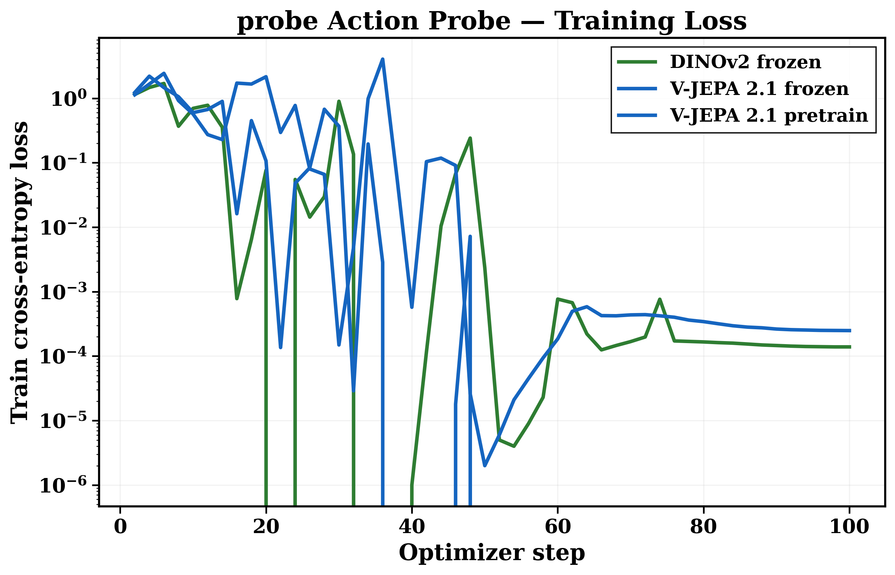
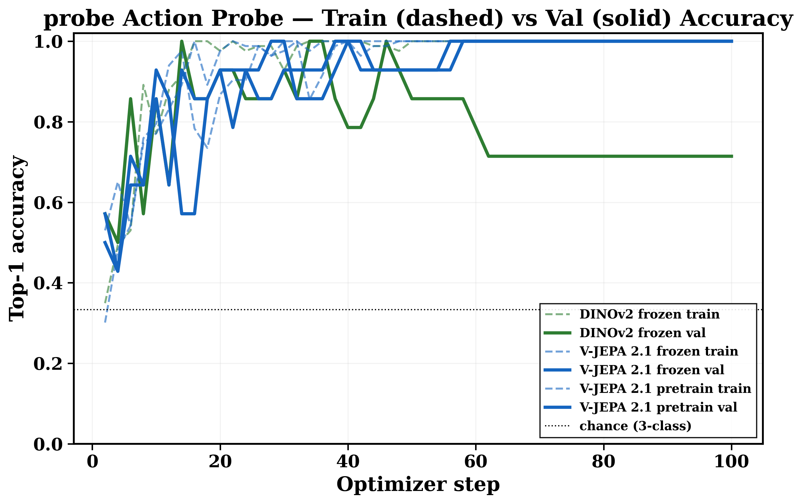
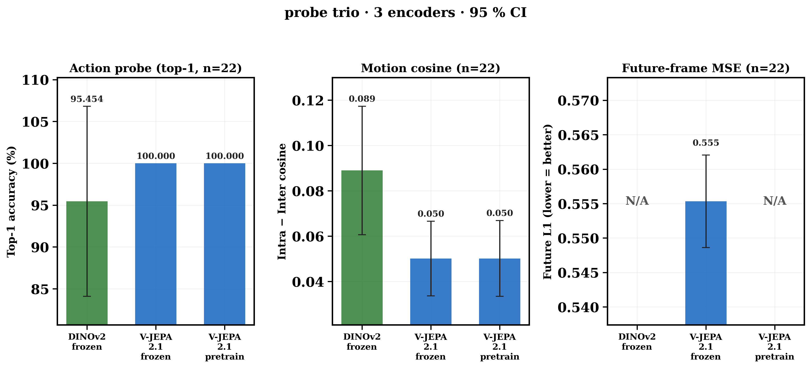

# 📊 Weekly Report — iter13 SANITY (n=22 test, 2026-05-03)

## 🎯 Metric ↔ Meta benchmark alignment

| 🔢 | 🧪 Our metric | 🏆 Meta-published analog | 🎬 Skill probed | 🥇 V-JEPA 2.1 | 🥈 DINOv2 | 🚦 |
|:--:|:--|:--|:--|:--:|:--:|:--:|
| 1️⃣ | 🎯 **Attentive probe top-1 acc** (3-class action: walking/driving/drone) | 🏆 **SSv2** + **Diving-48** + **Kinetics-400** (4-layer attentive probe) | 🏃 motion-centric action recognition | **100.00 %** ⚠️ saturated (BCa NaN) | 95.45 % ±11.4 | 🔄 inverted-but-saturated |
| 2️⃣ | 🔮 **Future-frame L1 MSE** (V-JEPA's native L1 latent loss) | 🏆 **Ego4D OSC** (object-state-change anticipation) + **EPIC-KITCHENS-100** | 🔮 future-frame latent prediction | 0.5553 ±0.0067 | ❌ n/a (no predictor head) | 🟢 V-JEPA-only signal |
| 3️⃣ | 🧲 **Per-clip motion cosine** (intra − inter class) | 🏆 **SSv2** motion-similarity proxy | 🌀 temporal feature clustering | 0.0501 ±0.0167 | **0.0890 ±0.0283** | 🔄 DINOv2 wins (n=22 too small to trust) |

---

## 🖼️ SANITY plots (`outputs/sanity/probe_plot/`, n=22 test)

| 🖼️ | 📈 Plot | 🔍 What it shows |
|:--:|:--|:--|
| 📉 |  | 🏃 Stage 3 probe-head **train-loss** trajectories (50 ep × N enc) — both V-JEPA variants converge ≈ 0 by ep 10; DINOv2 by ep 25 |
| 📈 |  | 🎯 Stage 3 probe-head **val-acc** trajectories — V-JEPA hits 100 % saturation by ep 30 (N=14 val); DINOv2 plateaus at 92.86 % |
| 📊 |  | 🏆 3-panel encoder bar-chart: top-1 acc 🎯 + motion cos 🧲 + future MSE 🔮 across 3 encoders (4th & 5th vars dropped — surgery trainers not yet run on 96 GB) |

⏳ **NEXT**: 96 GB FULL run → n_test ≈ 1,492 → BCa CIs shrink ~8× → real P1/P2/P3 verdict.
