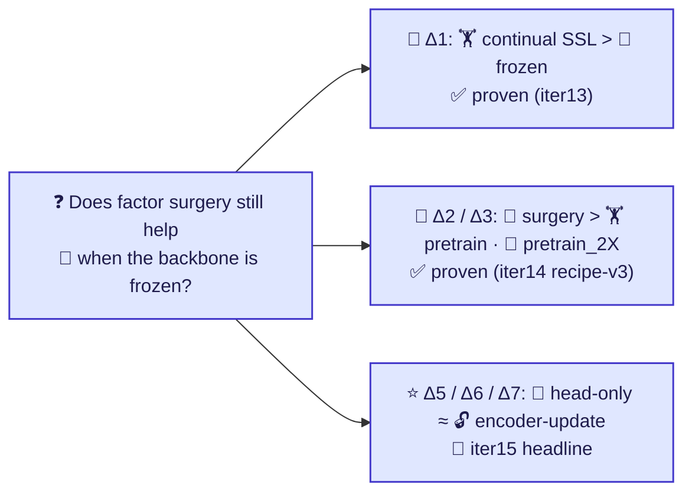
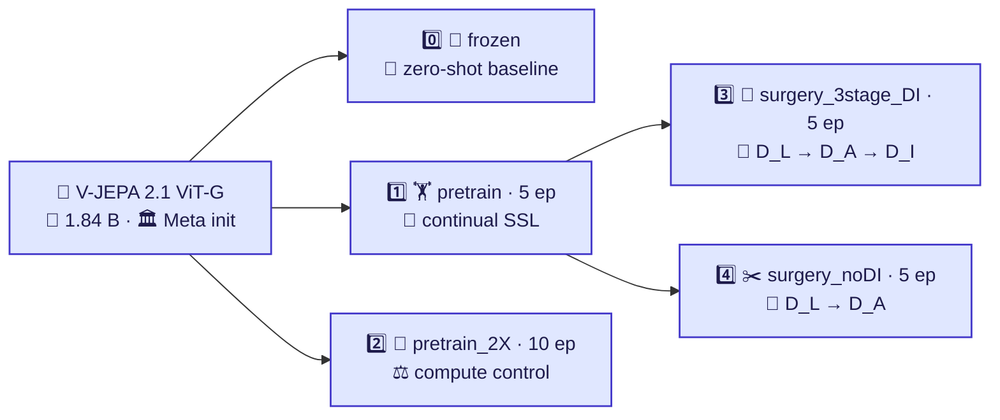
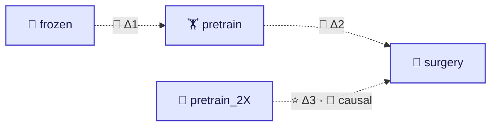
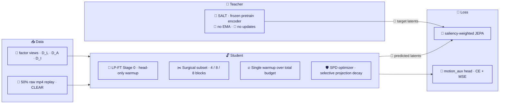
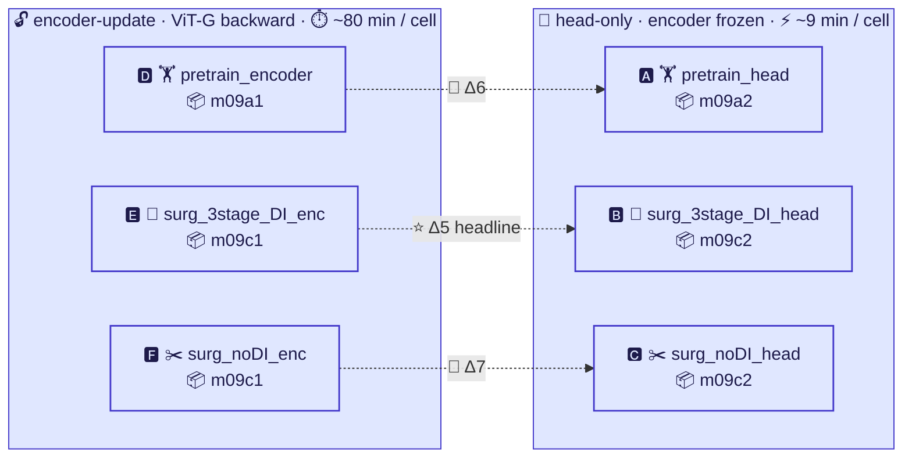
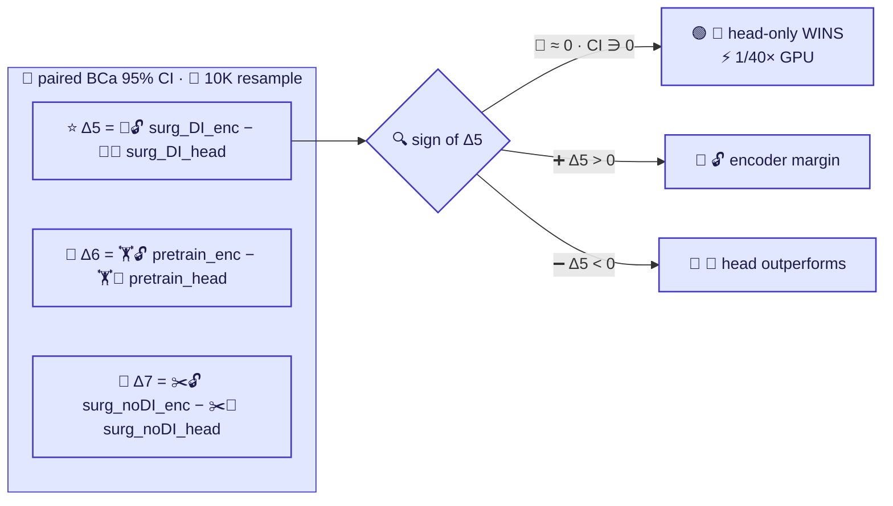
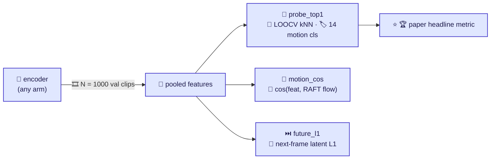
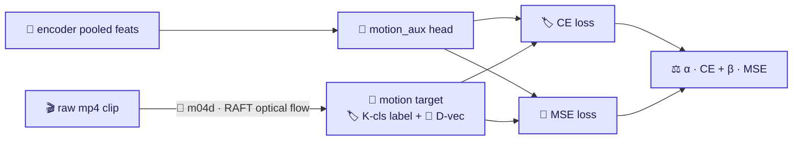
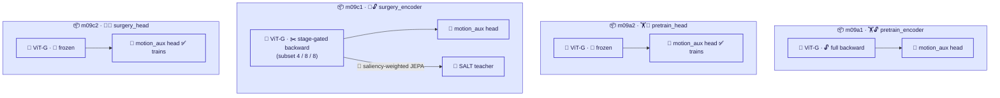

# 🧪 iter15 — Head-only vs Encoder-update surgery (paper §3 Method figures)
> ## 🎯 Paper goal:  `vjepa_surgery` [X_epochs(surgery) +X_epochs(pretrain)] ≫ `vjepa_pretrain` [2X epochs] ≫ `vjepa_frozen` on motion / temporal features
> 🎯 Claim: `head-only surgery` ≈ `encoder-update surgery` on motion features ⇒ 1/40× GPU.
> Diagrams only — paper-figure aesthetic. One concept per diagram.

---

## § 1 — 🔬 Research question

---

## § 2 — 🧬 Encoder zoo (5 arms compared at eval)

---

## § 3 — 🔗 Sequential composition + paired-Δ tests

---

## § 4 — 🧬 Recipe-v3 winning recipe (iter14 R1 · 🏆 top-1 = 0.8456)

---

## § 5 — 🧪 iter15 6-cell paired-Δ matrix

---

## § 6 — 📊 Paired-Δ tests (paper §4 Results)

---

## § 7 — 🔭 Probe-trio evaluation protocol

---

## § 8 — 🧠 motion_aux head (auxiliary supervision)

---

## § 9 — 🏗️ Training-loop schematic (m09a / m09c × encoder / head)

