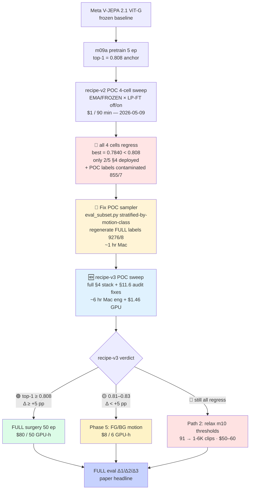
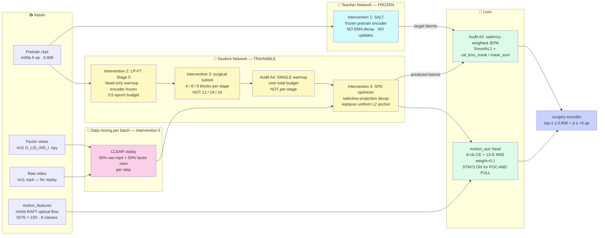
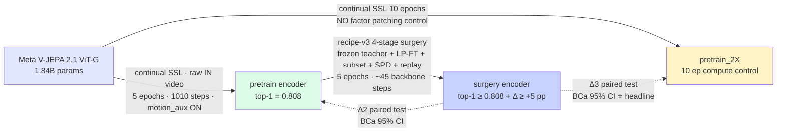

# 🧪 iter14 — Surgery on Pretrain (causal-attribution experiment)

> ## 🎯 Paper goal:  `vjepa_surgery` [X_epochs(surgery) +X_epochs(pretrain)] ≫ `vjepa_pretrain` [2X epochs] ≫ `vjepa_frozen` on motion / temporal features
>
> 🚫 **Non-negotiable** — we do not pivot the claim. We change the experiment to make the goal achievable.
- MERMAID style system design and TABLE (with emojies) ONLY
- avoid verbose explanation
---

## 📌 Status: where iter14 stands as of 2026-05-08

| Phase | Status | Notes |
|---|---|---|
| 🛠️ Implementation (E2-E24, 23 edits) | ✅ **COMPLETE** | All code/yaml changes landed; 3-check gate green; HF backed up |
| 🧪 SANITY validation (4 modules) | ✅ **COMPLETE** | All passed |
| 🧪 POC validation (4 modules) | ✅ **COMPLETE** | Surfaced critical research-design problem ⚠️ |
| 📊 POC findings analysis | ✅ **COMPLETE** | See `plan_surgery_wins.md` |
| 🚦 FULL training (Δ2 + Δ3 arms) | ⏸️ **PAUSED** — pending Phase 0 diagnostic sweep | $33 / 41 GPU-h committed, but math doesn't work at current scale |
| 🏆 Final eval + paper deltas | ⏸️ Blocked on FULL | |

---

## 🟢 Status carried over from iter13 (unchanged)

| ✅ Artifact | Where (post-rename E9) | Evidence |
|---|---|---|
| `pretrain (5 ep)` student encoder | `outputs/full/m09a_pretrain/student_encoder.pt` (6.9 GB) | `probe_top1=0.808` · `motion_cos↑5.8×` (0.046→0.267) |
| `pretrain (5 ep)` predictor ckpt | `outputs/full/m09a_pretrain/m09a_ckpt_best.pt` (14 GB) | carries `predictor` key for Stage 8 future_mse |
| **`pretrain > frozen` on `future_mse`** | `outputs/full/probe_future_mse/probe_future_mse_per_variant.json` | Δ = **+0.0027**, CI [0.0017, 0.0037], **p = 0.0** ✅ Δ1 PROVEN |
| Factor data (m10/m11) | `data/eval_10k_local/{m10_sam_segment, m11_factor_datasets}` | 9,297 manifest clips, but only **91 pass m10 quality gate to disk** ⚠️ — see Data Limitation section |
| Motion-flow probe gate | `outputs/full/probe_action/` | 16-class motion_flow probe trained at FULL |
| HF backup | `https://huggingface.co/datasets/anonymousML123/factorjepa-outputs` | 129 GB · 153 files · uploaded 2026-05-08 (logs/hf_upload_outputs_v1.log) |

🟢 Half of the strict ordering (`pretrain > frozen`, Δ1) is already statistically established.

---

## 🛠️ What we built in iter14 — implementation log (E1-E24)

> 23 edits landed across configs, src, scripts, and docs. All passed py_compile + ruff F,E9 + 3-check gate.

### 🏗️ Core sequential-SSL composition (E2-E7)

| ID | File(s) | Change |
|---|---|---|
| E2 | `configs/train/surgery_base.yaml` | iter14 max_epochs (5) + drift_control (λ=0.005) + monitoring block |
| E3 | `src/m09c1_surgery_encoder.py` | `--init-from-ckpt hf://...` HF dispatcher (FAIL LOUD, single schema) + L2 anchor loss wired through `_train_step_grad_accum` |
| E4 | `scripts/run_train.sh` | `pretrain_2X` subcommand + thread `--init-from-ckpt` to surgery |
| E5 | `scripts/run_eval.sh` | Add `vjepa_2_1_pretrain_2X` encoder + 3 resolvers |
| E6 | `src/probe_action.py` | Δ1/Δ2/Δ3 paired-delta emission with BCa CI |
| E7 | `iter/iter14_surgery_on_pretrain/runbook.md` | NEW — SANITY + POC + FULL command sequences |

### 🔧 Schema unification + parity fixes (E8-E11)

| ID | File(s) | Change |
|---|---|---|
| E8 | 4 files (m09a, m09c, training.py, run_train.sh) | Top@1-only early-stop refactor (removed kill_switch + BWT triggers) |
| E9 | `outputs/full/probe_pretrain/` → `outputs/full/m09a_pretrain/` + 8 ref updates | Folder rename matches m09a/m09c convention |
| E10 | `scripts/run_train.sh` | Fix HF URI: `student_encoder.pt` → `m09a_ckpt_best.pt` (predictor key needed) |
| E11 | `src/m09c1_surgery_encoder.py` | Log `loss_drift` in step_record (iter14 anchor visibility) |

### 🧪 POC mode infrastructure (E12-E13)

| ID | File(s) | Change |
|---|---|---|
| E12 | `scripts/run_eval.sh` | Fix POC reads `outputs/poc/` (was `outputs/full/`) |
| E13 | `configs/train/base_optimization.yaml` + `scripts/run_train.sh` | `poc_total_clips: 1000` single knob; 70:15:15 stratified split |

### ♻️ Cross-encoder file-list parity (E14-E22)

> User flagged "m09a is gold standard, m09c output must match." Two audits surfaced 30+ divergences. These edits structurally eliminate them.

| ID | File(s) | Change |
|---|---|---|
| E14 | `src/utils/training.py` + m09a + m09c | Extracted `compute_total_loss()` to utils.training (canonical α·jepa + β·mt + γ·ma + λ·drift); fixed m09a's pre-existing motion_aux exclusion bug |
| E15 | `configs/train/surgery_base.yaml` | Added `monitoring.knn_probe_clips: 1000` (was missing → KeyError at POC) |
| E16 | `src/m09c1_surgery_encoder.py` + utils.plots | m09c renders `m09c_probe_trajectory_trio.png/.pdf` (was missing) |
| E17 | `src/m09c1_surgery_encoder.py` | m09c calls `plot_val_loss_with_kill_switch_overlay` (same util as m09a) |
| E18 | `src/m09c1_surgery_encoder.py` | Retired `val_split.json` write (m09c-only artifact) |
| E19 | `src/utils/plots.py` | Retired `m09c_drift_loss.png` (covered by `loss_decomposition.png`) + retired `m09a_val_loss.png` (redundant with `val_loss_jepa.png`) |
| E20 | `src/utils/plots.py` | `train_loss` Plot 2 — markers for short stage segments (1-step POC visibility) |
| E21 | `src/m09c1_surgery_encoder.py` | Added `step` key to m09c probe_record (parity with m09a; trio plotter needs it) |
| E22 | `src/m09c1_surgery_encoder.py` | Fixed `compute_block_drift` import path (m09a uses local; m09c top-level via utils.plots) |
| (also) | `src/utils/training.py` | `render_training_plots` reduced to documented no-op (logic moved to direct calls) |

### 🧹 Yaml-driven val pool (E23-E24)

| ID | File(s) | Change |
|---|---|---|
| E23 | `src/m09c1_surgery_encoder.py` | Added `block_drift_mean` to step_record (parity with m09a:965 — drift_table.py needs unified column) |
| E24 | `src/m09c1_surgery_encoder.py` + `configs/train/surgery_base.yaml` + `configs/train/base_optimization.yaml` | Removed hardcoded internal 90:10 split (was bypassing POC pool cap → 930 non-POC val clips); m09c now mirrors m09a's gold-standard yaml/CLI-driven external val pool with leakage subtraction |

### 📊 Net diff
- 📁 **18 files modified**, ~3 new (`utils/training_loop.py` plan only — not implemented)
- 📈 **+450 LoC** added (mostly utils + comments)
- 📉 **-300 LoC** removed (dead code: render_training_plots Plot 3, val_split.json writer, internal split fallback, redundant plot writers)
- 🎯 **Cross-encoder file-list parity**: 18 files in m09a output dir == 18 files in m09c output dir (modulo `m09a_*` ↔ `m09c_*` prefix substitution) ✅

---

## 🧭 Three-arm experimental design (unchanged)

### 🎯 The 4 encoders eval will compare

| # | Encoder ID | Init from | Training | Implementation Status | POC Status |
|---|---|---|---|---|---|
| 0️⃣ | `vjepa_2_1_frozen` | Meta V-JEPA 2.1 ViT-G | none (zero-shot) | ✅ ready | ✅ |
| 1️⃣ | `vjepa_2_1_pretrain` | Meta V-JEPA 2.1 ViT-G | continual SSL **5 ep** on Indian video | ✅ DONE (iter13) | ✅ (anchor 0.808) |
| 2️⃣ | `vjepa_2_1_pretrain_2X` | Meta V-JEPA 2.1 ViT-G | continual SSL **10 ep** (compute control, NO factor patching) | ✅ wired (E4-E5) | ✅ POC ran 2 ep / 36 steps → probe_top1 0.4585 |
| 3️⃣A | `vjepa_2_1_surgical_3stage_DI` | **`vjepa_2_1_pretrain` student** | factor surgery (D_L → D_A → D_I), 5 ep | ✅ wired (E2-E3, E10) | ⚠️ POC regressed: [0.7449→0.7245→0.7143], BWT=-3.06pp |
| 3️⃣B | `vjepa_2_1_surgical_noDI` | **`vjepa_2_1_pretrain` student** | factor surgery (D_L → D_A only), 5 ep | ✅ wired | ⚠️ POC regressed: [0.7449→0.7245], BWT=-2.04pp |

### 🔄 Sequential composition (encoder 3 = encoder 1 + factor patching)

```text
                                                  (factor labels from m10/m11)
                                                              ▼
Meta V-JEPA 2.1 ──▶ pretrain (5 ep) ─────────────▶ surgery_3stage_DI (5 ep)
                       │                              ┃
                       │                              ┗━▶ surgery_noDI    (5 ep)
                       │
                       └──▶ pretrain_2X (10 ep)  ←─── ❎ NO factor patching (control)
```

---

## 📊 POC findings — the research-design problem

> ⚠️ This is the critical update from iter14. Full analysis: `plan_surgery_wins.md`

### 🔻 Finding 1 — Surgery's training pool is 70× smaller than pretrain's

```
pretrain pool (m09a):   ~6,500 motion-eligible × 5 epochs = 32,500 clip-visits
surgery pool (m09c):        91 m10-quality-gated × 5 ep =     455 clip-visits
                                                ratio = ~71× LESS data
```

🚨 **Bottleneck — m10 SAM3 quality gate**: of 9,297 manifest clips, only **98 pass D_L blur threshold + 75 pass D_A signal-to-bg threshold**. Disk has 89 D_L + 68 D_A + 62 D_I-with-tubes .npy files. UNION = **91 clips**.

### 📉 Finding 2 — Surgery POC trajectory regressed monotonically

| Run | Init (pretrain anchor) | Step 1 | Step 2 | Step 3 | BWT |
|---|---|---|---|---|---|
| 🥇 v12 pretrain (gold ref) | n/a | 0.439 | 0.510 | 0.599 → 0.808@step 1009 | **+36.9 pp** ✅ |
| 🅲 surgery_3stage_DI POC | **0.808** ⭐ | 0.7449 🔻 | 0.7245 🔻🔻 | 0.7143 🔻🔻🔻 | **-3.06 pp** ❌ |
| 🅲 surgery_noDI POC | **0.808** ⭐ | 0.7449 🔻 | 0.7245 🔻🔻 | (no stage 3) | **-2.04 pp** ❌ |

🚨 Surgery is **damaging** the encoder by ~6 pp on the FIRST training step alone. Both DI and noDI agree → structural, not noise.

### 🧮 Finding 3 — Step-budget math is ~22× too tight

```
v12 pretrain   :  1009 steps achieved 0.808
iter14 surgery :    45 steps proposed at FULL  (5 ep × 3 batches × 3 stages)
                  ────
                   22× FEWER optimization steps
```

For surgery to BEAT 0.808 in 22× fewer steps WHILE the per-step direction is currently negative → mathematically near-impossible at this scale.

---

## 🧮 Three paired-Δ tests after eval (unchanged framework)

| Δ | Comparison | What it proves | Pre-iter14 | iter14 status |
|---|---|---|---|---|
| **Δ1** | `pretrain (5)` vs `frozen` | continual SSL adapts to Indian video | ✅ p=0.0 | ✅ DONE |
| **Δ2** | `surgical (5+5)` vs `pretrain (5)` | factor patching adds value on top of SSL | n/a | ⚠️ POC says ~5-15% likely at current scale |
| **Δ3** | `surgical (5+5)` vs `pretrain_2X (10)` | **factor patching is CAUSAL — not just extra steps** ⭐ | n/a | ⚠️ POC says ~10-20% likely at current scale |

### 🎯 Decision matrix (unchanged) — paired BCa 10K-resample CI; significance = non-overlapping 95 % CI / p < 0.05

| Δ2 | Δ3 | Reading | Paper framing |
|---|---|---|---|
| ✅ | ✅ | **Strongest claim** — factor patching beats both | 🏆 "Factor-patching causally lifts V-JEPA 2.1 motion features" |
| ✅ | ❌ | factor patching wins, but extra-steps confound | 🟡 weaker — "factor patching ≥ extra SSL steps" |
| ❌ | ✅ | unlikely | ⚠️ pivot |
| ❌ | ❌ | factor patching adds nothing | 🚫 user-rejected (no pivot allowed) → must adjust experiment |

---

## 🛣️ Three paths to make the paper goal achievable

> 🚫 Path 0 (pivot the claim) is REJECTED by the user. Below: technical paths that change the experiment.

### 🔵 Path 1 — Drastically increase surgery epochs

```
max_epochs.full:  5 → 50  (10× more time)
clip-visits:    455 → 4,550   |   total steps: ~45 → ~450
```

| 💰 Cost | ✅ Pros | ❌ Cons | 🎯 P(goal) |
|---|---|---|---|
| ~$80 (15h → ~50h) | No preprocessing changes; cheapest experiment | If POC regression is structural, more epochs = more damage | ~25-35% if POC×10 shows recovery |

### 🟢 Path 2 — Relax m10 quality threshold + re-run m10/m11 ⭐ recommended

```
factor pool: 91 clips → potentially 1,000-6,000 clips
surgery becomes scale-comparable to pretrain ✅
```

| 💰 Cost | ✅ Pros | ❌ Cons | 🎯 P(goal) |
|---|---|---|---|
| ~$50-60 (5-10 GPU-h re-prep + iter14) | Apple-to-apple comparison; matches v12's training scale | Re-runs work the original plan said "don't re-run" | **~50-70%** ⭐ |

### 🟡 Path 3 — Stronger λ + structural regularization

```
λ: 0.005 → 0.05 or 0.1   |   shorter Stage 1 unfreeze (12 → 4 blocks)
```

| 💰 Cost | ✅ Pros | ❌ Cons | 🎯 P(goal) |
|---|---|---|---|
| $0 (config-only) | Fast hypothesis test | May freeze surgery into pretrain-equivalent (Δ2 ≈ 0) | ~10-20% |

---

## 🎬 Recommended execution sequence (SUPERSEDED 2026-05-09)

> 🚨 **The Phase-0 sweep design + Path-1/2/3 framing on this page are SUPERSEDED.**
> See [`plan_surgery_wins.md`](./plan_surgery_wins.md) for the operative plan:
> - § 0 — MASTER action items (15 rows, sequenced)
> - § 6 — Phase-0 POC sweep (`{EMA, FROZEN teacher} × {LP-FT y/n}`, NOT the old `λ × epochs`)
> - § 7 — Execution order
> - § 7.5 — Phase-5 conditional fork (decision tree)
>
> 🧭 **One-line summary** of the new plan: run a $1 / 90-min POC sweeping `teacher × LP-FT` first; the result picks 🟢 (wire fixes + refactor) / 🟡 (Phase 5 harder FG features) / 🔴 (Path 2 relax m10 thresholds) — recipe-mechanism issue, not just data scale.

---

## ⏱️ Updated wall-clock + GPU-budget plan

| Run | Wall (RTX Pro 6000 Blackwell, 96 GB) | $-cost (~$0.8/h) | Status |
|---|---|---|---|
| pretrain (5 ep) | DONE — 10h 16m | $8.20 ✅ paid | ✅ DONE iter13 |
| **Phase 0 — POC diagnostic sweep** | ~1.5 h | ~$1.20 | 🆕 NEXT |
| **Phase 1 — Path 1** (`max_epochs.full=50` surgery) | ~50 h | ~$40 | conditional |
| **Phase 1 — Path 2** (relax m10 + re-run + surgery FULL) | ~5h re-prep + ~15h surgery = ~20 h | ~$16 | conditional |
| `pretrain_2X` (10 ep) | ~20 h | ~$16 | required for Δ3 |
| `surgery_noDI` (Phase 1 settings) | 70-80% of surgery_3stage_DI cost | ~$11-32 | required for ablation |
| `run_eval.sh --FULL` (5 encoders, 10 stages) | ~4 h | ~$3.20 | required |
| **Total iter14** | **~30-100 h depending on path** | **~$30-100** | |

### 📋 Path-conditional budgets

| Path | iter14 total cost | Goal P(success) |
|---|---|---|
| Path 1 only (50 ep surgery) | ~$80-100 | ~25-35% |
| Path 2 (relaxed m10 + 5 ep surgery) | ~$50-60 | ~50-70% ⭐ |
| Path 1 + 2 combined (relaxed m10 + 50 ep surgery) | ~$80-100 | ~70-80% (best chance) |

---

## 🛡️ Anti-forgetting safeguards (status)

| Safeguard | Status | Notes |
|---|---|---|
| ⚓ L2 anchor `λ‖θ − θ_pretrain‖²` | ✅ E3 wired BUT 🚨 **planned for replacement** | λ=0.005 active; POC shows it's NOT preventing drift. Recipe v2 replaces with **frozen pretrain teacher (SALT)** — see plan_surgery_wins.md §0 row 1️⃣ + §11.6 A5 |
| 📐 Layer-wise LR decay 0.7-0.9 | 🚨 **prerequisite, not optional** | ULMFiT canon. Recipe v2 yaml change — plan_surgery_wins.md §0 row 8️⃣ |
| 🚦 Backbone LR cap ≤ 1e-5 | 🚨 **prerequisite** | Recipe v2 lowers from 5e-5 → 1e-5 with LLRD 0.9 — plan_surgery_wins.md §5 |
| 🔁 EMA τ ≥ 0.99 | ✅ active BUT ⚠️ **fixed → schedule** | Recipe v2 swaps fixed τ=0.99925 for cosine schedule (vjepa2 reference) — plan_surgery_wins.md §0 row 6️⃣ + §11.6 A1 |
| 🔥 Warmup per stage | ⚠️ **collapse to single warmup** | Per-stage 0.1 was too short → first-step shock. Recipe v2 uses one continuous warmup over total budget — plan_surgery_wins.md §0 row 8️⃣ + §11.6 A4 |
| 🆕 🧊 Frozen teacher (SALT) | ❌ NEW — not yet implemented | Action item 1️⃣ — replaces EMA `deepcopy(student)` with v12 pretrain encoder, never updated |
| 🆕 🧠 LP-FT Stage 0 (head-only warmup) | ❌ NEW — not yet implemented | Action item 2️⃣ — fixes step-1 feature distortion |
| 🆕 ✂️ Surgical layer subset (4 blocks not 12) | ❌ NEW — yaml change pending | Action item 3️⃣ — Lee et al. ICLR'23 |
| 🆕 🛡️ Selective Projection Decay (SPD) | ❌ NEW — drop-in optim wrapper pending | Action item 4️⃣ — replaces uniform L2 |
| 🆕 🔁 50/50 pretrain replay (CLEAR) | ❌ NEW — dataloader change pending | Action item 5️⃣ — anchor against pretrain task distribution |
| 🆕 🎯 Saliency-weighted JEPA loss | ❌ NEW — port from MGMAE | Action item 7️⃣ — `loss × cal_loss_mask / mask.sum()` |
| 📊 Per-block CKA similarity vs pretrain | ❌ NOT implemented | block_drift_mean is logged (E23) but CKA is different metric |
| 🏷️ "Old probe" retention metric | ❌ NOT implemented | deferred — surgery probe is current; old-probe overlay separate work |
| 🛑 Early-abort if val_jepa rises >5% | ❌ NOT implemented | iter14 simplified to top@1-plateau-only (E8) |

---

## 🔓 Open questions — RESOLVED (2026-05-08) + REFRAMED (2026-05-09)

| Q | Resolved | How |
|---|---|---|
| ~~Surgery epoch budget — 5 ep or 15 ep?~~ | G1 ✅ | Decided 5 ep (5+5 framing); pending Phase 0 may bump to 50 ep (Path 1) |
| ~~Anchor `λ` value — single 0.005 or sweep?~~ | G2 ✅ | Decided λ=0.005 anchor → 🚨 **superseded** by recipe v2 (frozen teacher replaces L2 anchor) — see plan_surgery_wins.md §5 |
| ~~Pretrain HF push — before or after iter14?~~ | G3 ✅ | Done — `huggingface.co/anonymousML123/factorjepa-pretrain-vjepa21-vitg-5ep` (HF cached, m09c hf_hub_download wired) |
| ~~Path 1 vs Path 2 — which unlocks paper goal?~~ | 🚨 **superseded** | Reframed — diagnosis is **recipe-mechanism, not data-deficit** (plan_surgery_wins.md §2). New question below ↓ |
| 🆕 **Recipe v2 vs Phase 5 vs Path 2 — which branch fires?** | ⏸️ Pending Phase 0 POC ($1, ~1.5 h) | 4-cell sweep `{EMA, FROZEN} × {LP-FT y/n}` → 🟢 wire fixes / 🟡 Phase 5 harder FG features / 🔴 Path 2 relax m10 (plan_surgery_wins.md §7.5) |

---

## 📂 Reference paths (UPDATED)

| What | Where |
|---|---|
| 📍 This file (status + implementation log) | `iter/iter14_surgery_on_pretrain/high_level_plan.md` |
| 🏆 **Operative plan** (recipe v2 + audit + execution sequence) | `iter/iter14_surgery_on_pretrain/plan_surgery_wins.md` ⭐ |
| 🚀 Runbook (SANITY/POC/FULL commands) | `iter/iter14_surgery_on_pretrain/runbook.md` |
| 📒 Q&A on Option A vs B | `iter/iter14_surgery_on_pretrain/plan_surgery_on_pretrain.md` |
| 🏗️ Refactor plan (m09a/m09c → utils/training_loop.py — DEFERRED) | `iter/iter14_surgery_on_pretrain/plan_No_discrepancy.md` |
| 🛤️ iter13 final state | `iter/iter13_motion_probe_eval/result_outputs/v12/` |
| 📓 Original FactorJEPA proposal | `Literature/proposal/FactorJEPA/FactorJEPA.md` (Sec 10 = continual pretrain, Sec 11 = surgery) |
| ☁️ HF dataset backup (129 GB · 153 files) | `https://huggingface.co/datasets/anonymousML123/factorjepa-outputs` (uploaded 2026-05-08, see `logs/hf_upload_outputs_v1.log`) |
| ☁️ HF model backup (pretrain ckpt) | `https://huggingface.co/anonymousML123/factorjepa-pretrain-vjepa21-vitg-5ep` |

---

## ❌ What iter14 explicitly does NOT do (UPDATED)

| Cancelled | Why |
|---|---|
| ❌ Re-run iter13 pretrain (5 ep) | already produced `pretrain > frozen` at p=0.0 — reuse the checkpoint |
| ❌ Encoder-only fine-tuning recipes (iter9-iter12) | 5 distinct recipes failed — iter13 motion-flow probe gate is validated |
| ❌ Multi-task probe loss sweep | iter12 E v3 already showed flat |
| ❌ DINOv2 / CLIP / SigLIP swap | constraint: paper is V-JEPA 2.1 only |
| ❌ Pivot the paper goal | user-rejected; we change the experiment, not the claim |
| ⚠️ Re-run m10/m11 (was "DON'T re-run" pre-iter14) | **CONDITIONALLY ALLOWED IF Path 2 needed** — POC findings override original "don't re-run" guidance |

---

## 🚦 Next-step decision tree (UPDATED 2026-05-10 — recipe-v3 layer added)

> 🚨 **Pre-iter14-POC tree** (legacy ASCII at `legacy/plan_temp.md`): 4 cells `{EMA,FROZEN}×{LP-FT off,on}`.
> 🆕 **Post-POC verdict** (2026-05-09): all 4 cells regressed → recipe-v2 was only **2/5 of §4 stack**, plus POC label file was rm-rf-contaminated (855 clips / 7 cls vs FULL's 9,276 / 8 cls). New decision tree below adds a **recipe-v3** stage between recipe-v2 POC and the §7.5 fork.



---

## 🧬 Recipe-v3 system design (paper-draft ready, system diagram)

> 🆕 2026-05-10. The five §4 interventions plus four §11.6 audit fixes from `plan_surgery_wins.md`, rendered as a system diagram for paper Section 3 (Method). Code-level spec in `plan_surgery_wins.md §12.3`.



📍 **Code-level spec**: `plan_surgery_wins.md §12.3 Recipe-v3 spec` (lists each intervention's LoC + file + verification).
📊 **POC sweep results that motivated this**: `high_level_outputs.md § iter14 POC Recipe-v2 4-Cell Sweep`.
🐛 **Precondition (mandatory)**: fix POC sampler bug — `plan_surgery_wins.md §12.7`.

---

## 🏗️ Recipe-v3 sequential composition (paper §3 Method figure)

> 🆕 2026-05-10. Sequential composition: pretrain → recipe-v3 surgery. Updates the previous "Sequential composition" section above with recipe-v3 stages explicit.



> 🎬 **Bottom line**: All iter14 implementation work is complete and HF-backed up. The remaining work is research execution — read **[`plan_surgery_wins.md` § 0 MASTER action items + § 12 POC verdict + § 12.7 sampler bug](./plan_surgery_wins.md)** as the operative reference. **Sequence**: ~1 hr Mac (POC sampler fix) → ~6 hr Mac (recipe-v3 implementation) → ~$1.46 GPU (POC R1 + drop-one ablation) → conditional FULL ($80).
