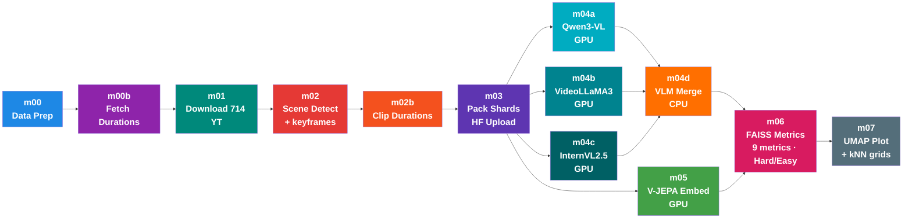

Plan: Convert WalkIndia-200k to WebDataset TAR Shards + Upload to HF

STATUS: COMPLETED (116 shards, 115,687 clips, 121.5 GB uploaded in 36 min)

Final Module Numbering (after renumbering)

src/
├── m00_data_prep.py              # Parse YT_videos_raw.md → JSON, word freq, city matrix
├── m00b_fetch_durations.py       # Fetch YT video durations via yt-dlp metadata (no download)
├── m01_download.py               # Download 714 YT videos at 480p (Mac, aria2c)
├── m02_scene_detect.py           # Greedy scene-aware split → ffmpeg encode clips + keyframe export
├── m02b_scene_fetch_duration.py  # Scan all clips, output clip_durations.json
├── m03_pack_shards.py            # Pack clips into WebDataset TAR shards → upload to HF
├── m04a_qwen_tag.py              # [GPU] Qwen3-VL-8B tagging (vLLM + HF streaming) → tags_qwen.json
├── m04b_videollama_tag.py        # [GPU] VideoLLaMA3-7B tagging → tags_videollama.json
├── m04c_internvl_tag.py          # [GPU] InternVL2.5-8B tagging → tags_internvl.json
├── m04d_vlm_merge.py             # Cross-VLM agreement merge → unified tags.json (CPU)
├── m05_vjepa_embed.py            # [GPU] V-JEPA 2 embeddings (ViT-G, 1408-dim)
├── m06_faiss_metrics.py          # FAISS kNN: 9 metrics + Hard/Easy mode
├── m07_umap_plot.py              # UMAP visualization + kNN confusion matrix + kNN neighbor grids
└── utils/
    ├── __init__.py
    ├── config.py                 # Paths, constants, shared utility functions
    ├── export_metadata.py        # tags.json → metadata.jsonl per leaf dir
    ├── hf_utils.py               # HF auth, README gen, metadata upload (shared library)
    └── tag_taxonomy.json         # 11 tag fields + confidence schema for VLMs

Dependency Graph



Notes:
- m04a, m04b, m04c, m05 all run in parallel (all stream from HF)
- m04d merges 3 VLM outputs → unified tags.json (Cross-VLM agreement)
- Both m04d AND m05 must complete before m06 can run
- m04d outputs tags.json (cross-VLM validated labels for cluster purity)
- m05 outputs embeddings.npy (learned representations)
- m06 asks: "do clips with same cross-VLM tag land near each other in V-JEPA embedding space?"

How tags flow into evaluation:

```
m04a tags_qwen.json  ──┐
m04b tags_videollama.json ──┤──→ m04d VLM Merge ──→ tags.json (unified)
m04c tags_internvl.json ──┘     (>90% agree = keep, <70% = discard)

tags.json                            m06 evaluates V-JEPA quality (9 metrics):
┌──────────────────────┐             ┌──────────────────────────────────┐
│ [                    │             │ Prec@K (Cluster Purity):         │
│   {                  │             │   For each clip i:               │
│     "scene_type":    │──────────→  │     my_type = tags[i]["scene_type"]
│       "market",      │             │     neighbors = kNN(embeddings[i])│
│     "confidence_     │             │     % neighbors with same type?  │
│       scene_type":   │             ├──────────────────────────────────┤
│       0.92,          │             │ + Cycle@K, Overlap@K, mAP@K,    │
│     "_model": ...,   │             │   nDCG@K, Silhouette,           │
│     "_vlm_agreement":│             │   Conf sweep, Multi-attr slices │
│       0.95,          │             │ + Hard/Easy mode (±30s window)   │
│     ...              │             └──────────────────────────────────┘
│   },                 │
│   ...                │             m07 visualizes:
│ ]                    │             ┌──────────────────────────────────┐
└──────────────────────┘  ────────→  │ UMAP scatter colored by          │
                                     │   tags[i]["scene_type"]          │
                                     │ Confusion matrix + kNN grids    │
                                     │ Macro/micro reporting           │
                                     └──────────────────────────────────┘
```

Naming Convention

- Numbered modules (m00-m07, m04a-m04d): Pipeline steps with CLI (--SANITY/--FULL)
- m04a/m04b/m04c: Isolated VLM scripts (different deps, can run on different machines)
- m04d: CPU-only Cross-VLM merge
- utils/hf_utils.py: Shared HF library (auth, README, metadata upload)
- utils/config.py: All path constants and shared utility functions
- utils/export_metadata.py: tags.json → metadata.jsonl conversion
- utils/tag_taxonomy.json: Tag field definitions + confidence schema for all VLMs

Key Design Decisions

1. m03_pack_shards.py vs utils/hf_utils.py — NOT redundant:
   - m03 = CLI pipeline step (TAR packing + upload orchestration)
   - hf_utils = shared library (auth, token, README gen, metadata upload)
   - m03 imports FROM hf_utils

2. m02b stays standalone (not merged into m02):
   - m02 takes ~6 hours (scene detection + encoding)
   - m02b takes ~5 min (ffprobe scan)
   - Separate steps = independent re-runs

3. Obsolete functions removed from hf_utils.py:
   - upload_full() — old upload_large_folder approach (hit 10k file limit)
   - commit_remaining() — old batch commit workaround
   - Stale auto-upload removed from m02_scene_detect.py

Context (original problem)

115,687 mp4 clips (121.2 GB) across 75 sections. Individual mp4 upload failed due to:
- HF 10k files/directory limit (kolkata/walking has 20,633 files)
- 256 commits/hour rate limit (stuck at 104k/115k for 12+ hours)
- MerkleDB xet cache errors

Solution: WebDataset TAR shards (~1GB each). HF sees ~120 files instead of 115k.

TAR Structure (HF WebDataset convention)

data/
├── train-00000.tar
│   ├── 000000.mp4          # clip video
│   ├── 000000.json         # metadata for this clip
│   ├── 000001.mp4
│   ├── 000001.json
│   └── ...                 # ~1000 clips per shard
├── train-00001.tar
├── ...
└── train-00115.tar         # ~116 shards total

Implementation: src/m03_pack_shards.py

USAGE:
    caffeinate -s python -u src/m03_pack_shards.py --SANITY 2>&1 | tee logs/m03_pack_shards_sanity.log
    caffeinate -s python -u src/m03_pack_shards.py --FULL 2>&1 | tee logs/m03_pack_shards_full.log

Step 1: Build clip manifest from clip_durations.json
Step 2+3: Create TAR shard → upload → delete local (streaming, 1GB at a time)
Step 4: Upload README.md via utils/hf_utils.py

Result: 116 shards, 115,687 clips, 121.5 GB uploaded in 36 minutes
Dataset: https://huggingface.co/datasets/anonymousML123/walkindia-200k

---

Implementation: src/m04a_qwen_tag.py (vLLM + HF Streaming)

STATUS: IMPLEMENTED (637 lines, all 10 production fixes applied)

Research Summary

vLLM supports Qwen3-VL-8B video input via offline LLM() class:
- `limit_mm_per_prompt={"video": 1}` (1 video per prompt)
- `process_vision_info(messages, return_video_kwargs=True)` handles video extraction
- `mm_data["video"] = video_inputs` for multi_modal_data dict
- `mm_processor_kwargs=video_kwargs` is CRITICAL (tells processor not to re-sample frames)
- `enforce_eager=True` avoids CUDA graph memory issues
- `OMP_NUM_THREADS=1` fixes thread oversubscription in containers

HF WebDataset streaming:
- `load_dataset(repo, split="train", streaming=True)` auto-detects TAR shards
- `.decode(False)` returns raw mp4 bytes (no video decoding)
- Each example: `{"mp4": {"path":..., "bytes": b"..."}, "json": {...}, "__key__": "000000"}`
- Write mp4 bytes → tempfile → pass to `process_vision_info()`

Production Issues (10 fixes applied)

| # | Issue | Severity | Fix Applied | Lines |
|---|-------|----------|-------------|-------|
| 1 | VRAM leak over long runs | CRITICAL | Orchestrator spawns worker subprocesses every 10k clips. Worker exits → GPU memory fully released | 422-502 |
| 2 | CPU RAM leak (V1 engine) | HIGH | `os.environ.setdefault("VLLM_USE_V1", "0")` before vLLM import forces stable V0 engine | 24 |
| 3 | Single-threaded preprocessing | HIGH | `ThreadPoolExecutor(max_workers=4)` parallelizes `process_vision_info()` across batch | 242-247 |
| 4 | Oversized encoder cache | MEDIUM | `max_model_len` 16384→4096 (our clips: ~210 video tokens + 350 text + 512 output = ~1072, 4× headroom) | 485 |
| 5 | HF streaming timeout | HIGH | Producer thread retries with exponential backoff (1s→2s→4s→...→60s, max 5 retries) | 325-332 |
| 6 | Corrupted MP4 crash | MEDIUM | `validate_mp4()` checks file size >1KB + cv2 frame count >0 before VLM | 135-149 |
| 7 | Tempfile /tmp disk full | MEDIUM | `finally` block always cleans up; uses project-local `OUTPUTS_DIR/tmp_m04a/` not `/tmp` | 233-239 |
| 8 | Checkpoint corruption | MEDIUM | Atomic `os.replace()` write, `.tmp` backup recovery, interval 1000→500 clips | 154-186 |
| 9 | GPU under-utilization | HIGH | Producer/consumer pipeline: background thread preprocesses batch N+1 while GPU infers batch N | 288-338 |
| 10 | Tests | — | py_compile OK, AST OK, --help OK | verified |

Architecture (with fixes)

```
ORCHESTRATOR (main process, no GPU)
    ├── reads checkpoint (tags.json)
    ├── spawns WORKER subprocess every 10k clips (Issue 1)
    └── loops until 115k clips done

WORKER subprocess (loads vLLM, exits after segment)
    ├── loads Qwen3-VL-8B via vLLM LLM() [max_model_len=4096, enforce_eager=True]
    │
    ├── PRODUCER THREAD (background, Issues 5+9)
    │   ├── HF WebDataset stream (streaming=True, decode=False)
    │   ├── retry on ConnectionError/Timeout (exp backoff)
    │   ├── write mp4 → project-local tmpdir (Issue 7)
    │   ├── validate mp4 (Issue 6)
    │   ├── ThreadPoolExecutor(4): process_vision_info() in parallel (Issue 3)
    │   └── put preprocessed batch → Queue(maxsize=2)
    │
    ├── CONSUMER (main thread, GPU inference)
    │   ├── take batch from Queue
    │   ├── vLLM LLM.generate() → batched inference
    │   ├── parse JSON → merge metadata + 11 tags
    │   └── atomic checkpoint every 500 clips (Issue 8)
    │
    └── exit (GPU memory fully released, Issue 1)
```

USAGE:
    python -u src/m04a_qwen_tag.py --SANITY 2>&1 | tee logs/m04a_qwen_tag_sanity.log
    python -u src/m04a_qwen_tag.py --FULL 2>&1 | tee logs/m04a_qwen_tag_full.log

Performance Budget (H100 80GB)

- Video tokens: max_model_len=4096, clips at fps=1 → ~210 video tokens per clip (4× headroom)
- Data loading: ~20 clips/s at 100 MB/s streaming — NOT the bottleneck
- VLM inference: 1-5 clips/s on H100 — THIS is the bottleneck
- Preprocessing: parallelized (4 threads), pipelined with inference (Issue 3+9)
- Engine restarts: ~12 workers × ~60s model load = ~12 min overhead (vs hours lost to OOM)
- Total estimate: 115k clips ÷ 3 clips/s ÷ 3600 = ~10.7 hours + 12 min restarts

Tag Taxonomy (11 fields from src/utils/tag_taxonomy.json)

9 single-value fields: scene_type, time_of_day, weather, crowd_density,
  traffic_density, road_surface, infrastructure_quality, vegetation, lighting
2 multi-value fields: road_layout, notable_objects

Enriched JSON Sidecar (after tagging)

Before (m03 pack): 8 metadata fields
  video_id, section, city, tour_type, tier, duration_sec, size_mb, source_file

After (m04d merge): 8 metadata + 11 tags + 11 confidence + 3 provenance + 1 agreement = 34 fields
  + 11 tags: scene_type, time_of_day, weather, crowd_density, traffic_density,
    road_layout, road_surface, infrastructure_quality, notable_objects,
    vegetation, lighting
  + 11 confidence: confidence_scene_type, confidence_time_of_day, ... (each in [0,1])
  + 3 provenance: _model, _prompt_version, _tagged_at
  + 1 agreement: _vlm_agreement (fraction of 3 VLMs that agreed)

---

Proposal Alignment (FactorJEPA Ch 8-9 → Implementation)
========================================================

Decisions made after comparing FactorJEPA proposal (Ch 8: Automatic Annotations,
Ch 9: Evaluating V-JEPA) against this engineering plan:

KEPT as-is (plan diverges from proposal intentionally):
- 11 tag fields (proposal has 7) — extra 4 fields capture India-specific attributes
- Variable 4-10s clips (proposal says fixed 10s) — scene-aware splitting is better
- Cross-VLM agreement (not in proposal) — stronger QC than single-VLM
- Baselines: Random, DINOv2, Shuffled V-JEPA, CLIP (not in proposal) — needed for fair comparison

ADDED to align with proposal:
- Per-field confidence scores (#4): each VLM outputs confidence_* per field
- Provenance tracking (#5): _model, _prompt_version, _tagged_at per clip
- Keyframe export (#6): --keyframes flag in m02, 1 keyframe per clip via ffmpeg
- Metric naming (#7): proposal names as primary (Cycle@K, Prec@K, Overlap@K)
- 7 new metrics (#8): mAP@K, nDCG@K, Silhouette, Overlap@K, Multi-attr slices, Conf sweep, Macro/micro
- Hard/Easy mode (#9): exclusion window ±30s within same video_id

SKIPPED:
- Dual-prompt self-consistency: Cross-VLM agreement (3 VLMs) is stronger
- Human spot-check audit: Cross-VLM agreement replaces this
- Train/val/test splits: not needed for pure evaluation (no training). Exclusion window handles leakage

VLM Architecture (Option 2: Isolated VLMs):
```
m04a_qwen_tag.py       → tags_qwen.json      (Qwen3-VL-8B, vLLM)
m04b_videollama_tag.py → tags_videollama.json (VideoLLaMA3-7B)
m04c_internvl_tag.py   → tags_internvl.json   (InternVL2.5-8B)
                           ↓
m04d_vlm_merge.py   → tags.json (unified, cross-VLM validated)
```
Each VLM script is isolated: different dependencies, different GPU memory profiles,
can run on different machines. m04d is CPU-only merge + agreement computation.

Metrics output schema (m06):
```json
{
  "easy": {
    "cycle_at_k": 72.1, "prec_at_k": 58.3,
    "overlap_at_k": 65.0, "map_at_k": 0.45,
    "ndcg_at_k": 0.52, "silhouette": 0.31,
    "per_scene": {},
    "multi_attribute_slices": {},
    "macro_avg": {}, "micro_avg": {}
  },
  "hard": {"cycle_at_k": 41.5, "prec_at_k": 35.2, "...": "..."},
  "confidence_sweep": [
    {"threshold": 0.5, "coverage": 0.95, "prec_at_k": 56.1},
    {"threshold": 0.7, "coverage": 0.80, "prec_at_k": 62.3}
  ],
  "k_neighbors": 6, "num_clips": 115687, "exclusion_window_sec": 30
}
```

Implementation priority:
1. m04b + m04c + m04d (Cross-VLM pipeline) — unlocks agreement-based QC
2. Metric renaming (Cycle@K, Prec@K) — no logic change
3. New metrics (mAP@K, nDCG@K, Silhouette, macro/micro) — pure numpy
4. Confidence scores in VLM prompts — prompt engineering + parse
5. Provenance tracking — trivial addition to tag output
6. Hard/Easy mode — exclusion window masking in m06
7. Multi-attribute slices — loop over tag fields in m06
8. Keyframe export — ffmpeg flag in m02
9. Overlap@K — needs augmented re-embedding via m05
10. kNN neighbor grids — visualization in m07, needs keyframes
