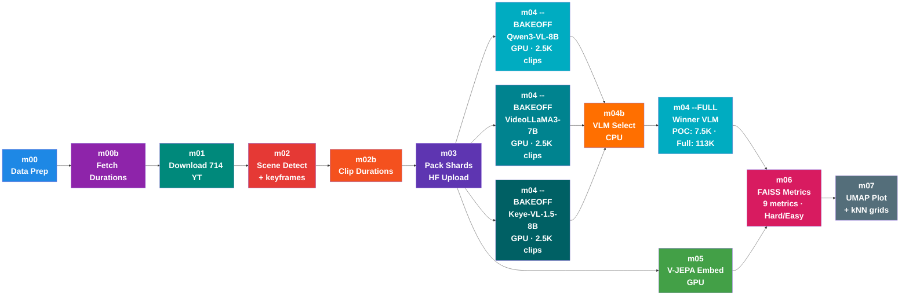

Plan: Convert WalkIndia-200k to WebDataset TAR Shards + Upload to HF

STATUS: COMPLETED (116 shards, 115,687 clips, 121.5 GB uploaded in 36 min)

Final Module Numbering (after renumbering)

src/
├── m00_data_prep.py              # Parse YT_videos_raw.md → JSON, word freq, city matrix
├── m00b_fetch_durations.py       # Fetch YT video durations via yt-dlp metadata (no download)
├── m00c_sample_subset.py          # Stratified 10K subset sampling for POC runs
├── m01_download.py               # Download 714 YT videos at 480p (Mac, aria2c)
├── m02_scene_detect.py           # Greedy scene-aware split → ffmpeg encode clips + keyframe export
├── m02b_scene_fetch_duration.py  # Scan all clips, output clip_durations.json
├── m03_pack_shards.py            # Pack clips into WebDataset TAR shards → upload to HF
├── m04_vlm_tag.py                # [GPU] VLM tagging (--model qwen|videollama|keye, --BAKEOFF|--FULL)
├── m04b_vlm_select.py            # [CPU] Bake-off comparison → pick winner VLM
├── m05_vjepa_embed.py            # [GPU] V-JEPA 2 embeddings (ViT-G, 1408-dim)
├── m06_faiss_metrics.py          # FAISS kNN: 9 metrics + Hard/Easy mode
├── m07_umap_plot.py              # UMAP visualization + kNN confusion matrix + kNN neighbor grids
└── utils/
    ├── __init__.py
    ├── config.py                 # Paths, constants, shared utility functions
    ├── export_metadata.py        # tags.json → metadata.jsonl per leaf dir
    ├── hf_utils.py               # HF auth, README gen, metadata upload (shared library)
    └── tag_taxonomy.json         # 11 tag fields + confidence schema for VLMs

Dependency Graph



Notes:
- POC-first: Run entire Ch 8+9 pipeline on 10K stratified subset before scaling to 115K
- Phase 1 (bake-off): 3 VLMs tag the SAME 2,500 clips in parallel → m04b picks the winner
- Phase 2 (full): winner VLM tags remaining clips (POC: ~7.5K, FULL: ~113K) → tags.json
- m04 bake-off and m05 run in parallel (both stream from HF)
- Both m04 --FULL AND m05 must complete before m06 can run
- m04 outputs tags.json (winner VLM pseudo-labels for diagnostic slicing)
- m05 outputs embeddings.npy (learned representations)
- m06 asks: "do clips with same scene_type land near each other in V-JEPA embedding space?"
- Tags are DIAGNOSTIC — primary metrics (Cycle@K, Overlap@K) are label-free
- No gold truth needed: cross-VLM consensus on 2,500 clips IS the evaluation signal
- --subset flag: all scripts (m04-m07) accept --subset <path> to operate on POC subset only

How tags flow into evaluation:

```
PHASE 1: VLM Bake-off (2,500 clips × 3 VLMs)
─────────────────────────────────────────────
m04 --model qwen --BAKEOFF       → data/bakeoff/tags_qwen.json
m04 --model videollama --BAKEOFF → data/bakeoff/tags_videollama.json
m04 --model keye --BAKEOFF       → data/bakeoff/tags_keye.json
                                         ↓
m04b_vlm_select.py               → vlm_comparison.json + .png/.pdf
                                   (cross-VLM consensus = proxy gold truth)
                                         ↓
                                   Winner = VLM with highest agreement
                                   with the other two (no human labels needed)

PHASE 2: Full Run (winner on ~113K remaining clips)
────────────────────────────────────────────────────
m04 --model <winner> --FULL      → tags.json (33 fields/clip)
                                   (resumes from bake-off checkpoint)

tags.json                            m06 evaluates V-JEPA quality (9 metrics):
┌──────────────────────┐             ┌──────────────────────────────────┐
│ [                    │             │ Prec@K (Cluster Purity):         │
│   {                  │             │   For each clip i:               │
│     "scene_type":    │──────────→  │     my_type = tags[i]["scene_type"]
│       "market",      │             │     neighbors = kNN(embeddings[i])│
│     "confidence_     │             │     % neighbors with same type?  │
│       scene_type":   │             ├──────────────────────────────────┤
│       0.92,          │             │ + Cycle@K, Overlap@K, mAP@K,    │
│     "_model": ...,   │             │   nDCG@K, Silhouette,           │
│     ...              │             │   Conf sweep, Multi-attr slices │
│   },                 │             │ + Hard/Easy mode (±30s window)   │
│   ...                │             └──────────────────────────────────┘
│ ]                    │
└──────────────────────┘             m07 visualizes:
                        ──────────→  ┌──────────────────────────────────┐
                                     │ UMAP scatter colored by          │
                                     │   tags[i]["scene_type"]          │
                                     │ Confusion matrix + kNN grids    │
                                     │ Macro/micro reporting           │
                                     └──────────────────────────────────┘
```

Naming Convention

- Numbered modules (m00-m07): Pipeline steps with CLI (--SANITY/--BAKEOFF/--FULL)
- m00c_sample_subset.py: Stratified sampling → data/subset_10k.json (deterministic, seed=42)
- m04_vlm_tag.py: Parameterized by --model (qwen|videollama|keye). VLMBackend ABC + 3 concrete impls
- m04b_vlm_select.py: CPU-only bake-off comparison. Reads 3 bakeoff JSONs → picks winner
- --subset <path>: All scripts (m04-m07) accept this flag. Filters to POC subset, outputs to outputs_poc/
- utils/hf_utils.py: Shared HF library (auth, README, metadata upload)
- utils/config.py: All path constants, VLM_MODELS dict, SUBSET_FILE, shared utility functions
- utils/export_metadata.py: tags.json → metadata.jsonl conversion
- utils/tag_taxonomy.json: Tag field definitions + confidence schema

POC-First Strategy (10K subset → 115K full)
=============================================

Rationale: Instead of burning GPU compute on 115K clips at every step across Ch 8-11,
run the entire 4-chapter pipeline on a 10K stratified subset first. Validate metrics,
debug code, tune hyperparams on cheap runs. Scale to 115K only after POC results confirm
the pipeline works end-to-end.

Optimal subset size: 10,000 clips
- Statistical minimum for kNN (k=6): ~1K per scene_type × 10 types = 10K
- FAISS IVF-PQ training: needs ≥8×nlist = 8×1000 = 8K (10K covers this)
- Confidence sweep binning: needs ~500+ per bin to be meaningful
- Bake-off consensus: 2,500 clips (subset of 10K) already planned

Implementation: m00c_sample_subset.py
```
python -u src/m00c_sample_subset.py --n 10000 2>&1 | tee logs/m00c_sample_subset.log
```

Stratified sampling:
- Input: clip_durations.json (115K entries with video_id, section, city, tier, duration)
- Stratify by: city_tier (1/2/3) × tour_type (walk/drive/drone) × geography (proportional)
- Output: data/subset_10k.json (list of 10K clip keys, deterministic seed=42)
- Ensures every city tier, video type, and geographic region is represented proportionally

--subset flag architecture:
```
# All pipeline scripts accept --subset <path>:
python -u src/m04_vlm_tag.py --model qwen --BAKEOFF --subset data/subset_10k.json
python -u src/m04_vlm_tag.py --model <winner> --FULL --subset data/subset_10k.json
python -u src/m05_vjepa_embed.py --FULL --subset data/subset_10k.json
python -u src/m06_faiss_metrics.py --subset data/subset_10k.json
python -u src/m07_umap_plot.py --subset data/subset_10k.json

# When --subset is provided:
# - HF streaming skips clips not in subset (fast seek via __key__ match)
# - Output files go to outputs_poc/ instead of outputs/
# - Logs prefixed with [POC] for easy identification
# - No code path differences — same pipeline, fewer clips
```

POC timeline (estimated):
```
Week 1: Ch 8 + Ch 9 POC
  - m00c: generate 10K subset                          (~5 min, CPU)
  - m04 --BAKEOFF × 3 VLMs on 2.5K clips               (~1h, GPU)
  - m04b: select winner                                 (~5 min, CPU)
  - m04 --FULL winner on remaining 7.5K                 (~45 min, GPU)
  - m05: V-JEPA embed 10K clips                         (~2h, GPU)
  - m06: FAISS metrics (9 metrics, Hard/Easy)            (~10 min, CPU)
  - m07: UMAP + visualizations                           (~10 min, CPU)
  → Deliverable: POC metrics.json + plots

Week 2: Ch 10 POC (code does NOT exist yet)
  - Continual pretraining on 10K clips                   (~20h, GPU)
  - Re-run m06/m07 on adapted embeddings
  → Deliverable: frozen vs adapted comparison

Week 3-4: Ch 11 POC (code does NOT exist yet)
  - SAM3 masks on 10K clips (~100K frames)               (~14-28h, GPU)
  - Factor dataset construction                          (~2h, CPU)
  - Surgery fine-tuning                                  (~40h, GPU)
  - Re-run m06/m07 on surgical embeddings
  → Deliverable: frozen vs adapted vs surgical comparison
```

After POC validates → scale to 115K with same scripts (just drop --subset flag).

Key Design Decisions

1. m03_pack_shards.py vs utils/hf_utils.py — NOT redundant:
   - m03 = CLI pipeline step (TAR packing + upload orchestration)
   - hf_utils = shared library (auth, token, README gen, metadata upload)
   - m03 imports FROM hf_utils

2. m02b stays standalone (not merged into m02):
   - m02 takes ~6 hours (scene detection + encoding)
   - m02b takes ~5 min (ffprobe scan)
   - Separate steps = independent re-runs

3. Obsolete functions removed from hf_utils.py:
   - upload_full() — old upload_large_folder approach (hit 10k file limit)
   - commit_remaining() — old batch commit workaround
   - Stale auto-upload removed from m02_scene_detect.py

Context (original problem)

115,687 mp4 clips (121.2 GB) across 75 sections. Individual mp4 upload failed due to:
- HF 10k files/directory limit (kolkata/walking has 20,633 files)
- 256 commits/hour rate limit (stuck at 104k/115k for 12+ hours)
- MerkleDB xet cache errors

Solution: WebDataset TAR shards (~1GB each). HF sees ~120 files instead of 115k.

TAR Structure (HF WebDataset convention)

data/
├── train-00000.tar
│   ├── 000000.mp4          # clip video
│   ├── 000000.json         # metadata for this clip
│   ├── 000001.mp4
│   ├── 000001.json
│   └── ...                 # ~1000 clips per shard
├── train-00001.tar
├── ...
└── train-00115.tar         # ~116 shards total

Implementation: src/m03_pack_shards.py

USAGE:
    caffeinate -s python -u src/m03_pack_shards.py --SANITY 2>&1 | tee logs/m03_pack_shards_sanity.log
    caffeinate -s python -u src/m03_pack_shards.py --FULL 2>&1 | tee logs/m03_pack_shards_full.log

Step 1: Build clip manifest from clip_durations.json
Step 2+3: Create TAR shard → upload → delete local (streaming, 1GB at a time)
Step 4: Upload README.md via utils/hf_utils.py

Result: 116 shards, 115,687 clips, 121.5 GB uploaded in 36 minutes
Dataset: https://huggingface.co/datasets/anonymousML123/walkindia-200k

---

Implementation: src/m04_vlm_tag.py (Parameterized VLM Tagging + Bake-off)

STATUS: Refactoring m04_qwen_tag.py → m04_vlm_tag.py (VLMBackend abstraction)

Research Summary

vLLM supports Qwen3-VL-8B video input via offline LLM() class:
- `limit_mm_per_prompt={"video": 1}` (1 video per prompt)
- `process_vision_info(messages, return_video_kwargs=True)` handles video extraction
- `mm_data["video"] = video_inputs` for multi_modal_data dict
- `mm_processor_kwargs=video_kwargs` is CRITICAL (tells processor not to re-sample frames)
- `enforce_eager=True` avoids CUDA graph memory issues
- `OMP_NUM_THREADS=1` fixes thread oversubscription in containers

HF WebDataset streaming:
- `load_dataset(repo, split="train", streaming=True)` auto-detects TAR shards
- `.decode(False)` returns raw mp4 bytes (no video decoding)
- Each example: `{"mp4": {"path":..., "bytes": b"..."}, "json": {...}, "__key__": "000000"}`
- Write mp4 bytes → tempfile → pass to `process_vision_info()`

Production Issues (10 fixes applied)

| # | Issue | Severity | Fix Applied | Lines |
|---|-------|----------|-------------|-------|
| 1 | VRAM leak over long runs | CRITICAL | Orchestrator spawns worker subprocesses every 10k clips. Worker exits → GPU memory fully released | 422-502 |
| 2 | CPU RAM leak (V1 engine) | HIGH | `os.environ.setdefault("VLLM_USE_V1", "0")` before vLLM import forces stable V0 engine | 24 |
| 3 | Single-threaded preprocessing | HIGH | `ThreadPoolExecutor(max_workers=4)` parallelizes `process_vision_info()` across batch | 242-247 |
| 4 | Oversized encoder cache | MEDIUM | `max_model_len` 16384→4096 (our clips: ~210 video tokens + 350 text + 512 output = ~1072, 4× headroom) | 485 |
| 5 | HF streaming timeout | HIGH | Producer thread retries with exponential backoff (1s→2s→4s→...→60s, max 5 retries) | 325-332 |
| 6 | Corrupted MP4 crash | MEDIUM | `validate_mp4()` checks file size >1KB + cv2 frame count >0 before VLM | 135-149 |
| 7 | Tempfile /tmp disk full | MEDIUM | `finally` block always cleans up; uses project-local `OUTPUTS_DIR/tmp_m04/` not `/tmp` | 233-239 |
| 8 | Checkpoint corruption | MEDIUM | Atomic `os.replace()` write, `.tmp` backup recovery, interval 1000→500 clips | 154-186 |
| 9 | GPU under-utilization | HIGH | Producer/consumer pipeline: background thread preprocesses batch N+1 while GPU infers batch N | 288-338 |
| 10 | Tests | — | py_compile OK, AST OK, --help OK | verified |

Architecture (with fixes)

```
ORCHESTRATOR (main process, no GPU)
    ├── reads checkpoint (tags.json)
    ├── spawns WORKER subprocess every 10k clips (Issue 1)
    └── loops until 115k clips done

WORKER subprocess (loads vLLM, exits after segment)
    ├── loads Qwen3-VL-8B via vLLM LLM() [max_model_len=4096, enforce_eager=True]
    │
    ├── PRODUCER THREAD (background, Issues 5+9)
    │   ├── HF WebDataset stream (streaming=True, decode=False)
    │   ├── retry on ConnectionError/Timeout (exp backoff)
    │   ├── write mp4 → project-local tmpdir (Issue 7)
    │   ├── validate mp4 (Issue 6)
    │   ├── ThreadPoolExecutor(4): process_vision_info() in parallel (Issue 3)
    │   └── put preprocessed batch → Queue(maxsize=2)
    │
    ├── CONSUMER (main thread, GPU inference)
    │   ├── take batch from Queue
    │   ├── vLLM LLM.generate() → batched inference
    │   ├── parse JSON → merge metadata + 11 tags
    │   └── atomic checkpoint every 500 clips (Issue 8)
    │
    └── exit (GPU memory fully released, Issue 1)
```

USAGE:
    # Sanity check (20 clips)
    python -u src/m04_vlm_tag.py --model qwen --SANITY 2>&1 | tee logs/m04_sanity_qwen.log

    # --- POC MODE (10K subset) ---
    # Phase 1: Bake-off (2,500 clips × 3 VLMs — can run in parallel on 3 GPUs)
    python -u src/m04_vlm_tag.py --model qwen --BAKEOFF --subset data/subset_10k.json 2>&1 | tee logs/m04_bakeoff_qwen_poc.log
    python -u src/m04_vlm_tag.py --model videollama --BAKEOFF --subset data/subset_10k.json 2>&1 | tee logs/m04_bakeoff_videollama_poc.log
    python -u src/m04_vlm_tag.py --model keye --BAKEOFF --subset data/subset_10k.json 2>&1 | tee logs/m04_bakeoff_keye_poc.log

    # Phase 2: Select winner (CPU-only)
    python -u src/m04b_vlm_select.py 2>&1 | tee logs/m04b_vlm_select.log

    # Phase 3: Winner on remaining POC clips (~7.5K)
    python -u src/m04_vlm_tag.py --model <winner> --FULL --subset data/subset_10k.json 2>&1 | tee logs/m04_full_<winner>_poc.log

    # --- FULL MODE (115K, after POC validates) ---
    # Phase 1: Bake-off (same 2,500 clips, no --subset)
    python -u src/m04_vlm_tag.py --model qwen --BAKEOFF 2>&1 | tee logs/m04_bakeoff_qwen.log
    python -u src/m04_vlm_tag.py --model videollama --BAKEOFF 2>&1 | tee logs/m04_bakeoff_videollama.log
    python -u src/m04_vlm_tag.py --model keye --BAKEOFF 2>&1 | tee logs/m04_bakeoff_keye.log

    # Phase 2: Select winner (CPU-only)
    python -u src/m04b_vlm_select.py 2>&1 | tee logs/m04b_vlm_select.log

    # Phase 3: Full run (winner on remaining ~113K clips)
    python -u src/m04_vlm_tag.py --model <winner> --FULL 2>&1 | tee logs/m04_full_<winner>.log

Performance Budget (H100 80GB)

- Video tokens: max_model_len=4096, clips at fps=1 → ~210 video tokens per clip (4× headroom)
- Data loading: ~20 clips/s at 100 MB/s streaming — NOT the bottleneck
- VLM inference: 1-5 clips/s on H100 — THIS is the bottleneck
- Preprocessing: parallelized (4 threads), pipelined with inference (Issue 3+9)
- Engine restarts: ~12 workers × ~60s model load = ~12 min overhead (vs hours lost to OOM)

Bake-off budget:
- Qwen on 2,500 clips at ~3 clips/s      = ~14 min
- VideoLLaMA3 on 2,500 clips at ~1-2 c/s  = ~20-40 min (transformers, no vLLM batching)
- Keye-VL on 2,500 clips at ~2-3 clips/s  = ~15-20 min
- Total bake-off: ~50-70 min

POC budget (10K subset):
- Bake-off (3 × 2.5K): ~1h GPU
- Winner on remaining 7.5K: ~45 min GPU
- V-JEPA embed 10K: ~2h GPU
- FAISS + UMAP: ~20 min CPU
- Total POC Ch 8+9: ~4h GPU + ~25 min CPU

Full budget (115K, after POC validates):
- Full run (winner only): 113k clips ÷ 3 clips/s ÷ 3600 = ~10.5 hours
- Grand total: ~11.5 hours (vs ~30h if all 3 ran on full)

Tag Taxonomy (11 fields from src/utils/tag_taxonomy.json)

9 single-value fields: scene_type, time_of_day, weather, crowd_density,
  traffic_density, road_surface, infrastructure_quality, vegetation, lighting
2 multi-value fields: road_layout, notable_objects

Enriched JSON Sidecar (after tagging)

Before (m03 pack): 8 metadata fields
  video_id, section, city, tour_type, tier, duration_sec, size_mb, source_file

After (m04 tagging): 8 metadata + 11 tags + 11 confidence + 3 provenance = 33 fields
  + 11 tags: scene_type, time_of_day, weather, crowd_density, traffic_density,
    road_layout, road_surface, infrastructure_quality, notable_objects,
    vegetation, lighting
  + 11 confidence: confidence_scene_type, confidence_time_of_day, ... (each in [0,1])
  + 3 provenance: _model (winner VLM from bake-off), _prompt_version, _tagged_at

---

Proposal Alignment (FactorJEPA Ch 8-9 → Implementation)
========================================================

Decisions made after comparing FactorJEPA proposal (Ch 8: Automatic Annotations,
Ch 9: Evaluating V-JEPA) against this engineering plan:

KEPT as-is (plan diverges from proposal intentionally):
- 11 tag fields (proposal has 7) — extra 4 fields capture India-specific attributes
- Variable 4-10s clips (proposal says fixed 10s) — scene-aware splitting is better
- Baselines: Random, DINOv2, Shuffled V-JEPA, CLIP (not in proposal) — needed for fair comparison

ADDED to align with proposal:
- Per-field confidence scores (#4): Qwen outputs confidence_* per field (logprobs)
- Provenance tracking (#5): _model, _prompt_version, _tagged_at per clip
- Keyframe export (#6): --keyframes flag in m02, 1 keyframe per clip via ffmpeg
- Metric naming (#7): proposal names as primary (Cycle@K, Prec@K, Overlap@K)
- 7 new metrics (#8): mAP@K, nDCG@K, Silhouette, Overlap@K, Multi-attr slices, Conf sweep, Macro/micro
- Hard/Easy mode (#9): exclusion window ±30s within same video_id

SKIPPED:
- Human spot-check audit: VLM bake-off consensus replaces this
- Train/val/test splits: not needed for pure evaluation (no training). Exclusion window handles leakage

VLM Architecture: Bake-off (3 VLMs on 2.5K → winner on 113K)
```
Phase 1: Bake-off (same 2,500 clips, deterministic HF stream order)
m04_vlm_tag.py --model qwen       --BAKEOFF → data/bakeoff/tags_qwen.json
m04_vlm_tag.py --model videollama  --BAKEOFF → data/bakeoff/tags_videollama.json
m04_vlm_tag.py --model keye        --BAKEOFF → data/bakeoff/tags_keye.json
                                        ↓
m04b_vlm_select.py → vlm_comparison.json (cross-VLM consensus = proxy gold truth)
                                        ↓
Phase 2: Winner VLM runs --FULL → tags.json (resumes from bake-off checkpoint)
```

VLM Selection Criteria (no human labels needed):
| Criterion | Weight | What it measures |
|-----------|--------|-----------------|
| Cross-VLM agreement % | 25% | How often this VLM matches majority vote across 11 fields |
| JSON parse success % | 30% | % of clips with valid structured JSON output |
| Taxonomy compliance % | 15% | % of values within allowed tag categories |
| Confidence calibration | 10% | Correlation between confidence and agreement |
| Speed (clips/sec) | 20% | Throughput — matters for 113K full run |

VLMs selected by benchmark scores (not download count):
| VLM | Size | VideoMME | MLVU | Why Selected |
|-----|------|----------|------|--------------|
| **Qwen3-VL-8B** | 8B | — | 75.3 | Best Hindi text/signage, existing implementation |
| **VideoLLaMA3-7B** | 7B | 66.2 | 73.0 | Best MLVU + PerceptionTest, SigLIP vision encoder |
| **Keye-VL-1.5-8B** | 8B | 73.0 | — | Highest VideoMME (beats GPT-4o), SlowFast encoding |

GPU budget: ~1h bake-off (3×2.5K) + ~10h full (1×113K) = ~11h total
vs. 3 VLMs on full: ~30h. Saves ~19h GPU for Ch 10-11.

Metrics output schema (m06):
```json
{
  "easy": {
    "cycle_at_k": 72.1, "prec_at_k": 58.3,
    "overlap_at_k": 65.0, "map_at_k": 0.45,
    "ndcg_at_k": 0.52, "silhouette": 0.31,
    "per_scene": {},
    "multi_attribute_slices": {},
    "macro_avg": {}, "micro_avg": {}
  },
  "hard": {"cycle_at_k": 41.5, "prec_at_k": 35.2, "...": "..."},
  "confidence_sweep": [
    {"threshold": 0.5, "coverage": 0.95, "prec_at_k": 56.1},
    {"threshold": 0.7, "coverage": 0.80, "prec_at_k": 62.3}
  ],
  "k_neighbors": 6, "num_clips": 10000, "exclusion_window_sec": 30,
  "mode": "poc", "subset_file": "data/subset_10k.json"
}
```

Implementation priority:
0. Build m00c_sample_subset.py — stratified 10K subset (prerequisite for all POC runs)
1. Add --subset flag to config.py + all pipeline scripts (m04-m07)
2. Refactor m04_qwen_tag.py → m04_vlm_tag.py (VLMBackend ABC + QwenBackend + VideoLLaMA3Backend + KeyeVLBackend)
3. Add --BAKEOFF mode (2,500 clips) + --model flag
4. Build m04b_vlm_select.py (cross-VLM agreement, parse rate, speed, comparison plots)
5. Update m05_vjepa_embed.py for --subset + POC mode
6. Update m06_faiss_metrics.py — 9 metrics + Hard/Easy mode + --subset
7. Update m07_umap_plot.py — kNN grids + --subset
8. Run Ch 8+9 POC end-to-end on 10K subset → validate metrics
9. Metric renaming (Cycle@K, Prec@K) — no logic change
10. Confidence scores in VLM prompts — prompt engineering + parse
11. Provenance tracking — trivial addition to tag output
12. Multi-attribute slices — loop over tag fields in m06
13. Keyframe export — ffmpeg flag in m02
14. Overlap@K — needs augmented re-embedding via m05
15. kNN neighbor grids — visualization in m07, needs keyframes
16. After POC validates → scale to 115K (drop --subset flag)
