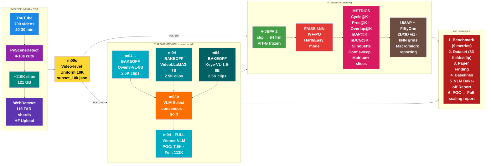
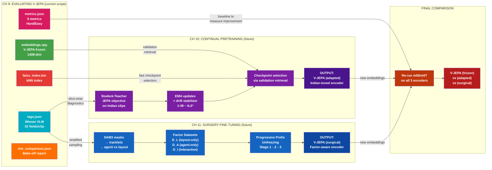

# WalkIndia-200K

> **A Large-Scale Benchmark for Evaluating Video Foundation Models on Non-Western Urban Scenes**

---

## The Big Question

```
┌─────────────────────────────────────────────────────────────────────────────────┐
│   "Can an AI model trained on WESTERN videos understand INDIAN streets?"        │
├─────────────────────────────────────────────────────────────────────────────────┤
│                                                                                 │
│   V-JEPA was trained on YouTube videos (mostly Western content).                │
│   We test if it can recognize that:                                             │
│                                                                                 │
│   • Two Indian market scenes are SIMILAR                                        │
│   • A market scene is DIFFERENT from a temple scene                             │
│   • Night traffic looks DIFFERENT from morning traffic                          │
│                                                                                 │
│   WITHOUT teaching it anything about India!                                     │
│                                                                                 │
└─────────────────────────────────────────────────────────────────────────────────┘
```

---

## Research Novelty

| Rank | Novelty | Strength | Why Novel |
|------|---------|----------|-----------|
| 1 | **Geographic transfer evaluation** | STRONG | No one has tested if V-JEPA's "world model" transfers to Indian streets |
| 2 | **Label-free video evaluation metrics** | STRONG | Self-consistency & stability metrics are new for video (only done for images) |
| 3 | **Indian urban video dataset** | MEDIUM | New dataset contribution (~200K clips from 700 videos) |
| 4 | **VLM bake-off pipeline** | MEDIUM | 3-VLM comparison (Qwen3-VL, VideoLLaMA3, Keye-VL) → consensus-based winner selection |

### POC-First Strategy

**Run the entire 4-chapter pipeline on a 10K video-level uniform subset before scaling to 115K.**

| Aspect | Detail |
|--------|--------|
| **Subset size** | 10,000 clips (from 115K) |
| **Why 10K** | Statistical minimum for kNN (k=6, 10 scene types × 1K each), FAISS IVF-PQ training (≥8K), confidence sweep binning |
| **Sampling** | Video-level uniform: each video contributes ~equal clips (ensures all cities/types represented) |
| **Tool** | `m00c_sample_subset.py` → `data/subset_10k.json` (deterministic, seed=42) |
| **Flag** | All scripts (m04-m07) accept `--subset data/subset_10k.json` to operate on POC subset only |
| **Output dir** | `outputs_poc/` (separate from `outputs/`) |
| **Scale up** | After POC validates → drop `--subset` flag, same scripts run on 115K |

**POC timeline:**
| Week | Chapter | GPU Hours | Deliverable |
|:----:|---------|:---------:|-------------|
| 1 | Ch 8+9 (data + eval) | ~4h | POC metrics.json + plots |
| 2 | Ch 10 (continual pretraining) | ~20h | frozen vs adapted comparison |
| 3-4 | Ch 11 (surgery fine-tuning) | ~54h | frozen vs adapted vs surgical comparison |

### Research Gap (Validated via Web Search)

- NO evaluation of V-JEPA on Indian/non-Western street videos
- NO large-scale Indian urban walking video dataset
- NO "self-consistency + stability" metrics applied to VIDEO embeddings
- NO study on cultural/geographical transfer of video world models

### Honest Limitations

| Limitation | Mitigation |
|------------|------------|
| VLM tags are pseudo-labels, not ground truth | VLM bake-off (3-way consensus on 2.5K clips) + per-field confidence + confidence sweep |
| Circular bias: Western models validating Western models | Include DINOv2/random baselines; primary metrics are label-free (Cycle@K, Overlap@K) |
| Video artifacts (blur, shake) may confound clustering | Quality filtering + stratified analysis |

---

## Pipeline Summary



### Why VLM Branch connects to V-JEPA BRANCH (W → F, W -.-> G)

```
DATA PIPELINE        V-JEPA BRANCH              VLM BAKE-OFF BRANCH
─────────────        ─────────────              ──────────────────────
WebDataset    ──→    m00c Subset   ──→          POC: 10K clips (--subset)
(116 TARs)           (10K uniform)               Full: 115K clips (no flag)
                          │
                          ├──→ V-JEPA 2 → FAISS  ←──  Phase 1: 3 VLMs × 2.5K clips
                          │    embeddings   ↑           Qwen3-VL   ──┐
                          │                 │           VideoLLaMA3 ──┤→ m04b Select → Winner
                          │                 │           Keye-VL-1.5 ──┘
                          │                 │          Phase 2: Winner × remaining → tags.json
                          │                 │          (POC: 7.5K remaining | Full: 113K remaining)
                          │                 │
                     Prec@K uses BOTH:
                     • embeddings (V-JEPA) for kNN neighbors
                     • scene_type (winner VLM pseudo-label) as diagnostic labels

                     No gold truth needed:
                     • cross-VLM consensus on 2,500 clips = proxy gold truth
                     • VLM with highest agreement with other two = winner

                     NOTE: Tags are DIAGNOSTIC — primary metrics
                     (Cycle@K, Overlap@K) are label-free
```

How tags flow into evaluation:

```
Phase 1: Bake-off (2,500 clips × 3 VLMs)
m04 --BAKEOFF qwen       → data/bakeoff/tags_qwen.json
m04 --BAKEOFF videollama  → data/bakeoff/tags_videollama.json
m04 --BAKEOFF keye        → data/bakeoff/tags_keye.json
         ↓
m04b_vlm_select.py → vlm_comparison.json + plots → Winner

Phase 2: Winner on remaining clips
m04 --FULL <winner> --subset data/subset_10k.json → outputs_poc/tags.json  (POC: 7.5K)
m04 --FULL <winner>                               → tags.json              (Full: 113K)

tags.json                            m06 evaluates V-JEPA quality (9 metrics):
┌──────────────────────┐            ┌──────────────────────────────────┐
│ [                    │            │ Prec@K:                          │
│   {                  │            │   For each clip i:               │
│     "scene_type":    │──────────→ │     my_type = tags[i]["scene_type"]
│       "market",      │            │     neighbors = kNN(embeddings[i])│
│     "confidence_     │            │     % neighbors with same type?  │
│       scene_type":   │            ├──────────────────────────────────┤
│       0.92,          │            │ + Cycle@K, Overlap@K, mAP@K,    │
│     "_model": ...,   │            │   nDCG@K, Silhouette            │
│     ...              │            │ + Conf sweep, Multi-attr slices  │
│   },                 │            │ + Hard/Easy mode (±30s window)   │
│   ...                │            └──────────────────────────────────┘
│ ]                    │
└──────────────────────┘            m07 visualizes:
                       ──────────→  ┌──────────────────────────────────┐
                                    │ UMAP scatter colored by scene_type│
                                    │ Confusion matrix + kNN grids     │
                                    │ Macro/micro reporting            │
                                    └──────────────────────────────────┘
```

<details>
<summary>Original ASCII art (cross-reference)</summary>

```
╔═══════════════════════════════════════════════════════════════════════════════════════════════════════════════════════════════════════════╗
║                                                       WalkIndia-200K Benchmark                                                            ║
╚═══════════════════════════════════════════════════════════════════════════════════════════════════════════════════════════════════════════╝

┌──────────────┐       ┌──────────────────┐       ┌──────────────┐
│   YouTube    │       │  PySceneDetect   │       │  ~115K clips │
│  700 videos  │ ════► │  4-10s cuts      │ ════► │   121 GB     │ ════╗
│  20-30 min   │       │  4-10s cuts      │       │              │     ║
└──────────────┘       └──────────────────┘       └──────────────┘     ║
                                                                       ▼
╔══════════════════════════════════════════════════════════════════════▼════════════════════════════════════════════════════════════════════╗
║                                          PARALLEL PROCESSING                                                                              ║
╠═══════════════════════════════════════════════════════════════════════════════════════════════════════════════════════════════════════════╣
║                                                                                                                                           ║
║  V-JEPA BRANCH:                                                                                                                           ║
║  ┌──────────────────┐       ┌──────────────────┐       ┌──────────────────────────────────┐       ┌───────────────────────────────┐       ║
║  │    V-JEPA 2      │       │    FAISS kNN     │       │           METRICS (9)            │       │     UMAP + FiftyOne           │       ║
║  │  clip ➔ 64 frm   │ ════► │     IVF-PQ       │ ════► │  Cycle@K · Prec@K · Overlap@K   │ ════► │   2D/3D viz · kNN grids       ═║═══╗   ║
║  │  ➔ ViT-G (frozen)│       │  Hard/Easy mode  │       │  mAP@K · nDCG@K · Silhouette   │       │   Macro/micro reporting        │   ║   ║
║  └──────────────────┘       └──────────────────┘       │  Conf sweep · Multi-attr slices │       └───────────────────────────────┘   ║   ║
║                                     ▲                  └──────────────────────────────────┘                                           ║   ║
║                                     ║                              ▲                                                                  ║   ║
║                                     ║ tags + confidence ───────────┘ (confidence feeds threshold sweep)                               ║   ║
║                                     ║                                                                                                 ║   ║
║  VLM BAKE-OFF BRANCH (3 VLMs × 2.5K → select winner → full 113K):                                                                    ║   ║
║  ┌──────────────────────────────┐                                                                                                     ║   ║
║  │  m04 --BAKEOFF (2.5K clips) │     ┌───────────────────────────┐     ┌──────────────────────────┐                                   ║   ║
║  │  ├ Qwen3-VL-8B              │     │  m04b VLM Select (CPU)    │     │  m04 --FULL (winner)     │                                   ║   ║
║  │  ├ VideoLLaMA3-7B           │────►│  consensus = proxy gold   │────►│  ~113K remaining clips   │═════════════════════════════════╣   ║
║  │  └ Keye-VL-1.5-8B           │     │  → vlm_comparison.json    │     │  → tags.json (33 fields) │                                   ║   ║
║  └──────────────────────────────┘     └───────────────────────────┘     └──────────────────────────┘                                   ║   ║
║                                                                                                                                       ║   ║
╚═══════════════════════════════════════════════════════════════════════════════════════════════════════════════════════════════════════╩═══╩═╝
                                                                                                                                        ║
                                                                                                                                        ▼
╔═══════════════════════════════════════════════════════════════════════════════════════════════════════════════════════════════════════════╗
║                                                           DELIVERABLES                                                                    ║
╠═════════════════════╦═════════════════════════════════════════════════════════════════════════════════════════════════════════════════════╣
║ 1. Benchmark        ║ 9 metrics: Cycle@K, Prec@K, Overlap@K, mAP@K, nDCG@K, Silhouette, Conf sweep, Slices, Hard/Easy                    ║
║ 2. Dataset          ║ WalkIndia-200K (115K clips · 33 fields/clip: tags + confidence + provenance)                                        ║
║ 3. Paper Finding    ║ Does V-JEPA transfer to Indian streets? (Yes/No + evidence across 9 metrics)                                       ║
║ 4. Baselines        ║ Random embeddings, DINOv2, shuffled V-JEPA, CLIP                                                                   ║
║ 5. VLM Bake-off     ║ 3-VLM comparison report on 2.5K clips (consensus-based selection, publishable finding)                                ║
╚═════════════════════╩═════════════════════════════════════════════════════════════════════════════════════════════════════════════════════╝
```

</details>

### Clarification: "Label-Free" Claim

| Metric | Truly Label-Free? | Explanation |
|--------|-------------------|-------------|
| **Cycle@K** | YES | If A's nearest neighbor is B, does B point back to A? No labels needed. |
| **Overlap@K** | YES | Same clip with different crops → similar neighbors? No labels needed. |
| **Silhouette** | **NO** | Uses scene_type labels for cluster assignment. |
| **Prec@K / mAP@K / nDCG@K** | **NO** | Uses bake-off winner's pseudo-labels as diagnostics. Honest about this. |

### Addressing Circular Bias

| Concern | Mitigation |
|---------|------------|
| V-JEPA + VLM both Western-trained | Primary metrics (Cycle@K, Overlap@K) are label-free — no VLM dependency |
| Single VLM bias | 3-VLM bake-off on 2.5K clips validates tag quality via cross-model consensus |
| Video artifacts vs semantics | Filter by quality score, stratify analysis by blur/shake |
| VLMs may share training data biases | 3 architecturally diverse VLMs (different backbones, vision encoders) + DINOv2/random baselines |

---

## Step 1: Data Collection

| Source | @walkinginindia YouTube |
|--------|-------------------------|
| Videos | ~700 videos × 20-30 min |
| Total  | 14,000-21,000 minutes   |
| Content| Markets, Junctions, Temples, Beach roads, Lanes |
| Tool   | `yt-dlp` / `youtube-dl` |
| Output | Raw `.mp4` files        |

---

## Step 2: Scene Detection

**Library**: `PySceneDetect` ([scenedetect.com](https://scenedetect.com))

```
30-min video ──→ Content Detection ──→ [clip1][clip2][clip3]...
                                        4-10s  4-10s  4-10s
                                      + optional --keyframes (1 JPEG per clip)
```

| Input  | 700 videos              |
|--------|-------------------------|
| Output | ~115K short clips (4-10s), optional keyframes via `--keyframes` |
| Method | Greedy scene-aware splitting (PySceneDetect ContentDetector) |

---

## Step 3: V-JEPA 2 Embedding

**Model**: `facebook/vjepa2-vitg-fpc64-384` (1B params, frozen)

```
4-10s clip ──→ Sample 64 frames ──→ ViT-G Encoder ──→ Embedding Vector
                                    (NO TRAINING)     [dim: 1408]
```

| Property | Value |
|----------|-------|
| Frames   | 64 per clip |
| Params   | 1B (ViT-G, frozen) |
| Embedding dim | 1408 |
| Training | None required |

---

## Step 4: Auto-Tagging (VLM Bake-off → Winner)

**Architecture**: Single parameterized script `m04_vlm_tag.py --model qwen|videollama|keye`

```
Phase 1: Bake-off (same 2,500 clips × 3 VLMs)
m04_vlm_tag.py --model qwen       --BAKEOFF → data/bakeoff/tags_qwen.json
m04_vlm_tag.py --model videollama  --BAKEOFF → data/bakeoff/tags_videollama.json
m04_vlm_tag.py --model keye        --BAKEOFF → data/bakeoff/tags_keye.json
                                        ↓
m04b_vlm_select.py → vlm_comparison.json (consensus = proxy gold truth)
                                        ↓
Phase 2: Winner runs --FULL → tags.json (resumes from bake-off checkpoint)
```

No gold truth needed — cross-VLM consensus IS the evaluation:
- 3 architecturally different VLMs tag the same 2,500 clips independently
- VLM with highest agreement with the other two = winner
- Also measured: JSON parse rate, taxonomy compliance, confidence calibration, speed

VLMs selected by **benchmark scores** (not download count):

| VLM | Size | VideoMME | MLVU | Why Selected |
|-----|------|:--------:|:----:|-------------|
| **Qwen3-VL-8B** | 8B | — | 75.3 | Best Hindi text/signage, existing implementation |
| **VideoLLaMA3-7B** | 7B | 66.2 | 73.0 | Best MLVU + PerceptionTest (72.8), SigLIP vision encoder |
| **Keye-VL-1.5-8B** | 8B | 73.0 | — | Highest VideoMME (beats GPT-4o 71.9), SlowFast encoding |

GPU budget: ~1h bake-off + ~10h full = **~11h total** (vs ~30h if all 3 on full)

Structured tags per clip — 11 fields (NOT free-form captions):

```json
{
  "scene_type":             "market|junction|residential_lane|promenade|transit|temple_tourist|highway|alley|commercial|construction",
  "time_of_day":            "morning|afternoon|evening|night",
  "weather":                "clear|cloudy|rain|fog|overcast",
  "crowd_density":          "low|med|high",
  "traffic_density":        "low|med|high",
  "road_surface":           "asphalt|concrete|dirt|cobblestone|mixed|paved|unpaved|wet",
  "infrastructure_quality": "good|moderate|poor",
  "vegetation":             "none|sparse|moderate|dense",
  "lighting":               "natural|artificial|mixed|low_light",
  "notable_objects":        ["bus","auto_rickshaw","bike","car","truck","street_vendor","police","signage","animals","pedestrian","construction_barrier"],
  "road_layout":            "intersection|narrow_lane|wide_road|sidewalk_present|median",

  "confidence_scene_type":  0.92,
  "confidence_time_of_day": 0.85,
  "...":                    "... (11 confidence fields, each in [0,1])",

  "_model":                 "Qwen/Qwen3-VL-8B-Instruct",
  "_prompt_version":        "v1.0",
  "_tagged_at":             "2026-02-22T14:30:00Z",
}
```

After m04 tagging (winner VLM): 8 metadata + 11 tags + 11 confidence + 3 provenance = **33 fields per clip**

---

## Step 5: FAISS Indexing

**Library**: `FAISS` (Facebook AI Similarity Search)

**Why FAISS instead of naive kNN:**
| Metric | Naive kNN | FAISS (IVF-PQ) |
|--------|-----------|----------------|
| Time complexity | O(n²) | O(n log n) |
| 200K clips search | ~hours | ~seconds |
| Memory | All in RAM | Compressed (PQ) |
| GPU support | No | Yes (5-10x faster) |

```
115K embeddings ──→ FAISS Index (IVF-PQ) ──→ Fast Approximate kNN
                                              ├── Easy mode (all neighbors)
                                              └── Hard mode (exclude ±30s same video)
```

**Hard/Easy Mode** (proposal alignment):
- Easy: default kNN, no exclusion
- Hard: mask out neighbors within ±30s of same video_id before computing metrics
- Reports both modes side-by-side — handles temporal leakage without train/val/test splits

**Recommended Index:**
```python
import faiss

d = 1408  # V-JEPA ViT-G embedding dimension
nlist = 1000  # clusters for IVF

# IVF + PQ: fast, memory-efficient
quantizer = faiss.IndexFlatL2(d)
index = faiss.IndexIVFPQ(quantizer, d, nlist, 16, 8)
index.train(embeddings)
index.add(embeddings)

# Search k nearest neighbors
distances, indices = index.search(query, k=10)
```

---

## Step 6: UMAP Visualization

**Library**: `UMAP` (Uniform Manifold Approximation and Projection)

**Why UMAP:**
| Feature | UMAP | t-SNE |
|---------|------|-------|
| Speed | Fast | Slow |
| Global structure | Preserved | Lost |
| Scalability | 200K+ points | ~10K points |
| Clustering-friendly | Yes (works with HDBSCAN) | Limited |

```
1408-dim embeddings ──→ UMAP ──→ 2D/3D scatter plot + kNN neighbor grids
```

**Use cases:**
- Paper figures showing cluster separation
- Debug embedding quality
- Validate if scene types actually cluster

```python
import umap

reducer = umap.UMAP(n_components=2, n_neighbors=15, min_dist=0.1)
embedding_2d = reducer.fit_transform(embeddings)

# Plot with scene_type colors from Qwen3-VL tags
plt.scatter(embedding_2d[:, 0], embedding_2d[:, 1], c=scene_type_colors)
```

---

## Step 7: FiftyOne Exploration

**Library**: `FiftyOne` (Voxel51) - Open-source dataset curation tool

**Why FiftyOne:**
| Feature | Custom Scripts | FiftyOne |
|---------|----------------|----------|
| Interactive UI | No | Yes (web-based) |
| UMAP built-in | Manual | One-click |
| Filter by tags | Code | Visual |
| Find outliers | Hard | Easy |
| Share with team | Difficult | URL link |

```
clips + embeddings + tags ──→ FiftyOne Dataset ──→ Interactive Web UI
```

**Use cases:**
- Browse 200K clips visually
- Click on UMAP points to view clips
- Filter by scene_type, crowd_density, etc.
- Find mislabeled samples

```python
import fiftyone as fo

dataset = fo.Dataset("walkindia-200k")
for clip_path, embedding, tags in zip(clips, embeddings, all_tags):
    sample = fo.Sample(filepath=clip_path)
    sample["embedding"] = embedding.tolist()
    sample["scene_type"] = tags["scene_type"]
    sample["crowd_density"] = tags["crowd_density"]
    dataset.add_sample(sample)

# Launch interactive UI
session = fo.launch_app(dataset)
```

---

## Step 8: Evaluation - Quantitative Metrics (9 metrics)

All metrics reported in **Easy** (all neighbors) and **Hard** (±30s exclusion window) modes.

### 8.1 Label-Free Metrics (Core Contribution)

| Metric | Proposal Name | Formula | What It Measures |
|--------|---------------|---------|------------------|
| **Cycle@K** | Cycle@k (Step 6) | % of clips where kNN(A)=B implies kNN(B)=A | Embedding neighborhood stability |
| **Overlap@K** | Overlap@K (Step 7) | IoU of kNN neighborhoods from two views. *Implemented as dim-split approximation (no crop augmentation pipeline).* | Robustness to view changes |
| **Silhouette** | Silhouette (Step 8) | sklearn silhouette_score on embeddings + scene_type | Cluster separation quality |

### 8.2 Pseudo-Label Metrics (uses Qwen diagnostic tags)

| Metric | Proposal Name | Formula | What It Measures |
|--------|---------------|---------|------------------|
| **Prec@K** | Prec@K (Step 9) | % of kNN neighbors with same scene_type | Semantic coherence |
| **mAP@K** | mAP@K (Step 10) | Mean Average Precision: ranked retrieval with tag-based relevance | Retrieval ranking quality |
| **nDCG@K** | nDCG@K (Step 10) | Normalized DCG: graded relevance from multi-field tag overlap | Graded retrieval quality |

### 8.3 Analysis Metrics

| Metric | Proposal Step | What It Measures |
|--------|---------------|------------------|
| **Multi-attribute slices** | Step 11 | Prec@K grouped by time_of_day, weather, crowd_density, etc |
| **Confidence sweep** | Step 14 | Vary confidence cutoff → plot Prec@K vs coverage |
| **Macro/micro averaging** | Step 13 | Per-class avg (macro) and global avg (micro) for all metrics |

### 8.4 Baselines (Required for Fair Comparison)

| Baseline | Purpose |
|----------|---------|
| **Random embeddings** | Lower bound - should have ~0% consistency |
| **Shuffled V-JEPA** | Tests if temporal order matters |
| **DINOv2 (image-only)** | Tests if video understanding adds value |
| **CLIP** | Tests text-vision alignment baseline |

### 8.5 Tag Quality Control (VLM Bake-off + Confidence)

Winner VLM selected via 3-way bake-off on 2,500 clips:

| QC Mechanism | How It Works |
|-------------|--------------|
| **VLM bake-off** | 3 VLMs tag 2.5K clips → cross-VLM consensus selects best VLM (no gold labels) |
| **Per-field confidence** | Winner VLM outputs confidence_* per field in [0,1] |
| **Confidence sweep** | Vary threshold → plot metric vs coverage tradeoff |
| **High-confidence slices** | Only evaluate on clips with confidence > threshold |

Bake-off selection criteria (5 dimensions):
| Criterion | Weight | Signal |
|-----------|:------:|--------|
| JSON parse success % | 30% | VLM that can't produce valid JSON is useless |
| Cross-VLM agreement % | 25% | VLM closest to majority vote across 11 fields |
| Speed (clips/sec) | 20% | Matters for 113K full run |
| Taxonomy compliance % | 15% | Values within allowed categories |
| Confidence calibration | 10% | High confidence → high agreement? |

Tags are DIAGNOSTIC for Ch 10-11 slice-wise analysis.
Primary metrics (Cycle@K, Overlap@K) are label-free and don't depend on tag quality.

### 8.6 Confounder Analysis

| Confounder | Mitigation |
|------------|------------|
| Motion blur | Filter clips by blur score > threshold |
| Camera shake | Filter clips by optical flow variance |
| Lighting changes | Stratify analysis: day vs night |
| Video quality | Report metrics separately for high/low quality |

### Success Criteria

> **POC milestone (10K subset):** Same criteria on 10K clips. If POC metrics are stable → scale to 115K.
> **Full milestone (115K):** V-JEPA transfers well if: (1) Cycle@K > 70%, (2) Outperforms DINOv2 baseline on Indian data, (3) Hard-mode Prec@K significantly above random baseline, (4) Ch 10-11 adapted model improves over frozen baseline.

---

## Key Libraries

| Step | Library | Purpose |
|------|---------|---------|
| 0c | m00c_sample_subset.py | Video-level uniform 10K subset for POC → `data/subset_10k.json` |
| 2 | PySceneDetect | Split videos into clips (optional `--keyframes` for JPEG export) |
| 3 | V-JEPA 2 (ViT-G) | Frozen video embeddings (1408-dim) |
| 4 | Qwen3-VL-8B / VideoLLaMA3-7B / Keye-VL-1.5-8B | VLM bake-off (2.5K clips) → winner tags full dataset |
| 4b | m04b_vlm_select.py | CPU-only: cross-VLM consensus comparison → pick winner |
| 5 | FAISS | Fast similarity search (GPU) + Hard/Easy mode |
| 6 | UMAP | Dimensionality reduction & visualization + kNN grids |
| 7 | FiftyOne | Interactive dataset exploration |

---

## Proposal Alignment (FactorJEPA Ch 8-9)

Cross-reference: FactorJEPA proposal chapters 8 (Automatic Annotations) and 9 (Evaluating V-JEPA)
were compared against this plan. 12 discrepancies were found and resolved:

| # | Discrepancy | Decision | Rationale |
|---|-------------|----------|-----------|
| 1 | 11 tag fields vs proposal's 7 | **KEEP 11** | Extra 4 (road_surface, infrastructure_quality, vegetation, lighting) capture India-specific attributes |
| 2 | Variable 4-10s clips vs proposal's fixed 10s | **KEEP 4-10s** | Scene-aware splitting produces better clips |
| 3 | QC: dual-prompt + human audit | **SKIP** | Confidence from Qwen logprobs + confidence sweep. Tags are diagnostic only |
| 4 | Per-field confidence scores | **ADD** | Qwen outputs confidence_* per field (logprobs). Enables confidence sweep in m06 |
| 5 | Provenance tracking | **ADD** | _model, _prompt_version, _tagged_at per clip |
| 6 | Keyframe export | **ADD (optional)** | --keyframes flag in m02, 1 keyframe per clip via ffmpeg. m07 extracts frames on-the-fly without this. |
| 7 | Metric naming mismatch | **RENAME** | Use proposal names: Cycle@K, Prec@K, Overlap@K (old names as aliases) |
| 8 | 6+ missing metrics | **ADD** | mAP@K, nDCG@K, Silhouette, Overlap@K, multi-attr slices, conf sweep, macro/micro |
| 9 | No Hard/Easy mode | **ADD** | Exclusion window ±30s within same video_id. Report both modes |
| 10 | No train/val/test splits | **SKIP** | Pure evaluation project — no training. Exclusion window (#9) handles leakage |
| 11 | Multi-VLM cross-check | **ADD (bake-off)** | 3 VLMs on 2.5K clips → consensus selects winner → winner on full 113K. GPU-efficient |
| 12 | Baselines (plan addition) | **KEEP** | Random, DINOv2, Shuffled V-JEPA, CLIP — needed for fair comparison |

---

## Engineering Details

### Context: Why WebDataset TAR Shards

115,687 mp4 clips (121.2 GB) across 75 sections. Individual mp4 upload failed due to:
- HF 10k files/directory limit (kolkata/walking has 20,633 files)
- 256 commits/hour rate limit (stuck at 104k/115k for 12+ hours)
- MerkleDB xet cache errors

Solution: WebDataset TAR shards (~1GB each). HF sees ~120 files instead of 115k.

TAR structure (HF WebDataset convention):
```
data/
├── train-00000.tar
│   ├── 000000.mp4          # clip video
│   ├── 000000.json         # metadata for this clip
│   ├── 000001.mp4
│   ├── 000001.json
│   └── ...                 # ~1000 clips per shard
├── train-00001.tar
├── ...
└── train-00115.tar         # ~116 shards total
```

### Key Design Decisions

1. **m03_pack_shards.py vs utils/hf_utils.py — NOT redundant:**
   - m03 = CLI pipeline step (TAR packing + upload orchestration)
   - hf_utils = shared library (auth, token, README gen, metadata upload)
   - m03 imports FROM hf_utils

2. **m02b stays standalone (not merged into m02):**
   - m02 takes ~6 hours (scene detection + encoding)
   - m02b takes ~5 min (ffprobe scan)
   - Separate steps = independent re-runs

3. **Obsolete functions removed from hf_utils.py:**
   - upload_full() — old upload_large_folder approach (hit 10k file limit)
   - commit_remaining() — old batch commit workaround

### Naming Convention

- Numbered modules (m00-m07): Pipeline steps with CLI (--SANITY/--BAKEOFF/--FULL)
- m00c_sample_subset.py: Video-level uniform sampling → data/subset_10k.json (deterministic, seed=42)
- m04_vlm_tag.py: Parameterized by --model (qwen|videollama|keye). VLMBackend ABC + 3 concrete impls
- m04b_vlm_select.py: CPU-only bake-off comparison. Reads 3 bakeoff JSONs → picks winner
- --subset flag: All scripts (m04-m07) accept this. Filters to POC subset, outputs to outputs_poc/
- utils/config.py: All path constants, VLM_MODELS dict, SUBSET_FILE, shared utility functions
- utils/tag_taxonomy.json: Tag field definitions + confidence schema

### m04 Production Architecture

vLLM research notes:
- `limit_mm_per_prompt={"video": 1}` (1 video per prompt)
- `process_vision_info(messages, return_video_kwargs=True)` handles video extraction
- `mm_processor_kwargs=video_kwargs` is CRITICAL (tells processor not to re-sample frames)
- `enforce_eager=True` avoids CUDA graph memory issues
- `OMP_NUM_THREADS=1` fixes thread oversubscription in containers

HF WebDataset streaming:
- `load_dataset(repo, split="train", streaming=True)` auto-detects TAR shards
- `.decode(False)` returns raw mp4 bytes (no video decoding)
- Each example: `{"mp4": {"path":..., "bytes": b"..."}, "json": {...}, "__key__": "000000"}`

Architecture (orchestrator/worker pattern):
```
ORCHESTRATOR (main process, no GPU)
    ├── reads checkpoint (tags.json)
    ├── spawns WORKER subprocess every 10k clips (prevents VRAM leak)
    └── loops until all clips done

WORKER subprocess (loads vLLM, exits after segment)
    ├── loads VLM via vLLM LLM() [max_model_len=4096, enforce_eager=True]
    │
    ├── PRODUCER THREAD (background)
    │   ├── HF WebDataset stream (streaming=True, decode=False)
    │   ├── retry on ConnectionError/Timeout (exp backoff)
    │   ├── write mp4 → project-local tmpdir
    │   ├── validate mp4 (size >1KB + cv2 frame count >0)
    │   ├── ThreadPoolExecutor(4): process_vision_info() in parallel
    │   └── put preprocessed batch → Queue(maxsize=2)
    │
    ├── CONSUMER (main thread, GPU inference)
    │   ├── take batch from Queue
    │   ├── vLLM LLM.generate() → batched inference
    │   ├── parse JSON → merge metadata + 11 tags
    │   └── atomic checkpoint every 500 clips (os.replace)
    │
    └── exit (GPU memory fully released)
```

Production issues resolved (10 fixes):

| # | Issue | Severity | Fix |
|---|-------|----------|-----|
| 1 | VRAM leak over long runs | CRITICAL | Orchestrator spawns worker subprocesses every 10k clips |
| 2 | CPU RAM leak (V1 engine) | HIGH | `VLLM_USE_V1=0` forces stable V0 engine |
| 3 | Single-threaded preprocessing | HIGH | `ThreadPoolExecutor(4)` parallelizes process_vision_info() |
| 4 | Oversized encoder cache | MEDIUM | max_model_len 16384→4096 (4x headroom for our clips) |
| 5 | HF streaming timeout | HIGH | Producer retries with exponential backoff (1s→60s, max 5) |
| 6 | Corrupted MP4 crash | MEDIUM | validate_mp4() checks size + frame count before VLM |
| 7 | Tempfile /tmp disk full | MEDIUM | Uses project-local tmpdir, always cleaned in finally block |
| 8 | Checkpoint corruption | MEDIUM | Atomic os.replace(), .tmp backup recovery, interval 500 clips |
| 9 | GPU under-utilization | HIGH | Producer/consumer pipeline: preprocess N+1 while GPU infers N |
| 10 | Tests | — | py_compile, AST, --help verified |

### Performance Budget (H100 80GB)

Bake-off budget:
- Qwen on 2,500 clips at ~3 clips/s = ~14 min
- VideoLLaMA3 on 2,500 clips at ~1-2 c/s = ~20-40 min
- Keye-VL on 2,500 clips at ~2-3 clips/s = ~15-20 min
- Total bake-off: ~50-70 min

POC budget (10K subset):
- Bake-off (3 x 2.5K): ~1h GPU
- Winner on remaining 7.5K: ~45 min GPU
- V-JEPA embed 10K: ~2h GPU
- FAISS + UMAP: ~20 min CPU
- Total POC Ch 8+9: ~4h GPU + ~25 min CPU

Full budget (115K, after POC validates):
- Full run (winner only): 113k clips / 3 clips/s / 3600 = ~10.5 hours
- Grand total: ~11.5 hours (vs ~30h if all 3 ran on full)

### Metrics Output Schema (m06)

```json
{
  "easy": {
    "cycle_at_k": 72.1, "prec_at_k": 58.3,
    "overlap_at_k": 65.0, "map_at_k": 0.45,
    "ndcg_at_k": 0.52, "silhouette": 0.31,
    "per_scene": {},
    "multi_attribute_slices": {},
    "macro_avg": {}, "micro_avg": {}
  },
  "hard": {"cycle_at_k": 41.5, "prec_at_k": 35.2, "...": "..."},
  "confidence_sweep": [
    {"threshold": 0.5, "coverage": 0.95, "prec_at_k": 56.1},
    {"threshold": 0.7, "coverage": 0.80, "prec_at_k": 62.3}
  ],
  "k_neighbors": 6, "num_clips": 10000, "exclusion_window_sec": 30,
  "mode": "poc", "subset_file": "data/subset_10k.json"
}
```

---

## Bridge: How Ch 9 Outputs Feed into Ch 10-11

> **Note:** Ch 10-11 are NOT in current scope. This section shows how current work connects to future work.
> POC-first: All 4 chapters run on 10K subset first. Scale to 115K after POC validates.
> Detailed Ch 10-11 diagrams will be created when Ch 9 POC metrics are in hand.



**What each Ch 9 artifact feeds:**

| Ch 9 Output | Used By | Purpose |
|-------------|---------|---------|
| `embeddings.npy` | Ch 10 | Validation retrieval (Cycle@K, Overlap@K) to select best checkpoint |
| `tags.json` | Ch 10, Ch 11 | Slice-wise diagnostics (scene_type, time_of_day trends) + stratified sampling |
| `faiss_index.bin` | Ch 10 | Fast kNN during checkpoint selection (no rebuilding index each time) |
| `metrics.json` | Ch 11, Final | Frozen V-JEPA baseline to measure how much adaptation improves |
| `vlm_comparison.json` | Paper | Publishable finding: which VLM works best on Indian street videos |

**Final comparison (the paper's punchline):**
```
V-JEPA (frozen)    → metrics_frozen.json     ← Ch 9 (current)
V-JEPA (adapted)   → metrics_adapted.json    ← Ch 10 (continual pretraining)
V-JEPA (surgical)  → metrics_surgical.json   ← Ch 11 (surgery fine-tuning)

Question the paper answers:
"Does domain adaptation help V-JEPA understand Indian streets better?"
```

---

## Optional Improvements

The following tools are **not required** for the current pipeline but may be useful for future extensions.

---

### 1. SAM3 (Segment Anything Model 3)

**Purpose**: Pixel-level object segmentation masks

| Aspect | Details |
|--------|---------|
| **Pros** | Precise object boundaries, exact object counts, track objects across frames |
| **Cons** | High compute cost, slow inference, requires GPU |
| **Current Redundancy** | LOW - Required for Ch 11 factor datasets (layout/agent/interaction) |
| **Future Use Case** | Ch 11: SAM3 masks → tracklets → factor patching for surgery fine-tuning |

```
[OPTIONAL] clip frames ──→ SAM3 ──→ pixel masks per object
```

---

### 2. DINOv2 (Multi-Encoder Ensemble)

**Purpose**: Add image-based embeddings alongside V-JEPA video embeddings

| Aspect | Details |
|--------|---------|
| **Pros** | Strong static appearance features, well-established baseline, can ensemble with V-JEPA |
| **Cons** | 2x compute cost, requires embedding fusion strategy |
| **Current Redundancy** | HIGH - V-JEPA 2 already trained on images+videos, covers both motion & appearance |
| **Future Use Case** | Ablation study comparing V-JEPA vs DINOv2 vs ensemble on Indian data |

```
[OPTIONAL] clip ──→ DINOv2 ──→ image embedding ──┐
                └──→ V-JEPA ──→ video embedding ──┴──→ concat/fuse
```

---

### 3. TransNetV2 (Neural Scene Detection)

**Purpose**: Neural network-based scene boundary detection (replace PySceneDetect)

| Aspect | Details |
|--------|---------|
| **Pros** | Higher accuracy on hard cuts, better on gradual transitions, trained on real boundaries |
| **Cons** | Requires GPU, slower than PySceneDetect, marginal improvement |
| **Current Redundancy** | MEDIUM - PySceneDetect's `detect-adaptive` already good enough |
| **Future Use Case** | If scene splits are poor quality, switch to TransNetV2 |

```
[OPTIONAL] video ──→ TransNetV2 ──→ more accurate scene boundaries
```

---

### 4. Autodistill (Zero-Annotation Object Detection)

**Purpose**: Auto-label objects using foundation models (GroundingDINO + SAM)

| Aspect | Details |
|--------|---------|
| **Pros** | Precise bounding boxes, object counts, no manual labeling needed |
| **Cons** | Pipeline complexity, requires multiple models, slow inference |
| **Current Redundancy** | HIGH - Qwen3-VL sufficient for scene-level tagging, we don't need boxes |
| **Future Use Case** | If you need object-level ground truth for training downstream models |

```
[OPTIONAL] clip ──→ GroundingDINO ──→ bounding boxes ──→ object counts
```

---

### 5. Weak Supervision / LLM Validator

**Purpose**: Use LLM (GPT-4) to auto-correct/validate Qwen3-VL tags

| Aspect | Details |
|--------|---------|
| **Pros** | Catches tagging errors, improves ground truth quality, industry standard |
| **Cons** | API costs (GPT-4), adds latency, premature optimization |
| **Current Redundancy** | HIGH - Only needed if Qwen3-VL tags have many errors (test first) |
| **Future Use Case** | Production-grade dataset curation, if Qwen3-VL accuracy drops below 90% |

```
[OPTIONAL] clip ──→ Qwen3-VL ──→ tags ──→ GPT-4 validator ──→ cleaned tags
```

---

## Optional Summary Table

| Tool | Redundancy | Add When? |
|------|------------|-----------|
| SAM3 | LOW (needed for Ch 11) | Factor datasets for surgery fine-tuning |
| DINOv2 | HIGH | Ablation study / ensemble experiments |
| TransNetV2 | MEDIUM | Scene splits are poor quality |
| Autodistill | HIGH | Need bounding box annotations |
| Weak Supervision | HIGH | Qwen3-VL accuracy < 90% |
