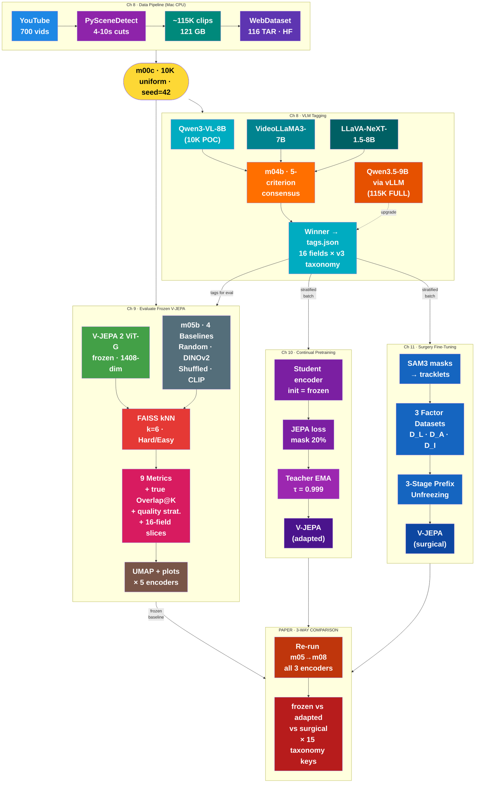
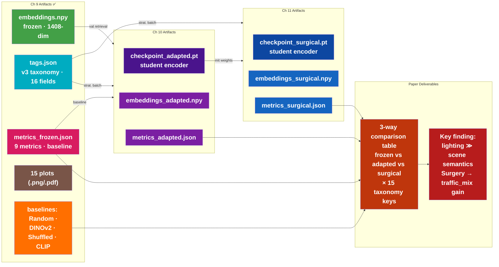

# WalkIndia-200K

> **A Large-Scale Benchmark for Evaluating Video Foundation Models on Non-Western Urban Scenes**

---

## The Big Question

```
┌─────────────────────────────────────────────────────────────────────────────────┐
│   "Can an AI model trained on WESTERN videos understand INDIAN streets?"        │
├─────────────────────────────────────────────────────────────────────────────────┤
│                                                                                 │
│   V-JEPA was trained on YouTube videos (mostly Western content).                │
│   We test if it can recognize that:                                             │
│                                                                                 │
│   • Two Indian market scenes are SIMILAR                                        │
│   • A market scene is DIFFERENT from a temple scene                             │
│   • Chaotic mixed traffic is DIFFERENT from orderly motorized traffic           │
│   • Shared pedestrian-vehicle space is DIFFERENT from separated sidewalks       │
│                                                                                 │
│   WITHOUT teaching it anything about India!  (Ch 9)                             │
│   Then: Can we TEACH it Indian patterns?     (Ch 10 + Ch 11)                   │
│                                                                                 │
└─────────────────────────────────────────────────────────────────────────────────┘
```

---

## Research Novelty

| Rank | Novelty | Strength | Why Novel |
|------|---------|----------|-----------|
| 1 | **Geographic transfer evaluation** | STRONG | No one has tested if V-JEPA's "world model" transfers to Indian streets |
| 2 | **Label-free video evaluation metrics** | STRONG | Self-consistency & stability metrics are new for video (only done for images) |
| 3 | **Indian urban video dataset** | MEDIUM | New dataset contribution (~200K clips from 700 videos) |
| 4 | **VLM bake-off pipeline** | MEDIUM | 3-VLM comparison → consensus-based winner selection |
| 5 | **Domain adaptation via surgery fine-tuning** | STRONG | Factor-decomposed self-supervised adaptation (layout/agent/interaction) |

### Research Gap (Validated via Web Search)

- NO evaluation of V-JEPA on Indian/non-Western street videos
- NO large-scale Indian urban walking video dataset
- NO "self-consistency + stability" metrics applied to VIDEO embeddings
- NO study on cultural/geographical transfer of video world models
- NO factor-decomposed self-supervised domain adaptation for video encoders

### Honest Limitations

| Limitation | Mitigation |
|------------|------------|
| VLM tags are pseudo-labels, not ground truth | VLM bake-off (3-way consensus on 2.5K clips) + per-field confidence + confidence sweep |
| Circular bias: Western models validating Western models | Include DINOv2/random baselines; primary metrics are label-free (Cycle@K, Overlap@K) |
| Video artifacts (blur, shake) may confound clustering | Quality filtering + stratified analysis |

---

## POC-First Strategy

**Run the entire 4-chapter pipeline on a 10K video-level uniform subset before scaling to 115K.**

| Aspect | Detail |
|--------|--------|
| **Subset** | 10,000 clips from 115K (video-level uniform, seed=42) |
| **Tool** | `m00c_sample_subset.py` → `data/subset_10k.json` |
| **Flag** | All scripts accept `--subset data/subset_10k.json` + `--local-data data/subset_10k_local` |
| **Pre-download** | `m00d_download_subset.py` pre-downloads 10K clips to local WebDataset TARs (~11 min, ~10.7 GB) |
| **Output** | `outputs_poc/` (separate from `outputs/`) |
| **Scale** | After POC validates → drop `--subset`, same scripts run on 115K |

### POC Timeline (Sequential, on RTX PRO 6000 96GB)

| Week | Chapter | GPU Hours | Deliverable | Status |
|:----:|---------|:---------:|-------------|--------|
| 1 | Ch 8+9 (data + eval + baselines) | ~8-12h | metrics_frozen.json + 15 plots + baselines | **DONE** (48 outputs, 0 errors. Clean time ~6h 35m on RTX PRO 6000. Actual first run ~12h 18m across 6 runs due to bugs fixed incrementally.) |
| 1.5 | Temporal eval extension (m04f + m06 ext) | ~3h CPU + ~2h GPU | motion features + temporal Prec@K + updated radar | **TODO** (pre-Ch10 requirement) |
| 2 | Ch 10 (continual pretraining) | ~20h | metrics_adapted.json (frozen vs adapted, spatial + temporal) | NEXT |
| 3-4 | Ch 11 (surgery fine-tuning) | ~54h | metrics_surgical.json (frozen vs adapted vs surgical, spatial + temporal) | FUTURE |

---

## Full Pipeline (Ch 8 → 9 → 10 → 11)



---

## Taxonomy: v1 → v3 (Indian Urban)

Tags serve **two purposes only**: (1) stratified batching for Ch10/Ch11, (2) slice-wise evaluation. They are NEVER training labels.

| Field | v1 (Western) | v3 (Indian Urban) | Change |
|-------|-------------|--------------------------|--------|
| `scene_type` | market, junction, residential_lane, promenade, transit, temple_tourist, highway, **alley**(n=14), commercial, **construction**(n=53) | market, **bazaar**, junction, residential_lane, promenade, transit, temple_tourist, highway, commercial, **ghat**, **flyover_underpass** | Removed dead categories, added Indian scenes |
| `time_of_day` | morning, afternoon, evening, night | **day, night** | Collapsed — pollution haze makes day subdivisions indistinguishable |
| `traffic_mix` | *(missing)* | **motorized_only, mixed_motorized, mixed_all, pedestrian_dominant** | **NEW** — THE Indian differentiator |
| `ped_vehicle_separation` | *(missing)* | **separated, partial, shared_space** | **NEW** — Western vs Indian infrastructure gap |
| `road_encroachment` | *(missing)* | **clear, partial, heavy** | **NEW** — informal road use |
| `road_layout` | 5 values | + **speed_breaker, open_drain** | Indian infrastructure |
| `notable_objects` | 11 Western-generic | 14 Indian-specific: + **cycle_rickshaw, handcart, sacred_cow, stray_dog, overhead_wires, religious_shrine** − police, construction_barrier, animals | India-specific objects |
| `video_quality` | *(missing)* | **clean, blur, shake** | **NEW** — quality stratification for confounder analysis |
| weather, crowd_density, traffic_density, road_surface, infrastructure_quality, vegetation, lighting | *(unchanged)* | *(unchanged)* | Universal fields |

**Total: 11 → 16 fields** (13 single + 2 multi + 1 changelog). File: `src/utils/tag_taxonomy.json` (v3)

---

## Ch 9: Evaluate Frozen V-JEPA

### Code built vs Proposal (FactorJEPA Ch 9)

| # | Proposal Step | Status | Module → Evidence |
|:---:|:---|:---:|:---|
| | **9.1 Step-by-step evaluation protocol** | | |
| 1 | Clip bank + leakage prevention | ✅ BUILT | m02 (4-10s scene-aware cuts) + m06 (±30s exclusion mask, video_id grouping) |
| 2 | Embedding extraction (frozen) | ✅ BUILT | m05 (V-JEPA 2 ViT-G, 1408-dim, mean-pool, near-dedup) |
| 3 | Build kNN index | ✅ BUILT | m06 (FAISS-GPU, k=6, Easy + Hard modes) |
| 4 | Evaluation subsets via tags | ✅ BUILT | m04 (dynamic prompt from taxonomy, 16 fields) + m06 (confidence sweep 7 thresholds) |
| | **9.2 Overall (label-free) evaluation** | | |
| 5 | Qualitative kNN grids | ✅ BUILT | m08 create_knn_grid() (query + k neighbors, green/red borders) |
| 6 | Cycle consistency | ✅ BUILT | m06 compute_cycle_at_k() Easy + Hard |
| 7 | Overlap@K (augmentation) | ⚠️ APPROX | m06 compute_overlap_at_k() = dim-split approximation, NOT true multi-crop |
| 8 | Clustering diagnostics | ✅ BUILT | m06 compute_silhouette() per 13 single-val keys (tags as labels, no k-means) |
| | **9.3 Class-wise evaluation using weak tags** | | |
| 9 | Prec@K per class | ✅ BUILT | m06 compute_prec_at_k() + compute_per_scene_purity() per-value |
| 10 | mAP@K / nDCG@K | ✅ BUILT | m06 compute_map_at_k() + compute_ndcg_at_k() (graded multi-field) |
| 11 | Multi-attribute slices | ✅ BUILT | m06 compute_multi_attribute_slices() (8 slice fields, all taxonomy keys) |
| 12 | Confusion analysis | ✅ BUILT | m08 create_confusion_matrix() + 3x3 grid per taxonomy key |
| | **9.4 Reporting: overall vs class-wise** | | |
| 13 | Macro/micro aggregation | ✅ BUILT | m06 compute_macro_micro_avg() (macro + count-weighted micro) |
| 14 | Confidence sweep + Hard/Easy | ✅ BUILT | m06 compute_confidence_sweep() (7 thresholds) + Hard mode throughout |
| 15 | Student-friendly protocol | — OPTIONAL | (not needed for paper) |
| | **Critical for paper (not in original 15 steps)** | | |
| 16 | Baseline — Random embeddings | ✅ BUILT | m05b `--encoder random` — random 1408-dim vectors, L2-normed, CPU-only |
| 17 | Baseline — DINOv2 (image) | ✅ BUILT | m05b `--encoder dinov2` — ViT-L/14 middle-frame, 1024-dim, GPU |
| 18 | Baseline — Shuffled V-JEPA | ✅ BUILT | m05b `--encoder vjepa_shuffled` — temporal-order ablation, 1408-dim, GPU |
| 19 | Baseline — CLIP (text-vision) | ✅ BUILT | m05b `--encoder clip` — ViT-L/14 middle-frame, 768-dim, GPU |
| 20 | True Overlap@K (multi-crop) | ✅ BUILT | m05c augmented embeddings + m06 `--true-overlap` integration |
| 21 | VLM re-tag 10K (v3 taxonomy) | ✅ BUILT | m04 with v3 taxonomy (16 fields). 115K: Qwen3.5-9B via vLLM (planned) |
| 22 | UMAP visualization | ✅ BUILT | m07 GPU cuML UMAP (1408→2D) + m08 scatter plots per key; umap_2d.npy exists |
| | **Temporal evaluation extension (post-Ch9 finding)** | | |
| 23 | Optical flow motion features (per clip) | ❌ NOT BUILT | m04f — RAFT/Farneback → mean flow magnitude, flow direction histogram, camera motion estimate. CPU-computable, deterministic. Ground-truth temporal signal. |
| 24 | VLM temporal tags (camera_motion, traffic_flow, crowd_dynamics) | ❌ NOT BUILT | m04 prompt extension — add 3 temporal fields to v3 taxonomy. Requires re-tagging 10K clips (~2h GPU). Risk: VLM temporal quality uncertain. |
| 25 | Temporal Prec@K / mAP@K evaluation | ❌ NOT BUILT | m06 extension — compute retrieval metrics using temporal tags/features. Control: if DINOv2/CLIP score well on "temporal" tags → tags are actually spatial proxies. |

### Baselines — COMPLETE (10K POC, Mar 9 2026)

```
┌─────────────────────────────────────────────────────────────────────────────┐
│                    Ch 9 BASELINE COMPARISON (COMPLETE)                        │
├─────────────────────────────────────────────────────────────────────────────┤
│                                                                             │
│  All 4 baselines + True Overlap@K coded in m05b + m05c.                    │
│  m06/m07 accept --encoder flag. m08b generates comparison plots.           │
│                                                                             │
│  ┌─────────────┐  ┌─────────────┐  ┌─────────────┐  ┌─────────────┐       │
│  │   Random     │  │  DINOv2     │  │  Shuffled   │  │    CLIP     │       │
│  │  embeddings  │  │ (image-only)│  │   V-JEPA    │  │(text-vision)│       │
│  ├─────────────┤  ├─────────────┤  ├─────────────┤  ├─────────────┤       │
│  │ 1408-dim    │  │ ViT-L/14    │  │ shuffle frms│  │ ViT-L/14    │       │
│  │ random vecs │  │ frozen      │  │ re-embed    │  │ frozen      │       │
│  │ L2-normed   │  │ 1 frame/clip│  │ same V-JEPA │  │ 1 frame/clip│       │
│  ├─────────────┤  ├─────────────┤  ├─────────────┤  ├─────────────┤       │
│  │ LOWER BOUND │  │ IMAGE vs    │  │ TEMPORAL    │  │ TEXT-VISION │       │
│  │ m05b CPU    │  │ VIDEO test  │  │ ORDER test  │  │ ALIGNMENT   │       │
│  │ ✅ BUILT    │  │ ✅ BUILT    │  │ ✅ BUILT    │  │ ✅ BUILT    │       │
│  └──────┬──────┘  └──────┬──────┘  └──────┬──────┘  └──────┬──────┘       │
│         │                │                │                │               │
│         └────────────────┴────────────────┴────────────────┘               │
│                                    │                                        │
│                                    ▼                                        │
│                    ALL re-run through SAME m06/m07/m08                      │
│                    via --encoder flag (FAISS is dim-agnostic)               │
│                    m08b generates comparison bar + radar + LaTeX            │
│                                                                             │
│  115K FULL: VLM re-tag with Qwen3.5-9B via vLLM on Blackwell              │
│  (see vLLM_plan_Blackwell.md for deployment plan)                          │
│                                                                             │
└─────────────────────────────────────────────────────────────────────────────┘
```

### Baseline Selection Rationale

**Design principle**: Controlled ablation — each baseline isolates ONE variable vs V-JEPA. This is NOT a model leaderboard; it's a diagnostic tool to answer "what makes V-JEPA's embeddings work (or fail) for Indian street scenes?"

#### Chosen (4 baselines)

| Encoder | Params | Input | Research Question | Why Included |
|---------|--------|-------|-------------------|--------------|
| **Random** | 0 | none | Lower bound — does any metric beat chance? | Sanity check. If V-JEPA ≈ random, embeddings are useless. |
| **DINOv2** (ViT-L/14) | ~300M | 1 frame | Does temporal info help, or is a single frame enough? | Same training paradigm (self-supervised), removes video → image. Isolates temporal contribution. |
| **CLIP** (ViT-L/14) | ~300M | 1 frame | Does language supervision help visual retrieval? | Same arch (ViT-L), but contrastive text-image training. Isolates language alignment effect. |
| **V-JEPA Shuffled** | 1B | 64 frames (shuffled) | Does frame ORDER matter, or just frame bag? | Same model + same frames, only temporal order destroyed. Isolates temporal reasoning. |

#### Skipped (3 candidate models)

| Model | Params | Why Excluded |
|-------|--------|--------------|
| **Qwen3-VL-Embedding-8B** | 8B | 8× V-JEPA's params — unfair comparison. Language-supervised VLM (wrong axis: tests model family, not a controlled variable). Ch10-11 adapt V-JEPA, not compare model families. |
| **VideoMAE v2** | ~1B | Self-supervised video encoder (closest fair alternative), but same training paradigm as V-JEPA — would test architecture differences, not isolate a clear variable. Adds GPU hours without answering a distinct question. |
| **InternVideo2** | ~1B | Multi-stage trained (self-sup + supervised + text-aligned) — confounds 3+ variables at once. Cannot attribute performance delta to any single factor. |

**Bottom line**: The 4 chosen baselines form a clean 2×2 ablation grid (temporal vs static × self-supervised vs language-supervised), plus a random lower bound. Adding more models would create a leaderboard, not deepen understanding.

### Ch 9 Key Findings (10K POC, 5 encoders, Mar 9 2026)

```
┌─────────────────────────────────────────────────────────────────────────────┐
│                    Ch 9 FINDINGS SUMMARY (10K POC)                           │
├─────────────────────────────────────────────────────────────────────────────┤
│                                                                             │
│  5-ENCODER COMPARISON (Easy mode, k=6):                                     │
│                                                                             │
│  Encoder          Prec@K   mAP@K  Cycle@K  nDCG@K  Overlap@K  Silhouette  │
│  ─────────────────────────────────────────────────────────────────────────  │
│  dinov2            50.5%  0.4271   66.8%   0.9577   60.9%(d)   -0.0574    │
│  clip              46.0%  0.3816   65.2%   0.9583   47.1%(d)   -0.0470    │
│  vjepa_shuffled    35.3%  0.2724   76.2%   0.9500   35.3%(d)   -0.2245    │
│  vjepa             14.6%  0.0792   78.7%   0.9032   10.5%(t)   -0.2503    │
│  random            12.2%  0.0608   55.0%   0.8978    0.0%(d)   -0.0206    │
│                                                                             │
│  (d)=dim-split approx, (t)=true multi-crop                                 │
│                                                                             │
│  KEY FINDINGS:                                                              │
│                                                                             │
│  1. V-JEPA WINS Cycle@K (78.7%) — most stable neighborhoods               │
│     But LAGS badly on Prec@K (14.6%) and mAP@K (0.079)                    │
│     vs DINOv2 (50.5% / 0.427) and CLIP (46.0% / 0.382)                   │
│                                                                             │
│  2. IMAGE baselines (DINOv2, CLIP) CRUSH video model (V-JEPA)             │
│     on retrieval accuracy — single middle frame > 64 video frames          │
│     V-JEPA's temporal reasoning doesn't help scene classification          │
│                                                                             │
│  3. Shuffled V-JEPA (35.3%) > V-JEPA (14.6%) on Prec@K                   │
│     Destroying temporal order IMPROVES retrieval — V-JEPA's temporal       │
│     encoding actively HURTS scene-type discrimination                      │
│                                                                             │
│  4. V-JEPA organizes by ILLUMINATION, not SCENE SEMANTICS                  │
│     Per-key mAP: time_of_day=0.617, lighting=0.580 >> scene_type=0.079    │
│     "Similar vibes, different places"                                       │
│                                                                             │
│  5. Easy/Hard gap < 0.5pp — data pipeline prevents temporal leakage        │
│                                                                             │
│  6. EVALUATION GAP: taxonomy measures SPATIAL features only                │
│     All 16 v3 taxonomy fields are spatial (scene_type, road_surface, etc.) │
│     V-JEPA learns spatiotemporal dynamics — 0 temporal fields to measure   │
│     External validation: "Temporal vs Spatial: Comparing DINOv3 and        │
│     V-JEPA2" (arXiv:2509.21595) confirms same spatial/temporal tradeoff   │
│     → Need temporal evaluation extension before Ch10/Ch11 (see below)     │
│                                                                             │
│  IMPLICATION FOR Ch 10-11:                                                  │
│  V-JEPA needs domain adaptation to understand Indian SCENE SEMANTICS.       │
│  It already captures lighting/weather — adaptation should target            │
│  traffic_mix, pedestrian_vehicle_separation, scene_type (v3 taxonomy keys)  │
│  ALSO: add temporal evaluation metrics to measure Ch10/Ch11 gains on       │
│  the axis where V-JEPA is DESIGNED to excel (motion/dynamics)              │
│                                                                             │
│  PIPELINE TIMING (clean run estimate with current code):                    │
│  m04=2h02m, m05=1h20m, m05b=1h39m, m05c=93m, m06-m08b=3m → ~6h 35m       │
│                                                                             │
└─────────────────────────────────────────────────────────────────────────────┘
```

---

## Temporal Evaluation Extension (Pre-Ch10 Requirement)

### Motivation

Ch 9 findings reveal a **measurement gap**: all 16 v3 taxonomy fields measure spatial/appearance features. V-JEPA's temporal features (motion patterns, camera dynamics, traffic flow) are **unmeasured**. Without temporal metrics, we cannot:
- Fully characterize what V-JEPA captures vs image baselines
- Measure whether Ch10 continual pretraining improves temporal understanding
- Measure whether Ch11 agent/interaction surgery stages succeed

External validation: [arXiv:2509.21595](https://arxiv.org/abs/2509.21595) "Temporal vs Spatial: DINOv3 and V-JEPA2" confirms spatial models cluster better, temporal models are more consistent — same pattern as our data.

### Two Approaches (Priority Order)

```
┌─────────────────────────────────────────────────────────────────────────────┐
│                    TEMPORAL EVALUATION: TWO APPROACHES                       │
├─────────────────────────────────────────────────────────────────────────────┤
│                                                                             │
│  APPROACH A: COMPUTED MOTION FEATURES (RECOMMENDED FIRST)                  │
│  ─────────────────────────────────────────────────────────                  │
│  Module: m04f (new, CPU-computable, deterministic)                         │
│                                                                             │
│  Per-clip features:                                                         │
│  • Mean optical flow magnitude (RAFT or Farneback)                         │
│  • Flow direction histogram (8-16 bins)                                    │
│  • Camera motion estimate (global homography fit)                          │
│  • Temporal intensity variance (frame differencing)                         │
│                                                                             │
│  Evaluation: "Do V-JEPA neighbors have similar motion statistics?"         │
│  → Compute Pearson/Spearman correlation between embedding distance         │
│    and motion feature distance for all K-nearest pairs                     │
│  → Per-encoder comparison (V-JEPA should >> DINOv2/CLIP)                  │
│                                                                             │
│  Pros: deterministic, no VLM noise, ground-truth temporal signal           │
│  Cons: low-level features, may not capture high-level actions              │
│  Effort: ~1 new module, CPU-only, ~2-3h on 10K clips                      │
│                                                                             │
│  ───────────────────────────────────────────────────────────────────        │
│                                                                             │
│  APPROACH B: VLM TEMPORAL TAGS (SUPPLEMENTARY)                             │
│  ─────────────────────────────────────────────                              │
│  Module: m04 prompt extension + tag_taxonomy.json v4                       │
│                                                                             │
│  New taxonomy fields:                                                       │
│  • camera_motion: static | pan_left | pan_right | walk_forward | shaky     │
│  • dominant_traffic_flow: toward | away | cross_left | cross_right | mixed │
│  • crowd_dynamics: static | dispersing | converging | flowing              │
│                                                                             │
│  Evaluation: standard Prec@K / mAP@K on temporal fields                   │
│  Control: if DINOv2/CLIP score well → tags are spatial proxies, not truly  │
│           temporal. This control is ESSENTIAL.                              │
│                                                                             │
│  Pros: semantic-level temporal understanding, extends existing pipeline     │
│  Cons: VLM temporal quality uncertain, requires re-tagging (~2h GPU)       │
│  Effort: prompt update + re-tag 10K + m06 extension                        │
│                                                                             │
│  ───────────────────────────────────────────────────────────────────        │
│                                                                             │
│  EXPECTED RESULTS (Ch9 baseline with temporal metrics):                     │
│                                                                             │
│  Metric type       V-JEPA   DINOv2   CLIP   Shuffled   Random              │
│  ──────────────────────────────────────────────────────────────             │
│  Spatial Prec@K    14.6%    50.5%    46.0%  35.3%      12.2%   (current)   │
│  Temporal Prec@K   ???      LOW*     LOW*   LOW**      ~0%     (expected)  │
│                                                                             │
│  * DINOv2/CLIP = single-frame → blind to motion (should be near-random)   │
│  ** Shuffled = temporal order destroyed → temporal metrics should degrade  │
│                                                                             │
│  IF V-JEPA >> image baselines on temporal metrics:                          │
│     → POWERFUL FINDING: V-JEPA encodes temporal dynamics that image        │
│       models cannot see, but these dynamics don't correlate with           │
│       spatial scene taxonomy                                                │
│     → Motivates: adapt V-JEPA's temporal features to Indian dynamics       │
│                                                                             │
│  IF V-JEPA ≈ image baselines on temporal metrics:                          │
│     → Tags are spatial proxies (control check) OR V-JEPA's temporal       │
│       features don't capture high-level motion semantics                    │
│                                                                             │
└─────────────────────────────────────────────────────────────────────────────┘
```

### Pipeline Ordering Rationale

The temporal evaluation extension comes AFTER the full spatial pipeline (m04→m08b), not before.
This is intentional — the temporal gap was **discovered from Ch9 results**, not known a priori.

```
Pipeline ordering:
1. Run full spatial pipeline (DONE, Ch9 rows 1-22)
   m04 tags → m05/m05b/m05c embeddings → m06 FAISS → m07 UMAP → m08/m08b plots
   ↓
2. Discover temporal evaluation gap from Ch9 results (DONE)
   Finding: shuffled > normal V-JEPA → temporal encoding hurts spatial scene classification
   Finding: 16 taxonomy fields × 0 temporal = measurement gap
   ↓
3. Extend with temporal metrics (TODO, rows 23-25)
   m04f (optical flow) → m06 extension (temporal Prec@K) → m08b update
   ↓
4. Re-run FAISS extension with temporal features → updated radar/comparison
   Now the comparison table has BOTH spatial and temporal axes
```

The spatial metrics are PRESERVED (not replaced). Temporal is additive.

### Implementation Sequence

| Step | Action | Module | Effort | When |
|------|--------|--------|--------|------|
| 1 | Optical flow features (Approach A) | m04f (new) | ~1 day coding + ~3h CPU | Before Ch10 |
| 2 | Temporal correlation analysis in m06 | m06 extension | ~0.5 day | Before Ch10 |
| 3 | VLM temporal tags (Approach B, optional) | m04 prompt + retag | ~0.5 day + ~2h GPU | Before Ch10 |
| 4 | Temporal Prec@K + image-baseline control | m06 extension | ~0.5 day | Before Ch10 |
| 5 | Update m08b radar/bar with temporal axis | m08b extension | ~0.5 day | Before Ch10 |

---

## Ch 10: Continual Self-Supervised Pretraining

### System Diagram

```
┌─────────────────────────────────────────────────────────────────────────────────────────┐
│                     Ch 10: CONTINUAL PRETRAINING ON INDIAN CLIPS                        │
│                     Same JEPA loss, no labels, just Indian data                         │
├─────────────────────────────────────────────────────────────────────────────────────────┤
│                                                                                         │
│  INPUTS FROM Ch 9:                                                                      │
│  ┌──────────────┐  ┌──────────────┐  ┌──────────────┐                                  │
│  │ tags.json    │  │ embeddings   │  │ metrics      │                                  │
│  │ (v3 taxonomy  │  │ .npy         │  │ _frozen.json │                                  │
│  │  15 fields)  │  │ (frozen      │  │ (baseline to │                                  │
│  │              │  │  encoder)    │  │  beat)       │                                  │
│  └──────┬───────┘  └──────┬───────┘  └──────┬───────┘                                  │
│         │                 │                 │                                            │
│    stratified         validation        compare                                         │
│    batching           retrieval         before/after                                     │
│         │                 │                 │                                            │
│  ═══════╪═════════════════╪═════════════════╪══════════════════════════════════           │
│         ▼                 ▼                 ▼                                            │
│                                                                                         │
│  ┌─ ONE TRAINING STEP ─────────────────────────────────────────────────────────┐        │
│  │                                                                              │        │
│  │  1. SAMPLE batch (uniform by video_id, stratified by v3 taxonomy tags)       │        │
│  │     ┌───────────────────────────────────────────────────────────────┐        │        │
│  │     │ Ensure mix of: day/night, traffic_mix values,                │        │        │
│  │     │ pedestrian_vehicle_separation, scene_type diversity          │        │        │
│  │     │ Tags used for SAMPLING ONLY — never as supervised targets    │        │        │
│  │     └───────────────────────────────────────────────────────────────┘        │        │
│  │                                                                              │        │
│  │  2. DECODE clip → T frames (16 or 32) → 224×224                            │        │
│  │     Apply video-consistent augmentations (one crop for ALL frames)          │        │
│  │                                                                              │        │
│  │  3. MASK 20% of spatiotemporal patches (2-6 rectangular blocks)             │        │
│  │     ┌──┬──┬──┬──┬──┬──┬──┬──┐                                              │        │
│  │     │  │  │██│██│  │  │  │  │  ██ = hidden (target)                         │        │
│  │     ├──┼──┼──┼──┼──┼──┼──┼──┤  □  = visible (context)                      │        │
│  │     │  │  │██│██│  │  │  │  │                                               │        │
│  │     ├──┼──┼──┼──┼──┼──┼──┼──┤                                              │        │
│  │     │  │  │  │  │  │  │  │  │                                               │        │
│  │     └──┴──┴──┴──┴──┴──┴──┴──┘                                              │        │
│  │                                                                              │        │
│  │  4. FORWARD PASS                                                            │        │
│  │     ┌─────────────────┐          ┌─────────────────┐                        │        │
│  │     │  STUDENT f_θ    │          │  TEACHER f_θ̄   │                        │        │
│  │     │  (trainable)    │          │  (EMA copy)     │                        │        │
│  │     │  sees: visible  │          │  sees: masked   │                        │        │
│  │     │  patches only   │          │  patches only   │                        │        │
│  │     └────────┬────────┘          └────────┬────────┘                        │        │
│  │              │                            │ (no gradients)                   │        │
│  │              ▼                            ▼                                  │        │
│  │     ┌─────────────────┐          ┌─────────────────┐                        │        │
│  │     │  PREDICTOR g_φ  │          │  Teacher targets │                        │        │
│  │     │  (trainable)    │─── MSE ──│  T = sg(f_θ̄)    │                        │        │
│  │     │  predicts T̂     │   loss   │  (stop gradient) │                        │        │
│  │     └─────────────────┘          └─────────────────┘                        │        │
│  │                                                                              │        │
│  │  5. UPDATE                                                                  │        │
│  │     θ ← θ − lr·∇L_JEPA(θ,φ)           (student + predictor by gradient)    │        │
│  │     θ̄ ← 0.999·θ̄ + 0.001·θ             (teacher by EMA, no gradient)       │        │
│  │     Optional: + λ·‖θ − θ₀‖²            (drift stabilizer)                  │        │
│  │                                                                              │        │
│  └──────────────────────────────────────────────────────────────────────────────┘        │
│                                                                                         │
│  CHECKPOINT SELECTION (every 2K-5K steps):                                              │
│  ┌──────────────────────────────────────────────────────────────────────┐                │
│  │  1. Extract embeddings on validation subset (held-out video_ids)    │                │
│  │  2. Build FAISS index → compute Cycle@K (Hard mode)                │                │
│  │  3. Pick checkpoint with best Cycle@K                              │                │
│  │     (primary: label-free, no tag dependency)                        │                │
│  │  4. Also log: Prec@K per v3 taxonomy key (diagnostic, not selection) │                │
│  └──────────────────────────────────────────────────────────────────────┘                │
│                                                                                         │
│  OUTPUT: V-JEPA (adapted) = student encoder f_θ at best checkpoint                      │
│                                                                                         │
├─────────────────────────────────────────────────────────────────────────────────────────┤
│  HYPERPARAMETERS (runnable defaults)                                                    │
│  Clip: 10s, T=16 frames, 224px │ Mask: 20%, 2-6 blocks │ EMA τ: 0.996→0.999 warmup    │
│  Optimizer: AdamW │ LR: small (backbone) + larger (predictor) │ Grad clip: 1.0          │
│  Drift: λ tuned in ablation │ Checkpoint: every 2K steps │ Mixed precision (bf16)       │
│  Est GPU: ~20h on RTX PRO 6000 (96GB) for 10K clips                                    │
└─────────────────────────────────────────────────────────────────────────────────────────┘
```

### Ch 10 Evaluation (re-run SAME pipeline)

```
┌─────────────────────────────────────────────────────────────────────────────┐
│                     Ch 10 EVALUATION FLOW                                   │
├─────────────────────────────────────────────────────────────────────────────┤
│                                                                             │
│  V-JEPA (adapted)                                                           │
│  student checkpoint                                                         │
│        │                                                                    │
│        ▼                                                                    │
│  m05_vjepa_embed.py ──→ embeddings_adapted.npy (re-embed ALL 5K clips)     │
│        │                                                                    │
│        ▼                                                                    │
│  m06_faiss_metrics.py ──→ metrics_adapted.json (SAME 9 metrics)            │
│        │                     + per-key breakdown on 15 v3 taxonomy fields    │
│        ▼                                                                    │
│  m07_umap.py ──→ umap_2d_adapted.npy                                      │
│        │                                                                    │
│        ▼                                                                    │
│  m08_plot.py ──→ SIDE-BY-SIDE plots: frozen vs adapted                     │
│                                                                             │
│  KEY COMPARISON TABLE (the paper result):                                   │
│  ┌──────────────────────┬──────────────┬──────────────┬─────────┐          │
│  │ Metric               │ Frozen (Ch9) │ Adapted(Ch10)│ Delta   │          │
│  ├──────────────────────┼──────────────┼──────────────┼─────────┤          │
│  │ SPATIAL METRICS:     │              │              │         │          │
│  │ scene_type mAP@K     │ 0.079        │ ???          │ +???    │          │
│  │ traffic_mix mAP@K    │ (measured)   │ ???          │ ±???    │          │
│  │ ped_veh_sep mAP@K    │ (measured)   │ ???          │ ±???    │          │
│  │ lighting mAP@K       │ 0.580        │ ???          │ ±???    │          │
│  │ TEMPORAL METRICS:    │              │              │         │          │
│  │ motion corr (flow)   │ ???          │ ???          │ ±???    │          │
│  │ camera_motion Prec@K │ ???          │ ???          │ ±???    │          │
│  │ traffic_flow Prec@K  │ ???          │ ???          │ ±???    │          │
│  │ LABEL-FREE:          │              │              │         │          │
│  │ Cycle@K              │ 78.7%        │ ???          │ ±???    │          │
│  │ Overlap@K (true)     │ 10.5%        │ ???          │ ±???    │          │
│  │ nDCG@K               │ 0.903        │ ???          │ ±???    │          │
│  └──────────────────────┴──────────────┴──────────────┴─────────┘          │
│                                                                             │
│  EXPECTED OUTCOMES:                                                         │
│  • scene_type mAP improves modestly (0.079 → 0.10-0.15)                   │
│  • traffic_mix/ped_veh_sep show Indian-specific learning                    │
│  • lighting mAP stays stable (already good at 0.58)                        │
│  • Temporal metrics: motion correlation should IMPROVE (Indian-adapted     │
│    temporal features better match Indian traffic/crowd dynamics)            │
│  • IF spatial improves but temporal doesn't → model learns appearance only │
│  • IF temporal improves but spatial doesn't → model learns dynamics only   │
│  • IF no improvement → motivates Ch 11 (surgery needed, not just data)     │
│                                                                             │
└─────────────────────────────────────────────────────────────────────────────┘
```

### Code built vs Proposal (FactorJEPA Ch 10)

| # | Proposal Step | Status | Module → Evidence |
|:---:|:---|:---:|:---|
| | **10.1 Training data and sampling** | | |
| 1 | Train/val split by video_id (avoid leakage) | ❌ NOT BUILT | m09 — need video_id-level split (no clip from same video in both sets) |
| 2 | Decode normalization (fixed FPS, T frames, 224px) | ❌ NOT BUILT | m09 — consistent T={16,32} frames, fixed spatial resize+crop pipeline |
| 3 | Stratified sampling (uniform by video_id + tag mix) | ❌ NOT BUILT | m09 — v3 taxonomy tags for batch balancing (day/night, traffic_mix, scene_type) |
| | **10.2 Model components** | | |
| 4 | Student encoder (init from frozen V-JEPA, trainable) | ❌ NOT BUILT | m09 — load facebook/vjepa2-vitg-fpc64-384, set requires_grad=True |
| 5 | Teacher encoder (EMA copy, non-trainable) | ❌ NOT BUILT | m09 — deepcopy of student, no gradients, updated only by EMA |
| 6 | Predictor network (student→teacher space, trainable) | ❌ NOT BUILT | m09 — small network g_phi, trained jointly with student |
| | **10.3 Continual JEPA objective** | | |
| 7 | Two views per clip (context + target views) | ❌ NOT BUILT | m09 — video-consistent augments (one crop for ALL frames in clip) |
| 8 | Spatiotemporal masking (15-30%, 2-6 block sampling) | ❌ NOT BUILT | m09 — sample M_t (target tokens), M_c = complement (context tokens) |
| 9 | Latent regression loss (MSE, stop-gradient on T) | ❌ NOT BUILT | m09 — L_JEPA = E[norm(T_hat - sg(T))^2] over masked tokens + minibatch |
| 10 | Teacher EMA update (tau warmup 0.996 → 0.999) | ❌ NOT BUILT | m09 — theta_bar = tau * theta_bar + (1-tau) * theta after each step |
| | **10.4 Optimization** | | |
| 11 | AdamW + LR schedule (small backbone, larger predictor) | ❌ NOT BUILT | m09 — warmup + grad clip 1.0, mixed precision bf16 |
| 12 | Conservative drift control (L2 anchor to theta_0) | ❌ NOT BUILT | m09 — optional R_stab = lambda * norm(theta - theta_0)^2, lambda tuned |
| | **10.5 Training loop** | | |
| 13 | Full training step (sample→decode→augment→mask→fwd→loss→update→EMA) | ❌ NOT BUILT | m09 — complete loop, uniform video_id sampling |
| 14 | Checkpointing (student + teacher, every 2K-5K steps) | ❌ NOT BUILT | m09 — save both weights, student = official checkpoint |
| | **10.6 Validation and model selection** | | |
| 15 | Fast validation subset (held-out video_ids, 5-10K) | ❌ NOT BUILT | m09 — fixed val set, cheap retrieval metrics per checkpoint |
| 16 | Checkpoint selection (best Cycle@K hard mode) | ❌ NOT BUILT | m09 — primary: label-free Cycle@K, diagnostic: per-key Prec@K |
| | **10.7 Reporting and ablations** | | |
| 17 | Ablations (steps, aug strength, EMA tau, stabilizer lambda) | ❌ NOT BUILT | m09 — sweep 4 hyperparams, report overall + slice metrics |
| 18 | Evaluation (re-run m05→m08, frozen vs adapted table) | ❌ NOT BUILT | m05+m06+m07+m08 — re-embed with adapted encoder, side-by-side comparison |
| | **Pre-Ch10 temporal evaluation (new, from Ch9 findings)** | | |
| 19 | Optical flow motion features (m04f) | ❌ NOT BUILT | m04f — RAFT/Farneback per clip → flow magnitude, direction histogram, camera motion. CPU-only. |
| 20 | Temporal correlation analysis in m06 | ❌ NOT BUILT | m06 — correlate embedding distance with motion feature distance per encoder. V-JEPA should >> DINOv2. |
| 21 | VLM temporal tags (optional, Approach B) | ❌ NOT BUILT | m04 prompt extension — camera_motion, traffic_flow, crowd_dynamics. Re-tag 10K (~2h GPU). |
| 22 | Temporal Prec@K + image-baseline control | ❌ NOT BUILT | m06 — temporal retrieval metrics. Control: DINOv2/CLIP should score LOW (single-frame → motion-blind). |

---

## Ch 11: Surgery Fine-Tuning

### Factor Dataset Creation (SAM → Tracklets → 3 Datasets)

```
┌─────────────────────────────────────────────────────────────────────────────────────────┐
│                     Ch 11: FACTOR DATASET CREATION                                      │
├─────────────────────────────────────────────────────────────────────────────────────────┤
│                                                                                         │
│  RAW CLIP (10s, Delhi market):                                                          │
│  ┌─────────────────────────────────────────────────────────────────────────────┐        │
│  │  🏪🏪  🛺 🐄  👤👤👤  🏪🏪  🛺  👤  🏪  overhead wires ~~~~            │        │
│  │  shops  auto cow  people  shops auto person  road surface ════             │        │
│  └─────────────────────────────────────────────────────────────────────────────┘        │
│                    │                                                                    │
│                    ▼                                                                    │
│  STEP 1: SAM3 (every frame) → instance masks {m_t,k} with confidence                   │
│  STEP 2: Track across frames → greedy IoU matching (δ_iou=0.3, gap=1 frame)            │
│  STEP 3: Classify tracklets → motion score (centroid displacement)                      │
│           moving (≥4 frames above threshold) = AGENT                                    │
│           static = LAYOUT / BACKGROUND                                                  │
│                    │                                                                    │
│          ┌─────────┼────────────────────┐                                               │
│          ▼         ▼                    ▼                                                │
│  ┌──────────────┐ ┌──────────────┐ ┌──────────────────────────────────┐                 │
│  │ D_L: LAYOUT  │ │ D_A: AGENT  │ │ D_I: INTERACTION                 │                 │
│  │              │ │              │ │                                  │                 │
│  │ Suppress all │ │ Suppress    │ │ Mine pairs of agent tracklets    │                 │
│  │ agents       │ │ background  │ │ that are:                        │                 │
│  │ (blur/       │ │ (zeros/     │ │  • close (d < 0.2 × frame_w)    │                 │
│  │  inpaint)    │ │  matte)     │ │  • persistent (≥4 frames)       │                 │
│  │              │ │              │ │  • with motion cue:             │                 │
│  │ Keeps:       │ │ Keeps:      │ │    approach/retreat/cross/follow │                 │
│  │ roads,       │ │ autos,      │ │                                  │                 │
│  │ buildings,   │ │ cows,       │ │ Extract spatiotemporal tube      │                 │
│  │ wires,       │ │ rickshaws,  │ │ (bounding box + margin around    │                 │
│  │ drains,      │ │ people,     │ │  both agents across event)       │                 │
│  │ speed bumps  │ │ dogs,       │ │                                  │                 │
│  │              │ │ handcarts   │ │ Anti-shortcut perturbations:     │                 │
│  │              │ │              │ │  • tube jitter (±5-15%)         │                 │
│  │              │ │              │ │  • margin randomization          │                 │
│  │              │ │              │ │  • raw vs masked mixing (50/50) │                 │
│  │              │ │              │ │  • mask noise (dilation/erosion) │                 │
│  └──────────────┘ └──────────────┘ └──────────────────────────────────┘                 │
│                                                                                         │
│  EVAL MAPPING (v3 taxonomy taxonomy → factor):                                           │
│  ┌──────────────────────────────────────────────────────────────┐                       │
│  │ Layout (D_L):  road_layout, road_surface, infrastructure_   │                       │
│  │                quality, road_encroachment                    │                       │
│  │ Agent (D_A):   notable_objects, traffic_mix,                │                       │
│  │                pedestrian_vehicle_separation, crowd_density  │                       │
│  │ Interaction:   mined from SAM (not VLM tags)                │                       │
│  └──────────────────────────────────────────────────────────────┘                       │
│                                                                                         │
└─────────────────────────────────────────────────────────────────────────────────────────┘
```

### 3-Stage Progressive Prefix Unfreezing

```
┌─────────────────────────────────────────────────────────────────────────────────────────┐
│                     Ch 11: 3-STAGE SURGERY SCHEDULE                                     │
│                     Same JEPA loss throughout — only input + trainable depth change      │
├─────────────────────────────────────────────────────────────────────────────────────────┤
│                                                                                         │
│  V-JEPA encoder: L transformer layers (e.g. L=40)                                       │
│                                                                                         │
│  STAGE 1: LAYOUT (learn Indian road geometry)                                           │
│  ┌─────────────────────────────────────────────────────────────┐                        │
│  │  Layers 0-10   ████████████ TRAINABLE                      │                        │
│  │  Layers 11-39  ░░░░░░░░░░░░░░░░░░░░░░░░░░░░ FROZEN        │                        │
│  │                                                             │                        │
│  │  Input: 100% layout-only clips (D_L)                       │                        │
│  │  Learns: narrow lanes, open drains, speed breakers,         │                        │
│  │          overhead wires, road widths — Indian road features  │                        │
│  │  Duration: ~5K steps + short warmup                         │                        │
│  └─────────────────────────────────────────────────────────────┘                        │
│                              │                                                          │
│                              ▼                                                          │
│  STAGE 2: AGENTS (learn Indian vehicles/people/animals)                                 │
│  ┌─────────────────────────────────────────────────────────────┐                        │
│  │  Layers 0-20   ████████████████████████ TRAINABLE          │                        │
│  │  Layers 21-39  ░░░░░░░░░░░░░░░░░░ FROZEN                  │                        │
│  │                                                             │                        │
│  │  Input: 90% agent-only (D_A) + 10% layout replay (D_L)    │                        │
│  │  Learns: auto-rickshaws, cycle-rickshaws, sacred cows,      │                        │
│  │          handcarts, stray dogs — Indian agent vocabulary     │                        │
│  │  Duration: ~5K steps + short warmup for newly-unfrozen      │                        │
│  └─────────────────────────────────────────────────────────────┘                        │
│                              │                                                          │
│                              ▼                                                          │
│  STAGE 3: INTERACTIONS (learn agent-agent relationships)                                │
│  ┌─────────────────────────────────────────────────────────────┐                        │
│  │  Layers 0-30   ████████████████████████████████ TRAINABLE  │                        │
│  │  Layers 31-39  ░░░░░░░░ FROZEN                             │                        │
│  │                                                             │                        │
│  │  Input: 85% interaction (D_I) + 10% agent + 5% layout     │                        │
│  │  Learns: auto dodging cow, pedestrian crossing through      │                        │
│  │          mixed traffic, rickshaw following pedestrian        │                        │
│  │  Duration: ~5K steps + short warmup for newly-unfrozen      │                        │
│  └─────────────────────────────────────────────────────────────┘                        │
│                              │                                                          │
│                              ▼                                                          │
│  OUTPUT: V-JEPA (surgical) = student encoder at best checkpoint                         │
│                                                                                         │
│  WHY PROGRESSIVE (not all-at-once):                                                     │
│  • Shallow layers learn low-level Indian textures FIRST (roads, surfaces)               │
│  • Mid layers learn mid-level Indian objects NEXT (agents, vehicles)                    │
│  • Deep layers learn high-level Indian relationships LAST (interactions)                │
│  • Replay mixing prevents catastrophic forgetting of earlier stages                     │
│  • Frozen output layers preserve compatibility with downstream tasks                    │
│                                                                                         │
│  SANITY CHECK: Run evaluation on RAW (unpatched) clips.                                 │
│  If gains only on patched clips → model learned artifacts, not Indian patterns. FAIL.   │
│                                                                                         │
├─────────────────────────────────────────────────────────────────────────────────────────┤
│  Est GPU: ~54h on RTX PRO 6000 (96GB) for 10K clips                                    │
│  SAM3 masks: can run in parallel with Ch10 training (~10h GPU)                          │
└─────────────────────────────────────────────────────────────────────────────────────────┘
```

### Code built vs Proposal (FactorJEPA Ch 11)

| # | Proposal Step | Status | Module → Evidence |
|:---:|:---|:---:|:---|
| | **11.1 Factor datasets from SAM segmentation** | | |
| 1 | SAM3 instance segmentation (every frame → masks) | ❌ NOT BUILT | m10 — run SAM3 per frame, store as RLE/PNG, with confidence scores |
| 2 | Greedy IoU tracklet matching (delta_iou=0.3, gap=1) | ❌ NOT BUILT | m10 — associate masks across frames, max IoU matching, short gap tolerance |
| 3 | Agent vs layout classification (motion filter) | ❌ NOT BUILT | m10 — centroid displacement per tracklet, agent if motion > thresh for >=4 frames |
| 4 | Per-frame mask generation (A_t, B_t) | ❌ NOT BUILT | m10 — A_t = union of agent masks, B_t = complement, optional dilation for thin structures |
| | **11.1 Derived datasets** | | |
| 5 | D_L: layout-only (suppress agents via blur/inpaint) | ❌ NOT BUILT | m11 — preserve B_t (roads, buildings, wires), suppress A_t pixels |
| 6 | D_A: agent-only (suppress background via zeros/matte) | ❌ NOT BUILT | m11 — preserve A_t (vehicles, people, animals), suppress B_t pixels |
| | **11.2 Mining interaction events for D_I** | | |
| 7 | Candidate pairs (overlapping agent tracklets >=4 frms) | ❌ NOT BUILT | m11 — enumerate (tau_a, tau_b) pairs with temporal co-occurrence >= r frames |
| 8 | Distance + persistence filter (d < d_max, >=4 consec) | ❌ NOT BUILT | m11 — centroid distance < 0.15-0.25 x frame_w for >=r consecutive frames |
| 9 | Relative motion cue (approach/retreat/cross/follow) | ❌ NOT BUILT | m11 — direction vectors, approach=decreasing d, crossing >45 deg, following=similar velocity |
| 10 | Interaction tube extraction (bbox + 10-20% margin) | ❌ NOT BUILT | m11 — per-frame box enclosing both agents, expand margin, crop spatiotemporal tube |
| 11 | D_I: interaction dataset (raw vs masked rendering) | ❌ NOT BUILT | m11 — raw tube crop + soft-matte masked crop, mix 50/50 |
| | **11.3 Selective factor patching** | | |
| 12 | Anti-shortcut perturbations (6 types) | ❌ NOT BUILT | m11 — tube jitter +-5-15%, margin rand, raw/masked mixing, boundary blend, mask noise, artifact realism |
| | **11.4 Training objective (same JEPA loss)** | | |
| 13 | JEPA loss on patched clips (MSE, stop-grad, EMA) | ❌ NOT BUILT | m12 — identical loss to Ch10, only input distribution changes (patched clips) |
| | **11.5 Progressive prefix unfreezing** | | |
| 14 | Prefix boundary implementation (freeze layers > n_s) | ❌ NOT BUILT | m12 — requires_grad=False, exclude from optimizer param groups, no state update |
| 15 | Stage 1 — Layout (n1 ~ 0.25L, p(L)=1.0) | ❌ NOT BUILT | m12 — shallow layers trainable, 100% D_L input, ~5K steps + warmup |
| 16 | Stage 2 — Agent (n2 ~ 0.50L, p(A)=0.9, p(L)=0.1) | ❌ NOT BUILT | m12 — mid layers unfrozen, 90% D_A + 10% D_L replay, ~5K steps + warmup |
| 17 | Stage 3 — Interaction (n3 ~ 0.75L, p(I)=0.85, p(A)=0.10, p(L)=0.05) | ❌ NOT BUILT | m12 — deep layers unfrozen, 85% D_I + replay mix, ~5K steps + warmup |
| 18 | Layer-wise LR decay (smaller LR early, larger at boundary) | ❌ NOT BUILT | m12 — within unfrozen prefix, reduces risk of destroying low-level filters |
| | **11.6 Stage-wise training loop** | | |
| 19 | Per-stage init (increase n_s, rebuild optimizer, warmup) | ❌ NOT BUILT | m12 — newly-unfrozen layers get fresh optimizer state, short warmup avoids spikes |
| 20 | Full training iteration per stage | ❌ NOT BUILT | m12 — sample mode m → clip → P_m(x) → views/masks → fwd → loss → backprop unfrozen → EMA |
| 21 | Checkpointing (student + teacher per stage) | ❌ NOT BUILT | m12 — student checkpoint = final "V-JEPA (surgical)" model |
| | **11.7 Quality filters and defaults** | | |
| 22 | Quality filters (drop empty/degenerate samples) | ❌ NOT BUILT | m11 — drop agent-only if A_t ~ 0, layout-only if A_t covers >80%, broken tracklets |
| | **11.8 Verification** | | |
| 23 | Overall retrieval eval (kNN grids, Cycle@K, Overlap@K) | ❌ NOT BUILT | m05+m06+m07+m08 — re-embed with surgical encoder, same pipeline as Ch9 |
| 24 | Factor-sliced retrieval (query D_L/D_A/D_I separately) | ❌ NOT BUILT | m06 — per-factor neighborhoods: layout→layout, agent→agent, interaction→interaction |
| 25 | Sanity check — raw vs patched clips | ❌ NOT BUILT | m06 — gains must transfer to RAW clips; patched-only gains = artifact learning (FAIL) |
| 26 | Final 3-way comparison (frozen vs adapted vs surgical) | ❌ NOT BUILT | m05+m06+m07+m08 — x 15 v3 taxonomy keys, side-by-side table for paper |
| | **Temporal evaluation for Ch11 (critical for Stages 2-3)** | | |
| 27 | Temporal metrics per surgery stage | ❌ NOT BUILT | m06 — measure temporal Prec@K + motion correlation after each stage. Stage 1 (layout) → spatial gain expected. Stage 2 (agent) → temporal gain expected. Stage 3 (interaction) → temporal gain expected. Without temporal metrics, Stages 2-3 gains are UNMEASURABLE. |
| 28 | Factor-temporal cross-analysis | ❌ NOT BUILT | m06 — per-factor × per-metric-type matrix: which surgery stage improves spatial vs temporal understanding? This is the paper's key table for Ch11. |

---

## Final Comparison (The Paper's Punchline)

```
┌─────────────────────────────────────────────────────────────────────────────────────────┐
│                     3-WAY COMPARISON: frozen vs adapted vs surgical                     │
├─────────────────────────────────────────────────────────────────────────────────────────┤
│                                                                                         │
│  SAME evaluation pipeline for all 3 encoders:                                           │
│                                                                                         │
│  m05 (embed) → m06 (FAISS metrics) → m07 (UMAP) → m08 (plots)                         │
│  SAME 5,105 clips, SAME tags, SAME k=6, SAME Hard/Easy modes                           │
│                                                                                         │
│  ┌────────────────────┬──────────────┬──────────────┬──────────────┐                    │
│  │ Metric             │ Ch 9: Frozen │ Ch 10: Adapt │ Ch 11: Surg  │                    │
│  ├────────────────────┼──────────────┼──────────────┼──────────────┤                    │
│  │ SPATIAL:           │              │              │              │                    │
│  │ Prec@K (scene)     │ 14.6%        │              │              │                    │
│  │ mAP@K (overall)    │ 0.079        │              │              │                    │
│  │ Silhouette (scene) │ -0.250       │              │              │                    │
│  │ time_of_day mAP@K  │ 0.617        │              │              │                    │
│  │ lighting mAP@K     │ 0.580        │              │              │                    │
│  │ TEMPORAL (NEW):    │              │              │              │                    │
│  │ motion corr (flow) │ (pending)    │              │              │                    │
│  │ camera_motion P@K  │ (pending)    │              │              │                    │
│  │ traffic_flow P@K   │ (pending)    │              │              │                    │
│  │ LABEL-FREE:        │              │              │              │                    │
│  │ Cycle@K            │ 78.7%        │              │              │                    │
│  │ nDCG@K             │ 0.903        │              │              │                    │
│  │ Overlap@K (true)   │ 10.5%        │              │              │                    │
│  ├────────────────────┼──────────────┼──────────────┼──────────────┤                    │
│  │ DINOv2 Prec@K      │ 50.5%        │     —        │     —        │                    │
│  │ CLIP Prec@K        │ 46.0%        │     —        │     —        │                    │
│  │ Shuffled Prec@K    │ 35.3%        │     —        │     —        │                    │
│  │ Random Prec@K      │ 12.2%        │     —        │     —        │                    │
│  └────────────────────┴──────────────┴──────────────┴──────────────┘                    │
│                                                                                         │
│  PAPER STORY (what each outcome means):                                                 │
│                                                                                         │
│  IF Ch10 improves + Ch11 improves more:                                                 │
│  → "Self-supervised adaptation helps, structured surgery helps MORE.                    │
│     Factor decomposition (layout→agent→interaction) is the right                        │
│     inductive bias for adapting video world models to new domains."                     │
│                                                                                         │
│  IF Ch10 improves + Ch11 ≈ Ch10:                                                       │
│  → "Basic domain data is sufficient. Surgery adds complexity but                        │
│     not value — simpler continual pretraining is recommended."                          │
│                                                                                         │
│  IF Ch10 no improvement + Ch11 improves:                                                │
│  → "Unstructured data exposure fails. The model needs GUIDED                            │
│     exposure to layout/agent/interaction factors separately."                            │
│                                                                                         │
│  IF neither improves:                                                                   │
│  → "Self-supervised adaptation is insufficient for cross-domain                         │
│     transfer. Supervised fine-tuning or architectural changes needed."                  │
│     (Still a publishable negative result!)                                              │
│                                                                                         │
│  TEMPORAL × SPATIAL MATRIX (enriched story with temporal metrics):                      │
│                                                                                         │
│  IF spatial improves + temporal improves:                                                │
│  → "Adaptation works on BOTH axes — model learns Indian scenes AND dynamics"            │
│                                                                                         │
│  IF spatial improves + temporal flat:                                                    │
│  → "Model learns Indian visual appearance but NOT Indian motion dynamics"               │
│                                                                                         │
│  IF temporal improves + spatial flat:                                                    │
│  → "Model captures Indian dynamics but scene classification still weak —                │
│     temporal features and scene taxonomy are orthogonal"                                 │
│                                                                                         │
│  The spatial × temporal matrix is the RICHEST story for the paper.                      │
│                                                                                         │
└─────────────────────────────────────────────────────────────────────────────────────────┘
```

---

## Dependency Graph & Parallelization

```
┌─────────────────────────────────────────────────────────────────────────────────────────┐
│                     DEPENDENCY GRAPH (what blocks what)                                  │
├─────────────────────────────────────────────────────────────────────────────────────────┤
│                                                                                         │
│  WEEK 1: Ch 9 COMPLETE + Temporal Evaluation Extension                                   │
│  ┌──────────────────┐  ┌──────────────────┐  ┌──────────────────┐                       │
│  │ Random baseline  │  │ DINOv2 baseline  │  │ CLIP baseline    │                       │
│  │ m05b (CPU)       │  │ m05b (GPU)       │  │ m05b (GPU)       │                       │
│  └────────┬─────────┘  └────────┬─────────┘  └────────┬─────────┘                       │
│           │  ┌──────────────────┐│  ┌──────────────────┐│                                │
│           │  │ Shuffled V-JEPA  ││  │ True Overlap@K   ││                                │
│           │  │ m05b (GPU)       ││  │ m05c (GPU)       ││                                │
│           │  └────────┬─────────┘│  └────────┬─────────┘│                                │
│           └───────────┴──────────┴───────────┴──────────┘                                │
│                                  │                                                       │
│                                  ▼                                                       │
│           ┌───────────────────────────────────────────────┐                               │
│           │ FAISS × 5 encoders (m06 --encoder)            │  ← DONE                      │
│           │ + UMAP × 5 (m07) + m08b comparison            │                               │
│           └──────────────────────┬────────────────────────┘                               │
│                                  │                                                       │
│           ┌──────────────────────▼────────────────────────┐                               │
│           │ TEMPORAL EVAL EXTENSION (NEW, pre-Ch10)       │                               │
│           │ m04f: optical flow features (CPU, ~3h)        │                               │
│           │ m06 ext: temporal correlation analysis         │                               │
│           │ m04 ext: VLM temporal tags (optional, ~2h GPU)│                               │
│           │ m08b ext: radar/bar with temporal axis         │                               │
│           └──────────────────────┬────────────────────────┘                               │
│                                  │                                                       │
│           ┌──────────────────────▼────────────────────────┐                               │
│           │ VLM re-tag 115K clips: Qwen3.5-9B via vLLM   │                               │
│           │ (on Blackwell GPU, see vLLM_plan_Blackwell.md)│                               │
│           └──────────────────────┬────────────────────────┘                               │
│                                  │                                                       │
│  ════════════════════════════════╪═══════════════════════════════════                     │
│                      │                                                                   │
│  WEEK 2: Ch 10       │                                                                   │
│  ┌───────────────────▼───────────┐  ┌─────────────────────────────────┐                  │
│  │ Ch 10: Continual pretraining  │  │ Ch 11 PREP (parallel on CPU):  │                  │
│  │ Student-teacher JEPA          │  │ • Write SAM3 pipeline script   │                  │
│  │ ~20h GPU                      │  │ • Write tracklet mining        │                  │
│  │                               │  │ • Write factor dataset builder │                  │
│  │ ALSO (parallel on GPU):       │  │ • Test on SANITY (20 clips)   │                  │
│  │ • SAM3 masks on 10K clips     │  │                               │                  │
│  │   (~10h, can interleave)      │  │                               │                  │
│  └───────────────┬───────────────┘  └─────────────────────────────────┘                  │
│                  │                                                                       │
│                  ▼                                                                       │
│  ┌───────────────────────────────┐                                                       │
│  │ Ch 10 Evaluation              │                                                       │
│  │ Re-run m05→m08                │                                                       │
│  │ Compare: frozen vs adapted    │                                                       │
│  │ ~3h GPU                       │                                                       │
│  └───────────────┬───────────────┘                                                       │
│                  │                                                                       │
│  ════════════════╪═══════════════════════════════════════════════════                     │
│                  │                                                                       │
│  WEEK 3-4: Ch 11 │                                                                       │
│  ┌───────────────▼───────────────┐                                                       │
│  │ Ch 11: Surgery fine-tuning    │                                                       │
│  │ Starts from Ch10 checkpoint   │                                                       │
│  │ (NOT from frozen V-JEPA)      │                                                       │
│  │                               │                                                       │
│  │ Stage 1: Layout  (~18h GPU)   │                                                       │
│  │ Stage 2: Agent   (~18h GPU)   │                                                       │
│  │ Stage 3: Interact (~18h GPU)  │                                                       │
│  └───────────────┬───────────────┘                                                       │
│                  │                                                                       │
│                  ▼                                                                       │
│  ┌───────────────────────────────┐                                                       │
│  │ FINAL Evaluation              │                                                       │
│  │ Re-run m05→m08 on all 3      │                                                       │
│  │ 3-way comparison table        │                                                       │
│  │ ~3h GPU                       │                                                       │
│  └───────────────────────────────┘                                                       │
│                                                                                         │
│  TOTAL: ~65h GPU + ~5h CPU over 4 weeks                                                │
│                                                                                         │
└─────────────────────────────────────────────────────────────────────────────────────────┘
```

---

## Artifact Flow (What Each Chapter Produces & Consumes)



---

## Module Numbering (Existing + Proposed)

| Module | Chapter | Purpose | Status |
|--------|---------|---------|--------|
| m00-m03 | Ch 8 | Data pipeline (YouTube → clips → shards → HF) | DONE (Mac CPU) |
| m00c | Ch 8 | Video-level uniform 10K subset | DONE |
| **m00d** | **Ch 8** | **Pre-download subset to local WebDataset TARs. CPU-only (~11 min). Fixes producer starvation (8.4% hit rate → 100%).** | **DONE** (23.8 min CDN v3, 10K clips, 10.45 GB) |
| m04 | Ch 8 | VLM tagging (Qwen/VideoLLaMA/LLaVA). Now supports `--local-data` + resume dedup fix. | DONE |
| m04b | Ch 8 | VLM bake-off comparison | DONE |
| m04c | Ch 8 | Sanity comparison dashboard | DONE |
| m05 | Ch 9 | V-JEPA 2 embedding extraction. `_create_stream()` supports `local_data` kwarg (shared by m05b/m05c). | DONE |
| m06 | Ch 9 | FAISS kNN + 9 metrics | DONE |
| m07 | Ch 9 | cuML GPU UMAP | DONE |
| m08 | Ch 9 | CPU matplotlib plots | DONE |
| **m05b** | **Ch 9** | **Baseline embeddings (random, DINOv2, shuffled, CLIP). Supports `--local-data`. Optimized: FA2/SDPA+compile, producer pre-processes, image_encoder batch profile (4x vjepa).** | **DONE** (98m 43s — random 5K, dinov2/clip/shuffled 10K each) |
| **m05c** | **Ch 9** | **Augmented V-JEPA embeddings for True Overlap@K. Supports `--local-data`. Dedup optimization reads embeddings.paths.npy (5,105 clips).** | **DONE** (93m with dedup fix, 5,105 clips) |
| **m08b** | **Ch 9** | **Multi-encoder comparison (bar chart, radar, LaTeX)** | **DONE** (CPU-only, runs after m06 × 5) |
| **m04f** | **Ch 9+** | **Optical flow motion features per clip (CPU). RAFT/Farneback → flow magnitude, direction histogram, camera motion. Temporal ground-truth for retrieval evaluation.** | **TODO** |
| **m09** | **Ch 10** | **Continual pretraining (student-teacher JEPA)** | **TODO** |
| **m10** | **Ch 11** | **SAM3 segmentation + tracklet mining** | **TODO** |
| **m11** | **Ch 11** | **Factor dataset creation (D_L, D_A, D_I)** | **TODO** |
| **m12** | **Ch 11** | **Surgery fine-tuning (3-stage progressive unfreezing)** | **TODO** |

---

## Success Criteria

| Milestone | Criteria | When |
|-----------|----------|------|
| **Ch 9 complete** | Baselines done. V-JEPA Prec@K significantly above random. | Week 1 **DONE** |
| **Temporal eval** | m04f motion features computed. V-JEPA motion correlation > DINOv2/CLIP (validates temporal encoding). Image baselines score LOW on temporal metrics (control check passes). | Week 1.5 |
| **Ch 10 POC** | Adapted Cycle@K ≥ frozen. scene_type mAP improves. traffic_mix/ped_veh_sep show signal. Temporal metrics show Indian-specific motion learning. | Week 2 |
| **Ch 11 POC** | Surgical > adapted on factor-specific metrics. Stage 2 (agent) shows temporal gain. Stage 3 (interaction) shows temporal gain. Gains transfer to RAW (unpatched) clips. | Week 4 |
| **Paper-ready** | 3-way comparison table with baselines. 15 spatial keys + 3 temporal keys. Spatial × temporal matrix. All plots reproducible. | Week 5 |
