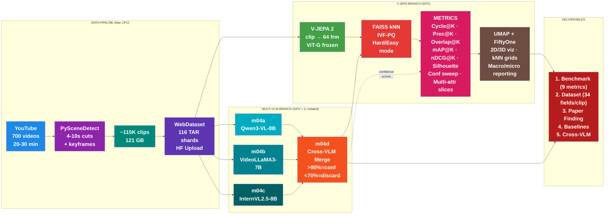

# WalkIndia-200K

> **A Large-Scale Benchmark for Evaluating Video Foundation Models on Non-Western Urban Scenes**

---

## The Big Question

```
┌─────────────────────────────────────────────────────────────────────────────────┐
│   "Can an AI model trained on WESTERN videos understand INDIAN streets?"        │
├─────────────────────────────────────────────────────────────────────────────────┤
│                                                                                 │
│   V-JEPA was trained on YouTube videos (mostly Western content).                │
│   We test if it can recognize that:                                             │
│                                                                                 │
│   • Two Indian market scenes are SIMILAR                                        │
│   • A market scene is DIFFERENT from a temple scene                             │
│   • Night traffic looks DIFFERENT from morning traffic                          │
│                                                                                 │
│   WITHOUT teaching it anything about India!                                     │
│                                                                                 │
└─────────────────────────────────────────────────────────────────────────────────┘
```

---

## Research Novelty

| Rank | Novelty | Strength | Why Novel |
|------|---------|----------|-----------|
| 1 | **Geographic transfer evaluation** | STRONG | No one has tested if V-JEPA's "world model" transfers to Indian streets |
| 2 | **Label-free video evaluation metrics** | STRONG | Self-consistency & stability metrics are new for video (only done for images) |
| 3 | **Indian urban video dataset** | MEDIUM | New dataset contribution (~200K clips from 700 videos) |
| 4 | **Qwen3-VL pseudo-labeling pipeline** | MEDIUM | Practical contribution for structured video tagging |

### Research Gap (Validated via Web Search)

- NO evaluation of V-JEPA on Indian/non-Western street videos
- NO large-scale Indian urban walking video dataset
- NO "self-consistency + stability" metrics applied to VIDEO embeddings
- NO study on cultural/geographical transfer of video world models

### Honest Limitations

| Limitation | Mitigation |
|------------|------------|
| VLM tags are pseudo-labels, not ground truth | Cross-VLM validation (3 VLMs must agree) + per-field confidence scores |
| Circular bias: Western models validating Western models | Include DINOv2/random baselines + 3 architecturally diverse VLMs |
| Video artifacts (blur, shake) may confound clustering | Quality filtering + stratified analysis |

---

## Pipeline Summary



### Why VLM Branch connects to V-JEPA BRANCH (J → F, J -.-> G)

```
DATA PIPELINE        V-JEPA BRANCH              MULTI-VLM BRANCH (isolated)
─────────────        ─────────────              ────────────────────────────
WebDataset    ──→    V-JEPA 2 → FAISS  ←──     m04a Qwen3-VL ──┐
(116 TARs)           embeddings   ↑              m04b VideoLLaMA3 ├→ m04d Merge → tags.json
                                  │              m04c InternVL2.5 ─┘
                                  │
                     Prec@K uses BOTH:
                     • embeddings (V-JEPA) for kNN neighbors
                     • scene_type (cross-VLM validated) as ground-truth labels

                     Confidence sweep uses:
                     • confidence scores from VLMs → filter → recompute metrics

                     Question m06 answers:
                     "Do clips with same cross-VLM scene_type
                      land near each other in V-JEPA space?"
```

How tags flow into evaluation:

```
m04a tags_qwen.json  ──┐
m04b tags_videollama ───┤──→ m04d merge ──→ tags.json (34 fields/clip)
m04c tags_internvl   ──┘

tags.json                            m06 evaluates V-JEPA quality (9 metrics):
┌──────────────────────┐            ┌──────────────────────────────────┐
│ [                    │            │ Prec@K:                          │
│   {                  │            │   For each clip i:               │
│     "scene_type":    │──────────→ │     my_type = tags[i]["scene_type"]
│       "market",      │            │     neighbors = kNN(embeddings[i])│
│     "confidence_     │            │     % neighbors with same type?  │
│       scene_type":   │            ├──────────────────────────────────┤
│       0.92,          │            │ + Cycle@K, Overlap@K, mAP@K,    │
│     "_vlm_agreement":│            │   nDCG@K, Silhouette            │
│       0.95,          │            │ + Conf sweep, Multi-attr slices  │
│     ...              │            │ + Hard/Easy mode (±30s window)   │
│   },                 │            └──────────────────────────────────┘
│   ...                │
│ ]                    │            m07 visualizes:
└──────────────────────┘            ┌──────────────────────────────────┐
                       ──────────→  │ UMAP scatter colored by scene_type│
                                    │ Confusion matrix + kNN grids     │
                                    │ Macro/micro reporting            │
                                    └──────────────────────────────────┘
```

<details>
<summary>Original ASCII art (cross-reference)</summary>

```
╔═══════════════════════════════════════════════════════════════════════════════════════════════════════════════════════════════════════════╗
║                                                       WalkIndia-200K Benchmark                                                            ║
╚═══════════════════════════════════════════════════════════════════════════════════════════════════════════════════════════════════════════╝

┌──────────────┐       ┌──────────────────┐       ┌──────────────┐
│   YouTube    │       │  PySceneDetect   │       │  ~115K clips │
│  700 videos  │ ════► │  4-10s cuts      │ ════► │   121 GB     │ ════╗
│  20-30 min   │       │  + keyframes     │       │              │     ║
└──────────────┘       └──────────────────┘       └──────────────┘     ║
                                                                       ▼
╔══════════════════════════════════════════════════════════════════════▼════════════════════════════════════════════════════════════════════╗
║                                          PARALLEL PROCESSING                                                                              ║
╠═══════════════════════════════════════════════════════════════════════════════════════════════════════════════════════════════════════════╣
║                                                                                                                                           ║
║  V-JEPA BRANCH:                                                                                                                           ║
║  ┌──────────────────┐       ┌──────────────────┐       ┌──────────────────────────────────┐       ┌───────────────────────────────┐       ║
║  │    V-JEPA 2      │       │    FAISS kNN     │       │           METRICS (9)            │       │     UMAP + FiftyOne           │       ║
║  │  clip ➔ 64 frm   │ ════► │     IVF-PQ       │ ════► │  Cycle@K · Prec@K · Overlap@K   │ ════► │   2D/3D viz · kNN grids       ═║═══╗   ║
║  │  ➔ ViT-G (frozen)│       │  Hard/Easy mode  │       │  mAP@K · nDCG@K · Silhouette   │       │   Macro/micro reporting        │   ║   ║
║  └──────────────────┘       └──────────────────┘       │  Conf sweep · Multi-attr slices │       └───────────────────────────────┘   ║   ║
║                                     ▲                  └──────────────────────────────────┘                                           ║   ║
║                                     ║                              ▲                                                                  ║   ║
║                                     ║ tags + confidence ───────────┘ (confidence feeds threshold sweep)                               ║   ║
║                                     ║                                                                                                 ║   ║
║  MULTI-VLM BRANCH (isolated, parallel):                                                                                               ║   ║
║  ┌──────────────────────────────┐                                                                                                     ║   ║
║  │  m04a Qwen3-VL-8B           │──┐                                                                                                  ║   ║
║  │  + confidence + provenance  │  │     ┌─────────────────────────────────────┐                                                       ║   ║
║  ├──────────────────────────────┤  ├───► │  m04d  Cross-VLM Merge (CPU)        │                                                       ║   ║
║  │  m04b VideoLLaMA3-7B        │──┤     │  Qwen3 ∩ VideoLLaMA3 ∩ InternVL2.5  │ ════════════════════════════════════════════════════════╣   ║
║  │  + confidence + provenance  │  │     │  >90% = high conf | <70% = discard  │                                                       ║   ║
║  ├──────────────────────────────┤  │     └─────────────────────────────────────┘                                                       ║   ║
║  │  m04c InternVL2.5-8B        │──┘                                                                                                   ║   ║
║  │  + confidence + provenance  │                                                                                                      ║   ║
║  └──────────────────────────────┘                                                                                                     ║   ║
║                                                                                                                                       ║   ║
╚═══════════════════════════════════════════════════════════════════════════════════════════════════════════════════════════════════════╩═══╩═╝
                                                                                                                                        ║
                                                                                                                                        ▼
╔═══════════════════════════════════════════════════════════════════════════════════════════════════════════════════════════════════════════╗
║                                                           DELIVERABLES                                                                    ║
╠═════════════════════╦═════════════════════════════════════════════════════════════════════════════════════════════════════════════════════╣
║ 1. Benchmark        ║ 9 metrics: Cycle@K, Prec@K, Overlap@K, mAP@K, nDCG@K, Silhouette, Conf sweep, Slices, Hard/Easy                    ║
║ 2. Dataset          ║ WalkIndia-200K (115K clips · 34 fields/clip: tags + confidence + provenance + agreement)                                        ║
║ 3. Paper Finding    ║ Does V-JEPA transfer to Indian streets? (Yes/No + evidence across 9 metrics)                                       ║
║ 4. Baselines        ║ Random embeddings, DINOv2, shuffled V-JEPA, CLIP                                                                   ║
║ 5. Cross-VLM        ║ % clips where Qwen3, VideoLLaMA3, InternVL2.5 agree (replaces human audit)                                         ║
╚═════════════════════╩═════════════════════════════════════════════════════════════════════════════════════════════════════════════════════╝
```

</details>

### Clarification: "Label-Free" Claim

| Metric | Truly Label-Free? | Explanation |
|--------|-------------------|-------------|
| **Cycle@K** | YES | If A's nearest neighbor is B, does B point back to A? No labels needed. |
| **Overlap@K** | YES | Same clip with different crops → similar neighbors? No labels needed. |
| **Silhouette** | **NO** | Uses scene_type labels for cluster assignment. |
| **Prec@K / mAP@K / nDCG@K** | **NO** | Uses cross-VLM validated pseudo-labels. Honest about this. |

### Addressing Circular Bias

| Concern | Mitigation |
|---------|------------|
| V-JEPA + single VLM both Western-trained | Cross-VLM agreement: Qwen3 ∩ VideoLLaMA3 ∩ InternVL2.5 |
| Single VLM bias | Use 3 different VLMs, only trust labels where all 3 agree |
| Video artifacts vs semantics | Filter by quality score, stratify analysis by blur/shake |
| Models may share training data biases | Report agreement % as confidence metric |

---

## Step 1: Data Collection

| Source | @walkinginindia YouTube |
|--------|-------------------------|
| Videos | ~700 videos × 20-30 min |
| Total  | 14,000-21,000 minutes   |
| Content| Markets, Junctions, Temples, Beach roads, Lanes |
| Tool   | `yt-dlp` / `youtube-dl` |
| Output | Raw `.mp4` files        |

---

## Step 2: Scene Detection

**Library**: `PySceneDetect` ([scenedetect.com](https://scenedetect.com))

```
30-min video ──→ Content Detection ──→ [clip1][clip2][clip3]...
                                        4-10s  4-10s  4-10s
                                      + 1 keyframe (.jpg) per clip
```

| Input  | 700 videos              |
|--------|-------------------------|
| Output | ~115K short clips (4-10s) + keyframes |
| Method | Greedy scene-aware splitting (PySceneDetect ContentDetector) |

---

## Step 3: V-JEPA 2 Embedding

**Model**: `facebook/vjepa2-vitg-fpc64-384` (1B params, frozen)

```
4-10s clip ──→ Sample 64 frames ──→ ViT-G Encoder ──→ Embedding Vector
                                    (NO TRAINING)     [dim: 1408]
```

| Property | Value |
|----------|-------|
| Frames   | 64 per clip |
| Params   | 1B (ViT-G, frozen) |
| Embedding dim | 1408 |
| Training | None required |

---

## Step 4: Auto-Tagging (3 Isolated VLMs + Merge)

**Architecture**: Option 2 — each VLM runs in isolation, then merge

```
m04a_qwen_tag.py       → tags_qwen.json       (Qwen3-VL-8B, vLLM)
m04b_videollama_tag.py → tags_videollama.json  (VideoLLaMA3-7B)
m04c_internvl_tag.py   → tags_internvl.json    (InternVL2.5-8B)
                              ↓
m04d_vlm_merge.py      → tags.json (unified, cross-VLM validated)
```

Why isolated: different dependencies, different GPU memory profiles, can run on different machines.

| VLM | Size | Strength | Script |
|-----|------|----------|--------|
| **Qwen3-VL-8B** | 8B | Hindi text/signage, MLVU 75.3 | m04a (existing) |
| **VideoLLaMA3-7B** | 7B | Motion understanding, #1 VideoMME | m04b (NEW) |
| **InternVL2.5-8B** | 8B | Architectural diversity | m04c (NEW) |

Structured tags per clip — 11 fields (NOT free-form captions):

```json
{
  "scene_type":             "market|junction|lane|promenade|transit|temple|highway|alley|commercial|construction",
  "time_of_day":            "morning|afternoon|evening|night",
  "weather":                "clear|rain|fog|overcast",
  "crowd_density":          "low|med|high",
  "traffic_density":        "low|med|high",
  "road_surface":           "asphalt|concrete|dirt|cobblestone|mixed",
  "infrastructure_quality": "good|moderate|poor",
  "vegetation":             "none|sparse|moderate|dense",
  "lighting":               "natural|artificial|mixed",
  "notable_objects":        ["bus","rickshaw","bike","vendor","police","signage","animals"],
  "road_layout":            "intersection|narrow_lane|wide_road|sidewalk|median",

  "confidence_scene_type":  0.92,
  "confidence_time_of_day": 0.85,
  "...":                    "... (11 confidence fields, each in [0,1])",

  "_model":                 "Qwen/Qwen3-VL-8B-Instruct",
  "_prompt_version":        "v1.0",
  "_tagged_at":             "2026-02-22T14:30:00Z",
  "_vlm_agreement":         0.95
}
```

After m04d merge: 8 metadata + 11 tags + 11 confidence + 3 provenance + 1 agreement = **34 fields per clip**

---

## Step 5: FAISS Indexing

**Library**: `FAISS` (Facebook AI Similarity Search)

**Why FAISS instead of naive kNN:**
| Metric | Naive kNN | FAISS (IVF-PQ) |
|--------|-----------|----------------|
| Time complexity | O(n²) | O(n log n) |
| 200K clips search | ~hours | ~seconds |
| Memory | All in RAM | Compressed (PQ) |
| GPU support | No | Yes (5-10x faster) |

```
115K embeddings ──→ FAISS Index (IVF-PQ) ──→ Fast Approximate kNN
                                              ├── Easy mode (all neighbors)
                                              └── Hard mode (exclude ±30s same video)
```

**Hard/Easy Mode** (proposal alignment):
- Easy: default kNN, no exclusion
- Hard: mask out neighbors within ±30s of same video_id before computing metrics
- Reports both modes side-by-side — handles temporal leakage without train/val/test splits

**Recommended Index:**
```python
import faiss

d = 1408  # V-JEPA ViT-G embedding dimension
nlist = 1000  # clusters for IVF

# IVF + PQ: fast, memory-efficient
quantizer = faiss.IndexFlatL2(d)
index = faiss.IndexIVFPQ(quantizer, d, nlist, 16, 8)
index.train(embeddings)
index.add(embeddings)

# Search k nearest neighbors
distances, indices = index.search(query, k=10)
```

---

## Step 6: UMAP Visualization

**Library**: `UMAP` (Uniform Manifold Approximation and Projection)

**Why UMAP:**
| Feature | UMAP | t-SNE |
|---------|------|-------|
| Speed | Fast | Slow |
| Global structure | Preserved | Lost |
| Scalability | 200K+ points | ~10K points |
| Clustering-friendly | Yes (works with HDBSCAN) | Limited |

```
1408-dim embeddings ──→ UMAP ──→ 2D/3D scatter plot + kNN neighbor grids
```

**Use cases:**
- Paper figures showing cluster separation
- Debug embedding quality
- Validate if scene types actually cluster

```python
import umap

reducer = umap.UMAP(n_components=2, n_neighbors=15, min_dist=0.1)
embedding_2d = reducer.fit_transform(embeddings)

# Plot with scene_type colors from Qwen3-VL tags
plt.scatter(embedding_2d[:, 0], embedding_2d[:, 1], c=scene_type_colors)
```

---

## Step 7: FiftyOne Exploration

**Library**: `FiftyOne` (Voxel51) - Open-source dataset curation tool

**Why FiftyOne:**
| Feature | Custom Scripts | FiftyOne |
|---------|----------------|----------|
| Interactive UI | No | Yes (web-based) |
| UMAP built-in | Manual | One-click |
| Filter by tags | Code | Visual |
| Find outliers | Hard | Easy |
| Share with team | Difficult | URL link |

```
clips + embeddings + tags ──→ FiftyOne Dataset ──→ Interactive Web UI
```

**Use cases:**
- Browse 200K clips visually
- Click on UMAP points to view clips
- Filter by scene_type, crowd_density, etc.
- Find mislabeled samples

```python
import fiftyone as fo

dataset = fo.Dataset("walkindia-200k")
for clip_path, embedding, tags in zip(clips, embeddings, all_tags):
    sample = fo.Sample(filepath=clip_path)
    sample["embedding"] = embedding.tolist()
    sample["scene_type"] = tags["scene_type"]
    sample["crowd_density"] = tags["crowd_density"]
    dataset.add_sample(sample)

# Launch interactive UI
session = fo.launch_app(dataset)
```

---

## Step 8: Evaluation - Quantitative Metrics (9 metrics)

All metrics reported in **Easy** (all neighbors) and **Hard** (±30s exclusion window) modes.

### 8.1 Label-Free Metrics (Core Contribution)

| Metric | Proposal Name | Formula | What It Measures |
|--------|---------------|---------|------------------|
| **Cycle@K** | Cycle@k (Step 6) | % of clips where kNN(A)=B implies kNN(B)=A | Embedding neighborhood stability |
| **Overlap@K** | Overlap@K (Step 7) | IoU of kNN(crop1) vs kNN(crop2) for same clip | Robustness to view changes |
| **Silhouette** | Silhouette (Step 8) | sklearn silhouette_score on embeddings + scene_type | Cluster separation quality |

### 8.2 Pseudo-Label Metrics (uses Cross-VLM validated tags)

| Metric | Proposal Name | Formula | What It Measures |
|--------|---------------|---------|------------------|
| **Prec@K** | Prec@K (Step 9) | % of kNN neighbors with same scene_type | Semantic coherence |
| **mAP@K** | mAP@K (Step 10) | Mean Average Precision: ranked retrieval with tag-based relevance | Retrieval ranking quality |
| **nDCG@K** | nDCG@K (Step 10) | Normalized DCG: graded relevance from multi-field tag overlap | Graded retrieval quality |

### 8.3 Analysis Metrics

| Metric | Proposal Step | What It Measures |
|--------|---------------|------------------|
| **Multi-attribute slices** | Step 11 | Prec@K grouped by time_of_day, weather, crowd_density, etc |
| **Confidence sweep** | Step 14 | Vary confidence cutoff → plot Prec@K vs coverage |
| **Macro/micro averaging** | Step 13 | Per-class avg (macro) and global avg (micro) for all metrics |

### 8.4 Baselines (Required for Fair Comparison)

| Baseline | Purpose |
|----------|---------|
| **Random embeddings** | Lower bound - should have ~0% consistency |
| **Shuffled V-JEPA** | Tests if temporal order matters |
| **DINOv2 (image-only)** | Tests if video understanding adds value |
| **CLIP** | Tests text-vision alignment baseline |

### 8.5 Cross-VLM Agreement (Reduces Single-Model Bias)

3 VLMs run in isolation (m04a, m04b, m04c), merged by m04d:

| VLM | Size | Why Selected | Strength |
|-----|------|--------------|----------|
| **Qwen3-VL-8B** | 8B | Best on MLVU (75.3), LVBench (56.2) | Long video, Hindi text/signage |
| **VideoLLaMA3-7B** | 7B | #1 on VideoMME (7B class), 128 frames | Motion understanding |
| **InternVL2.5-8B** | 8B | Different architecture, Chinese training | Architectural diversity |

**Agreement Metric:**
```
Cross-VLM Agreement % = |clips where Qwen3 ∩ VideoLLaMA3 ∩ InternVL agree| / total clips
```

| Agreement Level | Interpretation | Action |
|-----------------|----------------|--------|
| > 90% | High confidence | Use as ground truth |
| 70-90% | Moderate confidence | Review edge cases |
| < 70% | Low confidence | Discard |

Cross-VLM agreement replaces both dual-prompt self-consistency and human audit from the proposal — 3 architecturally different VLMs is a stronger QC signal.

### 8.6 Confounder Analysis

| Confounder | Mitigation |
|------------|------------|
| Motion blur | Filter clips by blur score > threshold |
| Camera shake | Filter clips by optical flow variance |
| Lighting changes | Stratify analysis: day vs night |
| Video quality | Report metrics separately for high/low quality |

### Success Criteria

> V-JEPA transfers well if: (1) Cycle@K > 70%, (2) Cross-VLM agreement > 80%, (3) Outperforms DINOv2 baseline on Indian data, (4) Hard-mode Prec@K significantly above random baseline.

---

## Key Libraries

| Step | Library | Purpose |
|------|---------|---------|
| 2 | PySceneDetect | Split videos into clips + keyframe export |
| 3 | V-JEPA 2 (ViT-G) | Frozen video embeddings (1408-dim) |
| 4a | Qwen3-VL-8B | Structured auto-tagging (isolated VLM) |
| 4b | VideoLLaMA3-7B | Structured auto-tagging (isolated VLM) |
| 4c | InternVL2.5-8B | Structured auto-tagging (isolated VLM) |
| 4d | — | Cross-VLM agreement merge (CPU) |
| 5 | FAISS | Fast similarity search (GPU) + Hard/Easy mode |
| 6 | UMAP | Dimensionality reduction & visualization + kNN grids |
| 7 | FiftyOne | Interactive dataset exploration |

---

## Proposal Alignment (FactorJEPA Ch 8-9)

Cross-reference: FactorJEPA proposal chapters 8 (Automatic Annotations) and 9 (Evaluating V-JEPA)
were compared against this plan. 12 discrepancies were found and resolved:

| # | Discrepancy | Decision | Rationale |
|---|-------------|----------|-----------|
| 1 | 11 tag fields vs proposal's 7 | **KEEP 11** | Extra 4 (road_surface, infrastructure_quality, vegetation, lighting) capture India-specific attributes |
| 2 | Variable 4-10s clips vs proposal's fixed 10s | **KEEP 4-10s** | Scene-aware splitting produces better clips |
| 3 | QC: dual-prompt + human audit | **SKIP** | Cross-VLM agreement (#11) across 3 architecturally different VLMs is stronger |
| 4 | Per-field confidence scores | **ADD** | Each VLM outputs confidence_* per field. Enables confidence sweep in m06 |
| 5 | Provenance tracking | **ADD** | _model, _prompt_version, _tagged_at per clip |
| 6 | Keyframe export | **ADD** | --keyframes flag in m02, 1 keyframe per clip via ffmpeg |
| 7 | Metric naming mismatch | **RENAME** | Use proposal names: Cycle@K, Prec@K, Overlap@K (old names as aliases) |
| 8 | 6+ missing metrics | **ADD** | mAP@K, nDCG@K, Silhouette, Overlap@K, multi-attr slices, conf sweep, macro/micro |
| 9 | No Hard/Easy mode | **ADD** | Exclusion window ±30s within same video_id. Report both modes |
| 10 | No train/val/test splits | **SKIP** | Pure evaluation project — no training. Exclusion window (#9) handles leakage |
| 11 | Cross-VLM agreement (plan addition) | **KEEP** | 3 isolated VLMs (m04a/b/c) + merge (m04d) — stronger than proposal's single VLM |
| 12 | Baselines (plan addition) | **KEEP** | Random, DINOv2, Shuffled V-JEPA, CLIP — needed for fair comparison |

Engineering details for each change → see `iter/iter6/plan.md` (Proposal Alignment section).

---

## Optional Improvements

The following tools are **not required** for the current pipeline but may be useful for future extensions.

---

### 1. SAM3 (Segment Anything Model 3)

**Purpose**: Pixel-level object segmentation masks

| Aspect | Details |
|--------|---------|
| **Pros** | Precise object boundaries, exact object counts, track objects across frames |
| **Cons** | High compute cost, slow inference, requires GPU |
| **Current Redundancy** | HIGH - Qwen3-VL already captures `notable_objects` list |
| **Future Use Case** | Object-level features for fine-grained retrieval, counting pedestrians/vehicles |

```
[OPTIONAL] clip frames ──→ SAM3 ──→ pixel masks per object
```

---

### 2. DINOv2 (Multi-Encoder Ensemble)

**Purpose**: Add image-based embeddings alongside V-JEPA video embeddings

| Aspect | Details |
|--------|---------|
| **Pros** | Strong static appearance features, well-established baseline, can ensemble with V-JEPA |
| **Cons** | 2x compute cost, requires embedding fusion strategy |
| **Current Redundancy** | HIGH - V-JEPA 2 already trained on images+videos, covers both motion & appearance |
| **Future Use Case** | Ablation study comparing V-JEPA vs DINOv2 vs ensemble on Indian data |

```
[OPTIONAL] clip ──→ DINOv2 ──→ image embedding ──┐
                └──→ V-JEPA ──→ video embedding ──┴──→ concat/fuse
```

---

### 3. TransNetV2 (Neural Scene Detection)

**Purpose**: Neural network-based scene boundary detection (replace PySceneDetect)

| Aspect | Details |
|--------|---------|
| **Pros** | Higher accuracy on hard cuts, better on gradual transitions, trained on real boundaries |
| **Cons** | Requires GPU, slower than PySceneDetect, marginal improvement |
| **Current Redundancy** | MEDIUM - PySceneDetect's `detect-adaptive` already good enough |
| **Future Use Case** | If scene splits are poor quality, switch to TransNetV2 |

```
[OPTIONAL] video ──→ TransNetV2 ──→ more accurate scene boundaries
```

---

### 4. Autodistill (Zero-Annotation Object Detection)

**Purpose**: Auto-label objects using foundation models (GroundingDINO + SAM)

| Aspect | Details |
|--------|---------|
| **Pros** | Precise bounding boxes, object counts, no manual labeling needed |
| **Cons** | Pipeline complexity, requires multiple models, slow inference |
| **Current Redundancy** | HIGH - Qwen3-VL sufficient for scene-level tagging, we don't need boxes |
| **Future Use Case** | If you need object-level ground truth for training downstream models |

```
[OPTIONAL] clip ──→ GroundingDINO ──→ bounding boxes ──→ object counts
```

---

### 5. Weak Supervision / LLM Validator

**Purpose**: Use LLM (GPT-4) to auto-correct/validate Qwen3-VL tags

| Aspect | Details |
|--------|---------|
| **Pros** | Catches tagging errors, improves ground truth quality, industry standard |
| **Cons** | API costs (GPT-4), adds latency, premature optimization |
| **Current Redundancy** | HIGH - Only needed if Qwen3-VL tags have many errors (test first) |
| **Future Use Case** | Production-grade dataset curation, if Qwen3-VL accuracy drops below 90% |

```
[OPTIONAL] clip ──→ Qwen3-VL ──→ tags ──→ GPT-4 validator ──→ cleaned tags
```

---

## Optional Summary Table

| Tool | Redundancy | Add When? |
|------|------------|-----------|
| SAM3 | HIGH | Need object-level features |
| DINOv2 | HIGH | Ablation study / ensemble experiments |
| TransNetV2 | MEDIUM | Scene splits are poor quality |
| Autodistill | HIGH | Need bounding box annotations |
| Weak Supervision | HIGH | Qwen3-VL accuracy < 90% |
