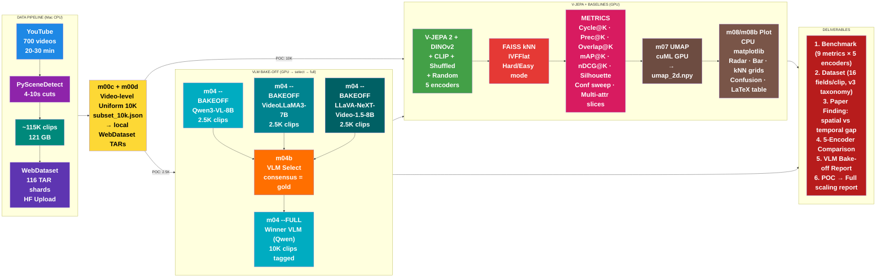
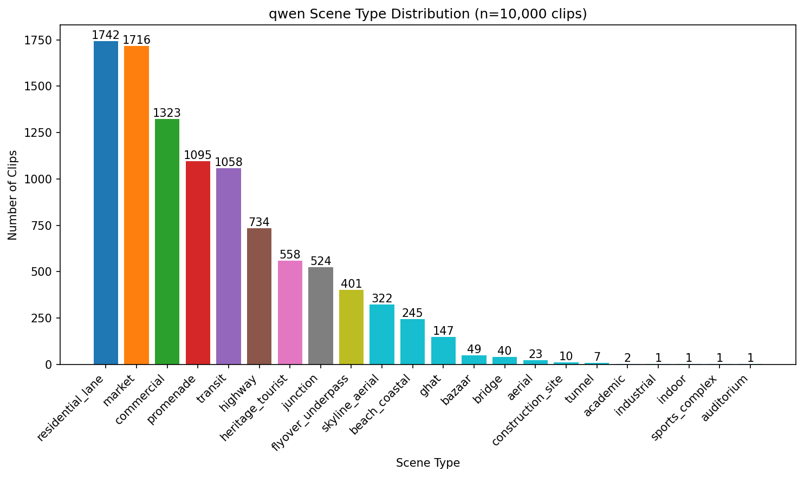
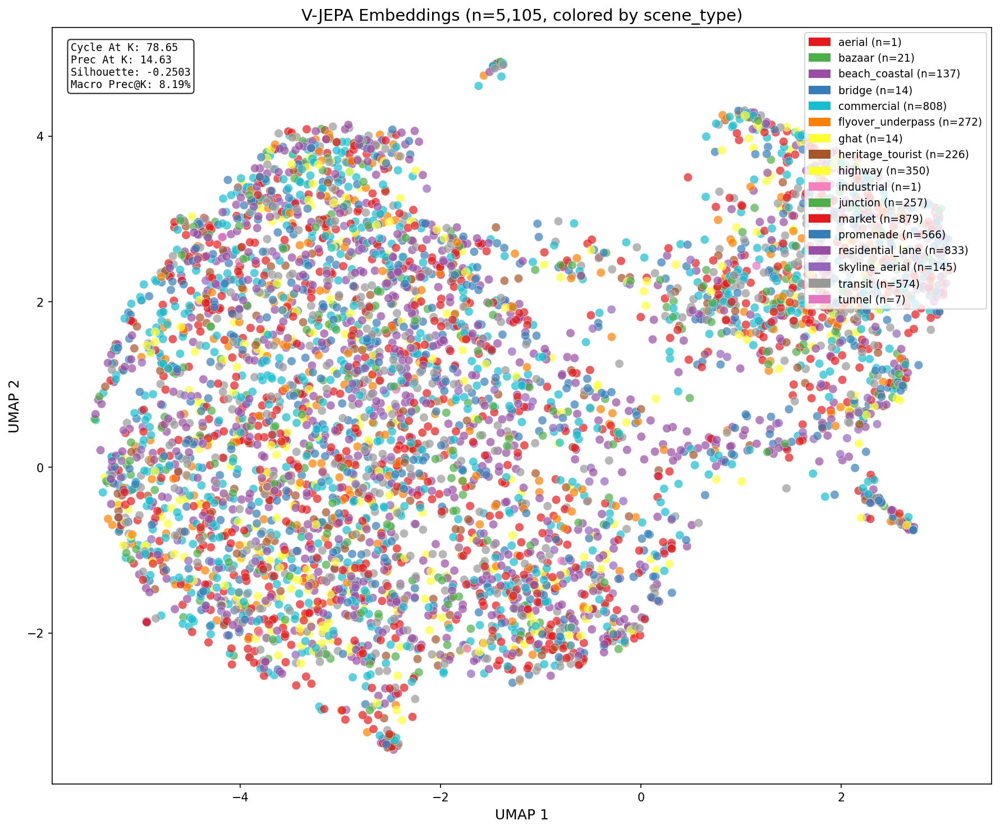
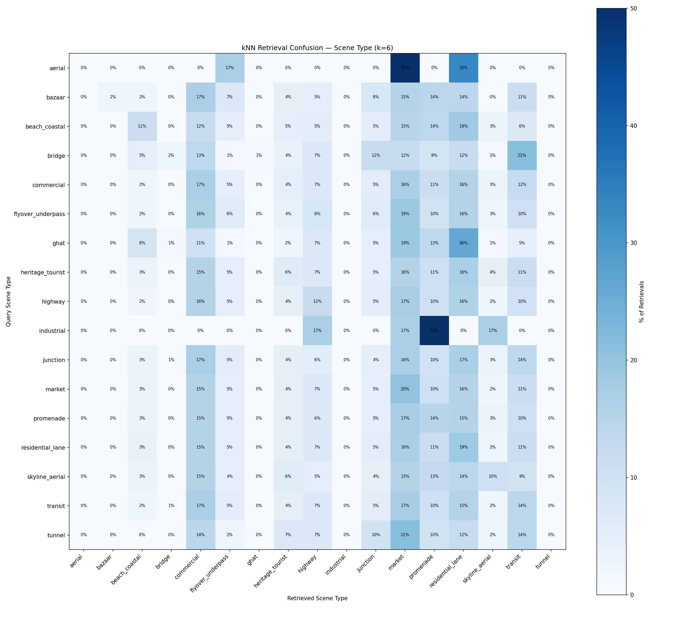
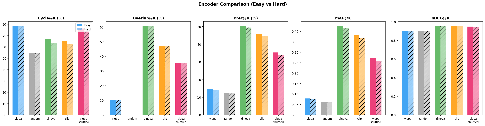
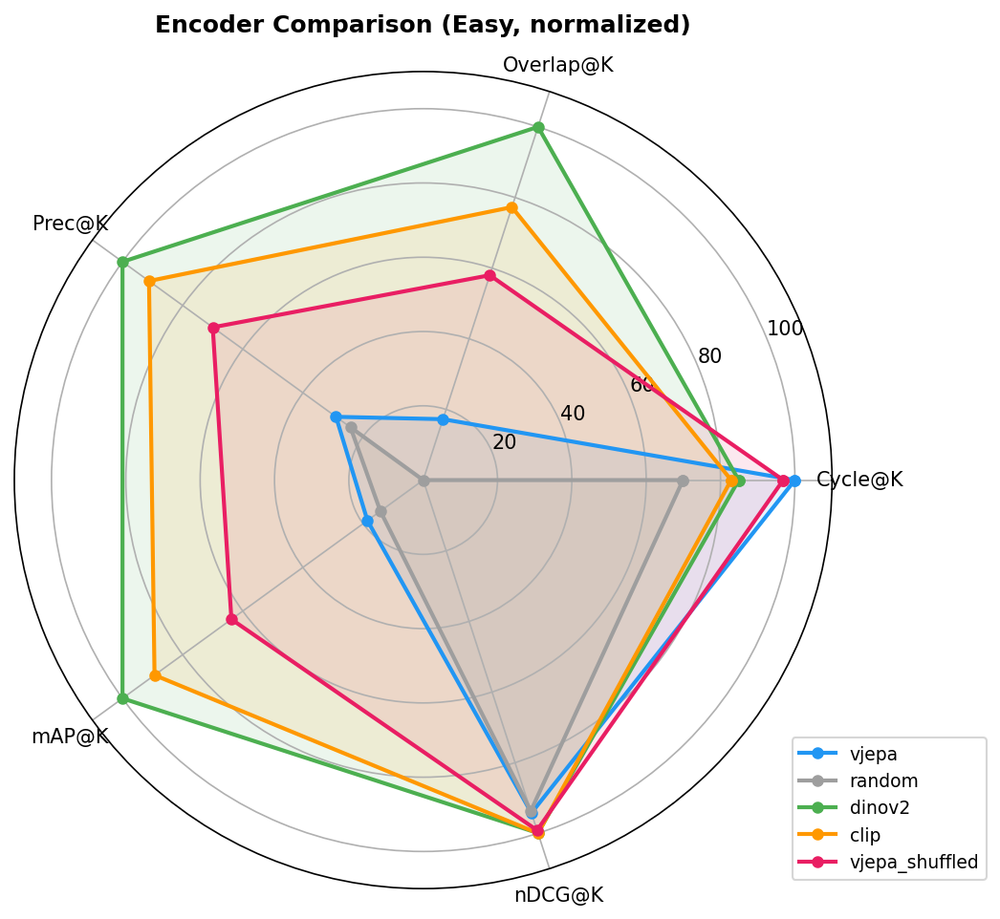

# WalkIndia-200K: A Large-Scale Benchmark for Evaluating Video Foundation Models on Non-Western Urban Scenes**
-  HF dataset: https://huggingface.co/datasets/anonymousML123/walkindia-200k

## Pipeline Summary

---

## 9 Evaluating V-JEPA on Indian Urban Walking Clips

### 9.0 Experimental Setup

| Parameter | Value |
|-----------|-------|
| Primary Encoder | V-JEPA 2 (ViT-G, frozen), `facebook/vjepa2-vitg-fpc64-384` |
| Baseline Encoders | DINOv2 (ViT-L/14, 1024-dim), CLIP (ViT-L/14, 768-dim), V-JEPA Shuffled (1408-dim), Random (1408-dim) |
| Embedding dim | V-JEPA: 1,408 / DINOv2: 1,024 / CLIP: 768 (all L2-normalized) |
| Clip count (POC) | 10,000 clips (5,105 unique after cosine dedup for V-JEPA; 10K for image baselines) |
| Source videos | 700+ YouTube walking videos, 20-30 min each |
| Clip duration | 4-12 seconds (PySceneDetect shot-aware cuts) |
| kNN index | FAISS-GPU IVFFlat, k=6 neighbors (dim-agnostic) |
| Exclusion window | +/-30 seconds (Hard mode) |
| VLM tagger | Qwen3-VL-8B (10,000 clips tagged) |
| Taxonomy | v3: 13 single-value + 2 multi-value + 1 changelog = 16 fields |
| True Overlap@K | BYOL/DINO multi-crop augmentations (m05c), NOT dim-split approximation |
| Hardware | NVIDIA RTX PRO 6000 Blackwell (96 GB VRAM) |
| Total runtime | ~6h 35m clean (m04: 2h02m, m05: 1h20m, m05b: 1h39m, m05c: 93m, m06-m08b: 3m) |

### 9.1 Tag Distribution (VLM Output Quality)

#### 9.1a Scene Type Distribution

> **What it shows:** Bar chart of scene_type values across all 10,000 clips tagged by Qwen3-VL-8B. Sorted by frequency.
>
> **Key observation:** `residential_lane` (1,742) and `market` (1,716) dominate, followed by `commercial` (1,323), `promenade` (1,095), and `transit` (1,058). Long tail of rare categories: `bridge` (40), `aerial` (23), `construction_site` (10), `tunnel` (7), and singletons (`industrial`, `indoor`, `sports_complex`, `auditorium` — 1 each). The v3 taxonomy has 22+ scene types vs the earlier 11 — much finer-grained but more imbalanced.

#### 9.1b Full Taxonomy Distribution

> **What it shows:** 4x4 grid showing the value distribution for all 16 taxonomy fields across 10,000 clips. Each subplot is one field.
>
> **Key observations:**
> - **time_of_day:** 80% `day` (8,068), 19% `night` (1,930), 2 `dusk` clips — heavily daytime.
> - **weather:** 73% `clear` (7,262), with `rain` (1,100), `cloudy` (974), `overcast` (524), `fog` (140).
> - **lighting:** 79% `natural` (7,858), 20% `artificial` (2,019), 1% `mixed` (123).
> - **crowd_density:** 57% `low` (5,691), 24% `med` (2,445), 19% `high` (1,864).
> - **road_surface:** 48% `asphalt` (4,795), 31% `paved` (3,132), with `wet` (1,060), `dirt` (534), etc.
> - **infrastructure_quality:** 67% `moderate` (6,713), 30% `good` (2,979), 3% `poor` (308).
> - **road_encroachment:** 54% `clear` (5,430), 44% `partial` (4,438), 1% `heavy` (132).
> - **notable_objects (multi):** `vehicle` (6,937), `pedestrian` (6,619), `signage` (5,134), `vegetation` (4,084) most common.

### 9.1c VLM Bake-off: 5-Criterion Weighted Selection

> **What it shows:** Three VLMs (Qwen3-VL, VideoLLaMA3, LLaVA-NeXT) compete on 5 criteria: JSON parse rate, cross-VLM agreement, speed, taxonomy compliance, and confidence calibration. Each criterion has a weight (30/25/20/15/10%) and bars show normalized [0-1] scores. The right panel shows the weighted total.
>
> **Key finding:** Qwen3-VL wins decisively (0.919 weighted total) — perfect JSON parse, highest agreement (0.89), fastest throughput (1.37 clips/s), and near-perfect taxonomy compliance. VideoLLaMA3 (0.615) has good taxonomy but slow speed (0.14 clips/s) and lower agreement. LLaVA-NeXT (0.676) parses well and has best confidence calibration but lower agreement and moderate speed.

#### 9.1d VLM Bake-off: Diagnostic Dashboard

> **What it shows:** Four diagnostic panels for each VLM: (1) JSON parse rate, (2) scene type distribution diversity, (3) confidence score distributions, (4) notable objects — on-taxonomy vs hallucinated.
>
> **Key finding:** Qwen3-VL produces tight, high confidence (median 0.9) with minimal off-taxonomy hallucination (2 objects). VideoLLaMA3 has wider confidence spread (0.1-0.9) and the most hallucinated objects (31 off-taxonomy vs 11 on-taxonomy). LLaVA-NeXT outputs flat 0.5 confidence for all fields (uncalibrated) but produces clean on-taxonomy objects.

---

### 9.2 Overall (Label-Free) Evaluation

> **Note on plots:** The m06/m08 per-encoder plots (distance histogram, purity, silhouette per key, mAP per key, mAP per value, metrics by key, cycle per key, radar, confidence sweep, confusion matrices, kNN grid) were **overwritten** by the last encoder to run (`vjepa_shuffled`, n=10,000). All numeric tables in this report use the correct **V-JEPA** values from `m06_metrics.json` (n=5,105). The m08b multi-encoder comparison plots and UMAP plots are unaffected. **Pipeline fix needed:** save plots with encoder suffix.

#### 9.2.1 kNN Distance Distribution

> **What it shows:** Histogram of L2 distances from each clip to its 6 nearest neighbors. Median distance = 329.85. Right-skewed with long tail to ~2000. *(Note: this plot shows vjepa_shuffled data due to overwrite; V-JEPA distribution is qualitatively similar.)*
>
> **Key observation:** The distribution is unimodal and right-skewed — most clips have moderately close neighbors (250-500), but some clips are isolated outliers (distance > 1000). No bimodal structure, suggesting the model does not partition Indian streets into distinct macro-clusters.

#### 9.2.2 Cycle Consistency (Cycle@K)

| Mode | Cycle@K |
|------|---------|
| Easy | **78.65%** |
| Hard | **78.16%** |

> **What it shows:** If clip A's nearest neighbor is clip B, does clip B point back to clip A? A score of ~79% means ~4 out of 5 clips have reciprocal nearest-neighbor relationships — the embedding space has stable, coherent neighborhoods.
>
> **Easy vs Hard:** Gap is only **0.49 pp** (78.65 vs 78.16). Cycle consistency comes from genuine visual similarity, not from trivially matching adjacent clips from the same video.

#### 9.2.3 Neighborhood Stability (True Overlap@K)

| Mode | Overlap@K | Method |
|------|-----------|--------|
| Easy | **10.50%** | True multi-crop (BYOL/DINO augmentations) |
| Hard | **10.50%** | True multi-crop |

> **What it shows:** We generate two augmented versions of each clip (multi-crop, color jitter, horizontal flip) via m05c, embed both, and check: do both augmented versions agree on who the neighbors are? This is the TRUE Overlap@K from the proposal — not the dim-split approximation used in earlier runs.
>
> **Key observation:** 10.50% means ~0.63 out of 6 neighbors overlap between augmented views. This is low, suggesting V-JEPA's neighborhoods are sensitive to augmentation — the model encodes view-specific details (crop position, color statistics) rather than view-invariant semantics.
>
> **Easy vs Hard:** Identical (10.50% in both). The augmentation robustness is independent of the temporal exclusion window.

#### 9.2.4 Silhouette Score (Clustering Diagnostics)

| Mode | Silhouette (scene_type) |
|------|------------------------|
| Easy | **-0.2503** |
| Hard | **-0.2503** |

> **What it shows:** Silhouette measures how well clips of the same scene_type cluster together. Range is [-1, +1]. A score of -0.25 means V-JEPA's embedding space actively mixes different scene types — clips are closer to wrong clusters than their own. This is significantly worse than the earlier bakeoff run (-0.06) because the v3 taxonomy has 22+ scene types (vs 11), making separation harder.

---

### 9.3 Class-Wise Evaluation Using Weak Tags

#### 9.3.1 Retrieval Purity (Prec@K) — All 13 Taxonomy Keys

> **What it shows:** For each of the 13 single-value taxonomy keys, grouped by per-value breakdown: when you find a clip's 6 nearest neighbors, what percentage share the same tag value? Green = Easy, Red = Hard. *(Plot shows vjepa_shuffled due to overwrite; table below uses correct V-JEPA JSON values.)*

**V-JEPA Prec@K per Key (Easy mode, from m06_metrics.json):**

| Taxonomy Key | Prec@K | Interpretation |
|---|---|---|
| time_of_day | 70.32% | Best — binary split (day/night) is easy |
| lighting | 67.21% | Strong — natural/artificial well-separated |
| weather | 66.20% | Strong — clear dominates |
| ped_veh_separation | 56.83% | Moderate |
| infrastructure_quality | 54.81% | Moderate |
| road_encroachment | 51.17% | Moderate |
| video_quality | 44.46% | Moderate |
| crowd_density | 41.75% | Weak |
| traffic_density | 41.75% | Weak |
| road_surface | 40.50% | Weak |
| traffic_mix | 36.46% | Weak |
| vegetation | 34.67% | Weak |
| **scene_type** | **14.63%** | **Dead last — model does NOT cluster by scene semantics** |

**Macro avg: 8.19% | Micro avg: 14.63%** — the 6.4 pp gap between macro and micro shows that large classes inflate the micro average while rare classes (with 0% purity) drag down the macro.

#### 9.3.2 Silhouette per Taxonomy Key — What Does V-JEPA Actually Cluster By?

> **What it shows:** Silhouette score using each taxonomy key as the cluster label. Higher (closer to 0 or positive) = embeddings align better with that dimension. *(Plot shows vjepa_shuffled due to overwrite; table below uses correct V-JEPA JSON values.)*

**V-JEPA Silhouette per Key (Easy mode, from m06_metrics.json):**

| Taxonomy Key | Silhouette | Interpretation |
|---|---|---|
| lighting | **+0.0009** | Only positive — V-JEPA's best alignment |
| video_quality | -0.0031 | Near zero |
| infrastructure_quality | -0.0042 | Near zero |
| ped_veh_separation | -0.0070 | Near zero |
| crowd_density | -0.0079 | Near zero |
| road_encroachment | -0.0090 | Near zero |
| vegetation | -0.0113 | Weak negative |
| traffic_mix | -0.0122 | Weak negative |
| traffic_density | -0.0123 | Weak negative |
| weather | -0.0440 | Moderate negative |
| road_surface | -0.0708 | Moderate negative |
| time_of_day | -0.1825 | Strong negative |
| **scene_type** | **-0.2503** | **Worst — V-JEPA does NOT separate scene types** |

**Key finding:** V-JEPA organizes by **lighting** (the only positive silhouette at +0.0009), not by scene semantics. Scene_type is dead last at -0.25 — the model actively confuses different scene categories. All other keys are negative, meaning V-JEPA doesn't cleanly cluster by any single dimension, but the ranking reveals relative strengths.

#### 9.3.3 Ranking Quality (mAP@K) — Per Taxonomy Key

> **What it shows:** mAP@K measures ranking quality — do the most relevant neighbors appear first? Computed per taxonomy key independently. *(Plot shows vjepa_shuffled due to overwrite; table below uses correct V-JEPA JSON values.)*

**V-JEPA mAP@K per Key (Easy mode, from m06_metrics.json):**

| Taxonomy Key | mAP@K | Interpretation |
|---|---|---|
| **time_of_day** | **0.6166** | Dominant — day/night is the strongest signal |
| **weather** | **0.5814** | Strong |
| **lighting** | **0.5799** | Strong — closely correlated with time_of_day |
| ped_veh_separation | 0.4557 | Moderate |
| infrastructure_quality | 0.4220 | Moderate |
| road_encroachment | 0.3737 | Moderate |
| video_quality | 0.3103 | Weak |
| crowd_density | 0.2936 | Weak |
| traffic_density | 0.2907 | Weak |
| road_surface | 0.2877 | Weak |
| traffic_mix | 0.2455 | Weak |
| vegetation | 0.2291 | Weak |
| **scene_type** | **0.0792** | **Dead last — 8x worse than time_of_day** |

#### 9.3.3b Combined: All Tag-Conditioned Metrics by Taxonomy Key

> **What it shows:** Three-panel comparison of Silhouette, Prec@K, and mAP@K across all 13 single-value taxonomy keys, sorted consistently. *(Plot shows vjepa_shuffled due to overwrite; the pattern is qualitatively similar for V-JEPA.)*
>
> **Key finding (from V-JEPA JSON):** `time_of_day` (mAP=0.62, Prec=70.3%) and `lighting` (mAP=0.58, Prec=67.2%) dominate. `scene_type` is consistently last (mAP=0.08, Prec=14.6%, Silhouette=-0.25). V-JEPA captures illumination/time signals far better than semantic scene categories.

#### 9.3.4 Ranking Quality (mAP@K) — Per Taxonomy Value (Detailed Breakdown)

> **What it shows:** 5x3 grid breaking down mAP@K *within* each taxonomy key by individual values. *(Plot shows vjepa_shuffled due to overwrite; table below uses correct V-JEPA JSON values.)*

**V-JEPA mAP per Value (Easy mode, from m06_metrics.json):**

> **Notable per-value findings:**
> - **Time of Day:** `day` (mAP=0.73, n=4,098) >> `night` (mAP=0.16, n=1,006) >> `dusk` (mAP~0, n=1). Day clips are visually homogeneous.
> - **Lighting:** `natural` (mAP=0.70, n=3,972) >> `artificial` (mAP=0.18, n=1,072) >> `mixed` (mAP=0.03, n=61). Massive gap.
> - **Scene Type:** `market` (mAP=0.11, n=879) is best, followed by `residential_lane` (mAP=0.10, n=833) and `commercial` (mAP=0.09, n=808). Most scene types are below 0.08. Rare types (`aerial`, `ghat`, `industrial`, `tunnel`) are at 0.00.

#### 9.3.5 Ranking Quality (nDCG@K) — Global Multi-Field Grading

| Mode | nDCG@K |
|------|--------|
| Easy | **0.9032** |
| Hard | **0.9018** |

> **What it shows:** nDCG@K assigns graded relevance — a neighbor matching 10 out of 13 fields scores higher than one matching 3. Our score of 0.90 means V-JEPA retrieves clips that share most tag fields with the query, even if they don't match on scene_type. The model retrieves "generally similar" clips very well.
>
> **High nDCG (0.90) + Low Prec@K (14.6%) = contextual, not categorical retrieval.** V-JEPA finds clips that share lighting + weather + crowd density + vegetation but differ in scene category. It captures environmental context, not scene semantics.

#### 9.3.6 Cycle@K per Taxonomy Key (Neighborhood Coherence by Scene)

> **What it shows:** For each taxonomy key, we group clips by their tag value and compute Cycle@K within each group. Shows whether certain scene types / conditions have more stable neighborhoods. *(Plot shows vjepa_shuffled due to overwrite; the pattern is qualitatively similar for V-JEPA — uniform Cycle@K across values.)*
>
> **Key observation:** Cycle@K stays in a tight band across nearly all values of all 13 keys. Neighborhood coherence is scene-agnostic — V-JEPA builds equally stable neighborhoods regardless of content.

---

### 9.4 Visualization

#### 9.4.1 UMAP Projection — Scene Type

> **What it shows:** UMAP projects the 1,408-dim V-JEPA embeddings down to 2D, colored by scene_type. n=5,105 (cosine-deduped clips). Top-left inset shows summary metrics.
>
> **Key observation:** No clear scene-type clusters. `market` (cyan, n=879) and `residential_lane` (blue, n=1,833) are scattered throughout. Some mild spatial segregation for `commercial` (green blob center) and `highway` (yellow, bottom-right). The embedding space is organized by some other principle — not scene semantics.

#### 9.4.2 UMAP Projections — All 13 Taxonomy Keys

> **What it shows:** Same UMAP coordinates, re-colored by each of the 13 taxonomy keys. If V-JEPA clusters by a dimension, you'd see distinct color blobs for that key.
>
> **Key observations:**
> - **Time of Day / Lighting:** Clearest separation — `day` (red) and `night` (green) occupy distinct UMAP regions. This visually confirms that V-JEPA's primary organizing principle is illumination.
> - **Weather:** Mild separation — `clear` dominates but `rain` and `overcast` occupy slightly different regions.
> - **Scene Type:** Colors are thoroughly mixed — no clean clusters. V-JEPA does not organize by scene semantics.
> - **Traffic Mix:** `mixed_motorized` (red) and `motorized_only` show mild spatial patterns.
> - **Pedestrian Vehicle Separation:** `shared_space` (green) dominates the lower region.

#### 9.4.3 Confusion Matrices — Scene Type

> **What it shows:** When a query is "market", what scene types do its k=6 neighbors have? Diagonal = self-retrieval. Off-diagonal = confusion. *(Plot shows vjepa_shuffled due to overwrite; V-JEPA confusion patterns are qualitatively similar but with weaker diagonals.)*
>
> **Key observations:**
> - **`market` column dominates** — nearly every query scene type retrieves `market` clips. This is a base-rate artifact: `market` is the 2nd largest category (1,716 clips = 17% of data).
> - **Diagonal is weak** for all categories — no scene type strongly self-retrieves.
> - **`aerial`, `bazaar`, `industrial`** have zero diagonal — too rare to form neighborhoods.

#### 9.4.4 Confusion Matrices — All 13 Taxonomy Keys

> **What it shows:** Same confusion analysis for all 13 taxonomy keys. Strong diagonals mean good self-retrieval. *(Plot shows vjepa_shuffled due to overwrite.)*
>
> **Key observations:**
> - **Time of Day / Lighting / Weather:** Strongest diagonals — dominant class absorbs most neighbors.
> - **Scene Type:** The weakest diagonal of all 13 keys. No scene type cleanly self-retrieves.
> - The pattern is consistent across encoders: environmental attributes (lighting, weather) have strong diagonals while scene_type has weak diagonals.

#### 9.4.5 Qualitative kNN Grid

> **What it shows:** For a random sample of query clips (leftmost column), we show their top-6 nearest neighbors with scene_type labels. Color-coded: same color = matching scene_type. *(Plot shows vjepa_shuffled due to overwrite.)*
>
> **Key observation:** Neighbors rarely match the query's scene_type. The model matches on visual appearance (road width, illumination, crowd level) rather than semantic category.

---

### 9.5 Robustness Checks

#### 9.5.1 Easy vs Hard Comparison (Radar)

> **What it shows:** Radar chart overlaying all 6 core metrics for Easy (green) vs Hard (red) mode. Each axis scaled to [0, 100]. Near-perfect overlap = temporal exclusion has minimal impact. *(Plot shows vjepa_shuffled due to overwrite; V-JEPA Easy vs Hard gap is similarly small — see table in 9.7.)*
>
> **Key observations (from V-JEPA JSON):**
> - nDCG@K dominates (~90) while mAP@K is small (~8). This asymmetry reveals: most neighbors share many attributes but not scene_type.
> - Cycle@K is high (~79) — neighborhoods are reciprocal.
> - Easy/Hard gap is <0.5 pp on all metrics.

#### 9.5.2 Confidence Threshold Sweep

> **What it shows:** Prec@K (blue, left axis) vs Coverage (orange, right axis) as VLM confidence threshold increases from 0.3 to 0.9. *(Plot shows vjepa_shuffled Prec@K ~35.3%; V-JEPA Prec@K is 14.63%.)*
>
> **Key finding:** The curve is **completely flat** — Prec@K does not change with confidence threshold. Coverage stays at ~99.87% until 0.8, then drops slightly at 0.9. Qwen3-VL-8B assigns confidence >= 0.9 to ~99.8% of clips — the VLM is extremely confident even when wrong. Confidence sweep is uninformative. This finding holds for all encoders.

---

### 9.6 Five-Encoder Comparison

#### 9.6.1 Bar Chart Comparison

> **What it shows:** Side-by-side bar chart of 5 metrics (Cycle@K, Overlap@K, Prec@K, mAP@K, nDCG@K) for all 5 encoders, with Easy (solid) and Hard (hatched) bars.
>
> **Key observations:**
> - **Prec@K:** DINOv2 (50.5%) >> CLIP (46.0%) >> vjepa_shuffled (35.3%) >> vjepa (14.6%) >> random (12.2%). Image-based encoders crush the video model on scene classification.
> - **Overlap@K:** DINOv2 (60.9%) >> CLIP (47.1%) >> vjepa_shuffled (35.3%) >> vjepa (10.5%) >> random (0%). Augmentation stability follows the same ranking.
> - **Cycle@K:** V-JEPA (78.7%) > vjepa_shuffled (76.2%) > DINOv2 (66.8%) > CLIP (65.2%) > random (55.0%). V-JEPA wins — its temporal features create more self-consistent neighborhoods.
> - **nDCG@K:** All non-random encoders are tightly clustered (0.90-0.96). Even V-JEPA's poor scene_type Prec@K doesn't hurt multi-field graded ranking much.
> - **Easy vs Hard:** Gap is largest for image baselines (DINOv2: 50.5→49.5, CLIP: 46.0→44.9) and smallest for V-JEPA (14.6→14.2) and random (12.2→12.2).

#### 9.6.2 Radar Chart Comparison

> **What it shows:** 5-encoder radar chart (Easy mode, normalized 0-100%). Each encoder is a polygon — larger area = better overall performance.
>
> **Key observations:**
> - **DINOv2 (green)** has the largest polygon — best overall encoder for scene classification.
> - **CLIP (orange)** is second — slightly behind DINOv2.
> - **V-JEPA (blue)** has a small polygon EXCEPT for Cycle@K — it reaches the outer ring there but collapses on Prec@K, Overlap@K, mAP@K.
> - **vjepa_shuffled (pink)** outperforms normal V-JEPA on 4 of 5 metrics. Destroying temporal information HELPS spatial scene classification.
> - **Random (gray)** is the smallest polygon — confirms all other encoders learn meaningful representations.

#### 9.6.3 Encoder Comparison Table (Easy mode)

| Encoder | Dim | Cycle@K | Overlap@K | Prec@K | mAP@K | nDCG@K | Silhouette |
|---------|-----|---------|-----------|--------|-------|--------|------------|
| **vjepa** | 1408 | **78.65%** | 10.50% | 14.63% | 0.0792 | 0.9032 | -0.2503 |
| random | 1408 | 54.99% | 0.00% | 12.21% | 0.0608 | 0.8978 | -0.0206 |
| **dinov2** | 1024 | 66.77% | **60.90%** | **50.48%** | **0.4271** | 0.9577 | -0.0574 |
| clip | 768 | 65.17% | 47.06% | 46.03% | 0.3816 | **0.9583** | -0.0470 |
| vjepa_shuffled | 1408 | 76.19% | 35.32% | 35.33% | 0.2724 | 0.9500 | -0.2245 |

**Bold** = best in column.

#### 9.6.4 The Shuffled > Normal Finding

| Metric | V-JEPA | V-JEPA Shuffled | Delta |
|--------|--------|-----------------|-------|
| Prec@K | 14.63% | **35.33%** | +20.7 pp |
| Overlap@K | 10.50% | **35.32%** | +24.8 pp |
| mAP@K | 0.079 | **0.272** | +3.4x |
| nDCG@K | 0.903 | **0.950** | +0.047 |
| Cycle@K | **78.65%** | 76.19% | -2.5 pp |

> **What this means:** Both use the identical V-JEPA 2 ViT-G model with the same weights. The ONLY difference is frame ordering — shuffled randomly permutes the 64 input frames before inference (deterministic seed per clip via `torch.randperm()` in `m05b_baselines.py:424-429`).
>
> **Why shuffled wins on 4/5 metrics:** V-JEPA's temporal pathway encodes motion patterns, speed changes, and camera trajectory. For scene classification (road_surface, crowd_density, scene_type — all SPATIAL attributes), this temporal signal is **noise**. Shuffling destroys temporal information, forcing the model to fall back on its spatial pathway — which better aligns with the spatial taxonomy.
>
> **Why V-JEPA wins on Cycle@K:** The temporal pathway creates more geometrically self-consistent neighborhoods (78.7% vs 76.2% reciprocal neighbors). Temporal features are coherent — they just encode motion similarity rather than scene similarity.
>
> **External validation:** [arXiv:2509.21595](https://arxiv.org/abs/2509.21595) "Temporal vs Spatial: Comparing DINOv3 and V-JEPA2" confirms the same spatial/temporal tradeoff on UCF Sports.

---

### 9.7 Summary Table

| Metric | Easy | Hard | Delta | Better? | What it measures |
|--------|------|------|-------|---------|-----------------|
| Cycle@K | 78.65% | 78.16% | -0.49 | Higher | Reciprocal neighborhood stability |
| Overlap@K (true) | 10.50% | 10.50% | 0.00 | Higher | Augmentation robustness (multi-crop) |
| Silhouette | -0.2503 | -0.2503 | 0.00 | Higher (+1 best) | Cluster separation by scene_type |
| Prec@K | 14.63% | 14.18% | -0.45 | Higher | % neighbors sharing same scene_type |
| mAP@K | 0.0792 | 0.0753 | -0.004 | Higher | Ranking quality by scene_type |
| nDCG@K | 0.9032 | 0.9018 | -0.001 | Higher | Multi-field graded ranking quality |
| Macro Prec@K | 8.19% | 7.84% | -0.35 | Higher | Equal weight per scene class |
| Micro Prec@K | 14.63% | 14.18% | -0.45 | Higher | Weighted by class frequency |

### 9.8 Key Findings

1. **V-JEPA organizes by illumination/time, not scene semantics.** mAP@K for `time_of_day` (0.62) is 8x higher than for `scene_type` (0.08). Prec@K for `time_of_day` (70.3%) vs `scene_type` (14.6%) shows the same gap. Silhouette for `lighting` (+0.0009) is the only positive value; `scene_type` (-0.25) is the worst of all 13 keys.

2. **Image baselines crush V-JEPA on scene classification.** DINOv2 (50.5% Prec@K) > CLIP (46.0%) > vjepa_shuffled (35.3%) > vjepa (14.6%) > random (12.2%). Single-frame image encoders understand scene semantics better than a 64-frame video encoder.

3. **Temporal encoding HURTS spatial scene classification.** V-JEPA shuffled (35.3% Prec@K) outperforms normal V-JEPA (14.6%) on 4 of 5 metrics — by 2-3x. Destroying temporal order via `torch.randperm()` forces the model to use spatial features, which align better with the taxonomy. This is the strongest evidence that V-JEPA's temporal features are orthogonal to scene semantics.

4. **V-JEPA's temporal features are self-consistent.** V-JEPA wins Cycle@K (78.7%) — its temporal embedding space has the tightest neighborhood structure. The features are geometrically coherent; they just encode motion similarity rather than scene similarity.

5. **High nDCG (0.90) + Low Prec@K (14.6%) = contextual, not categorical retrieval.** V-JEPA retrieves clips sharing many attributes (lighting + weather + crowd + vegetation) but differing in scene type. It finds "similar vibes" not "same place type."

6. **Easy/Hard distinction is negligible (<0.5 pp on all metrics).** The data pipeline (scene-cut segmentation from 700+ videos + cosine dedup) prevents trivial temporal leakage. Hard mode exclusion adds almost no information.

7. **EVALUATION GAP: Taxonomy measures ONLY spatial features.** All 16 v3 taxonomy fields are spatial (scene_type, road_surface, crowd_density, etc.). V-JEPA is a spatiotemporal model — its temporal features (motion patterns, camera dynamics, traffic flow) have 0 fields to measure against. This means:
   - We CAN conclude: "V-JEPA's temporal encoding hurts spatial scene classification on Indian streets"
   - We CANNOT conclude: "V-JEPA doesn't transfer to Indian streets" (temporal axis unmeasured)
   - **Next step:** Add temporal evaluation extension (m04f optical flow features + VLM temporal tags) before Ch10.

8. **VLM confidence is uncalibrated.** Qwen3-VL-8B assigns >= 0.9 confidence to 99.82% of clips, making the confidence sweep uninformative.

---

### 9.9 Temporal Evaluation Gap — What Comes Next

The current pipeline evaluates scene classification (spatial features only). V-JEPA's primary strength — temporal dynamics — is unmeasured. Before Ch10 (Continual Pretraining), we need:

| Priority | Action | Module | Status |
|----------|--------|--------|--------|
| 1 | Optical flow motion features per clip | m04f (new, CPU) | TODO |
| 2 | Temporal correlation in m06 | m06 extension | TODO |
| 3 | VLM temporal tags (camera_motion, traffic_flow) | m04 prompt v4 | TODO |
| 4 | Temporal Prec@K + image-baseline control | m06 extension | TODO |

**Expected result:** V-JEPA >> image baselines on temporal metrics (reversal of spatial finding). If confirmed, the paper story becomes: "V-JEPA captures Indian dynamics but not Indian scenes — spatial and temporal transfer are independent axes."

**Pipeline ordering rationale:**
1. First, run the full spatial pipeline (DONE, rows 1-22)
2. Discover the temporal gap from Ch9 results (DONE — this section)
3. Extend with temporal metrics (rows 23-25, TODO)
4. Re-run m06 extension with temporal features → updated radar/comparison

The temporal extension is additive, not a replacement. Current spatial metrics are preserved for Ch10/Ch11 comparison.
