# WalkIndia-200K: A Large-Scale Benchmark for Evaluating Video Foundation Models on Non-Western Urban Scenes**
-  HF dataset: https://huggingface.co/datasets/anonymousML123/walkindia-200k

## Pipeline Summary

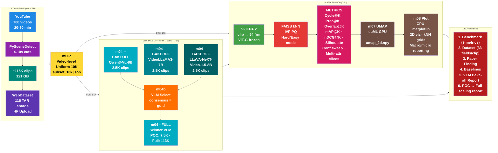

---

## 9 Evaluating V-JEPA on Indian Urban Walking Clips

### 9.0 Experimental Setup

| Parameter | Value |
|-----------|-------|
| Encoder | V-JEPA 2 (ViT-G, frozen), `facebook/vjepa2-vitg-fpc64-384` |
| Embedding dim | 1,408 (L2-normalized) |
| Clip count (POC) | 5,105 unique clips (cosine-deduped from 10K subset) |
| Source videos | 700+ YouTube walking videos, 20-30 min each |
| Clip duration | 4-12 seconds (PySceneDetect shot-aware cuts) |
| kNN index | FAISS-GPU IVF-Flat, k=6 neighbors |
| Exclusion window | +/-30 seconds (Hard mode) |
| VLM tagger | Qwen3-VL-8B (POC run on 5,105 clips) |
| Taxonomy | 9 single-value keys, 2 multi-value keys (11 total) |
| Hardware | NVIDIA RTX PRO 6000 Blackwell (96 GB VRAM) |

### 9.1 Tag Distribution (VLM Output Quality)

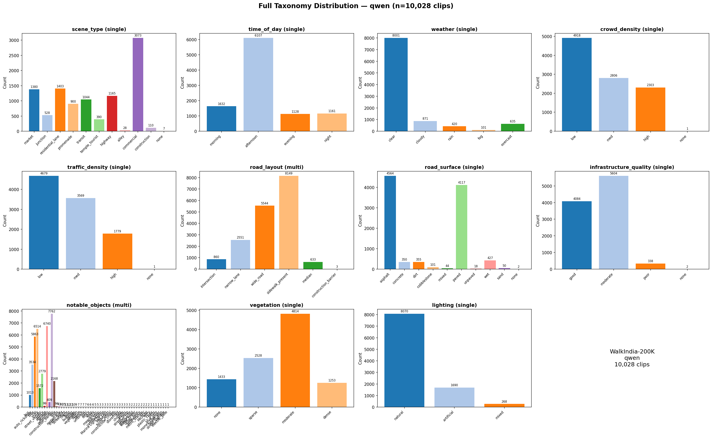

> **What it shows:** For each of the 11 taxonomy fields, this histogram shows how many clips were tagged with each value by Qwen3-VL-8B. It reveals whether the VLM-generated tags are balanced or heavily skewed toward dominant categories.
>
> **Key observation:** `scene_type` is dominated by `commercial` (1,511 clips, 30%) with `alley` (14) and `none` (5) nearly empty. `weather` is 78% `clear`. `lighting` is 84% `natural`. This class imbalance directly affects per-class metrics — rare categories like `alley` will show 0% Prec@K simply because there aren't enough examples to form kNN neighborhoods.

### 9.1b VLM Bake-off: 5-Criterion Weighted Selection

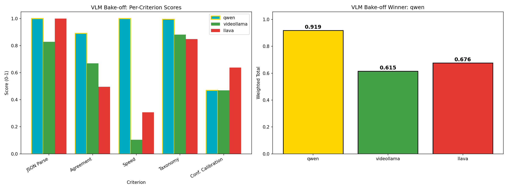

> **What it shows (layman):** Three VLMs (Qwen3-VL, VideoLLaMA3, LLaVA-NeXT) compete on 5 criteria: JSON parse rate (can the VLM produce valid structured tags?), cross-VLM agreement (does it match the majority vote?), speed (clips/sec throughput), taxonomy compliance (do values stay within allowed categories?), and confidence calibration (is the VLM confident when correct, uncertain when wrong?). Each criterion has a weight (30/25/20/15/10%) and bars show normalized [0-1] scores. The right panel shows the weighted total. **Higher is better for all criteria.**
>
> **Key finding:** Qwen3-VL wins decisively (0.919 weighted total) — perfect JSON parse, highest agreement (0.89), fastest throughput (1.37 clips/s), and near-perfect taxonomy compliance. VideoLLaMA3 (0.615) has good taxonomy but slow speed (0.14 clips/s) and lower agreement. LLaVA-NeXT (0.676) parses well and has best confidence calibration but lower agreement and moderate speed.

#### 9.1c VLM Bake-off: Diagnostic Dashboard

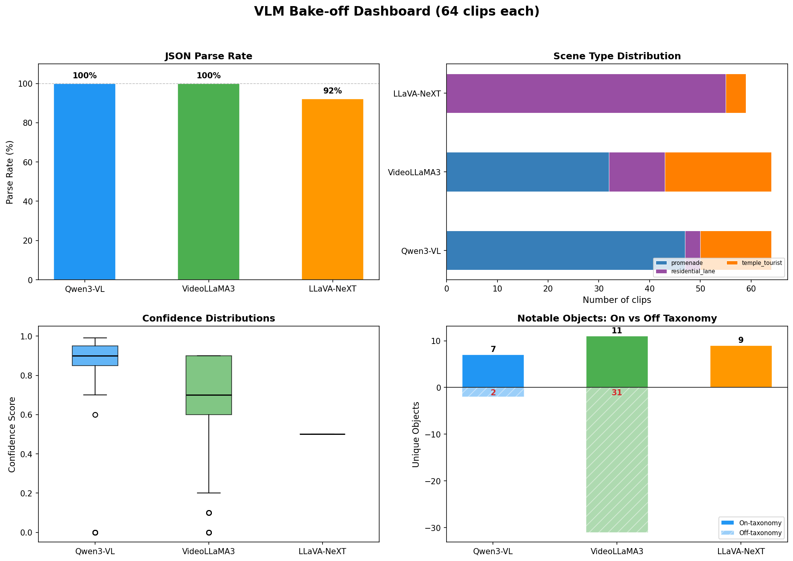

> **What it shows (layman):** Four diagnostic panels for each VLM: (1) JSON parse rate — % of clips that produced a valid single scene_type value; (2) scene type distribution — does the VLM produce diverse or monotonic tags?; (3) confidence score distributions — is the VLM well-calibrated or always overconfident?; (4) notable objects — how many unique object categories were detected, and how many were hallucinated (off-taxonomy)?
>
> **Key finding:** Qwen3-VL produces tight, high confidence (median 0.9) with minimal off-taxonomy hallucination (2 objects). VideoLLaMA3 has wider confidence spread (0.1–0.9) and the most hallucinated objects (31 off-taxonomy vs 11 on-taxonomy) — it invents object categories not in our schema. LLaVA-NeXT outputs flat 0.5 confidence for all fields (uncalibrated) but produces clean on-taxonomy objects (9, zero off-taxonomy).

---

### 9.2 Overall (Label-Free) Evaluation

#### 9.2.1 kNN Distance Distribution

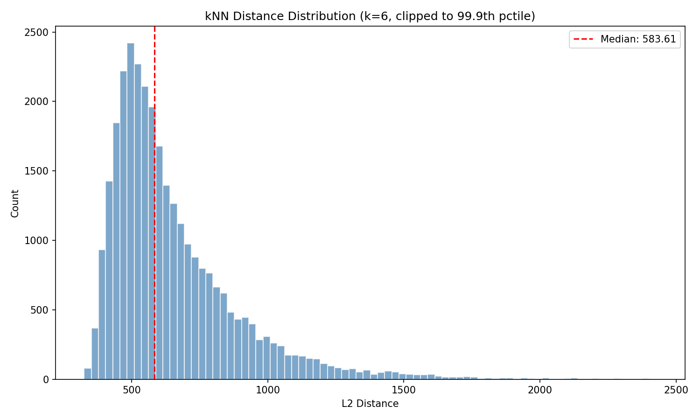

> **What it shows (layman):** Imagine each video clip as a point in a high-dimensional space. This histogram shows how far each clip is from its 6 nearest neighbors. If most distances are small, the representation is "tight" — similar clips cluster close together. If distances are spread out, the embedding space is more diffuse. **Lower distances = better clustering.**
>
> **Easy vs Hard:** This plot uses Easy mode (all neighbors allowed). Hard mode would shift the distribution slightly right since we exclude same-video temporal neighbors, forcing the model to find genuinely similar clips from different videos.

#### 9.2.2 Cycle Consistency (Cycle@K)

| Mode | Cycle@K |
|------|---------|
| Easy | **78.96%** |
| Hard | **78.39%** |

> **What it shows (layman):** If clip A's nearest neighbor is clip B, does clip B point back to clip A? Think of it as a friendship test — if you say someone is your best friend, do they say you are their best friend too? **Higher is better.** A score of 79% means ~4 out of 5 clips have reciprocal nearest-neighbor relationships — the embedding space has stable, coherent neighborhoods.
>
> **Easy vs Hard:** Gap is only **0.57 percentage points** (78.96 vs 78.39). This tiny difference tells us that cycle consistency comes from genuine visual similarity, not from trivially matching adjacent clips from the same video. The embeddings are robust — excluding same-video neighbors barely hurts.

#### 9.2.3 Neighborhood Stability (Overlap@K)

| Mode | Overlap@K |
|------|-----------|
| Easy | **26.84%** |
| Hard | **26.84%** |

> **What it shows (layman):** We split the 1,408-dim embedding into two halves (dims 1-704 and dims 705-1408) and check: do both halves agree on who your neighbors are? It measures how robust the neighborhoods are to using only partial information. **Higher is better.** 26.84% means about 1.6 out of 6 neighbors overlap between the two views — moderate robustness. (Note: this is an approximation; true Overlap@K requires augmented video crops.)
>
> **Easy vs Hard:** **Identical** (26.84% in both modes). This is expected — the dim-split approximation depends on embedding geometry, not on which neighbors are excluded. The metric is inherently label-free and mode-agnostic.

#### 9.2.4 Silhouette Score (Clustering Diagnostics)

| Mode | Silhouette (scene_type) |
|------|------------------------|
| Easy | **-0.0614** |
| Hard | **-0.0614** |

> **What it shows (layman):** Silhouette measures how well clips of the same type cluster together vs. how far apart different types are. Range is [-1, +1]. Positive means "well-separated clusters." Zero means "random/overlapping." Negative means "clips are closer to wrong clusters than their own." **Higher (closer to +1) is better.** A score of -0.06 means V-JEPA's embedding space does NOT cleanly separate scene types — it organizes clips by some other principle (see 9.3.2 below).
>
> **Easy vs Hard:** **Identical** (-0.0614 in both). This makes sense: silhouette is computed on the full embedding matrix and labels, not on kNN neighborhoods. The Easy/Hard exclusion window only affects kNN search, not the embedding geometry itself.

---

### 9.3 Class-Wise Evaluation Using Weak Tags

#### 9.3.1 Retrieval Purity (Prec@K) — All 9 Taxonomy Keys

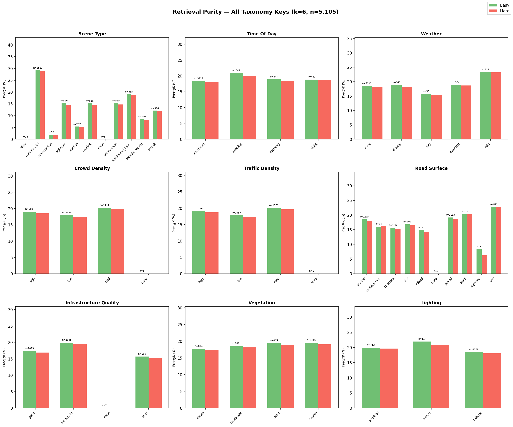

> **What it shows (layman):** For each taxonomy key (e.g., scene_type, weather, lighting), this shows: when you find clip A's 6 nearest neighbors, what percentage share the same tag value? Think of it as "if I'm in a market, do my neighbors also look like markets?" **Higher is better.** The 3x3 grid compares all 9 single-value taxonomy keys side by side.
>
> **Easy vs Hard:** Green bars (Easy) are consistently slightly taller than red bars (Hard) — allowing same-video neighbors inflates purity because adjacent clips from the same walk share the same scene/weather/lighting. The gap is small (~0.4-0.7 pp across keys), confirming our deduplication works well.

**Per scene_type breakdown (Easy mode):**

| Scene Type | Prec@K | Count | Interpretation |
|-----------|--------|-------|---------------|
| commercial | 29.31% | 1,511 | Largest class, strong self-retrieval |
| residential_lane | 19.11% | 865 | Second largest, decent purity |
| highway | 15.34% | 526 | Moderate — highways look similar across videos |
| promenade | 15.33% | 535 | Similar to highway level |
| market | 15.28% | 565 | Markets are visually diverse (open-air vs covered) |
| transit | 12.13% | 514 | Bus stops/stations have varied architecture |
| temple_tourist | 8.53% | 250 | Highly diverse — temples vs beaches vs monuments |
| junction | 5.37% | 267 | Junctions look like highways and commercial areas |
| construction | 1.89% | 53 | Too few examples, and visually similar to roads |
| alley / none | 0.00% | 14 / 5 | Insufficient examples for meaningful kNN |

**Macro avg: 11.12% | Micro avg: 18.73%** — the 7.6 pp gap between macro and micro shows that large classes (commercial) inflate the micro average, while rare classes (alley, construction) drag down the macro.

#### 9.3.2 Silhouette per Taxonomy Key — What Does V-JEPA Actually Cluster By?

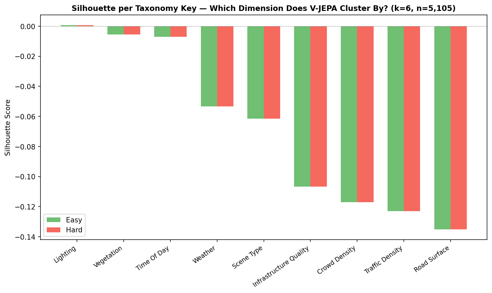

> **What it shows (layman):** We compute silhouette score using each taxonomy key as the "ground truth" cluster label. If silhouette is high for "lighting" but low for "scene_type", it means V-JEPA organizes its embedding space primarily by lighting conditions, not by semantic scene categories. This directly answers: **"What visual dimension does V-JEPA care about most?"** Higher (closer to 0 or positive) is better — it means the embeddings align with that dimension.
>
> **Easy vs Hard:** **Identical** for all keys (silhouette depends on embedding geometry, not kNN filtering). All values are negative, meaning V-JEPA doesn't cleanly cluster by ANY single taxonomy dimension. But the ranking is revealing.

**Ranking (Easy mode):**

| Taxonomy Key | Silhouette | Interpretation |
|---|---|---|
| lighting | **+0.0007** | Only positive value — V-JEPA's best alignment |
| vegetation | -0.0056 | Near-zero — weak signal |
| time_of_day | -0.0071 | Near-zero — weak signal |
| weather | -0.0534 | Moderate negative |
| **scene_type** | **-0.0614** | **5th out of 9 — V-JEPA does not prioritize scene semantics** |
| infrastructure_quality | -0.1066 | Poor alignment |
| crowd_density | -0.1170 | Poor alignment |
| traffic_density | -0.1230 | Poor alignment |
| road_surface | -0.1352 | Worst — road texture is invisible to V-JEPA |

**Key finding:** V-JEPA (trained on Ego4D/SSv2/HowTo100M — Western data) organizes Indian street clips primarily by **lighting/illumination** (the only positive silhouette), not by scene semantics. This is a core result: the model captures low-level visual properties (brightness, time of day) rather than high-level Indian urban scene categories.

#### 9.3.3 Ranking Quality (mAP@K) — Per Taxonomy Key

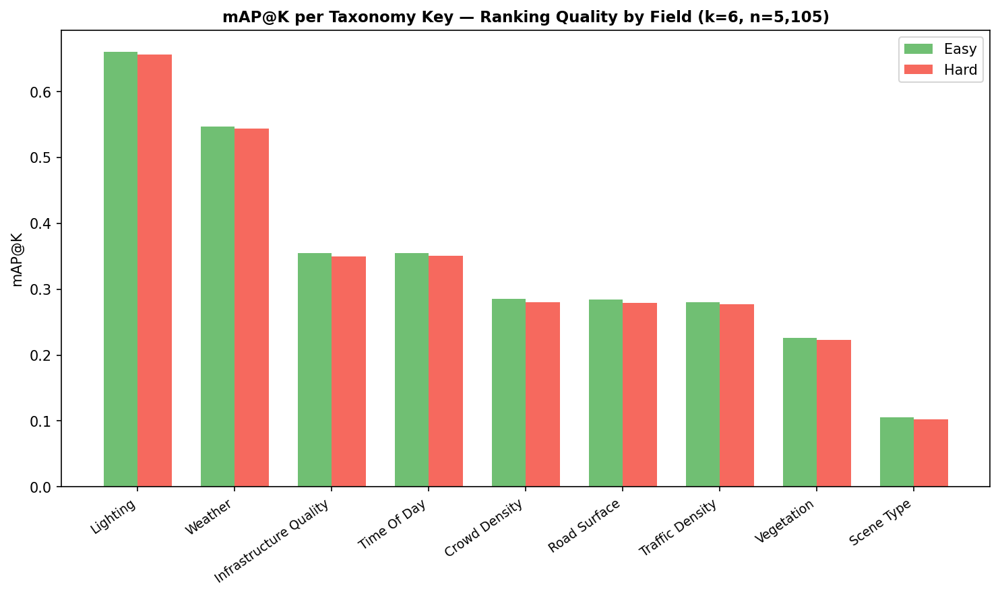

> **What it shows (layman):** mAP@K (Mean Average Precision) measures not just *whether* your neighbors share the same tag, but *how highly they are ranked*. A relevant neighbor at position #1 matters more than one at position #6. Think of it as a search engine quality score — do the best results appear first? Range is [0, 1]. **Higher is better.** We compute this for each taxonomy key independently — "using lighting as the only relevance criterion, how good is the ranking?"
>
> **Easy vs Hard:** Easy is consistently 0.3-0.5% higher across all keys. The gap is uniform and small, again confirming that temporal adjacency inflates results only slightly.

**Ranking (Easy mode):**

| Taxonomy Key | mAP@K | Interpretation |
|---|---|---|
| **lighting** | **0.6601** | Dominant — 2/3 of ranked neighbors match lighting |
| **weather** | **0.5474** | Strong — weather conditions are well-captured |
| infrastructure_quality | 0.3553 | Moderate |
| time_of_day | 0.3552 | Moderate |
| crowd_density | 0.2849 | Weak |
| road_surface | 0.2839 | Weak |
| traffic_density | 0.2801 | Weak |
| vegetation | 0.2266 | Weak |
| **scene_type** | **0.1056** | **Dead last — 6x worse than lighting** |

**Key finding:** This reinforces the silhouette result. V-JEPA's rankings are 6x better at preserving lighting similarity (mAP=0.66) than scene type similarity (mAP=0.11). The model "sees" illumination and weather far more clearly than semantic scene categories in Indian urban contexts.

#### 9.3.3b Combined: All Tag-Conditioned Metrics by Taxonomy Key

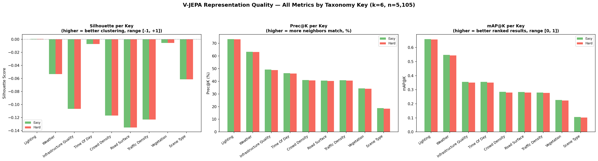

> **What it shows (layman):** This single grid combines the three metrics that can be computed "per taxonomy key" — Silhouette, Prec@K, and mAP@K — side by side with a consistent x-axis sorted by mAP@K. It directly answers: **across every way we measure, which visual dimension does V-JEPA capture best?** The consistent left-to-right decline across all 3 panels confirms the finding is robust — not an artifact of any single metric.
>
> **Easy vs Hard:** Green (Easy) bars are marginally taller than red (Hard) in Prec@K and mAP@K panels. Silhouette is identical (it depends on embedding geometry, not kNN filtering). The Easy/Hard gap is negligible across all keys.

**Why only 3 metrics, not all 6?** The other 3 core metrics cannot produce a meaningful "one bar per taxonomy key":
- **Cycle@K** and **Overlap@K** are label-free — they don't use tags, so there's no "Cycle@K for lighting" vs "Cycle@K for weather." (Per-*value* breakdowns — e.g., Cycle@K of market clips vs highway clips — are shown separately in the 3x3 Cycle grid.)
- **nDCG@K** uses all 9 fields simultaneously for graded relevance. A single-field nDCG degenerates mathematically to mAP@K, so it would be a duplicate column.

**Key numbers (Easy mode):**

| Taxonomy Key | Silhouette | Prec@K | mAP@K |
|---|---|---|---|
| lighting | +0.0007 | 73.38% | 0.6601 |
| weather | -0.0534 | 63.35% | 0.5474 |
| infrastructure_quality | -0.1066 | 49.31% | 0.3553 |
| time_of_day | -0.0071 | 43.99% | 0.3552 |
| crowd_density | -0.1170 | 40.37% | 0.2849 |
| road_surface | -0.1352 | 40.18% | 0.2839 |
| traffic_density | -0.1230 | 39.57% | 0.2801 |
| vegetation | -0.0056 | 34.04% | 0.2266 |
| **scene_type** | **-0.0614** | **18.73%** | **0.1056** |

#### 9.3.4 Ranking Quality (mAP@K) — Per Taxonomy Value (Detailed Breakdown)

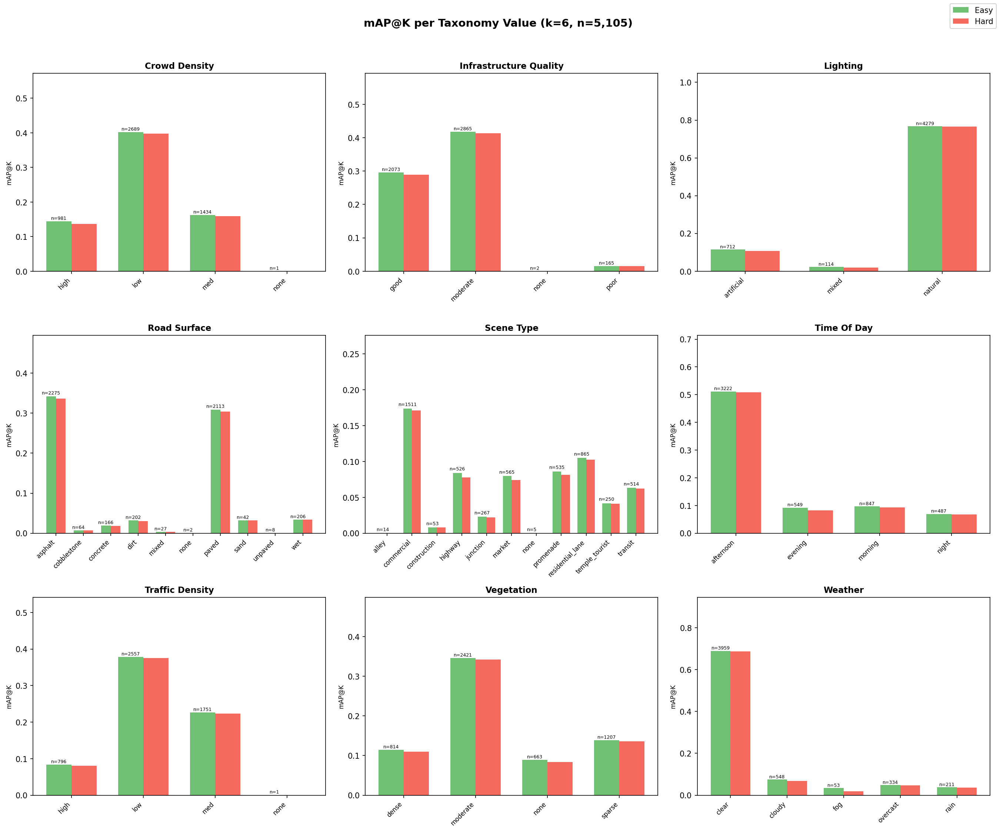

> **What it shows (layman):** Zooming in from 9.3.3, this 3x3 grid breaks down mAP@K *within* each taxonomy key — e.g., for lighting, what is mAP for "natural" vs "artificial" vs "mixed"? This reveals which specific attribute values the model handles well vs poorly.
>
> **Easy vs Hard:** Same pattern — green bars slightly taller. The interesting story is in the per-value variance: some values within the same key are easy to retrieve (natural lighting, mAP=0.78) while others are near impossible (mixed lighting, mAP~0).

**Notable per-value findings:**
- **Lighting:** `natural` (mAP=0.78, n=4,279) dominates because 84% of clips are natural light. `artificial` (mAP=0.08, n=712) is very hard — nighttime Indian streets look extremely diverse.
- **Weather:** `clear` (mAP=0.67, n=3,959) is easy. `rain` (mAP=0.04, n=211) is nearly impossible — rain clips are visually diverse.
- **Scene type:** `commercial` (mAP=0.18, n=1,511) is best. `alley` (mAP=0, n=14) and `construction` (mAP=0.01, n=53) are impossible due to tiny sample sizes.

#### 9.3.5 Ranking Quality (nDCG@K) — Global Multi-Field Grading

| Mode | nDCG@K |
|------|--------|
| Easy | **0.9003** |
| Hard | **0.8992** |

> **What it shows (layman):** nDCG@K (Normalized Discounted Cumulative Gain) assigns *graded* relevance: a neighbor that matches on 7 out of 9 taxonomy fields scores higher than one matching on 2 fields. It rewards neighbors that are "close but not identical" rather than treating relevance as binary. Range is [0, 1]. **Higher is better.** Our score of 0.90 means that V-JEPA's ranked neighbors tend to share most tag fields with the query, even if they don't match on scene_type. The model retrieves "generally similar" clips very well.
>
> **Easy vs Hard:** Gap is only **0.0011** (0.9003 vs 0.8992) — nearly identical. This high nDCG combined with low scene_type Prec@K means: V-JEPA finds clips that share lighting + weather + crowd density + vegetation but differ in scene category. The representations capture environmental context, not scene semantics.

#### 9.3.6 Cycle@K per Taxonomy Key (Neighborhood Coherence by Scene)

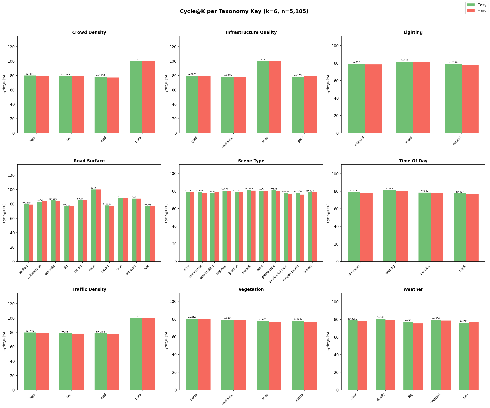

> **What it shows (layman):** For each taxonomy key, we group clips by their tag value (e.g., all "market" clips, all "highway" clips) and compute Cycle@K within each group. This answers: "Do market clips have more stable neighborhoods than highway clips?" **Higher is better.**
>
> **Easy vs Hard:** Green bars (Easy) are slightly taller across all values. The remarkable finding is the **uniformity**: across all 9 keys and all their values, Cycle@K stays in the **77-81% band**. This means neighborhood coherence is scene-agnostic — V-JEPA builds stable neighborhoods regardless of what the clip contains. The representation quality is consistent across all conditions.

---

### 9.4 Visualization

#### 9.4.1 UMAP Projections — All 9 Taxonomy Keys

> **What it shows (layman):** UMAP projects the 1,408-dim embeddings down to 2D for visualization. Each dot is a clip, colored by its tag value. If the model clusters well by that dimension, you'd see distinct color blobs. If it doesn't, colors are scattered randomly.
>
> **Key observation:** The scene_type UMAP shows mild clustering for `commercial` (green blob center-left) but severe overlap between most categories. The `lighting` UMAP shows the clearest separation — `natural` vs `artificial` clips occupy distinct regions. This visually confirms the silhouette and mAP findings: V-JEPA organizes by illumination, not semantics.

#### 9.4.2 Confusion Matrices — All 9 Taxonomy Keys

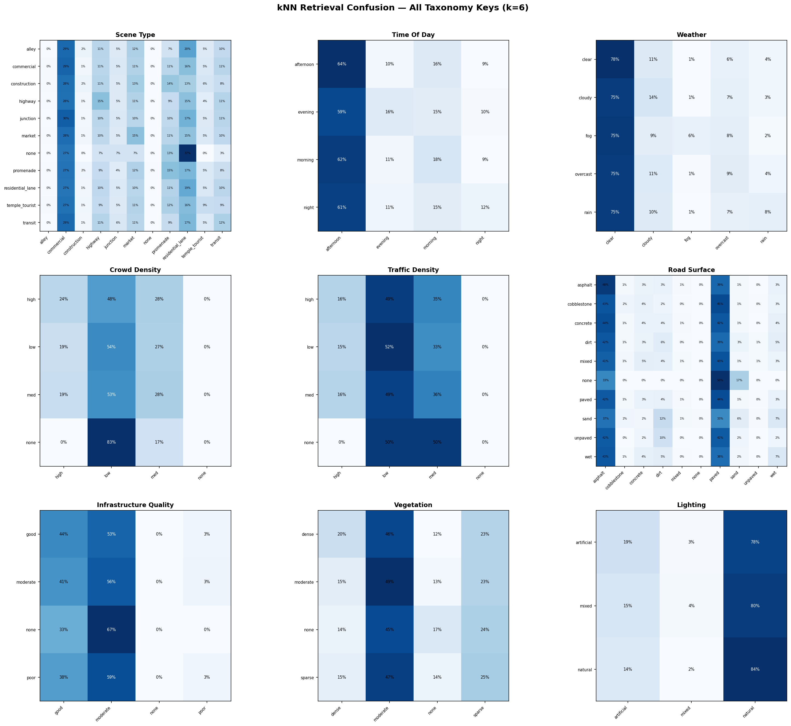

> **What it shows (layman):** For each clip, we look at what tag values its k=6 nearest neighbors have. The confusion matrix shows: when the query is "market", what do the neighbors look like? Strong diagonals mean high self-retrieval. Off-diagonal mass reveals dominant confusions.
>
> **Key observation:** The scene_type matrix shows `commercial` strongly self-retrieves (darkest diagonal cell) but `junction`, `transit`, and `market` heavily cross-contaminate each other — V-JEPA can't distinguish these visually similar Indian urban contexts. The `lighting` matrix has a near-perfect `natural` diagonal (84% of clips), confirming the model's illumination bias.

#### 9.4.3 Qualitative kNN Grid

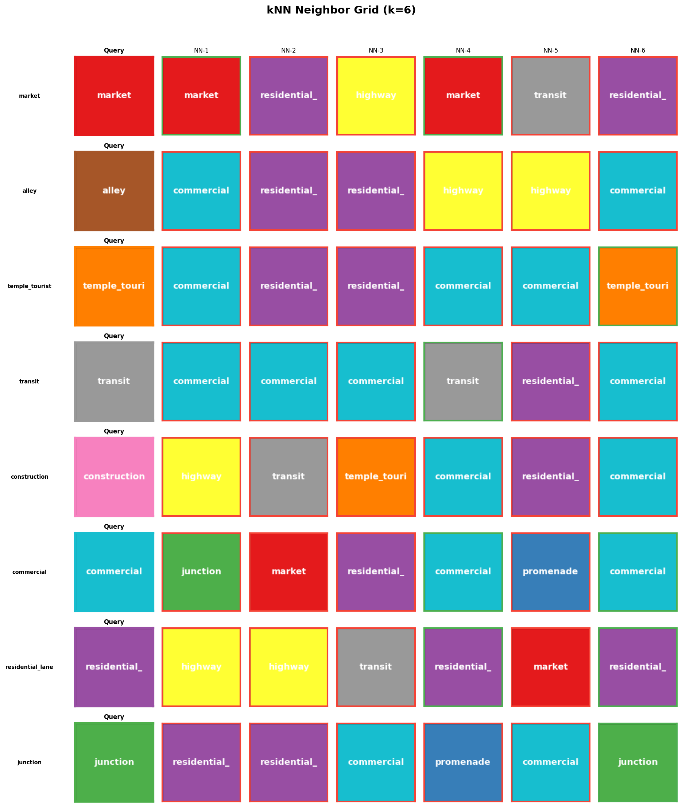

> **What it shows (layman):** For a random sample of query clips (leftmost column), we show their top-6 nearest neighbors. This is the most intuitive check — do the retrieved clips actually look similar to the query?
>
> **Key observation:** Neighbors tend to share visual appearance (lighting, road width, crowd level) rather than semantic category. A busy market query may retrieve a busy commercial street because both have crowds, vehicles, and similar illumination — not because the model understands "market" as a concept.

---

### 9.5 Robustness Checks

#### 9.5.1 Easy vs Hard Comparison (Radar)

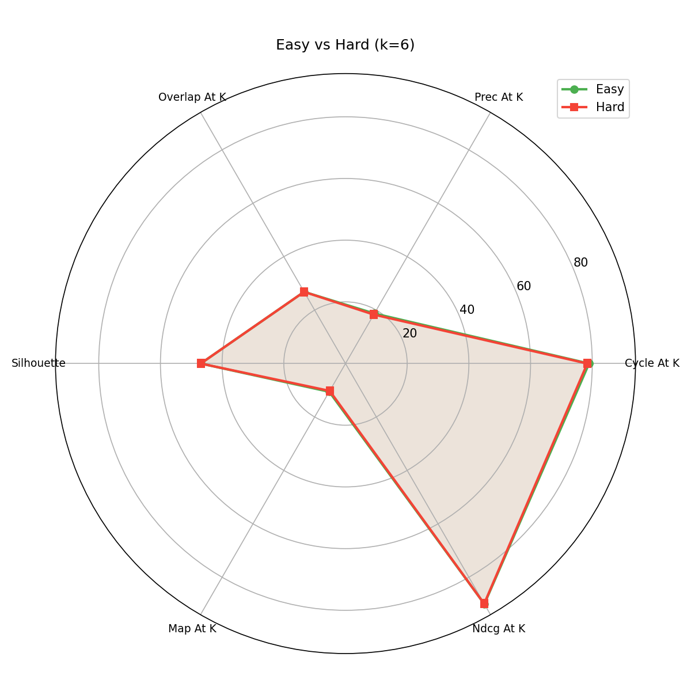

> **What it shows (layman):** A single radar chart overlaying all 6 core metrics for Easy (green) vs Hard (red) mode. Each axis is a metric scaled to [0, 100]. If both polygons overlap almost perfectly, it means excluding same-video temporal neighbors has minimal impact — the model genuinely finds similar clips, not just adjacent frames.
>
> **Easy vs Hard:** The two polygons are nearly identical. The largest gap is on Prec@K (0.40 pp). All other metrics differ by less than 0.6 pp. For our dataset (700+ videos cut into 4-12s clips with cosine dedup), Easy/Hard is essentially a non-distinction. This is actually a positive result — it means our data pipeline (scene-cut segmentation + cosine deduplication) already eliminates trivial temporal matches.

#### 9.5.2 Confidence Threshold Sweep

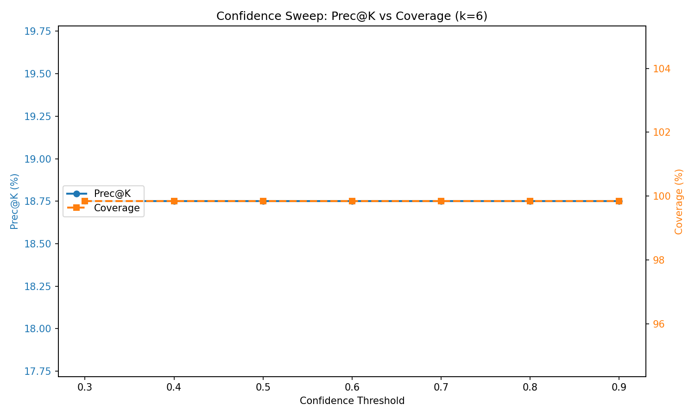

> **What it shows (layman):** We vary the VLM confidence threshold from 0.3 to 0.9 and check: does restricting to high-confidence clips improve Prec@K? If so, the VLM's uncertain tags are noisy. If Prec@K stays flat, the VLM is either very confident on everything or confidence doesn't correlate with correctness.
>
> **Easy vs Hard:** Not applicable (single mode). The key finding is that the curve is **completely flat** — Prec@K=18.75% and coverage=99.84% at all thresholds. This means Qwen3-VL-8B assigns confidence >= 0.9 to 99.84% of clips. The VLM is extremely confident even when wrong. This is a known issue with instruction-tuned VLMs — they rarely express uncertainty in structured outputs.

---

### 9.6 Summary Table

| Metric | Easy | Hard | Delta | Better? | What it measures |
|--------|------|------|-------|---------|-----------------|
| Cycle@K | 78.96% | 78.39% | -0.57 | Higher | Reciprocal neighborhood stability |
| Overlap@K | 26.84% | 26.84% | 0.00 | Higher | Robustness to partial info (dim-split) |
| Silhouette | -0.0614 | -0.0614 | 0.00 | Higher (+1 best) | Cluster separation by scene_type |
| Prec@K | 18.73% | 18.33% | -0.40 | Higher | % neighbors sharing same scene_type |
| mAP@K | 0.1056 | 0.1024 | -0.003 | Higher | Ranking quality by scene_type |
| nDCG@K | 0.9003 | 0.8992 | -0.001 | Higher | Multi-field graded ranking quality |
| Macro Prec@K | 11.12% | 10.81% | -0.31 | Higher | Equal weight per scene class |
| Micro Prec@K | 18.73% | 18.33% | -0.40 | Higher | Weighted by class frequency |

### 9.7 Key Findings

1. **V-JEPA organizes by illumination, not scene semantics.** Silhouette for `lighting` (+0.0007) is the only positive value; `scene_type` ranks 5th (-0.0614). mAP@K for `lighting` (0.66) is 6x higher than for `scene_type` (0.11). The model trained on Western data captures low-level visual properties (brightness, weather) far better than high-level Indian urban scene categories.

2. **High nDCG (0.90) + Low Prec@K (18.7%) = contextual, not categorical retrieval.** V-JEPA retrieves clips that share many attributes (lighting + weather + crowd + vegetation) but differ in scene type. It finds "similar vibes" not "same place type."

3. **Neighborhoods are remarkably stable.** Cycle@K ~79% across all scene types (77-81% band). The model builds consistent neighborhoods regardless of content — it's not better at some scenes and worse at others.

4. **Easy/Hard distinction is negligible (<0.6 pp on all metrics).** Our data pipeline (scene-cut segmentation from 700+ videos + cosine dedup) already prevents trivial temporal leakage. Hard mode exclusion adds almost no information.

5. **Class imbalance is a primary confounder.** `commercial` (29.3% Prec@K, n=1,511) dominates while `alley` (0%, n=14) and `construction` (1.9%, n=53) are invisible. The macro-micro gap (11.1% vs 18.7%) quantifies this imbalance effect.

6. **VLM confidence is uncalibrated.** Qwen3-VL-8B assigns >=0.9 confidence to 99.84% of clips, making the confidence sweep uninformative. Future work should explore calibration techniques or consensus-based confidence from the VLM bake-off.
