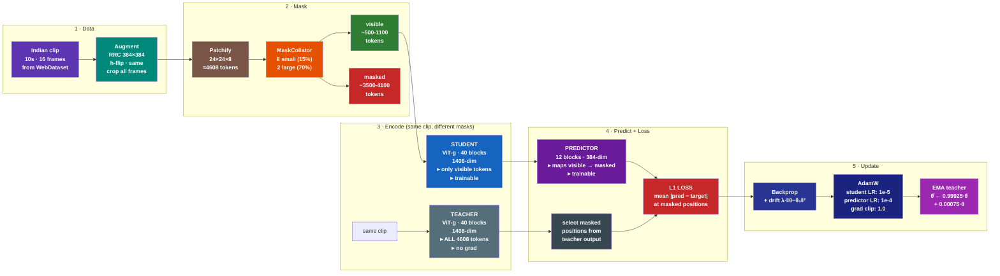
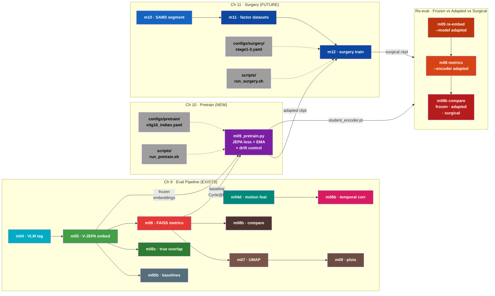

# Training Plan: Ch10 (Continual Pretraining) + Ch11 (Surgery Fine-Tuning)

> Ref: `Literature/proposal/FactorJEPA/FactorJEPA.md` Sections 10-11

---

## System Design: Ch10 + Ch11 Overview

```mermaid
flowchart LR
    subgraph INPUT ["Shared Input · Indian Clip Corpus"]
        direction TB
        D["WebDataset<br>116 TARs<br>~115K clips"] --> SPLIT["video_id split<br>90% train · 10% val"]
        TAGS["tags.json<br>16 fields × v3"]
    end

    subgraph CH10 ["Ch 10 · Continual Pretraining (m09_pretrain.py)"]
        direction LR

        subgraph LOOP ["Training Step (repeated 2K-10K times)"]
            direction TB
            AUG["Video-consistent augmentation<br>RandomResizedCrop 384×384"] --> MASK["Spatiotemporal mask sampling<br>8+2 blocks · ~80% masked"]

            subgraph FORWARD ["Forward Pass"]
                direction LR
                STU["Student encoder<br>ViT-g 1B · trainable<br>visible tokens only"] --> PRED["Predictor<br>12-layer 384-dim<br>predict masked tokens"]
                TEA["Teacher encoder<br>ViT-g 1B · frozen<br>ALL tokens · no grad"] --> LOSS["L1 Loss<br>|pred − target|<br>at masked positions"]
                PRED --> LOSS
            end

            MASK --> FORWARD
        end

        LOSS --> OPT["AdamW step<br>student + predictor<br>+ grad clip 1.0"]
        LOSS --> DRIFT["Drift control<br>λ·‖θ−θ₀‖²<br>(optional)"]
        OPT --> EMA["EMA update<br>θ̄ ← 0.99925·θ̄<br>+ 0.00075·θ"]
        EMA --> VAL{"Validate<br>every 2K steps?"}
        VAL -->|"yes"| CYCLE["Cycle@K<br>hard mode<br>FAISS-GPU"]
        VAL -->|"no"| CKPT["Checkpoint<br>student + teacher<br>+ predictor + opt"]
        CYCLE --> BEST["Best model<br>selection by<br>Cycle@1"]
        BEST --> ADAPTED["V-JEPA<br>(adapted)"]
    end

    subgraph CH11 ["Ch 11 · Surgery Fine-Tuning (m10 → m11 → m12)"]
        direction LR

        subgraph SAM ["m10 · SAM3 Segmentation"]
            direction TB
            SEG["SAM3<br>instance masks"] --> TRACK["Greedy IoU<br>tracklets"] --> AGENT["Agent vs Layout<br>motion filter"]
        end

        subgraph FACTOR ["m11 · Factor Datasets"]
            direction TB
            DL["D_L<br>layout-only<br>blur agents"]
            DA["D_A<br>agent-only<br>suppress BG"]
            DI["D_I<br>interaction<br>tube crops"]
        end

        AGENT --> DL
        AGENT --> DA
        AGENT --> DI

        subgraph STAGES ["m12 · Progressive Prefix Unfreezing"]
            direction TB
            S1["Stage 1<br>layers 0→10<br>100% D_L"] --> S2["Stage 2<br>layers 0→20<br>90% D_A + 10% D_L"] --> S3["Stage 3<br>layers 0→30<br>85% D_I + mix"]
        end

        FACTOR --> STAGES
        S3 --> SURGICAL["V-JEPA<br>(surgical)"]
    end

    subgraph EVAL ["Re-evaluation · 3-way comparison"]
        direction TB
        RE["m05 re-embed<br>× 3 encoders"] --> M6["m06 metrics<br>9 spatial<br>5 temporal"] --> M8["m08b plots<br>frozen vs adapted<br>vs surgical"]
    end

    INPUT --> CH10
    TAGS -->|"stratified batch"| CH10
    INPUT --> CH11
    TAGS -->|"stratified batch"| CH11
    CH10 --> CH11
    CH10 --> EVAL
    CH11 --> EVAL

    style D fill:#5e35b1,color:#fff,font-weight:bold
    style SPLIT fill:#7b1fa2,color:#fff,font-weight:bold
    style TAGS fill:#00acc1,color:#fff,font-weight:bold
    style AUG fill:#00897b,color:#fff,font-weight:bold
    style MASK fill:#e65100,color:#fff,font-weight:bold
    style STU fill:#1565c0,color:#fff,font-weight:bold
    style TEA fill:#546e7a,color:#fff,font-weight:bold
    style PRED fill:#6a1b9a,color:#fff,font-weight:bold
    style LOSS fill:#c62828,color:#fff,font-weight:bold
    style OPT fill:#283593,color:#fff,font-weight:bold
    style DRIFT fill:#4e342e,color:#fff,font-weight:bold
    style EMA fill:#9c27b0,color:#fff,font-weight:bold
    style CYCLE fill:#d81b60,color:#fff,font-weight:bold
    style BEST fill:#ad1457,color:#fff,font-weight:bold
    style ADAPTED fill:#4a148c,color:#fff,font-weight:bold
    style SEG fill:#0277bd,color:#fff,font-weight:bold
    style TRACK fill:#01579b,color:#fff,font-weight:bold
    style AGENT fill:#004d40,color:#fff,font-weight:bold
    style DL fill:#1b5e20,color:#fff,font-weight:bold
    style DA fill:#33691e,color:#fff,font-weight:bold
    style DI fill:#827717,color:#fff,font-weight:bold
    style S1 fill:#1565c0,color:#fff,font-weight:bold
    style S2 fill:#1565c0,color:#fff,font-weight:bold
    style S3 fill:#0d47a1,color:#fff,font-weight:bold
    style SURGICAL fill:#0d47a1,color:#fff,font-weight:bold
    style RE fill:#bf360c,color:#fff,font-weight:bold
    style M6 fill:#d84315,color:#fff,font-weight:bold
    style M8 fill:#b71c1c,color:#fff,font-weight:bold
```



---

## V-JEPA Training: What's Actually Used

PPO/DPO/GRPO are RLHF methods for text-generating LLMs. They are **fundamentally inapplicable** to V-JEPA. V-JEPA is a deterministic encoder (video → embedding), not a generative model. There's no reward signal, no preference pairs, no policy to optimize.

### V-JEPA 2.0 vs 2.1 Training Components

| Component | V-JEPA 2.0 | V-JEPA 2.1 |
|-----------|-----------|-----------|
| **Loss** | L1 latent prediction (masked tokens only) | Dense Predictive Loss (ALL tokens, L1) |
| **Optimizer** | AdamW | AdamW |
| **LR Schedule** | Warmup-constant-cooldown (NOT cosine) | Same |
| **EMA** | Fixed momentum (no ramp-up) | Same |
| **Architecture** | Student-teacher with predictor | Same + deep self-supervision at intermediate layers |

Sources: [V-JEPA 2 (arXiv:2506.09985)](https://arxiv.org/abs/2506.09985), [V-JEPA 2.1 (arXiv:2603.14482)](https://arxiv.org/abs/2603.14482)

---

## Self-Supervised Video Encoder Training Algorithms

| Algorithm | Loss Type | Used By | Negatives? |
|-----------|-----------|---------|------------|
| **JEPA latent prediction (L1)** | Regression in latent space | V-JEPA 2/2.1 | No |
| DINO + iBOT | Cross-entropy (CLS + patch) | DINOv2 | No (EMA teacher) |
| MSE pixel reconstruction | Pixel regression | VideoMAE, MAE | No |
| BYOL | MSE normalized projection | BYOL | No (EMA) |
| InfoNCE / NT-Xent | Contrastive | SimCLR, MoCo | Yes |

---

## Continual Pretraining Approaches (Ch10)

Proposal (Sec 10.3) specifies: same JEPA loss on Indian clips, student-teacher EMA, optional drift control.

Standard approaches in literature:

| # | Approach | How it works | Relevance |
|---|----------|-------------|-----------|
| 1 | **Same SSL loss on new data** | Resume pretraining with JEPA loss on Indian clips | Most direct. V-JEPA 2 itself does stage-wise training (pretrain → post-train). **Our primary approach.** |
| 2 | **EWC (Elastic Weight Consolidation)** | Penalty on important weights from prior training | Prevents catastrophic forgetting. Our drift control (λ·‖θ-θ₀‖²) is equivalent to L2-anchored EWC. |
| 3 | **Knowledge distillation** | Frozen original model as teacher, adapted model matches teacher outputs + learns from new data | Confirmed for CLIP/DINOv2 continual learning. Could supplement JEPA loss. |
| 4 | **LoRA / adapters** | Freeze backbone, train low-rank adapter modules | Reduces trainable params. C-LoRA confirmed for continual vision learning. |
| 5 | **Frozen encoder + new predictor** | Freeze encoder, train only predictor on new data | V-JEPA 2's own action-conditioned post-training uses this. Cheapest option. |

---

## Surgery Fine-Tuning Approaches (Ch11)

Proposal (Sec 11.5) specifies: progressive prefix unfreezing with factor datasets (Layout → Agent → Interaction).

| Stage | Layers Unfrozen | Input | Factor |
|-------|----------------|-------|--------|
| 1 | 0 to n₁ (~25% of L) | 100% D_L (layout-only) | Roads, buildings, wires |
| 2 | 0 to n₂ (~50% of L) | 90% D_A + 10% D_L replay | Vehicles, people, animals |
| 3 | 0 to n₃ (~75% of L) | 85% D_I + 10% D_A + 5% D_L | Agent-agent interactions |

Factor datasets (D_L, D_A, D_I) created via SAM3 segmentation → tracklet mining → agent/layout separation.

---

## Python Packages with JEPA Training Code

| Package | JEPA Support | Status |
|---------|-------------|--------|
| [facebookresearch/vjepa2](https://github.com/facebookresearch/vjepa2) | **YES** — full training configs in `configs/train/vitg16/` | Active, official |
| [facebookresearch/jepa](https://github.com/facebookresearch/jepa) | **YES** — V-JEPA 1 training (`app/vjepa/train.py`) | Active |
| [facebookresearch/eb_jepa](https://github.com/facebookresearch/eb_jepa) | **YES** — lightweight JEPA examples (CIFAR-10, Moving MNIST) | Active (2026) |
| LightlySSL | No JEPA (has BYOL, DINO, SimCLR, MoCo, MAE) | Active |
| solo-learn | No JEPA | Active |
| VISSL | No JEPA | Archived (2024) |

**For Ch10/Ch11**: Use Meta's official `facebookresearch/vjepa2` training code. Configs exist at `configs/train/vitg16/` (2.0) and `configs/train_2_1/vitG16/` (2.1 ablation).

---

## Model Strategy

| Phase | Model | Dim | Purpose |
|-------|-------|-----|---------|
| 10K POC | V-JEPA 2.0 ViT-g (1B) | 1408 | Validate pipeline works |
| 115K Primary | V-JEPA 2.0 ViT-g (1B) | 1408 | Main results, proposal-aligned |
| 115K Ablation | V-JEPA 2.1 ViT-G (2B) | 1664 | Scaling analysis for paper |

---

## Ch10 Training Recipe (from proposal Sec 10.3-10.5, corrected per V-JEPA 2 source)

> **Corrections vs proposal**: V-JEPA 2 source code confirms several differences from the proposal's text. See "Proposal vs V-JEPA 2 Source" table below.

```
1. Load V-JEPA 2 ViT-g checkpoint (student + teacher via deepcopy)
2. Stream Indian clips (uniform by video_id, stratified by v3 taxonomy)
3. Per step:
   a. Decode T frames, resize to 384px (match pretrained resolution)
   b. Apply video-consistent augmentation (RandomResizedCrop, same for all frames)
   c. Sample spatiotemporal masks (8 small blocks @15% + 2 large blocks @70% → ~75-90% total masking)
   d. Student forward on SAME clip (visible tokens only, via masks_enc)
   e. Teacher forward on SAME clip (ALL tokens, no grad) — masks applied post-forward for loss
   f. Predictor maps student features → teacher space at masked positions
   g. L1 loss on masked token predictions + drift control
   h. AdamW step on student + predictor
   i. EMA update teacher: θ̄ ← τ·θ̄ + (1-τ)·θ (τ=0.99925 fixed)
4. Checkpoint every 2K-5K steps
5. Select best checkpoint by Cycle@K (hard mode) on validation subset
```

### Ch10 Single Training Step (V-JEPA 2 JEPA loss, corrected)



### Proposal vs V-JEPA 2 Source (verified via web research, Mar 2026)

| Aspect | Proposal (FactorJEPA.md) says | V-JEPA 2 source (actual) | Impact |
|--------|------------------------------|--------------------------|--------|
| **Loss** | MSE: ‖T̂ − T‖₂² | **L1**: `mean(\|T̂ − T\|^1.0) / 1.0` | Use L1 (loss_exp=1.0) |
| **EMA** | Ramp τ from ~0.996 to ~0.999 | **Fixed** τ=0.99925 | Use fixed momentum |
| **Teacher forward** | Teacher on masked target tokens | Teacher on **ALL tokens** (masks applied post-forward) | Student=masked, Teacher=full |
| **Two views** | Separate context + target views with different augmentations | **Same clip** to both; asymmetry from masking only | No separate view generation needed |
| **Resolution** | 224 or 256 | **384** (vitg-fpc64-**384** pretrained resolution) | Use 384 to match pretrained |
| **Mask ratio** | 15-30% total masked | 15% per-block spatial → **~75-90% total** (8+2 blocks) | Much more aggressive masking |
| **Block count** | 2-6 blocks | **8 small + 2 large = 10** blocks | More blocks than proposal suggested |
| **LR schedule** | Not specified | Warmup-constant-cooldown (for from-scratch); cosine decay for continual pretraining | Cosine for our adaptation |

---

## Code Organization

### Why flat `src/m*.py` (not subdirectories)

Researched V-JEPA 2, DINOv2, VideoMAE, timm, MMAction2, SAM 2 repo structures. Two patterns dominate:

- **V-JEPA 2 / DINOv2**: `app/` (train) + `evals/` (eval) subdirectories — works when train and eval are **independent programs** with separate entry points, data loaders, dependencies
- **VideoMAE / timm**: Flat scripts with naming convention (`run_mae_pretraining.py`, `run_class_finetuning.py`)

**Our pipeline is sequential, not independent.** Modules share `config.py`, `gpu_batch.py`, encoder registry, WebDataset streaming, `bootstrap.py`, `wandb_utils.py`. m05 outputs feed m06 which feeds m08. Splitting into subdirectories would break the `m04 → m05 → m06 → m07 → m08` dependency chain that the numbering encodes.

### Decision: Flat modules + config-driven training (V-JEPA 2 style)

```
src/
├── m00-m08b                 # Existing eval pipeline (KEEP FLAT)
├── m09_pretrain.py          # Ch10 continual pretraining
├── m10_sam_segment.py       # Ch11 SAM3 + tracklets
├── m11_factor_datasets.py   # Ch11 D_L/D_A/D_I creation
├── m12_surgery.py           # Ch11 progressive unfreezing
└── utils/                   # Shared (KEEP)

configs/                     # NEW — V-JEPA 2 style
├── eval/
│   └── vitg16_poc.yaml
├── pretrain/
│   └── vitg16_indian.yaml
└── surgery/
    ├── stage1_layout.yaml
    ├── stage2_agent.yaml
    └── stage3_interaction.yaml

scripts/
├── run_evaluate.sh          # Ch9 (EXISTS)
├── run_pretrain.sh          # Ch10 (TODO)
└── run_surgery.sh           # Ch11 (TODO)
```

YAML configs carry hyperparameters (LR, EMA momentum, mask ratio, batch size, prefix boundary). Python scripts carry logic. This matches V-JEPA 2 / DINOv2 / MMAction2 conventions without breaking our module numbering.

### Module Pipeline: Ch9 (eval) → Ch10 (pretrain) → Ch11 (surgery) → Re-eval



---

## Implementation Path

### Training infrastructure from `facebookresearch/vjepa2`

| Their file | Purpose | Our adaptation |
|-----------|---------|---------------|
| `app/main.py` | Single-GPU training entry | `src/m09_pretrain.py` (same role) |
| `app/main_distributed.py` | Multi-GPU DDP | `src/m09_pretrain.py --distributed` (flag, not separate file) |
| `configs/train/vitg16/pretrain-256px-16f.yaml` | Base pretrain config | `configs/pretrain/vitg16_indian.yaml` |
| `configs/train/vitg16/cooldown-256px-64f.yaml` | Cooldown config | `configs/pretrain/vitg16_cooldown.yaml` |
| `src/models/vision_transformer.py` | ViT-g/ViT-G architecture | Import directly from vjepa2 package |
| `src/masks/` | Spatiotemporal mask sampling | Import directly |
| `src/datasets/` | Video data loading | Replace with our `_create_stream()` + `--local-data` pattern |

### Our modifications for Indian continual pretraining

1. **Data loader**: Replace their `src/datasets/` with HF WebDataset streaming (existing `_create_stream()` from m05)
2. **Drift control**: Add regularizer λ·‖θ-θ₀‖² to JEPA loss (Sec 10.4 of proposal)
3. **Stratified sampling**: Uniform by `video_id`, balanced by v3 taxonomy tags
4. **Validation loop**: Run Cycle@K (hard mode) on held-out video_ids every 2K-5K steps
5. **Checkpoint selection**: Best Cycle@K, not lowest loss (label-free selection)
6. **Logging**: Integrate with `utils/wandb_utils.py`
7. **Config-driven**: All hyperparameters in YAML, script reads config via `--config`

---

## Lambda Ablation: Drift Control Sweep

Drift control λ trades off adaptation (learning Indian-domain features) vs retention (preserving pretrained knowledge). We sweep 4 values, each producing an isolated checkpoint. See `plan_code_dev.md` for commands.

| Lambda | Strategy | Expected Radar Change |
|--------|----------|----------------------|
| 0 | No anchor — max adaptation | Spatial expands, temporal may shrink (forgetting) |
| 0.001 | Gentle anchor | Usually the sweet spot for continual pretraining |
| 0.01 | Balanced (default) | Moderate adaptation + moderate forgetting protection |
| 0.1 | Strong anchor — minimal drift | Radar barely changes from frozen — too conservative |

### Selection criteria

1. **Spatial must improve**: Prec@K > 14.6% (frozen baseline)
2. **Temporal must NOT regress**: Cycle@K >= 78.7% (frozen baseline)
3. Maximize the sum of normalized metrics across all 8 radar axes

The winner is the λ whose radar polygon is largest overall — not just biggest on one axis.
