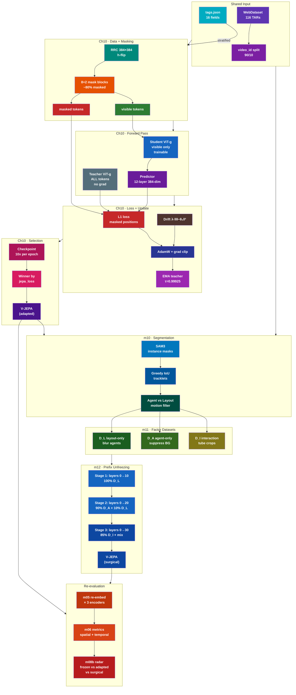
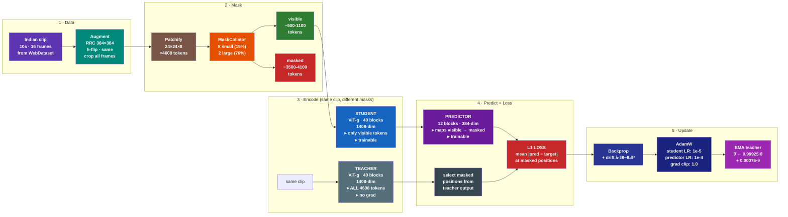
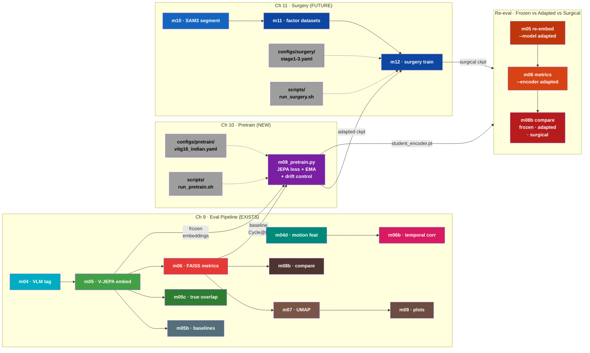

# Training Plan: Ch10 (Continual Pretraining) + Ch11 (Surgery Fine-Tuning)

> Ref: `Literature/proposal/FactorJEPA/FactorJEPA.md` Sections 10-11

---

## System Design: Ch10 + Ch11 Overview



---

## V-JEPA Training: What's Actually Used

PPO/DPO/GRPO are RLHF methods for text-generating LLMs. They are **fundamentally inapplicable** to V-JEPA. V-JEPA is a deterministic encoder (video → embedding), not a generative model. There's no reward signal, no preference pairs, no policy to optimize.

### V-JEPA 2.0 vs 2.1 Training Components

| Component | V-JEPA 2.0 | V-JEPA 2.1 |
|-----------|-----------|-----------|
| **Loss** | L1 latent prediction (masked tokens only) | Dense Predictive Loss (ALL tokens, L1) |
| **Optimizer** | AdamW | AdamW |
| **LR Schedule** | Warmup-constant-cooldown (NOT cosine) | Same |
| **EMA** | Fixed momentum (no ramp-up) | Same |
| **Architecture** | Student-teacher with predictor | Same + deep self-supervision at intermediate layers |

Sources: [V-JEPA 2 (arXiv:2506.09985)](https://arxiv.org/abs/2506.09985), [V-JEPA 2.1 (arXiv:2603.14482)](https://arxiv.org/abs/2603.14482)

---

## Self-Supervised Video Encoder Training Algorithms

| Algorithm | Loss Type | Used By | Negatives? |
|-----------|-----------|---------|------------|
| **JEPA latent prediction (L1)** | Regression in latent space | V-JEPA 2/2.1 | No |
| DINO + iBOT | Cross-entropy (CLS + patch) | DINOv2 | No (EMA teacher) |
| MSE pixel reconstruction | Pixel regression | VideoMAE, MAE | No |
| BYOL | MSE normalized projection | BYOL | No (EMA) |
| InfoNCE / NT-Xent | Contrastive | SimCLR, MoCo | Yes |

---

## Continual Pretraining Approaches (Ch10)

Proposal (Sec 10.3) specifies: same JEPA loss on Indian clips, student-teacher EMA, optional drift control.

Standard approaches in literature:

| # | Approach | How it works | Relevance |
|---|----------|-------------|-----------|
| 1 | **Same SSL loss on new data** | Resume pretraining with JEPA loss on Indian clips | Most direct. V-JEPA 2 itself does stage-wise training (pretrain → post-train). **Our primary approach.** |
| 2 | **EWC (Elastic Weight Consolidation)** | Penalty on important weights from prior training | Prevents catastrophic forgetting. Our drift control (λ·‖θ-θ₀‖²) is equivalent to L2-anchored EWC. |
| 3 | **Knowledge distillation** | Frozen original model as teacher, adapted model matches teacher outputs + learns from new data | Confirmed for CLIP/DINOv2 continual learning. Could supplement JEPA loss. |
| 4 | **LoRA / adapters** | Freeze backbone, train low-rank adapter modules | Reduces trainable params. C-LoRA confirmed for continual vision learning. |
| 5 | **Frozen encoder + new predictor** | Freeze encoder, train only predictor on new data | V-JEPA 2's own action-conditioned post-training uses this. Cheapest option. |

---

## Surgery Fine-Tuning Approaches (Ch11)

Proposal (Sec 11.5) specifies: progressive prefix unfreezing with factor datasets (Layout → Agent → Interaction).

| Stage | Layers Unfrozen | Input | Factor |
|-------|----------------|-------|--------|
| 1 | 0 to n₁ (~25% of L) | 100% D_L (layout-only) | Roads, buildings, wires |
| 2 | 0 to n₂ (~50% of L) | 90% D_A + 10% D_L replay | Vehicles, people, animals |
| 3 | 0 to n₃ (~75% of L) | 85% D_I + 10% D_A + 5% D_L | Agent-agent interactions |

Factor datasets (D_L, D_A, D_I) created via SAM3 segmentation → tracklet mining → agent/layout separation.

---

## Python Packages with JEPA Training Code

| Package | JEPA Support | Status |
|---------|-------------|--------|
| [facebookresearch/vjepa2](https://github.com/facebookresearch/vjepa2) | **YES** — full training configs in `configs/train/vitg16/` | Active, official |
| [facebookresearch/jepa](https://github.com/facebookresearch/jepa) | **YES** — V-JEPA 1 training (`app/vjepa/train.py`) | Active |
| [facebookresearch/eb_jepa](https://github.com/facebookresearch/eb_jepa) | **YES** — lightweight JEPA examples (CIFAR-10, Moving MNIST) | Active (2026) |
| LightlySSL | No JEPA (has BYOL, DINO, SimCLR, MoCo, MAE) | Active |
| solo-learn | No JEPA | Active |
| VISSL | No JEPA | Archived (2024) |

**For Ch10/Ch11**: Use Meta's official `facebookresearch/vjepa2` training code. Configs exist at `configs/train/vitg16/` (2.0) and `configs/train_2_1/vitG16/` (2.1 ablation).

---

## Execution Plan (ordered by priority)

### Step 1: 10K POC — Validate pipeline (DONE ✅)

| Item | Result |
|------|--------|
| Model | V-JEPA 2.0 ViT-g (1B), 1408-dim |
| Data | 10K subset (8,982 train / 1,018 val) |
| Ablation | λ ∈ {0, 0.001, 0.01, 0.1} × 1 epoch each |
| Winner | λ=0.001 (jepa_loss=1.4914, selected by lowest loss) |
| Adapted vs Frozen | Prec@K: 36.14% vs 36.09% (Δ=+0.05%, **noise**) |
| Conclusion | **10K clips insufficient for 1B model adaptation** |

### Step 2: 115K Full — Main result (IN PROGRESS 🔄)

| Item | Plan / Status |
|------|------|
| Model | V-JEPA 2.0 ViT-g (1B), same as POC |
| Data | 115K full corpus (~114K train / ~1K val) |
| Training frames | **16f** (Meta's recipe: 16f for 95% of training, V-JEPA 2 Sec 2.4) |
| Eval frames | **64f** (matches frozen baseline, via `pipeline.yaml: eval_frames_per_clip`) |
| Lambda | λ=0.001 (ablation skipped — used POC winner) |
| Training | 1 epoch = 1,023 steps at BS=112, **~6h** |
| Embedding | m05 re-embed at 64f, BS=44, **~15h** |
| Eval | `run_eval.sh --FULL` (6 encoders), **~1.3h** |
| **Total** | **~22h** |
| Critical fixes | ImageNet normalization added (Bug 13), 64f eval (Bug 14) |
| Command | `./scripts/run_pretrain.sh --FULL && ./scripts/run_eval.sh --FULL` |

### Step 3: 2B Scaling Ablation (LATER)

**Do NOT run before Step 2.** Rationale:
- V-JEPA 2.1 ViT-G (2B) has different architecture (deep self-supervision) → confounds the data-size experiment
- Different embedding dim (1664 vs 1408) → all downstream scripts need testing
- ~2x VRAM → may not fit at BS=112, needs profiler re-run
- The proposal specifies 2B as "scaling analysis" — an appendix ablation, not the main result

| Item | V-JEPA 2.0 (Step 2) | V-JEPA 2.1 (Step 3) |
|------|------|------|
| Architecture | ViT-g (1B), standard JEPA | ViT-G (2B), deep self-supervision at intermediate layers |
| Embedding dim | 1408 | 1664 |
| Loss | L1 latent prediction (masked tokens only) | Dense Predictive Loss (ALL tokens, L1) |
| Purpose | Main result: does 115K Indian data help? | Appendix: does model scale help at fixed data? |
| Prerequisite | None | Step 2 must show meaningful gain first |

### Step 4: Ch11 Surgery Fine-Tuning (NOT STARTED)

See Ch11 Implementation Status below.

---

## Ch10 Training Recipe (from proposal Sec 10.3-10.5, corrected per V-JEPA 2 source)

> **Corrections vs proposal**: V-JEPA 2 source code confirms several differences from the proposal's text. See "Proposal vs V-JEPA 2 Source" table below.

```
1. Load V-JEPA 2 ViT-g checkpoint (student + teacher via deepcopy)
2. Stream Indian clips (uniform by video_id, stratified by v3 taxonomy)
3. Per step:
   a. Decode T frames, resize to 384px (match pretrained resolution)
   b. Apply video-consistent augmentation (RandomResizedCrop, same for all frames)
   c. Sample spatiotemporal masks (8 small blocks @15% + 2 large blocks @70% → ~75-90% total masking)
   d. Student forward on SAME clip (visible tokens only, via masks_enc)
   e. Teacher forward on SAME clip (ALL tokens, no grad) — masks applied post-forward for loss
   f. Predictor maps student features → teacher space at masked positions
   g. L1 loss on masked token predictions + drift control
   h. AdamW step on student + predictor
   i. EMA update teacher: θ̄ ← τ·θ̄ + (1-τ)·θ (τ=0.99925 fixed)
4. Checkpoint every 2K-5K steps
5. Select best checkpoint by Cycle@K (hard mode) on validation subset
```

### Ch10 Single Training Step (V-JEPA 2 JEPA loss, corrected)



### Proposal vs V-JEPA 2 Source (verified via web research, Mar 2026)

| Aspect | Proposal (FactorJEPA.md) says | V-JEPA 2 source (actual) | Impact |
|--------|------------------------------|--------------------------|--------|
| **Loss** | MSE: ‖T̂ − T‖₂² | **L1**: `mean(\|T̂ − T\|^1.0) / 1.0` | Use L1 (loss_exp=1.0) |
| **EMA** | Ramp τ from ~0.996 to ~0.999 | **Fixed** τ=0.99925 | Use fixed momentum |
| **Teacher forward** | Teacher on masked target tokens | Teacher on **ALL tokens** (masks applied post-forward) | Student=masked, Teacher=full |
| **Two views** | Separate context + target views with different augmentations | **Same clip** to both; asymmetry from masking only | No separate view generation needed |
| **Resolution** | 224 or 256 | **384** (vitg-fpc64-**384** pretrained resolution) | Use 384 to match pretrained |
| **Mask ratio** | 15-30% total masked | 15% per-block spatial → **~75-90% total** (8+2 blocks) | Much more aggressive masking |
| **Block count** | 2-6 blocks | **8 small + 2 large = 10** blocks | More blocks than proposal suggested |
| **LR schedule** | Not specified | Warmup-constant-cooldown (for from-scratch); cosine decay for continual pretraining | Cosine for our adaptation |

---

## Code & Commands (updated April 4, 2026)

### 4-script architecture (no cross-chapter eval dependency)

```bash
# Ch9: Tags + Embeddings (5 frozen encoders + motion)
./scripts/run_frozen.sh --FULL

# Ch10: Training + Adapted Embeddings
./scripts/run_pretrain.sh --FULL

# Evaluation: ALL available encoders (auto-detects)
./scripts/run_eval.sh --FULL

# Ch11: Surgical fine-tuning (PLACEHOLDER)
./scripts/run_surgery.sh --FULL
```

### Code Organization

```
src/
├── m00-m08b                 # Ch9 eval pipeline (DONE)
├── m09_pretrain.py          # Ch10 continual pretraining (DONE)
├── m10_sam_segment.py       # Ch11 SAM3 + tracklets (TODO)
├── m10b_interaction_mine.py # Ch11 interaction tube mining (TODO)
├── m10c_factor_patch.py     # Ch11 D_L/D_A/D_I generation (TODO)
└── utils/

configs/
├── pipeline.yaml            # Shared: batch sizes, clip limits, eval params
├── pretrain/
│   └── vitg16_indian.yaml   # Ch10 training hyperparameters
└── surgery/                 # Ch11 (TODO)
    ├── stage1_layout.yaml
    ├── stage2_agent.yaml
    └── stage3_interaction.yaml

scripts/
├── run_frozen.sh            # Ch9 (DONE)
├── run_pretrain.sh          # Ch10 (DONE)
├── run_eval.sh              # ALL chapters (DONE)
└── run_surgery.sh           # Ch11 (PLACEHOLDER)
```

---

## Ch11 Implementation Status

### Novelty: why this combination is new

| Component | Exists separately? | Combined for video SSL? |
|---|---|---|
| Progressive prefix unfreezing | AutoProg (CVPR 2022) — images only | **NO** |
| Factor-decomposed video inputs (layout/agent/interaction) | Sparse-Tuning (token-level, not spatial) | **NO** |
| Self-supervised V-JEPA loss | facebookresearch/vjepa2 | **NO** |

**FactorJEPA's novelty = the combination.** No existing repo implements progressive layer unfreezing × factor-patched inputs × JEPA self-supervised loss on video.

### What's needed vs what exists

| Proposal Section | What's needed | Status |
|---|---|---|
| 11.1 SAM segmentation | `m10_sam_segment.py`: SAM3 → masks → tracklets → agent/layout | NOT STARTED |
| 11.1 Agent vs layout | Motion-based filter on tracklets | NOT STARTED |
| 11.1 Derived datasets | D_L (layout-only), D_A (agent-only), D_I (interaction) | NOT STARTED |
| 11.2 Interaction mining | `m10b_interaction_mine.py`: tracklet pairs → distance/persistence → tubes | NOT STARTED |
| 11.3 Factor patch operators | `m10c_factor_patch.py`: P_L (blur agents), P_A (suppress BG), P_I (crop) | NOT STARTED |
| 11.3 Interaction perturbations | Tube jitter, margin randomization, raw/masked mixing | NOT STARTED |
| 11.4 Training objective | Same V-JEPA loss (student-teacher, EMA, predictor) | **REUSE m09** ✅ |
| 11.5 Progressive prefix unfreezing | `requires_grad=False` for layers > n_s, rebuild optimizer | NOT STARTED |
| 11.5 Stage schedule | 3 stages: n1=0.25L, n2=0.50L, n3=0.75L | NOT STARTED |
| 11.5 Layer-wise LR decay | Smaller LR for earlier unfrozen layers | NOT STARTED |
| 11.6 Stage-wise training loop | Per-stage init + warmup | NOT STARTED |
| 11.8 Factor-sliced evaluation | Query with D_L, D_A, D_I separately | NOT STARTED |
| 11.8 Patch shortcut sanity check | Eval raw vs patched clips | NOT STARTED |
| `run_surgery.sh` | Full pipeline orchestration | PLACEHOLDER |

### What CAN be reused from Ch10

| Component | Reusable? |
|---|---|
| V-JEPA loss (student-teacher-predictor) | YES — identical |
| EMA teacher update | YES |
| Masking (8 small + 2 large blocks) | YES |
| Augmentation (crop + flip + ImageNet normalize) | YES |
| Embedding extraction (m05 at 64f) | YES |
| Evaluation suite (run_eval.sh) | YES + new factor-sliced queries |
| Checkpoint/resume | YES |

### Module Pipeline: Ch9 (eval) → Ch10 (pretrain) → Ch11 (surgery) → Re-eval



---

## Lambda Ablation: Drift Control Sweep

Drift control λ trades off adaptation (learning Indian-domain features) vs retention (preserving pretrained knowledge).

### 10K POC Results (actual, 2026-03-29)

| Lambda | JEPA Loss (1 epoch) | Strategy | Winner? |
|--------|:---:|----------|:---:|
| 0 | 1.5531 | No anchor — max adaptation | |
| **0.001** | **1.4914** (5 epochs) | Gentle anchor | **✓** |
| 0.01 | 1.5483 | Balanced | |
| 0.1 | 1.5314 | Strong anchor | |

**Finding:** All 4 lambdas produce nearly identical JEPA loss after 1 epoch (within noise). Drift control only differentiates over multiple epochs. Winner selected by lowest `jepa_loss` from `training_summary.json`.

### Adapted vs Frozen (10K POC, λ=0.001, 5 epochs)

| Metric | Frozen | Adapted | Delta | Verdict |
|--------|:---:|:---:|:---:|:---:|
| Prec@K (Easy) | 36.09% | 36.14% | +0.05% | Noise |
| Cycle@K (Easy) | 76.01% | 75.31% | -0.70% | Slight regression |
| mAP@K | 0.2778 | 0.2779 | +0.0001 | No change |
| Prec@K (Hard) | 34.70% | 34.70% | 0.00% | Identical |
| Cycle@K (Hard) | 73.56% | 72.97% | -0.59% | Slight regression |

**Conclusion:** 10K clips (8,982 train) produce zero meaningful adaptation on a 1B model. The 115K full corpus is required to test whether continual pretraining works at all.
