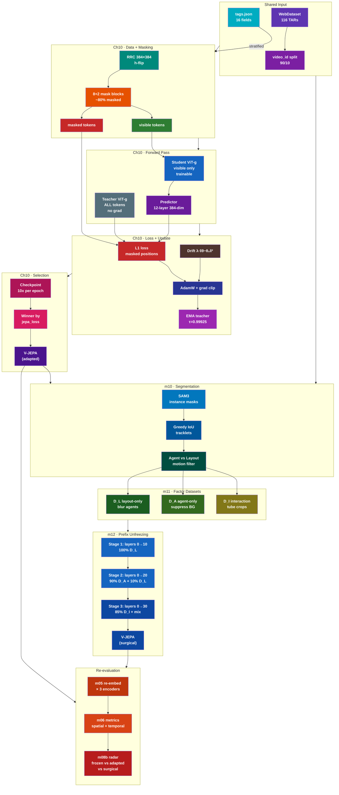
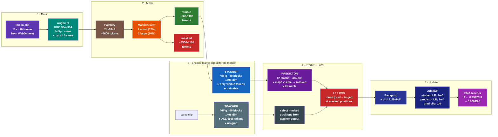
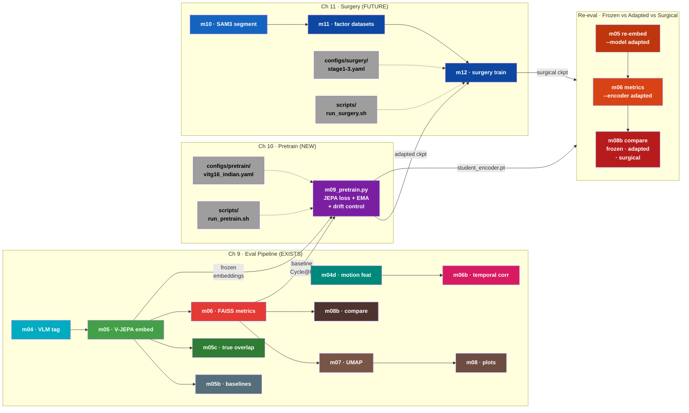
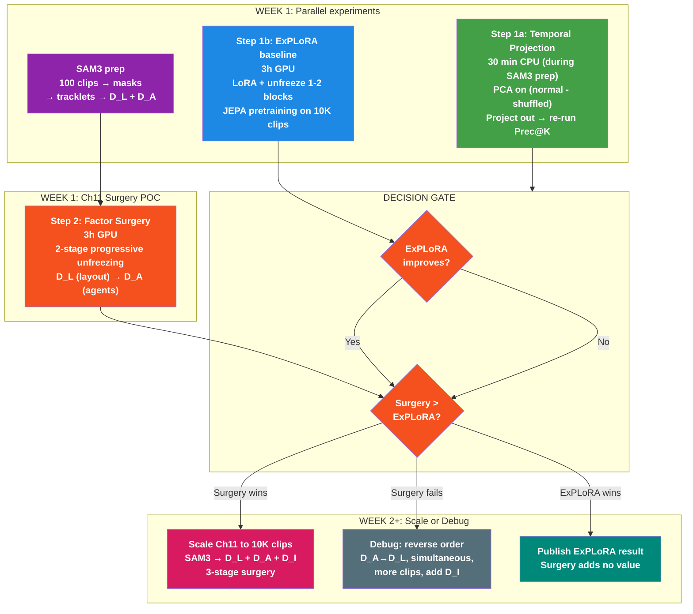

# Training Plan: Ch11 (Surgery Fine-Tuning) + Ch10 (Ablation Comparison)
> **GOAL: Get V-JEPA 2.1 (2B) surgical adaptation to improve Prec@K over frozen baseline on WalkIndia-200K.**
> Ch11 (surgery on frozen) is the PRIMARY path. Ch10 (brute-force) is a paper comparison arm, run LATER.
> Ref: `Literature/proposal/FactorJEPA/FactorJEPA.md` Sections 10-11

---

## System Design: Ch10 + Ch11 Overview



---

## V-JEPA Training: What's Actually Used

PPO/DPO/GRPO are RLHF methods for text-generating LLMs. They are **fundamentally inapplicable** to V-JEPA. V-JEPA is a deterministic encoder (video → embedding), not a generative model. There's no reward signal, no preference pairs, no policy to optimize.

### V-JEPA 2.0 vs 2.1 Training Components

| Component | V-JEPA 2.0 | V-JEPA 2.1 |
|-----------|-----------|-----------|
| **Loss** | L1 latent prediction (masked tokens only) | Dense Predictive Loss (ALL tokens, L1) |
| **Optimizer** | AdamW | AdamW |
| **LR Schedule** | Warmup-constant-cooldown (NOT cosine) | Same |
| **EMA** | Fixed momentum (no ramp-up) | Same |
| **Architecture** | Student-teacher with predictor | Same + deep self-supervision at intermediate layers |

Sources: [V-JEPA 2 (arXiv:2506.09985)](https://arxiv.org/abs/2506.09985), [V-JEPA 2.1 (arXiv:2603.14482)](https://arxiv.org/abs/2603.14482)

---

## Self-Supervised Video Encoder Training Algorithms

| Algorithm | Loss Type | Used By | Negatives? |
|-----------|-----------|---------|------------|
| **JEPA latent prediction (L1)** | Regression in latent space | V-JEPA 2/2.1 | No |
| DINO + iBOT | Cross-entropy (CLS + patch) | DINOv2 | No (EMA teacher) |
| MSE pixel reconstruction | Pixel regression | VideoMAE, MAE | No |
| BYOL | MSE normalized projection | BYOL | No (EMA) |
| InfoNCE / NT-Xent | Contrastive | SimCLR, MoCo | Yes |

---

## Continual Pretraining Approaches (Ch10)

Proposal (Sec 10.3) specifies: same JEPA loss on Indian clips, student-teacher EMA, optional drift control.

Standard approaches in literature:

| # | Approach | How it works | Relevance |
|---|----------|-------------|-----------|
| 1 | **Same SSL loss on new data** | Resume pretraining with JEPA loss on Indian clips | Most direct. V-JEPA 2 itself does stage-wise training (pretrain → post-train). **Our primary approach.** |
| 2 | **EWC (Elastic Weight Consolidation)** | Penalty on important weights from prior training | Prevents catastrophic forgetting. Our drift control (λ·‖θ-θ₀‖²) is equivalent to L2-anchored EWC. |
| 3 | **Knowledge distillation** | Frozen original model as teacher, adapted model matches teacher outputs + learns from new data | Confirmed for CLIP/DINOv2 continual learning. Could supplement JEPA loss. |
| 4 | **LoRA / adapters** | Freeze backbone, train low-rank adapter modules | Reduces trainable params. C-LoRA confirmed for continual vision learning. |
| 5 | **Frozen encoder + new predictor** | Freeze encoder, train only predictor on new data | V-JEPA 2's own action-conditioned post-training uses this. Cheapest option. |

---

## Surgery Fine-Tuning Approaches (Ch11)

Proposal (Sec 11.5) specifies: progressive prefix unfreezing with factor datasets (Layout → Agent → Interaction).

| Stage | Layers Unfrozen | Input | Factor |
|-------|----------------|-------|--------|
| 1 | 0 to n₁ (~25% of L) | 100% D_L (layout-only) | Roads, buildings, wires |
| 2 | 0 to n₂ (~50% of L) | 90% D_A + 10% D_L replay | Vehicles, people, animals |
| 3 | 0 to n₃ (~75% of L) | 85% D_I + 10% D_A + 5% D_L | Agent-agent interactions |

Factor datasets (D_L, D_A, D_I) created via SAM3 segmentation → tracklet mining → agent/layout separation.

---

## Python Packages with JEPA Training Code

| Package | JEPA Support | Status |
|---------|-------------|--------|
| [facebookresearch/vjepa2](https://github.com/facebookresearch/vjepa2) | **YES** — full training configs in `configs/train/vitg16/` | Active, official |
| [facebookresearch/jepa](https://github.com/facebookresearch/jepa) | **YES** — V-JEPA 1 training (`app/vjepa/train.py`) | Active |
| [facebookresearch/eb_jepa](https://github.com/facebookresearch/eb_jepa) | **YES** — lightweight JEPA examples (CIFAR-10, Moving MNIST) | Active (2026) |
| LightlySSL | No JEPA (has BYOL, DINO, SimCLR, MoCo, MAE) | Active |
| solo-learn | No JEPA | Active |
| VISSL | No JEPA | Archived (2024) |

**For Ch10/Ch11**: Use Meta's official `facebookresearch/vjepa2` training code. Configs exist at `configs/train/vitg16/` (2.0) and `configs/train_2_1/vitG16/` (2.1 ablation).

---

## Execution Plan (ordered by priority)

### Step 1: 10K POC — Validate pipeline (DONE ✅)

| Item | Result |
|------|--------|
| Model | V-JEPA 2.0 ViT-g (1B), 1408-dim |
| Data | 10K subset (8,982 train / 1,018 val) |
| Ablation | λ ∈ {0, 0.001, 0.01, 0.1} × 1 epoch each |
| Winner | λ=0.001 (jepa_loss=1.4914, selected by lowest loss) |
| Adapted vs Frozen | Prec@K: 36.14% vs 36.09% (Δ=+0.05%, **noise**) |
| Conclusion | **10K clips insufficient for 1B model adaptation** |

### Step 2a: 115K Full, λ=0.001 — CATASTROPHIC FORGETTING ❌ (2026-04-05)

| Item | Result |
|------|------|
| Model | V-JEPA 2.0 ViT-g (1B), same as POC |
| Data | 115K full corpus (114,576 train / 1K val) |
| Training | 16f, 1 epoch, BS=112, 1023 steps, LR=1e-5, ImageNet norm=YES |
| Eval | 10K POC subset, 64f, BS=44 |
| Lambda | **λ=0.001** |
| JEPA loss | 0.497 → 0.476 (train), best val=1.648 |
| Prec@K | **14.3% adapted vs 36.1% frozen (−21.8pp, significant)** |
| nDCG@K | 0.906 vs 0.950 (−0.045, significant) |
| Diagnosis | λ=0.001 drift penalty (0.00047) is 1000x smaller than JEPA loss (0.476). EWC literature uses λ=10²–10⁹ (arxiv 2505.05946) |
| Full log | `iter/utils/experiment_log.md` |

### Step 2b: λ=100 Ch10 Ablation (PARALLEL, not prerequisite for Ch11)

| Item | Plan |
|------|------|
| Model | V-JEPA 2.0 ViT-g (1B) — same as failed run |
| Data | 115K full corpus, same split |
| Training | 16f, **5 epochs + 1 cooldown**, **LR=1e-6 (constant)**, ImageNet norm=YES |
| Lambda | **λ=100** (100,000x stronger than failed λ=0.001) |
| Anti-forgetting | EWC (FIM-weighted L2) + VICReg variance-covariance |
| Layer freezing | Freeze layers 0-20, train 20-48 only |
| Monitoring | Effective rank + kNN probe → early stop if below frozen baseline |
| Purpose | **Comparison point** — "brute force fails, surgery succeeds" |
| Time | ~6h GPU |

### Step 3: V-JEPA 2.1 (2B) Upgrade — PRIMARY TARGET

V-JEPA 2.1 ViT-G (2B, 1664-dim) is the **primary target model**, not an appendix ablation. Gold standard audit found 2.1's dense loss + deep supervision maximizes spatial feature quality (+23.5 mIoU on ADE20K). Ref: [arXiv:2603.14482](https://arxiv.org/abs/2603.14482)

| Item | V-JEPA 2.0 (current) | V-JEPA 2.1 (target) |
|------|------|------|
| Architecture | ViT-g (1B), standard JEPA | ViT-G (2B), deep self-supervision at 4 intermediate layers |
| Embedding dim | 1408 | 1664 |
| Loss | L1 masked-only | Dense Predictive Loss (ALL tokens, L1) |
| Spatial quality | Baseline | +23.5 mIoU on ADE20K |
| Prerequisite | None | Step 2b validates forgetting control first |

### Step 4: Ch11 Surgery Fine-Tuning — DIRECTLY ON FROZEN

Ch11 runs **directly on the frozen V-JEPA encoder** (no Ch10 prerequisite). See "Key Insight: Ch10 NOT Prerequisite" section below.

---

## Ch10 Training Recipe (from proposal Sec 10.3-10.5, corrected per V-JEPA 2 source)

> **Corrections vs proposal**: V-JEPA 2 source code confirms several differences from the proposal's text. See "Proposal vs V-JEPA 2 Source" table below.

```
1. Load V-JEPA 2 ViT-g checkpoint (student + teacher via deepcopy)
2. Stream Indian clips (uniform by video_id, stratified by v3 taxonomy)
3. Per step:
   a. Decode T frames, resize to 384px (match pretrained resolution)
   b. Apply video-consistent augmentation (RandomResizedCrop, same for all frames)
   c. Sample spatiotemporal masks (8 small blocks @15% + 2 large blocks @70% → ~75-90% total masking)
   d. Student forward on SAME clip (visible tokens only, via masks_enc)
   e. Teacher forward on SAME clip (ALL tokens, no grad) — masks applied post-forward for loss
   f. Predictor maps student features → teacher space at masked positions
   g. L1 loss on masked token predictions + drift control
   h. AdamW step on student + predictor
   i. EMA update teacher: θ̄ ← τ·θ̄ + (1-τ)·θ (τ=0.99925 fixed)
4. Checkpoint every 2K-5K steps
5. Select best checkpoint by Cycle@K (hard mode) on validation subset
```

### Ch10 Single Training Step (V-JEPA 2 JEPA loss, corrected)



### Layman Explanation: How to Visualize and Explain This Diagram

**The exam analogy** — memorize this, use it in meetings:

> Imagine a fill-in-the-blanks exam about Indian street scenes.

**Box 1 (Data):** Take a 10-second clip of a busy Indian junction. Crop it randomly and flip it — this is the exam material.

**Box 2 (Mask):** Chop the video into 4,608 puzzle pieces (24 columns x 24 rows x 8 time slices). Now BLACK OUT 80% of the pieces. The student only sees ~900 pieces; 3,700 are hidden.

**Box 3 (Encode):** Two copies of the same 1-billion-parameter brain look at the SAME video:
- **Student** (blue, trainable): sees only the 900 visible pieces. Must figure out what the hidden pieces look like using only 20% of the information. Uses ALL 1B parameters to do this — nothing is frozen.
- **Teacher** (gray, frozen): sees ALL 4,608 pieces. Holds the answer key. Never learns — just provides correct answers.

**Box 4 (Predict + Loss):** The **Predictor** (purple, small 22M-param translator) converts the student's understanding of 900 visible pieces into guesses for the 3,700 hidden pieces. The **L1 Loss** measures: "how wrong were the guesses vs the teacher's answer key?" Lower = better.

**Box 5 (Update):** Three things happen after each exam:
1. **Backprop + drift control:** Gradients flow through ALL 1B student parameters. The drift term (λ·‖θ-θ₀‖²) penalizes the student for forgetting its original knowledge — like a leash preventing it from wandering too far from home.
2. **AdamW:** Updates the student's brain (all 1B params) and the predictor (22M params).
3. **EMA teacher update:** The teacher's answer key gets SLIGHTLY updated to reflect the student's improved understanding (99.925% old teacher + 0.075% new student). This slow update makes the teacher a stable, smoothed version of the student.

**Key point for meetings:** "This is **continual self-supervised pretraining**, not fine-tuning. ALL 1B parameters receive gradients on every step. The 80% masking creates the learning signal (predict hidden patches), not a parameter restriction. The drift control term is what prevents catastrophic forgetting — it's the leash that keeps the model anchored to its pretrained knowledge while learning Indian scene features."

**Why this is different from fine-tuning:**
- Fine-tuning = train on LABELED data (e.g., "this clip is a market scene"). We have NO labels.
- Pretraining = train on the SELF-SUPERVISED objective (predict masked video patches). The model learns by reconstructing what it can't see.
- The same JEPA loss that Meta used to train V-JEPA from scratch — we just continue it on Indian data.

**Why the teacher matters:**
- Without the teacher, the student could cheat by predicting trivial features (all zeros). The teacher provides a MOVING target — as the student improves, the teacher slowly absorbs those improvements and sets a harder target. This self-distillation is what prevents collapse.

---

### Proposal vs V-JEPA 2 Source (verified via web research, Mar 2026)

| Aspect | Proposal (FactorJEPA.md) says | V-JEPA 2 source (actual) | Impact |
|--------|------------------------------|--------------------------|--------|
| **Loss** | MSE: ‖T̂ − T‖₂² | **L1**: `mean(\|T̂ − T\|^1.0) / 1.0` | Use L1 (loss_exp=1.0) |
| **EMA** | Ramp τ from ~0.996 to ~0.999 | **Fixed** τ=0.99925 | Use fixed momentum |
| **Teacher forward** | Teacher on masked target tokens | Teacher on **ALL tokens** (masks applied post-forward) | Student=masked, Teacher=full |
| **Two views** | Separate context + target views with different augmentations | **Same clip** to both; asymmetry from masking only | No separate view generation needed |
| **Resolution** | 224 or 256 | **384** (vitg-fpc64-**384** pretrained resolution) | Use 384 to match pretrained |
| **Mask ratio** | 15-30% total masked | 15% per-block spatial → **~75-90% total** (8+2 blocks) | Much more aggressive masking |
| **Block count** | 2-6 blocks | **8 small + 2 large = 10** blocks | More blocks than proposal suggested |
| **LR schedule** | Not specified | Warmup-constant-cooldown (for from-scratch) | **Constant** (warmup then flat) — cosine re-warming causes forgetting ([arXiv:2503.02844](https://arxiv.org/abs/2503.02844)) |

---

## Code & Commands (updated April 5, 2026)

### 5-script architecture (no cross-chapter eval dependency)

```bash
# Ch9: Tags + motion features only
./scripts/prep_data.sh --FULL

# Ch10: Training only
./scripts/train_pretrain.sh --FULL

# Embedding: ALL chapters (auto-detects frozen + adapted)
./scripts/run_embed.sh --FULL --local-data data/full_local

# Evaluation: ALL available encoders (auto-detects)
./scripts/run_eval.sh --POC   # 10K fast signal
./scripts/run_eval.sh --FULL  # 115K paper result

# Ch11: Surgical fine-tuning (PLACEHOLDER)
./scripts/train_surgery.sh --FULL
```

### Code Organization

```
src/
├── m00-m08b                 # Ch9 eval pipeline (DONE)
├── m09_pretrain.py          # Ch10 continual pretraining (DONE)
├── m10_sam_segment.py       # Ch11 SAM3 + tracklets (TODO)
├── m10b_interaction_mine.py # Ch11 interaction tube mining (TODO)
├── m10c_factor_patch.py     # Ch11 D_L/D_A/D_I generation (TODO)
└── utils/

configs/
├── pipeline.yaml            # Shared: batch sizes, clip limits, eval params
├── pretrain/
│   └── vitg16_indian.yaml   # Ch10 training hyperparameters
└── surgery/                 # Ch11 (TODO)
    ├── stage1_layout.yaml
    ├── stage2_agent.yaml
    └── stage3_interaction.yaml

scripts/
├── prep_data.sh             # Ch9: m04(tags) + m04d(motion)
├── train_pretrain.sh        # Ch10: m09 training only
├── train_surgery.sh         # Ch11 (PLACEHOLDER)
├── run_embed.sh             # ALL: m05/m05b embedding
└── run_eval.sh              # ALL: m06→m08b evaluation
```

---

## Ch11 Implementation Status

### Novelty: why this combination is new

| Component | Exists separately? | Combined for video SSL? |
|---|---|---|
| Progressive prefix unfreezing | AutoProg (CVPR 2022) — images only | **NO** |
| Factor-decomposed video inputs (layout/agent/interaction) | Sparse-Tuning (token-level, not spatial) | **NO** |
| Self-supervised V-JEPA loss | facebookresearch/vjepa2 | **NO** |

**FactorJEPA's novelty = the combination.** No existing repo implements progressive layer unfreezing × factor-patched inputs × JEPA self-supervised loss on video.

### What's needed vs what exists

| Proposal Section | What's needed | Status |
|---|---|---|
| 11.1 SAM segmentation | `m10_sam_segment.py`: SAM3 → masks → tracklets → agent/layout | NOT STARTED |
| 11.1 Agent vs layout | Motion-based filter on tracklets | NOT STARTED |
| 11.1 Derived datasets | D_L (layout-only), D_A (agent-only), D_I (interaction) | NOT STARTED |
| 11.2 Interaction mining | `m10b_interaction_mine.py`: tracklet pairs → distance/persistence → tubes | NOT STARTED |
| 11.3 Factor patch operators | `m10c_factor_patch.py`: P_L (blur agents), P_A (suppress BG), P_I (crop) | NOT STARTED |
| 11.3 Interaction perturbations | Tube jitter, margin randomization, raw/masked mixing | NOT STARTED |
| 11.4 Training objective | Same V-JEPA loss (student-teacher, EMA, predictor) | **REUSE m09** ✅ |
| 11.5 Progressive prefix unfreezing | `requires_grad=False` for layers > n_s, rebuild optimizer | NOT STARTED |
| 11.5 Stage schedule | 3 stages: n1=0.25L, n2=0.50L, n3=0.75L | NOT STARTED |
| 11.5 Layer-wise LR decay | Smaller LR for earlier unfrozen layers | NOT STARTED |
| 11.6 Stage-wise training loop | Per-stage init + warmup | NOT STARTED |
| 11.8 Factor-sliced evaluation | Query with D_L, D_A, D_I separately | NOT STARTED |
| 11.8 Patch shortcut sanity check | Eval raw vs patched clips | NOT STARTED |
| `run_surgery.sh` | Full pipeline orchestration | PLACEHOLDER |

### What CAN be reused from Ch10

| Component | Reusable? |
|---|---|
| V-JEPA loss (student-teacher-predictor) | YES — identical |
| EMA teacher update | YES |
| Masking (8 small + 2 large blocks) | YES |
| Augmentation (crop + flip + ImageNet normalize) | YES |
| Embedding extraction (m05 at 64f) | YES |
| Evaluation suite (run_eval.sh) | YES + new factor-sliced queries |
| Checkpoint/resume | YES |

### Module Pipeline: Ch9 (eval) → Ch10 (pretrain) → Ch11 (surgery) → Re-eval



---

## Lambda Ablation: Drift Control Sweep

Drift control λ trades off adaptation (learning Indian-domain features) vs retention (preserving pretrained knowledge).

### 10K POC Results (actual, 2026-03-29)

| Lambda | JEPA Loss (1 epoch) | Strategy | Winner? |
|--------|:---:|----------|:---:|
| 0 | 1.5531 | No anchor — max adaptation | |
| **0.001** | **1.4914** (5 epochs) | Gentle anchor | **✓** |
| 0.01 | 1.5483 | Balanced | |
| 0.1 | 1.5314 | Strong anchor | |

**Finding:** All 4 lambdas produce nearly identical JEPA loss after 1 epoch (within noise). Drift control only differentiates over multiple epochs. Winner selected by lowest `jepa_loss` from `training_summary.json`.

### Adapted vs Frozen (10K POC, λ=0.001, 5 epochs)

| Metric | Frozen | Adapted | Delta | Verdict |
|--------|:---:|:---:|:---:|:---:|
| Prec@K (Easy) | 36.09% | 36.14% | +0.05% | Noise |
| Cycle@K (Easy) | 76.01% | 75.31% | -0.70% | Slight regression |
| mAP@K | 0.2778 | 0.2779 | +0.0001 | No change |
| Prec@K (Hard) | 34.70% | 34.70% | 0.00% | Identical |
| Cycle@K (Hard) | 73.56% | 72.97% | -0.59% | Slight regression |

**Conclusion:** 10K clips (8,982 train) produce zero meaningful adaptation on a 1B model. The POC "close to frozen" result was a **false positive** — JEPA loss=1.49 because ImageNet normalization was missing, so training was ineffective and model stayed near frozen.

### 115K FULL Results (actual, 2026-04-05) — CATASTROPHIC FORGETTING

| Lambda | Train clips | JEPA Loss | Drift Loss | Prec@K (adapted) | Prec@K (frozen) | Verdict |
|--------|:---:|:---:|:---:|:---:|:---:|:---:|
| **0.001** | 114,576 | 0.476 | 0.00047 | **14.3%** | 36.1% | **−21.8pp, random-level** |

**Diagnosis**: λ=0.001 drift penalty is 1000x smaller than JEPA loss — effectively zero regularization. EWC literature uses λ=10²–10⁹ (arxiv 2505.05946). Training was real this time (ImageNet norm fixed, loss dropped to 0.476 vs 1.49 in POC), but the JEPA loss overwrote spatial features without constraint.

**Next sweep**: λ ∈ {1.0, 10.0, 100.0}. See `iter/utils/experiment_log.md` for full HP details.

---

## Gold Standard Audit Fixes (12 Discrepancies Found)

Audit of m09_pretrain.py against V-JEPA 2/2.1 source code and literature (2026-04-10). All CRITICAL/HIGH items must be fixed before next run.

| # | Current | Fix to | Severity | Ref |
|---|---------|--------|----------|-----|
| 1 | Cosine LR decay to 1e-7 | **Constant** (warmup then flat) | CRITICAL | [arXiv:2503.02844](https://arxiv.org/abs/2503.02844) |
| 2 | V-JEPA 2.0 (1B, 1408d) | **V-JEPA 2.1 (2B, 1664d)** | CRITICAL | [arXiv:2603.14482](https://arxiv.org/abs/2603.14482) |
| 3 | Masked-only L1 loss | **Dense loss (all tokens)** | CRITICAL | V-JEPA 2.1 paper |
| 4 | Final layer supervision | **4-layer deep supervision** | CRITICAL | V-JEPA 2.1 paper |
| 5 | grad_clip=1.0 | **10.0 or remove** | MODERATE | V-JEPA 1/2 configs |
| 6 | 1 epoch | **5 epochs + 1 cooldown** | HIGH | [arXiv:2406.14833](https://arxiv.org/abs/2406.14833) |
| 7 | All layers trainable | **Freeze 0-20, train 20-48** | HIGH | [arXiv:2509.10156](https://arxiv.org/abs/2509.10156) |
| 8 | No cooldown phase | **Epoch 6: 64f, linear LR decay** (matches eval frame count) | HIGH | V-JEPA 2 cooldown config |
| 9 | Predictor LR 10x encoder | **Ablate: 10x vs 1x** (predictor = retention mechanism) | HIGH | [arXiv:2311.13321](https://arxiv.org/abs/2311.13321) |
| 10 | Teacher layer_norm missing | **Fixed** | FIXED | V-JEPA 2 train.py line 432 |
| 11 | Uniform L2 drift control | **EWC with FIM-weighted L2** | HIGH | [arXiv:2210.16365](https://arxiv.org/abs/2210.16365), [arXiv:2603.18596](https://arxiv.org/abs/2603.18596) |
| 12 | No collapse prevention | **VICReg variance-covariance term** | HIGH | [arXiv:2410.19560](https://arxiv.org/abs/2410.19560) |

---

## Updated Training Recipe (post-audit)

### Architecture: V-JEPA 2.1 ViT-G (2B)

1. Use V-JEPA 2.1 ViT-G (2B, 1664-dim) — strongest model, best spatial features (+23.5 mIoU on ADE20K), maximizes ceiling
2. V-JEPA 2.1's **dense loss** (loss on ALL tokens, not just masked) — the reason 2.1 is better at spatial tasks
3. V-JEPA 2.1's **deep self-supervision** (4-layer loss, not just final layer) — supervision throughout network depth
4. Pipeline changes: `VJEPA_EMBEDDING_DIM = 1664`, FAISS is dim-agnostic, m06/m07/m08 read shape dynamically

Ref: [V-JEPA 2.1 (arXiv:2603.14482)](https://arxiv.org/abs/2603.14482)

### Hyperparameters (corrected vs failed run)

| Param | Old (failed, λ=0.001) | New | Ref |
|-------|----------------------|-----|-----|
| Lambda | 0.001 | **[10, 100, 1000]** | [EWC](https://arxiv.org/abs/1612.00796), [EWC Done Right](https://arxiv.org/abs/2603.18596) |
| LR schedule | Cosine decay | **Constant** (warmup then flat) | [arXiv:2503.02844](https://arxiv.org/abs/2503.02844) |
| Encoder LR | 1e-5 | **1e-6** (10x smaller) | |
| Predictor LR | 1e-4 | **1e-5** (10x encoder) | |
| Layer freezing | All trainable | **Freeze 0-20, train 20-48** | [arXiv:2509.10156](https://arxiv.org/abs/2509.10156) |
| Epochs | 1 | **5 + 1 cooldown** | [arXiv:2406.14833](https://arxiv.org/abs/2406.14833) |
| Grad clip | 1.0 | **10.0** | V-JEPA 1/2 configs |

---

## Anti-Forgetting: Beyond Simple L2 Drift

### EWC with Fisher Information Matrix

Replace uniform L2 drift with FIM-weighted L2. Anchors important weights strongly, lets unimportant weights adapt freely. One-time FIM computation on frozen model (~30 min). Proven for SSL+ViT.

Refs: [EWC for SSL](https://arxiv.org/abs/2210.16365), [EWC Done Right](https://arxiv.org/abs/2603.18596) (fixes FIM gradient vanishing pitfall)

### VICReg Variance-Covariance Regularization

Add variance term to JEPA loss. Explicitly prevents dimensional collapse (our λ=0.001 run collapsed to random-level Prec@K=14.3%).

Refs: [C-JEPA](https://arxiv.org/abs/2410.19560), [VJ-VCR](https://arxiv.org/abs/2412.10925)

---

## Monitoring & Early Stopping Triggers

All implemented as EARLY STOPPING TRIGGERS, not just logging.

| Monitor | Metric | Stop condition | Ref |
|---------|--------|---------------|-----|
| Drift loss magnitude | drift_loss vs JEPA_loss ratio | drift_loss << JEPA_loss → forgetting | [EWC](https://arxiv.org/abs/1612.00796) |
| Embedding effective rank | Eigenvalue spectrum of covariance | Rank drops below frozen baseline | [arXiv:2110.09348](https://arxiv.org/abs/2110.09348) |
| kNN probe (1K val) | kNN accuracy on scene_type | Accuracy drops below frozen baseline | Direct Prec@K proxy |
| Val JEPA loss | Train-val divergence | Use kNN probe as real signal (SSL loss ≠ downstream) | [arXiv:2210.14199](https://arxiv.org/abs/2210.14199) |

---

## Key Insight: Ch10 is NOT a Prerequisite for Ch11

Ch11's novelty = factor-decomposed inputs + progressive prefix unfreezing using the SAME JEPA loss. This runs **directly on the frozen encoder**. Ch10's adapted checkpoint is not needed.

**Skipping Ch10 makes Ch11's result STRONGER:**

| Approach | What it proves | Paper strength |
|---|---|---|
| Ch10 → Ch11 | "Surgery improves an already-adapted model" | Weak — readers ask "was it Ch10 or Ch11?" |
| **Ch11 directly on frozen** | "Surgery alone fixes what brute-force couldn't" | Strong — clean attribution |
| **Ch11 on frozen + Ch10 as ablation** | "Surgery works AND outperforms brute force" | Strongest — both results |

**Literature supports skipping Ch10:**
- ULMFiT (Howard & Ruder, 2018) — progressive unfreezing directly on pretrained LM
- ExPLoRA ([arXiv:2406.10973](https://arxiv.org/abs/2406.10973), ICML 2025) — LoRA + 2-block unfreezing directly on frozen DINOv2
- LayerLock ([arXiv:2509.10156](https://arxiv.org/abs/2509.10156), ICCV 2025) — progressive freezing during pretraining

| | Skip Ch10 (Ch11 on frozen) | Do Ch10 first |
|---|---|---|
| Time to first result | **Days** | Weeks |
| Attribution | Clean | Confounded |
| Risk | If Ch11 fails, no fallback | Warmer starting point |
| Narrative | "Brute force fails, surgery succeeds" — **strong contrast** | "We pretrained, then refined" — incremental |
| Compute | ~20h | ~100h |
| NeurIPS deadline | Feasible in 3 weeks | Very tight |

**Novel contribution:** No paper addresses JEPA catastrophic forgetting — open research gap. Publishable regardless of result.

---

## Experiment Flow (V-JEPA 2.1, Ch11 Surgery vs ExPLoRA)



---

## Updated Execution Order (updated 2026-04-11)

All experiments use **V-JEPA 2.1 (2B, 1664-dim)**. No V-JEPA 2.0. No Ch10 in Week 1. No generalization to other datasets.

### WEEK 1: Surgery POC vs ExPLoRA baseline

```
Step 1a [30 min CPU, parallel]:  Temporal interference projection
  → PCA on (normal_embedding - shuffled_embedding) for 10K clips
  → Project V-JEPA 2.1 embeddings orthogonal to top components
  → Re-run Prec@K — diagnostic only, paper novelty if it works

Step 1b [3h GPU, parallel]:  ExPLoRA baseline on V-JEPA 2.1
  → Freeze all blocks except 0-1, LoRA (rank 8-16) on rest
  → JEPA pretraining on 10K Indian clips
  → Sets the bar that Ch11 surgery must beat

SAM3 prep [parallel with 1a/1b]:
  → SAM3 on 100 clips → instance masks → tracklets
  → Agent vs layout separation (motion filter)
  → Generate D_L (layout-only) + D_A (agent-only)

Step 2 [3h GPU]:  Ch11 factor surgery POC on frozen V-JEPA 2.1
  → 2-stage progressive prefix unfreezing (simplified: D_L then D_A, skip D_I)
  → Stage 1: unfreeze 0→25%L, train on D_L
  → Stage 2: unfreeze 0→50%L, train on 90% D_A + 10% D_L replay
  → Compare: frozen vs ExPLoRA vs Ch11-surgery
  → THE KEY QUESTION: does factor decomposition beat ExPLoRA?
```

### WEEK 1 Decision Gate

| Step 1a projection | Step 1b ExPLoRA | Step 2 Surgery | Action |
|---|---|---|---|
| Prec@K jumps | ExPLoRA improves | Surgery > ExPLoRA | **Strongest: projection + surgery wins** |
| Any | ExPLoRA improves | Surgery = ExPLoRA | **Publish ExPLoRA, surgery adds no value** |
| Any | No change | Surgery improves | **Best novelty: standard fails, surgery succeeds** |
| Any | ExPLoRA improves | Surgery < ExPLoRA | **Publish ExPLoRA, drop surgery** |
| Any | No change | No change | **Debug: reverse order, simultaneous factors, more clips** |

### If Surgery fails: debug sequence (before giving up)

1. Reverse order: D_A → D_L (agents first — most visually different)
2. All factors simultaneously (no ordering) — tests if factor decomposition itself helps
3. Add D_I (interactions) — full 3-stage from proposal Sec 11.5
4. More clips (1K instead of 100)

### WEEK 2+: Scale or write (conditional on Week 1)

```
IF Surgery > ExPLoRA:
  → Scale Ch11 to 10K clips: SAM3 → D_L + D_A + D_I → 3-stage surgery
  → Add Ch10 λ=100 as comparison arm (paper narrative: brute force vs surgery)
  → Target: statistically significant Prec@K improvement with 95% CI

IF ExPLoRA wins:
  → Publish ExPLoRA-on-V-JEPA-2.1 result
  → Surgery becomes an ablation showing it doesn't add value

IF nothing works:
  → Submit Ch9 diagnostic + temporal interference finding as standalone paper
```

---

## Research Papers: JEPA Family (48 found, 12 most relevant)

### Tier 1: Directly applicable

| Paper | arXiv | Technique | Why it matters |
|---|---|---|---|
| Drive-JEPA | [2601.22032](https://arxiv.org/abs/2601.22032) | V-JEPA continued SSL on driving video | Exact precedent — adjusted BS, WD, LR |
| Surgical V-JEPA | [2509.06831](https://arxiv.org/abs/2509.06831) | V-JEPA continued SSL on surgical video | Validates domain adaptation via continued SSL |
| Beyond Cosine Decay | [2503.02844](https://arxiv.org/abs/2503.02844) | Infinite/constant LR > cosine re-warming | Cosine re-warming causes forgetting |
| LayerLock (ICCV 2025) | [2509.10156](https://arxiv.org/abs/2509.10156) | Progressive freezing for video ViT (4B) | ViT layers converge in depth order |
| EWC for SSL (NeurIPS 2022 WS) | [2210.16365](https://arxiv.org/abs/2210.16365) | EWC works with SSL + ViT | Pre-computed FIM released |

### Tier 2: Informs design

| Paper | arXiv | Technique | Key insight |
|---|---|---|---|
| EWC Done Right | [2603.18596](https://arxiv.org/abs/2603.18596) | FIM gradient vanishing fix | Must read before using EWC |
| JEPA Implicit Bias (NeurIPS 2024) | [2407.03475](https://arxiv.org/abs/2407.03475) | Deeper predictor = robust features | Predictor depth matters |
| Revisiting Supervision (ECCV 2024) | [2311.13321](https://arxiv.org/abs/2311.13321) | MLP projector = retention mechanism | Predictor LR matters for forgetting |
| C-JEPA (NeurIPS 2024) | [2410.19560](https://arxiv.org/abs/2410.19560) | VICReg regularization for JEPA | Prevents collapse during domain shift |
| VJ-VCR | [2412.10925](https://arxiv.org/abs/2412.10925) | Variance-covariance reg for video JEPA | Same setting as ours |
| Stability Gap | [2406.14833](https://arxiv.org/abs/2406.14833) | Multi-epoch > 1 epoch | Recovery requires consolidation time |

### Anti-Forgetting

| Paper | arXiv | Technique |
|---|---|---|
| EWC (original) | [1612.00796](https://arxiv.org/abs/1612.00796) | Fisher Information anchoring |
| GEM | [1706.08840](https://arxiv.org/abs/1706.08840) | Backward Transfer metric + gradient projection |
| Real-time Forgetting Detection | [2512.20634](https://arxiv.org/abs/2512.20634) | Shallow/deep alignment (86-90% accuracy) |
| Dimensional Collapse | [2110.09348](https://arxiv.org/abs/2110.09348) | Effective rank monitoring |
| Same Loss Better Downstream (ICML 2023) | [2210.14199](https://arxiv.org/abs/2210.14199) | SSL loss ≠ downstream. Flatness matters. |
| Progressive SSL Freezing | [2303.07477](https://arxiv.org/abs/2303.07477) | Freeze correlated layers, -1-2% forgetting |

### Transfer Learning (fallback if full-param fails)

| Paper | arXiv | Technique | Forgetting risk |
|---|---|---|---|
| LoRA | [2106.09685](https://arxiv.org/abs/2106.09685) | Low-rank adaptation (~0.1% params) | Near-zero |
| BitFit | [2106.10199](https://arxiv.org/abs/2106.10199) | Bias-only tuning (~0.1% params) | Near-zero |
| Fine-Tuning Distorts | [2202.10054](https://arxiv.org/abs/2202.10054) | Head re-initialization | Low |
| Soft Masking CL | [2302.03241](https://arxiv.org/abs/2302.03241) | Data mixing for continual pretraining | Low |
| Domain-Specific Adapters | [2504.08613](https://arxiv.org/abs/2504.08613) | ViT adapters for domain CL | Low |
| Bayesian Checkpoint Selection | [2410.05612](https://arxiv.org/abs/2410.05612) | Checkpoint quality without labels | N/A (monitoring) |
| Future of CL (survey) | [2506.03320](https://arxiv.org/abs/2506.03320) | SSL = softer updates = less forgetting | N/A (survey) |

### V-JEPA Architecture

| Paper | arXiv | Technique |
|---|---|---|
| V-JEPA (original) | [2404.08471](https://arxiv.org/abs/2404.08471) | Feature prediction in latent space from video |
| V-JEPA 2 | [2506.09985](https://arxiv.org/abs/2506.09985) | 1M+ hours, ViT-G, JEPA + EMA |
| V-JEPA 2.1 | [2603.14482](https://arxiv.org/abs/2603.14482) | Dense loss + deep supervision + 2B model |
| I-JEPA (CVPR 2023) | [2301.08243](https://arxiv.org/abs/2301.08243) | Image JEPA, predictor depth study |

### Techniques Ranked by Expected Impact (with strict goal)

| # | Technique | Impact | Implement? |
|---|---|---|---|
| 1 | V-JEPA 2.1 (2B, dense loss, deep supervision) | CRITICAL | YES |
| 2 | λ = [10, 100, 1000] | CRITICAL | YES |
| 3 | Constant LR (not cosine) | CRITICAL | YES |
| 4 | EWC with FIM (not uniform L2) | HIGH | YES |
| 5 | VICReg variance-covariance | HIGH | YES |
| 6 | Progressive freezing (layers 0-20) | HIGH | YES |
| 7 | 5 epochs + cooldown | HIGH | YES |
| 8 | Effective rank early stopping | HIGH | YES |
| 9 | kNN probe early stopping | HIGH | YES |
| 10 | Predictor LR ablation (10x vs 1x) | MEDIUM | YES |
| 11 | LoRA (fallback) | MEDIUM | IF NEEDED |
| 12 | BitFit (fallback) | LOW | IF NEEDED |

---

## Idea Critic: 7-Dimension Evaluation (Reframed: Temporal Interference Paper)

**Framing:** Temporal interference discovery (Ch9) = the insight. Temporal projection + FactorJEPA surgery (Ch11 on frozen) = the method. Ch10 = ablation comparison.

| # | Dimension | Score | Assessment |
|---|-----------|-------|-----------|
| 1 | **Novelty** | MONTHS (unique combo) | "Temporal encoding corrupts spatial features on OOD data" — no prior work identifies this. Frame shuffling as diagnostic tool is novel. Temporal interference projection is 10 lines of NumPy. Factor-decomposed JEPA surgery is a unique combination. |
| 2 | **Impact** | HIGH | General finding applicable to ANY video foundation model on ANY OOD domain. Not India-specific. Scientific depth: diagnosis + theory + method. |
| 3 | **Timing** | WELL-TIMED | V-JEPA 2.1 just dropped. Geographic bias is hot. Window open but closing. |
| 4 | **Feasibility** | HIGH | Day 1 experiments are CPU-only (30 min + 1h). Ch11 POC = 3h GPU on 100 clips. No Ch10 prerequisite. Feasibility dramatically improved by skipping Ch10 and starting with cheap experiments. |
| 5 | **Competitive** | OPEN | No one doing temporal interference analysis on video SSL. Risk: Meta at 100x scale. Advantage: dataset + diagnostic finding + general theory. |
| 6 | **Nugget** | CLEAR | "Video foundation models suffer temporal interference — temporal features learned from training-domain motion statistics corrupt spatial representations on OOD data. We diagnose it via frame shuffling, remove it via subspace projection, and prevent it via factor-decomposed surgical fine-tuning." |
| 7 | **Narrative** | COMPELLING | (1) Western model fails on India, (2) shuffling IMPROVES results → temporal features are the problem, (3) project out temporal subspace → instant recovery, (4) FactorJEPA surgery prevents it permanently, (5) generalizes to driving + sports + medical. |

### Verdict: PURSUE (upgraded from REFINE)

Temporal interference framing makes this a general contribution, not a dataset paper. Feasibility dramatically improved by skipping Ch10 prerequisite and starting with cheap CPU experiments. No paper addresses JEPA catastrophic forgetting — open research gap, publishable regardless of result.

### Critical Validation (Week 1 — cheap experiments first)

See "Updated Execution Order" section above for the full week-by-week plan.

**Day 1 (CPU):** Temporal interference projection (30 min) + encoder fusion (1h)
**Day 2 (GPU):** Ch11 factor POC directly on frozen (3h)
**Day 3 (GPU):** λ=100 as parallel ablation (6h)
**Day 4-5 (CPU):** Generalize shuffled finding to BDD100K + Diving48

### Decision Tree (updated 2026-04-11)

- Surgery > ExPLoRA + projection works → **Strongest NeurIPS: 3 contributions**
- Surgery > ExPLoRA → **Strong NeurIPS: factor surgery beats SOTA adaptation**
- ExPLoRA improves, surgery = ExPLoRA → **Publish ExPLoRA-on-V-JEPA-2.1, surgery as ablation**
- Nothing improves Prec@K → **Submit Ch9 diagnostic + temporal interference finding**

---

## Best Paper Strategy (Brainstormer Reframing)

### The One-Sentence Paper

> "Video foundation models trained on Western data suffer from temporal interference — temporal features learned from Western motion statistics actively corrupt spatial representations on out-of-distribution domains — and we show that this interference can be diagnosed via frame shuffling, removed via subspace projection, and prevented via factor-decomposed surgical fine-tuning."

### Why the Current Proposal Won't Win Best Paper

Best Papers at NeurIPS share three traits: (1) a **surprising, general insight**, (2) a **simple, elegant method** that follows from the insight, (3) **thorough experiments** that prove generality beyond one dataset.

Current proposal has trait (1) buried in Ch9, lacks trait (2) because Ch10+Ch11 is a 12-variable kitchen sink, and lacks trait (3) because everything is on one dataset.

### Key Reframing

> V-JEPA's spatial features for Indian scenes are NOT missing — they're being CORRUPTED by temporal features. The shuffled > normal result proves this. The fix should REMOVE the corruption, not RETRAIN the whole model.

| | Current Proposal | Best Paper Version |
|---|---|---|
| **Title** | "FactorJEPA: Factor-Decomposed Surgical Fine-Tuning" | "Temporal Interference in Video Foundation Models: Diagnosis, Theory, and Surgery" |
| **Insight** | "Indian streets need domain adaptation" (specific) | "Temporal encoding actively corrupts spatial features when motion statistics shift" (general) |
| **Method** | 12-variable training recipe | Temporal interference projection (10 lines NumPy) + FactorJEPA when projection isn't enough |
| **Scope** | Indian streets only | Any domain where motion statistics differ from training |
| **Generality** | None tested | Test on driving (BDD100K), sports (Diving48), medical (surgical) |

### Restructured Paper: 5 Contributions

**Contribution 1 (Ch9): Diagnosis — The Temporal Interference Discovery**
- Shuffled V-JEPA > normal V-JEPA by 2.4x on Indian streets
- NOT a dataset bug — evidence of a systematic failure mode
- **Generalize:** test shuffled vs normal on 2-3 other OOD domains. If shuffling helps on ALL → general phenomenon, not a quirk of Indian data.

**Contribution 2 (NEW): Theory — The Temporal Interference Subspace**
- PCA on (normal_embedding - shuffled_embedding) for 10K clips
- Top principal components = the temporal interference subspace
- Project embeddings orthogonally → measure Prec@K recovery
- **30-minute CPU experiment that could be the paper's centerpiece**
- If it works: "We identify and remove the temporal interference subspace, recovering X% Prec@K with zero retraining"

**Contribution 3 (Ch10): Baseline — Continual Pretraining (What Doesn't Work)**
- Naive continual pretraining → catastrophic forgetting
- EWC + proper λ prevents forgetting but doesn't improve spatial features
- The "negative result that motivates the real solution"

**Contribution 4 (Ch11): Method — FactorJEPA (What Does Work)**
- Factor decomposition into layout/agent/interaction via SAM3
- Progressive prefix unfreezing
- Same JEPA loss — only input distribution and trainable depth change
- Key comparison: Ch10 (brute force) vs Ch11 (surgical) on same loss curve

**Contribution 5 (NEW): The Complementary Strengths Result**
- V-JEPA dominates temporal (Cycle@K 78.7%), DINOv2 dominates spatial (Prec@K 50.5%)
- Weighted fusion alpha*V-JEPA + (1-alpha)*DINOv2 outperforms both on ALL metrics
- 1-hour experiment, publishable baseline

### References from Brainstormer

| Paper | arXiv | Relevance |
|---|---|---|
| Drift-Adapter (EMNLP 2025) | [2509.23471](https://arxiv.org/abs/2509.23471) | Affine map between embedding spaces, 95-99% recall recovery |
| Representation Surgery (ICML 2024) | [2402.09631](https://arxiv.org/abs/2402.09631) | Optimal affine steering to remove harmful subspaces |
| ExPLoRA (ICML 2025) | [2406.10973](https://arxiv.org/abs/2406.10973) | LoRA + 2-block unfreezing for DINOv2 domain adaptation |
| Difference-Masking (EMNLP 2023) | [2305.14577](https://arxiv.org/abs/2305.14577) | Preferentially mask domain-specific regions during pretraining |
| Temporal vs Spatial (arXiv) | [2509.21595](https://arxiv.org/abs/2509.21595) | Confirms DINOv3 > V-JEPA spatial tradeoff independently |
