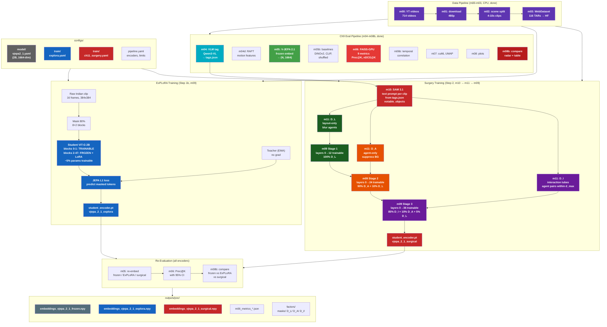
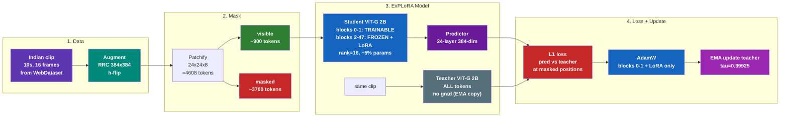
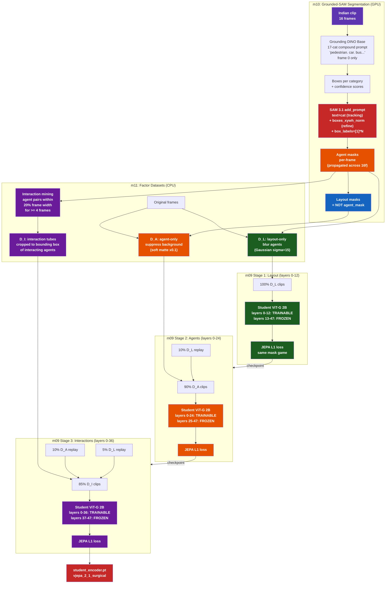
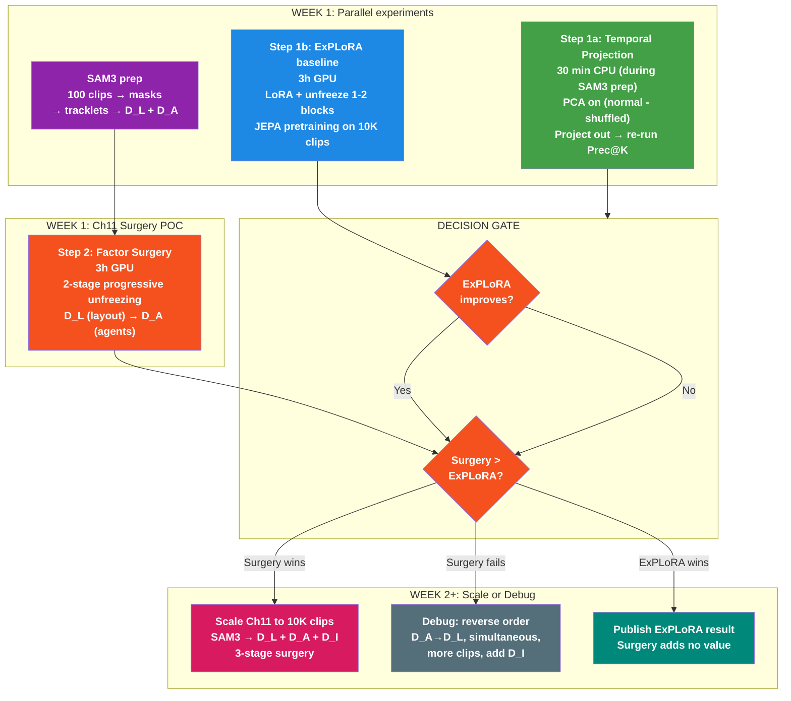

# Training Plan: Ch11 (Surgery Fine-Tuning) + Ch10 (Ablation Comparison)
> **GOAL: Get V-JEPA 2.1 (2B) surgical adaptation to improve Prec@K over frozen baseline on WalkIndia-200K.**
> Ch11 (surgery on frozen) is the PRIMARY path. Ch10 (brute-force) is a paper comparison arm, run LATER.
> Ref: `Literature/proposal/FactorJEPA/FactorJEPA.md` Sections 10-11
> **If surgery doesn't improve metrics:** See `iter/utils/literarure_survey.md` — 24 JEPA variants surveyed. Top fallback techniques: SIGReg regularizer (LeJEPA, replaces EMA), leakage-free factor training (VLA-JEPA), temporal straightening diagnostic (LeWorldModel).

## 🟢 Status (2026-04-15): m10/m11 upstream pipeline validated on dense100

- **m10** (Grounded-SAM): HF `Sam3TrackerVideoModel` @ **11 s/clip** (4.21× faster than raw sam3 pkg) → FULL 115K ETA **14.7 days on 24GB, 3.7 days on 96GB**.
- **m11** (factor datasets): D_L/D_A/D_I at 100/94/91 on 100 clips; **8723 bbox-adaptive D_I tubes** (+228 % vs fixed centroid squares).
- **Deadline fit**: upstream no longer on critical path. Remaining budget (~20 GPU-h) flows to Steps C/D/E (m05 frozen → m09 ExPLoRA → m09 Surgery) + Phase 3 ablations.
- **Decision gate unchanged**: POC (100 dense clips) → if Surgery > Frozen on Prec@K with 95 % CI, scale to FULL 115K. If not, follow fallback ladder in `literature_survey.md`.

---

## System Design: Full Pipeline (m00 → m11 → eval)

**Layman story (full pipeline):** Imagine building a map of every street in India for a self-driving car that only knows American roads.

1. **Data (purple, top):** You record 714 walking tour videos across Indian cities, chop them into 115K short clips (10 seconds each), and upload to a cloud dataset.

2. **Eval (teal/green/red, left):** A robot VLM watches each clip and tags it: "market, day, crowded, auto-rickshaw, sacred cow." Then V-JEPA 2.1 (the American-trained brain) converts each clip into a 1664-number fingerprint. FAISS finds which clips have similar fingerprints. If "market" clips cluster together → the brain understands markets. If not → it's confused.

3. **ExPLoRA (blue, middle):** Bolt tiny adapter modules (LoRA) onto the frozen brain. Only 5% of parameters change. Show it Indian clips, same fill-in-the-blanks game as V-JEPA's original training. Quick and cheap (~1 hour). This is the BASELINE TO BEAT.

4. **Surgery (red, middle-right):** THE EXPERIMENT.
   - **m10 (SAM 3.1):** An AI eye surgeon (SAM 3.1) looks at each clip's tags ("auto_rickshaw, pedestrian") and cuts the video into: roads-only (D_L), people-only (D_A), and interactions (D_I — a pedestrian crossing in front of an auto-rickshaw).
   - **m11:** Generates the 3 patched versions of each clip.
   - **m09 (3 stages):** Teaches the brain in order: first roads (layers 0-12), then people (layers 0-24), then interactions (layers 0-36). Each stage unlocks deeper layers. Earlier concepts are replayed to prevent forgetting.

5. **Re-eval (bottom):** Re-run the fingerprint + FAISS test on all 3 brains (frozen, ExPLoRA, surgical). The winner: whichever brain makes the best "market" clusters.

---

## System Design: ExPLoRA (Step 1b)

**Layman story (ExPLoRA):** A fill-in-the-blanks exam on Indian streets. The brain is FROZEN except for 2 "input processing" blocks and tiny LoRA adapters (~5% of total parameters). The student sees 20% of each video and guesses the hidden 80%. The teacher holds the answer key. Only the adapters and 2 blocks learn — like learning a new accent without forgetting the language. Cheap (~20 min on 1K clips), proven (+8% on satellite imagery).

---

## System Design: Surgery (Step 2) — THE PAPER NOVELTY

> **2026-04-14 update:** m10 architecture pivoted to **Grounded-SAM (Path D)** — Grounding DINO open-vocab box detection on frame 0 + SAM 3.1 text-tracked + box-refined propagation across 16 frames. Replaces the original SAM 3.1 native text grounding which failed on Indian objects (10/15 clips wrong/missing masks). Fixed 17-category agent taxonomy in `configs/train/ch11_surgery.yaml > factor_datasets.grounding_dino.agent_taxonomy` replaces per-clip VLM `notable_objects`. See `errors_N_fixes.md` #20-27 for pivot history.

**Layman story (Surgery):** Teaching a foreign doctor to work in an Indian hospital — in 3 stages:

**Stage 1 — Layout (green):** Show the doctor ONLY the hospital — walls, floor, equipment, wiring. No patients, no staff. Blur out all people. The doctor's "early visual processing" (layers 0-12) learns Indian infrastructure — narrow lanes, overhead wires, speed breakers, open drains. The rest of the brain stays FROZEN. Training data: D_L (layout-only clips where agents are blurred).

**Stage 2 — Agents (orange):** Now show the patients and staff — people, vehicles, animals. The background is dimmed to 10% brightness. The doctor's "mid-level understanding" (layers 0-24) learns to recognize Indian agents — auto-rickshaws, sacred cows, street vendors, cycle rickshaws. Mix in 10% layout-only clips so the doctor doesn't forget the infrastructure learned in Stage 1.

**Stage 3 — Interactions (purple):** Finally, show HOW people interact with each other and with the environment — a pedestrian dodging an auto-rickshaw, a vendor blocking half the road, a cow calmly walking through a busy market. These are interaction tubes: cropped video segments showing exactly where two agents are close together for at least 4 frames. The doctor's "high-level reasoning" (layers 0-36) learns Indian interaction patterns. Mix in 10% agent + 5% layout clips for replay.

**Why 3 factors and not just raw clips?** Each factor ISOLATES one concept. D_L teaches infrastructure WITHOUT confounding agent patterns. D_A teaches agents WITHOUT confounding layout. D_I teaches interactions in CONTEXT. This is like teaching anatomy, then physiology, then surgery — not throwing everything at the student at once.

**Why progressive unfreezing?** Earlier ViT layers learn low-level features (edges, textures). Later layers learn high-level semantics (scene composition, interactions). By unfreezing more layers at each stage, the model learns simple Indian features first, then builds complex understanding on top. Replay mixing prevents catastrophic forgetting of earlier stages.

---

## V-JEPA Training: What's Actually Used

PPO/DPO/GRPO are RLHF methods for text-generating LLMs. They are **fundamentally inapplicable** to V-JEPA. V-JEPA is a deterministic encoder (video → embedding), not a generative model. There's no reward signal, no preference pairs, no policy to optimize.

### V-JEPA 2.0 vs 2.1 Training Components

| Component | V-JEPA 2.0 | V-JEPA 2.1 |
|-----------|-----------|-----------|
| **Loss** | L1 latent prediction (masked tokens only) | Dense Predictive Loss (ALL tokens, L1) |
| **Optimizer** | AdamW | AdamW |
| **LR Schedule** | Warmup-constant-cooldown (NOT cosine) | Same |
| **EMA** | Fixed momentum (no ramp-up) | Same |
| **Architecture** | Student-teacher with predictor | Same + deep self-supervision at intermediate layers |

Sources: [V-JEPA 2 (arXiv:2506.09985)](https://arxiv.org/abs/2506.09985), [V-JEPA 2.1 (arXiv:2603.14482)](https://arxiv.org/abs/2603.14482)

---

## Self-Supervised Video Encoder Training Algorithms

| Algorithm | Loss Type | Used By | Negatives? |
|-----------|-----------|---------|------------|
| **JEPA latent prediction (L1)** | Regression in latent space | V-JEPA 2/2.1 | No |
| DINO + iBOT | Cross-entropy (CLS + patch) | DINOv2 | No (EMA teacher) |
| MSE pixel reconstruction | Pixel regression | VideoMAE, MAE | No |
| BYOL | MSE normalized projection | BYOL | No (EMA) |
| InfoNCE / NT-Xent | Contrastive | SimCLR, MoCo | Yes |

---

## Continual Pretraining Approaches (Ch10)

Proposal (Sec 10.3) specifies: same JEPA loss on Indian clips, student-teacher EMA, optional drift control.

Standard approaches in literature:

| # | Approach | How it works | Relevance |
|---|----------|-------------|-----------|
| 1 | **Same SSL loss on new data** | Resume pretraining with JEPA loss on Indian clips | Most direct. V-JEPA 2 itself does stage-wise training (pretrain → post-train). **Our primary approach.** |
| 2 | **EWC (Elastic Weight Consolidation)** | Penalty on important weights from prior training | Prevents catastrophic forgetting. Our drift control (λ·‖θ-θ₀‖²) is equivalent to L2-anchored EWC. |
| 3 | **Knowledge distillation** | Frozen original model as teacher, adapted model matches teacher outputs + learns from new data | Confirmed for CLIP/DINOv2 continual learning. Could supplement JEPA loss. |
| 4 | **LoRA / adapters** | Freeze backbone, train low-rank adapter modules | Reduces trainable params. C-LoRA confirmed for continual vision learning. |
| 5 | **Frozen encoder + new predictor** | Freeze encoder, train only predictor on new data | V-JEPA 2's own action-conditioned post-training uses this. Cheapest option. |

---

## Surgery Fine-Tuning Approaches (Ch11)

Proposal (Sec 11.5) specifies: progressive prefix unfreezing with factor datasets (Layout → Agent → Interaction).

| Stage | Layers Unfrozen | Input | Factor |
|-------|----------------|-------|--------|
| 1 | 0 to n₁ (~25% of L) | 100% D_L (layout-only) | Roads, buildings, wires |
| 2 | 0 to n₂ (~50% of L) | 90% D_A + 10% D_L replay | Vehicles, people, animals |
| 3 | 0 to n₃ (~75% of L) | 85% D_I + 10% D_A + 5% D_L | Agent-agent interactions |

Factor datasets (D_L, D_A, D_I) created via SAM3 segmentation → tracklet mining → agent/layout separation.

---

## Python Packages with JEPA Training Code

| Package | JEPA Support | Status |
|---------|-------------|--------|
| [facebookresearch/vjepa2](https://github.com/facebookresearch/vjepa2) | **YES** — full training configs in `configs/train/vitg16/` | Active, official |
| [facebookresearch/jepa](https://github.com/facebookresearch/jepa) | **YES** — V-JEPA 1 training (`app/vjepa/train.py`) | Active |
| [facebookresearch/eb_jepa](https://github.com/facebookresearch/eb_jepa) | **YES** — lightweight JEPA examples (CIFAR-10, Moving MNIST) | Active (2026) |
| LightlySSL | No JEPA (has BYOL, DINO, SimCLR, MoCo, MAE) | Active |
| solo-learn | No JEPA | Active |
| VISSL | No JEPA | Archived (2024) |

**For Ch10/Ch11**: Use Meta's official `facebookresearch/vjepa2` training code. Configs exist at `configs/train/vitg16/` (2.0) and `configs/train_2_1/vitG16/` (2.1 ablation).

---

## Execution Plan + Historical Results

**Current commands:** `iter/iter8/runbook.md`
**Current status:** `iter/iter8/next_steps.md`
**Training configs:** `configs/train/` (ch10_pretrain.yaml, explora.yaml, ch11_surgery.yaml)

### Historical: 10K POC (DONE ✅)

| Item | Result |
|------|--------|
| Model | V-JEPA 2.0 ViT-g (1B), 1408-dim |
| Data | 10K subset (8,982 train / 1,018 val) |
| Ablation | λ ∈ {0, 0.001, 0.01, 0.1} × 1 epoch each |
| Winner | λ=0.001 (jepa_loss=1.4914, selected by lowest loss) |
| Adapted vs Frozen | Prec@K: 36.14% vs 36.09% (Δ=+0.05%, **noise**) |
| Conclusion | **10K clips insufficient for 1B model adaptation** |

### Step 2a: 115K Full, λ=0.001 — CATASTROPHIC FORGETTING ❌ (2026-04-05)

| Item | Result |
|------|------|
| Model | V-JEPA 2.0 ViT-g (1B), same as POC |
| Data | 115K full corpus (114,576 train / 1K val) |
| Training | 16f, 1 epoch, BS=112, 1023 steps, LR=1e-5, ImageNet norm=YES |
| Eval | 10K POC subset, 64f, BS=44 |
| Lambda | **λ=0.001** |
| JEPA loss | 0.497 → 0.476 (train), best val=1.648 |
| Prec@K | **14.3% adapted vs 36.1% frozen (−21.8pp, significant)** |
| nDCG@K | 0.906 vs 0.950 (−0.045, significant) |
| Diagnosis | λ=0.001 drift penalty (0.00047) is 1000x smaller than JEPA loss (0.476). EWC literature uses λ=10²–10⁹ (arxiv 2505.05946) |
| Full log | `iter/utils/experiment_log.md` |

### Step 2b: λ=100 Ch10 Ablation (PARALLEL, not prerequisite for Ch11)

| Item | Plan |
|------|------|
| Model | V-JEPA 2.0 ViT-g (1B) — same as failed run |
| Data | 115K full corpus, same split |
| Training | 16f, **5 epochs + 1 cooldown**, **LR=1e-6 (constant)**, ImageNet norm=YES |
| Lambda | **λ=100** (100,000x stronger than failed λ=0.001) |
| Anti-forgetting | EWC (FIM-weighted L2) + VICReg variance-covariance |
| Layer freezing | Freeze layers 0-20, train 20-48 only |
| Monitoring | Effective rank + kNN probe → early stop if below frozen baseline |
| Purpose | **Comparison point** — "brute force fails, surgery succeeds" |
| Time | ~6h GPU |

### Step 3: V-JEPA 2.1 (2B) Upgrade — PRIMARY TARGET

V-JEPA 2.1 ViT-G (2B, 1664-dim) is the **primary target model**, not an appendix ablation. Gold standard audit found 2.1's dense loss + deep supervision maximizes spatial feature quality (+23.5 mIoU on ADE20K). Ref: [arXiv:2603.14482](https://arxiv.org/abs/2603.14482)

| Item | V-JEPA 2.0 (current) | V-JEPA 2.1 (target) |
|------|------|------|
| Architecture | ViT-g (1B), standard JEPA | ViT-G (2B), deep self-supervision at 4 intermediate layers |
| Embedding dim | 1408 | 1664 |
| Loss | L1 masked-only | Dense Predictive Loss (ALL tokens, L1) |
| Spatial quality | Baseline | +23.5 mIoU on ADE20K |
| Prerequisite | None | Step 2b validates forgetting control first |

### Step 4: Ch11 Surgery Fine-Tuning — DIRECTLY ON FROZEN

Ch11 runs **directly on the frozen V-JEPA encoder** (no Ch10 prerequisite). See "Key Insight: Ch10 NOT Prerequisite" section below.

---

## Ch10 Training Recipe

**Moved to:** `configs/train/ch10_pretrain.yaml` + `configs/train/base_optimization.yaml`
**Layman explanation:** See "Layman Explanation" in earlier session's plan_training.md commit history.

Key parameters (all in YAML, not hardcoded):
- LR: 1e-6 constant (not cosine), pred_lr 1x (not 10x)
- Lambda: [10, 100, 1000] (was [0, 0.001, 0.01, 0.1] — catastrophic forgetting)
- Dense loss: predict_all=true, lambda_context=0.5
- Deep supervision: 4-layer hierarchical (6656-dim teacher output)
- Freeze layers 0-20, train 20-48
- EWC drift control (FIM-weighted L2)

---

## Gold Standard Audit Fixes (12 Discrepancies Found)

Audit of m09_pretrain.py against V-JEPA 2/2.1 source code and literature (2026-04-10). All CRITICAL/HIGH items must be fixed before next run.

| # | Current | Fix to | Severity | Ref |
|---|---------|--------|----------|-----|
| 1 | Cosine LR decay to 1e-7 | **Constant** (warmup then flat) | CRITICAL | [arXiv:2503.02844](https://arxiv.org/abs/2503.02844) |
| 2 | V-JEPA 2.0 (1B, 1408d) | **V-JEPA 2.1 (2B, 1664d)** | CRITICAL | [arXiv:2603.14482](https://arxiv.org/abs/2603.14482) |
| 3 | Masked-only L1 loss | **Dense loss (all tokens)** | CRITICAL | V-JEPA 2.1 paper |
| 4 | Final layer supervision | **4-layer deep supervision** | CRITICAL | V-JEPA 2.1 paper |
| 5 | grad_clip=1.0 | **10.0 or remove** | MODERATE | V-JEPA 1/2 configs |
| 6 | 1 epoch | **5 epochs + 1 cooldown** | HIGH | [arXiv:2406.14833](https://arxiv.org/abs/2406.14833) |
| 7 | All layers trainable | **Freeze 0-20, train 20-48** | HIGH | [arXiv:2509.10156](https://arxiv.org/abs/2509.10156) |
| 8 | No cooldown phase | **Epoch 6: 64f, linear LR decay** (matches eval frame count) | HIGH | V-JEPA 2 cooldown config |
| 9 | Predictor LR 10x encoder | **Ablate: 10x vs 1x** (predictor = retention mechanism) | HIGH | [arXiv:2311.13321](https://arxiv.org/abs/2311.13321) |
| 10 | Teacher layer_norm missing | **Fixed** | FIXED | V-JEPA 2 train.py line 432 |
| 11 | Uniform L2 drift control | **EWC with FIM-weighted L2** | HIGH | [arXiv:2210.16365](https://arxiv.org/abs/2210.16365), [arXiv:2603.18596](https://arxiv.org/abs/2603.18596) |
| 12 | No collapse prevention | **VICReg variance-covariance term** | HIGH | [arXiv:2410.19560](https://arxiv.org/abs/2410.19560) |

---

## Key Insight: Ch10 is NOT a Prerequisite for Ch11

Ch11's novelty = factor-decomposed inputs + progressive prefix unfreezing using the SAME JEPA loss. This runs **directly on the frozen encoder**. Ch10's adapted checkpoint is not needed.

**Skipping Ch10 makes Ch11's result STRONGER:**

| Approach | What it proves | Paper strength |
|---|---|---|
| Ch10 → Ch11 | "Surgery improves an already-adapted model" | Weak — readers ask "was it Ch10 or Ch11?" |
| **Ch11 directly on frozen** | "Surgery alone fixes what brute-force couldn't" | Strong — clean attribution |
| **Ch11 on frozen + Ch10 as ablation** | "Surgery works AND outperforms brute force" | Strongest — both results |

**Literature supports skipping Ch10:**
- ULMFiT (Howard & Ruder, 2018) — progressive unfreezing directly on pretrained LM
- ExPLoRA ([arXiv:2406.10973](https://arxiv.org/abs/2406.10973), ICML 2025) — LoRA + 2-block unfreezing directly on frozen DINOv2
- LayerLock ([arXiv:2509.10156](https://arxiv.org/abs/2509.10156), ICCV 2025) — progressive freezing during pretraining

| | Skip Ch10 (Ch11 on frozen) | Do Ch10 first |
|---|---|---|
| Time to first result | **Days** | Weeks |
| Attribution | Clean | Confounded |
| Risk | If Ch11 fails, no fallback | Warmer starting point |
| Narrative | "Brute force fails, surgery succeeds" — **strong contrast** | "We pretrained, then refined" — incremental |
| Compute | ~20h | ~100h |
| NeurIPS deadline | Feasible in 3 weeks | Very tight |

**Novel contribution:** No paper addresses JEPA catastrophic forgetting — open research gap. Publishable regardless of result.

---

## Experiment Flow (V-JEPA 2.1, Ch11 Surgery vs ExPLoRA)

## Research Papers: JEPA Family (48 found, 12 most relevant)

### Tier 1: Directly applicable

| Paper | arXiv | Technique | Why it matters |
|---|---|---|---|
| Drive-JEPA | [2601.22032](https://arxiv.org/abs/2601.22032) | V-JEPA continued SSL on driving video | Exact precedent — adjusted BS, WD, LR |
| Surgical V-JEPA | [2509.06831](https://arxiv.org/abs/2509.06831) | V-JEPA continued SSL on surgical video | Validates domain adaptation via continued SSL |
| Beyond Cosine Decay | [2503.02844](https://arxiv.org/abs/2503.02844) | Infinite/constant LR > cosine re-warming | Cosine re-warming causes forgetting |
| LayerLock (ICCV 2025) | [2509.10156](https://arxiv.org/abs/2509.10156) | Progressive freezing for video ViT (4B) | ViT layers converge in depth order |
| EWC for SSL (NeurIPS 2022 WS) | [2210.16365](https://arxiv.org/abs/2210.16365) | EWC works with SSL + ViT | Pre-computed FIM released |

### Tier 2: Informs design

| Paper | arXiv | Technique | Key insight |
|---|---|---|---|
| EWC Done Right | [2603.18596](https://arxiv.org/abs/2603.18596) | FIM gradient vanishing fix | Must read before using EWC |
| JEPA Implicit Bias (NeurIPS 2024) | [2407.03475](https://arxiv.org/abs/2407.03475) | Deeper predictor = robust features | Predictor depth matters |
| Revisiting Supervision (ECCV 2024) | [2311.13321](https://arxiv.org/abs/2311.13321) | MLP projector = retention mechanism | Predictor LR matters for forgetting |
| C-JEPA (NeurIPS 2024) | [2410.19560](https://arxiv.org/abs/2410.19560) | VICReg regularization for JEPA | Prevents collapse during domain shift |
| VJ-VCR | [2412.10925](https://arxiv.org/abs/2412.10925) | Variance-covariance reg for video JEPA | Same setting as ours |
| Stability Gap | [2406.14833](https://arxiv.org/abs/2406.14833) | Multi-epoch > 1 epoch | Recovery requires consolidation time |

### Anti-Forgetting

| Paper | arXiv | Technique |
|---|---|---|
| EWC (original) | [1612.00796](https://arxiv.org/abs/1612.00796) | Fisher Information anchoring |
| GEM | [1706.08840](https://arxiv.org/abs/1706.08840) | Backward Transfer metric + gradient projection |
| Real-time Forgetting Detection | [2512.20634](https://arxiv.org/abs/2512.20634) | Shallow/deep alignment (86-90% accuracy) |
| Dimensional Collapse | [2110.09348](https://arxiv.org/abs/2110.09348) | Effective rank monitoring |
| Same Loss Better Downstream (ICML 2023) | [2210.14199](https://arxiv.org/abs/2210.14199) | SSL loss ≠ downstream. Flatness matters. |
| Progressive SSL Freezing | [2303.07477](https://arxiv.org/abs/2303.07477) | Freeze correlated layers, -1-2% forgetting |

### Transfer Learning (fallback if full-param fails)

| Paper | arXiv | Technique | Forgetting risk |
|---|---|---|---|
| LoRA | [2106.09685](https://arxiv.org/abs/2106.09685) | Low-rank adaptation (~0.1% params) | Near-zero |
| BitFit | [2106.10199](https://arxiv.org/abs/2106.10199) | Bias-only tuning (~0.1% params) | Near-zero |
| Fine-Tuning Distorts | [2202.10054](https://arxiv.org/abs/2202.10054) | Head re-initialization | Low |
| Soft Masking CL | [2302.03241](https://arxiv.org/abs/2302.03241) | Data mixing for continual pretraining | Low |
| Domain-Specific Adapters | [2504.08613](https://arxiv.org/abs/2504.08613) | ViT adapters for domain CL | Low |
| Bayesian Checkpoint Selection | [2410.05612](https://arxiv.org/abs/2410.05612) | Checkpoint quality without labels | N/A (monitoring) |
| Future of CL (survey) | [2506.03320](https://arxiv.org/abs/2506.03320) | SSL = softer updates = less forgetting | N/A (survey) |

### V-JEPA Architecture

| Paper | arXiv | Technique |
|---|---|---|
| V-JEPA (original) | [2404.08471](https://arxiv.org/abs/2404.08471) | Feature prediction in latent space from video |
| V-JEPA 2 | [2506.09985](https://arxiv.org/abs/2506.09985) | 1M+ hours, ViT-G, JEPA + EMA |
| V-JEPA 2.1 | [2603.14482](https://arxiv.org/abs/2603.14482) | Dense loss + deep supervision + 2B model |
| I-JEPA (CVPR 2023) | [2301.08243](https://arxiv.org/abs/2301.08243) | Image JEPA, predictor depth study |

### Techniques Ranked by Expected Impact (with strict goal)

| # | Technique | Impact | Implement? |
|---|---|---|---|
| 1 | V-JEPA 2.1 (2B, dense loss, deep supervision) | CRITICAL | YES |
| 2 | λ = [10, 100, 1000] | CRITICAL | YES |
| 3 | Constant LR (not cosine) | CRITICAL | YES |
| 4 | EWC with FIM (not uniform L2) | HIGH | YES |
| 5 | VICReg variance-covariance | HIGH | YES |
| 6 | Progressive freezing (layers 0-20) | HIGH | YES |
| 7 | 5 epochs + cooldown | HIGH | YES |
| 8 | Effective rank early stopping | HIGH | YES |
| 9 | kNN probe early stopping | HIGH | YES |
| 10 | Predictor LR ablation (10x vs 1x) | MEDIUM | YES |
| 11 | LoRA (fallback) | MEDIUM | IF NEEDED |
| 12 | BitFit (fallback) | LOW | IF NEEDED |

---

## Idea Critic: 7-Dimension Evaluation (Reframed: Temporal Interference Paper)

**Framing:** Temporal interference discovery (Ch9) = the insight. Temporal projection + FactorJEPA surgery (Ch11 on frozen) = the method. Ch10 = ablation comparison.

| # | Dimension | Score | Assessment |
|---|-----------|-------|-----------|
| 1 | **Novelty** | MONTHS (unique combo) | "Temporal encoding corrupts spatial features on OOD data" — no prior work identifies this. Frame shuffling as diagnostic tool is novel. Temporal interference projection is 10 lines of NumPy. Factor-decomposed JEPA surgery is a unique combination. |
| 2 | **Impact** | HIGH | General finding applicable to ANY video foundation model on ANY OOD domain. Not India-specific. Scientific depth: diagnosis + theory + method. |
| 3 | **Timing** | WELL-TIMED | V-JEPA 2.1 just dropped. Geographic bias is hot. Window open but closing. |
| 4 | **Feasibility** | HIGH | Day 1 experiments are CPU-only (30 min + 1h). Ch11 POC = 3h GPU on 100 clips. No Ch10 prerequisite. Feasibility dramatically improved by skipping Ch10 and starting with cheap experiments. |
| 5 | **Competitive** | OPEN | No one doing temporal interference analysis on video SSL. Risk: Meta at 100x scale. Advantage: dataset + diagnostic finding + general theory. |
| 6 | **Nugget** | CLEAR | "Video foundation models suffer temporal interference — temporal features learned from training-domain motion statistics corrupt spatial representations on OOD data. We diagnose it via frame shuffling, remove it via subspace projection, and prevent it via factor-decomposed surgical fine-tuning." |
| 7 | **Narrative** | COMPELLING | (1) Western model fails on India, (2) shuffling IMPROVES results → temporal features are the problem, (3) project out temporal subspace → instant recovery, (4) FactorJEPA surgery prevents it permanently, (5) generalizes to driving + sports + medical. |

### Verdict: PURSUE (upgraded from REFINE)

Temporal interference framing makes this a general contribution, not a dataset paper. Feasibility dramatically improved by skipping Ch10 prerequisite and starting with cheap CPU experiments. No paper addresses JEPA catastrophic forgetting — open research gap, publishable regardless of result.

### Critical Validation (Week 1 — cheap experiments first)

See "Updated Execution Order" section above for the full week-by-week plan.

**Day 1 (CPU):** Temporal interference projection (30 min) + encoder fusion (1h)
**Day 2 (GPU):** Ch11 factor POC directly on frozen (3h)
**Day 3 (GPU):** λ=100 as parallel ablation (6h)
**Day 4-5 (CPU):** Generalize shuffled finding to BDD100K + Diving48

### Decision Tree (updated 2026-04-11)

- Surgery > ExPLoRA + projection works → **Strongest NeurIPS: 3 contributions**
- Surgery > ExPLoRA → **Strong NeurIPS: factor surgery beats SOTA adaptation**
- ExPLoRA improves, surgery = ExPLoRA → **Publish ExPLoRA-on-V-JEPA-2.1, surgery as ablation**
- Nothing improves Prec@K → **Submit Ch9 diagnostic + temporal interference finding**

---

## Best Paper Strategy (Brainstormer Reframing)

### The One-Sentence Paper

> "Video foundation models trained on Western data suffer from temporal interference — temporal features learned from Western motion statistics actively corrupt spatial representations on out-of-distribution domains — and we show that this interference can be diagnosed via frame shuffling, removed via subspace projection, and prevented via factor-decomposed surgical fine-tuning."

### Why the Current Proposal Won't Win Best Paper

Best Papers at NeurIPS share three traits: (1) a **surprising, general insight**, (2) a **simple, elegant method** that follows from the insight, (3) **thorough experiments** that prove generality beyond one dataset.

Current proposal has trait (1) buried in Ch9, lacks trait (2) because Ch10+Ch11 is a 12-variable kitchen sink, and lacks trait (3) because everything is on one dataset.

### Key Reframing

> V-JEPA's spatial features for Indian scenes are NOT missing — they're being CORRUPTED by temporal features. The shuffled > normal result proves this. The fix should REMOVE the corruption, not RETRAIN the whole model.

| | Current Proposal | Best Paper Version |
|---|---|---|
| **Title** | "FactorJEPA: Factor-Decomposed Surgical Fine-Tuning" | "Temporal Interference in Video Foundation Models: Diagnosis, Theory, and Surgery" |
| **Insight** | "Indian streets need domain adaptation" (specific) | "Temporal encoding actively corrupts spatial features when motion statistics shift" (general) |
| **Method** | 12-variable training recipe | Temporal interference projection (10 lines NumPy) + FactorJEPA when projection isn't enough |
| **Scope** | Indian streets only | Any domain where motion statistics differ from training |
| **Generality** | None tested | Test on driving (BDD100K), sports (Diving48), medical (surgical) |

### Restructured Paper: 5 Contributions

**Contribution 1 (Ch9): Diagnosis — The Temporal Interference Discovery**
- Shuffled V-JEPA > normal V-JEPA by 2.4x on Indian streets
- NOT a dataset bug — evidence of a systematic failure mode
- **Generalize:** test shuffled vs normal on 2-3 other OOD domains. If shuffling helps on ALL → general phenomenon, not a quirk of Indian data.

**Contribution 2 (NEW): Theory — The Temporal Interference Subspace**
- PCA on (normal_embedding - shuffled_embedding) for 10K clips
- Top principal components = the temporal interference subspace
- Project embeddings orthogonally → measure Prec@K recovery
- **30-minute CPU experiment that could be the paper's centerpiece**
- If it works: "We identify and remove the temporal interference subspace, recovering X% Prec@K with zero retraining"

**Contribution 3 (Ch10): Baseline — Continual Pretraining (What Doesn't Work)**
- Naive continual pretraining → catastrophic forgetting
- EWC + proper λ prevents forgetting but doesn't improve spatial features
- The "negative result that motivates the real solution"

**Contribution 4 (Ch11): Method — FactorJEPA (What Does Work)**
- Factor decomposition into layout/agent/interaction via SAM3
- Progressive prefix unfreezing
- Same JEPA loss — only input distribution and trainable depth change
- Key comparison: Ch10 (brute force) vs Ch11 (surgical) on same loss curve

**Contribution 5 (NEW): The Complementary Strengths Result**
- V-JEPA dominates temporal (Cycle@K 78.7%), DINOv2 dominates spatial (Prec@K 50.5%)
- Weighted fusion alpha*V-JEPA + (1-alpha)*DINOv2 outperforms both on ALL metrics
- 1-hour experiment, publishable baseline

### References from Brainstormer

| Paper | arXiv | Relevance |
|---|---|---|
| Drift-Adapter (EMNLP 2025) | [2509.23471](https://arxiv.org/abs/2509.23471) | Affine map between embedding spaces, 95-99% recall recovery |
| Representation Surgery (ICML 2024) | [2402.09631](https://arxiv.org/abs/2402.09631) | Optimal affine steering to remove harmful subspaces |
| ExPLoRA (ICML 2025) | [2406.10973](https://arxiv.org/abs/2406.10973) | LoRA + 2-block unfreezing for DINOv2 domain adaptation |
| Difference-Masking (EMNLP 2023) | [2305.14577](https://arxiv.org/abs/2305.14577) | Preferentially mask domain-specific regions during pretraining |
| Temporal vs Spatial (arXiv) | [2509.21595](https://arxiv.org/abs/2509.21595) | Confirms DINOv3 > V-JEPA spatial tradeoff independently |
