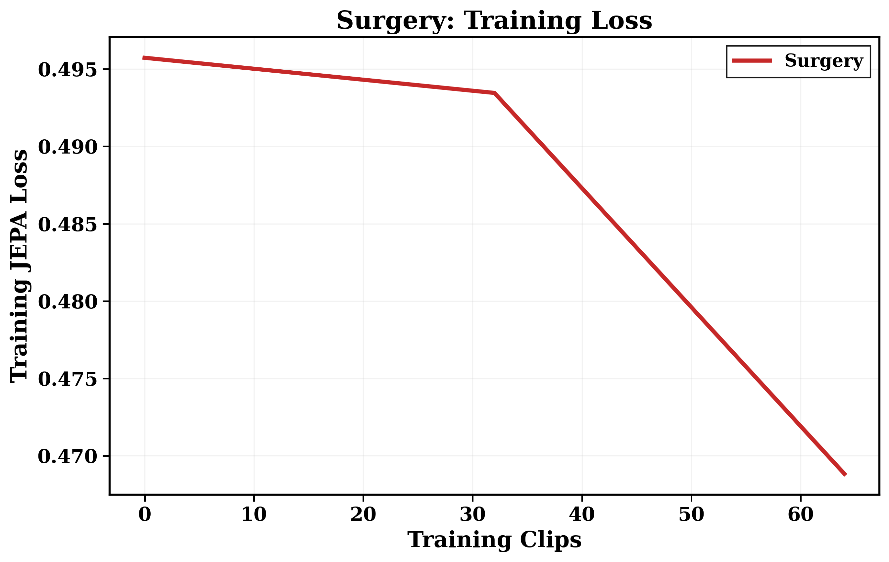
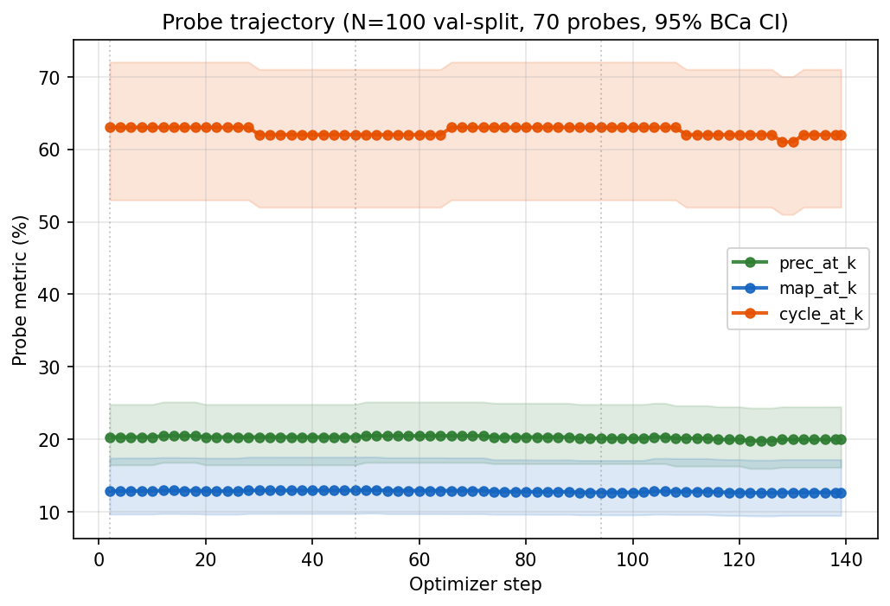
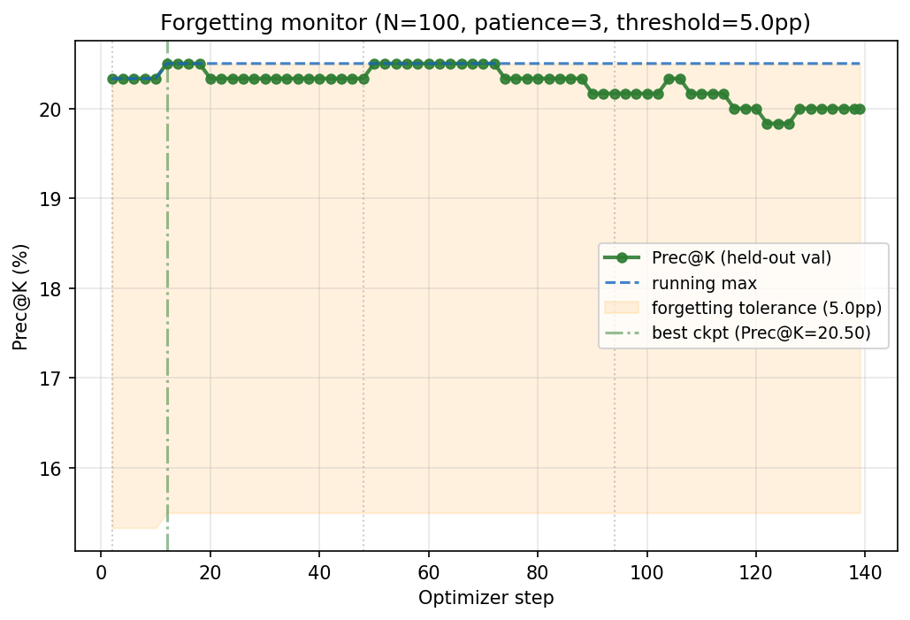
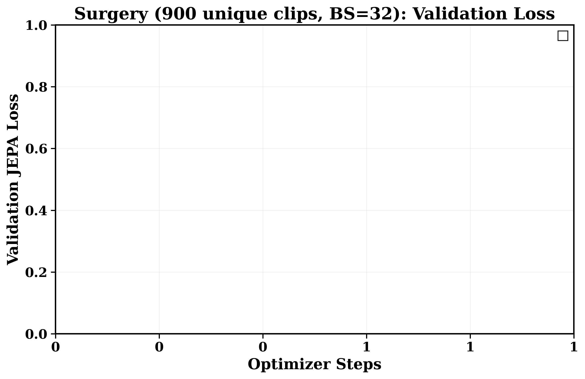

# 📊 Status — 1K POC Surgery Run (2026-04-19) 🧪

> 🚨 **Verdict**: ❌ **Decision gate FAILED** — Surgery ≈ Frozen on held-out Prec@K (Δ +0.17 pp, CIs overlap). 🔒 Step G (ExPLoRA) paused per runbook line 270; 🔄 Step C re-run needed with adjusted factor quality / training config.

---

## 🎯 Headline numbers 📈

| Metric | 🧊 Frozen | 🔧 Surgical | Δ | Gate |
|---|---|---|---|---|
| **Prec@K** (N=100 val-split, 95% BCa CI) | 20.17% ±4.50 | **20.33% ±4.67** | +0.17 pp | ❌ overlapping CIs |
| 🎯 mAP@K | 0.1299 ±0.045 | 0.1313 ±0.046 | +0.0014 | 😐 flat |
| 🔁 Cycle@K | 0.69 ±0.09 | 0.69 ±0.09 | 0.0 | 😐 flat |
| 📐 nDCG@K | 0.9422 ±0.0095 | 0.9424 ±0.0097 | +0.0002 | 😐 flat |
| 🧩 Dim-Cons@K | 52.84 ±4.36 | 52.72 ±4.30 | -0.13 | 😐 flat |
| 🌗 Silhouette | -0.1519 | -0.1521 | -0.0002 | 😐 flat |

---

## 🏃‍♀️ Pipeline walk (A→F, 1K POC tier) 🚀

| Step | ⏱️ Wall | 📦 Artifact | Status |
|---|---|---|---|
| 🔍 A – m10 Grounded-SAM | 1h00m20s (3.62 s/clip × 1000) | 1000 masks, quality_gate PASS ✅ | ✅ |
| 🧬 B – m11 Factor datasets | 11m43s factor-gen + plots | D_L=894, D_A=779, D_I=715 + manifest | ✅ |
| 🔧 C – m09c Surgery (5 ep, 3 stages) | 2h27m (12:25→14:52) | 139 steps, `student_best.pt` Stage 1 step 12 🏆 | ✅ |
| 🧊 D – m05 Frozen (100 val) | 1m58s (0.85 clips/s) | `embeddings_vjepa_2_1_frozen.npy` (100,1664) | ✅ |
| 🩺 E – m05 Surgical (100 val) | 4m45s (0.35 clips/s, adapted compile) | `embeddings_vjepa_2_1_surgical.npy` (100,1664) | ✅ |
| 🏆 F – m06 FAISS Prec@K | ~1m each arm | Frozen 20.17% / Surgical 20.33% | ✅ (❌ gate FAIL) |

---

## 🔬 Training diagnostics (src/m09c1_surgery_encoder.py → outputs/poc/m09c_surgery/) 📉

### 📉 Training loss (3-stage surgery curve)

- 🎚️ Final JEPA loss: **0.4516** (from `training_summary.json:final_loss`).
- ✅ 3 monotonically decreasing stage curves visible — optimization is working at the loss level.

### 🎯 Probe trajectory — Prec@K / mAP@K / Cycle@K across 70 probes

- 🟢 **First probe (step 2):** Prec@K = 20.33%.
- 🏆 **Peak (step 12, Stage 1):** Prec@K = **20.50%** ← best-ckpt auto-promoted to `student_encoder.pt`.
- 🔴 **Last probe (step 139):** Prec@K = 20.00%.
- ⚠️ **BWT (Prec@K[last] − Prec@K[first]): −0.33** — net regression across the run.
- 📉 Monotonic = **False**, max_drop = 0.17 pp.

### 🧠 Catastrophic-forgetting monitor (kill-switch view)

- 📈 Running-max envelope hits 20.50 at step 12, then Prec@K drifts down into the 19.83–20.00 band for the remainder of the run.
- ✅ Kill-switch patience (3 consecutive probes below `running_max − 5 pp`) was **NOT triggered** — drops stayed < 5 pp floor, so training completed its full budget.
- 💡 Interpretation: model is **softly forgetting** 💤 rather than catastrophically diverging 💥.

### 📊 JEPA val-loss (companion to retrieval metrics)

- 📉 val_jepa_loss: 0.4854 → 0.4760 (−2.0%) — mild monotonic improvement.
- 🤔 Optimization-trajectory signal says "learning happened" ✅; retrieval trajectory says "representation quality did not translate to Prec@K on held-out clips" ❌.

### 🏆 Decision-gate comparison (Frozen vs Surgical)

- 📊 Bar chart: 5 metrics × 2 arms with 95% BCa CI error bars.
- 🕸️ Radar: normalized overlay showing Surgical ≈ Frozen on every metric.
- 🚨 **Key finding: Δ Prec@K = +0.17 pp, CIs overlap heavily** (±4.5 pp half-widths swallow the delta).

---

## 🎬 m11 Factor-dataset video samples (2×2 grids: original / D_L layout / D_A agent / D_I interaction)

> 📽️ Spot-check 3 of 20 verify videos out of `outputs/poc/m11_factor_datasets/m11_per_Videoclip_verify/`. Each clip: 960×540 @ 6fps, shows the factor decomposition m09c consumes during training. ✅ If D_L looks layout-only (agents blurred), D_A agents are sharp with background dimmed, D_I crops to interaction tubes → factors are clean. 🐛 If masks leak or agents appear in D_L → **H1 factor-quality hypothesis** above is the cause.

### 🚗 Chennai drive — tier1/drive/15P_-dTlpLY-054
<video src="outputs/poc/m11_factor_datasets/m11_per_Videoclip_verify/tier1__chennai__drive__15P_-dTlpLY__15P_-dTlpLY-054.mp4.mp4" controls width="600"></video>

[📥 Download clip](outputs/poc/m11_factor_datasets/m11_per_Videoclip_verify/tier1__chennai__drive__15P_-dTlpLY__15P_-dTlpLY-054.mp4.mp4)

### 🚶 Delhi walking — tier1/walking/kn9RPUNqcrA-013
<video src="outputs/poc/m11_factor_datasets/m11_per_Videoclip_verify/tier1__delhi__walking__kn9RPUNqcrA__kn9RPUNqcrA-013.mp4.mp4" controls width="600"></video>

[📥 Download clip](outputs/poc/m11_factor_datasets/m11_per_Videoclip_verify/tier1__delhi__walking__kn9RPUNqcrA__kn9RPUNqcrA-013.mp4.mp4)

### 🏙️ Mumbai walking — tier1/walking/DFQO7Zn-KM4-1026
<video src="outputs/poc/m11_factor_datasets/m11_per_Videoclip_verify/tier1__mumbai__walking__DFQO7Zn-KM4-1026__DFQO7Zn-KM4-1026.mp4.mp4" controls width="600"></video>

[📥 Download clip](outputs/poc/m11_factor_datasets/m11_per_Videoclip_verify/tier1__mumbai__walking__DFQO7Zn-KM4-1026__DFQO7Zn-KM4-1026.mp4.mp4)

> ℹ️ Video paths are relative to this `.md` file (`iter/iter8/outputs/poc/...`) — works in local preview tools that render HTML `<video>` tags. If viewing on GitHub, use the 📥 Download links (GitHub's markdown sanitizer strips `<video>`).

---

## 🧪 Config snapshot (what ran) ⚙️

| 🎛️ Knob | Value | 📁 Source |
|---|---|---|
| 🔢 max_epochs.poc | 5 | `ch11_surgery.yaml:40` |
| 🪜 total steps | 139 (3 stages × ~46) | computed |
| 📦 batch_size | 32 effective (AdaptiveBatchSizer start=4, max=32) | `optimization.batch_size` |
| ✂️ train/val split | 900 / 100 (seed=42, cap 1000) | `data.train_val_split.poc: 0.9` |
| 🎯 probe.cadence | `saves_per_epoch` | `ch11_surgery.yaml:210` |
| ⏲️ probe_every | 2 steps (28/epoch ÷ saves_per_epoch=10) | `checkpoint.saves_per_epoch` (base) |
| 📈 n probes fired | 70 | `probe_history.jsonl` |
| 🏆 best_ckpt_enabled | true | `probe.best_ckpt_enabled.poc` |
| 🔪 kill_switch_enabled | true | `probe.kill_switch_enabled.poc` |
| 🚨 forgetting threshold / patience | 5 pp / 3 probes | yaml |
| 🔥 warmup_pct | 0.20 per stage | `surgery.warmup_pct` |
| 🎨 mixed_precision | bf16 | `mixed_precision.dtype` |
| 🏗️ Stage 1 trainable | blocks 0–12 (25%) | `surgery.stages[0]` |
| 🏗️ Stage 2 trainable | blocks 0–24 (50%), mix 90% D_A + 10% D_L | `surgery.stages[1]` |
| 🏗️ Stage 3 trainable | blocks 0–36 (75%), mix 85% D_I + 10% D_A + 5% D_L | `surgery.stages[2]` |

---

## 🔍 Where Surgery went wrong (diagnostic checklist) 🕵️

1. 🏅 **Best ckpt is at step 12 (Stage 1, D_L only).** Surgery's "best" is 12 steps in, when the model has barely moved from Frozen init → suggests **factor-specific fine-tuning is not adding usable signal** on val_1k's random sample.
2. 📉 **Stages 2 + 3 made it worse, not better.** The progressive-unfreezing curriculum is supposed to compound gains (D_L → D_A → D_I). Here D_A and D_I replay erased the tiny Stage-1 gain.
3. 🤔 **Val_jepa IS dropping** — so the optimization is finding a lower-loss latent space. But that latent space isn't more useful for retrieval than the Frozen one → **loss ≠ retrieval quality on this dataset at 1K scale**.
4. 📊 **val_split = random 100 of val_1k** (seed=42). Sampling noise at N=100 is ±4.5 pp. Any delta < 5 pp is indistinguishable 👀.

## 🛠️ Hypotheses to test next (pick 1-2 before re-running C) 🧭

- 🎭 **H1 — Factor quality**: m10 masks may be too noisy (low `mean_mask_confidence`, `clips_with_agents_pct` uneven). 🔍 Inspect `outputs/poc/m10_sam_segment/summary.json` + 20 spot-check overlays. If masks are wrong 🐛, D_A/D_I factors are garbage → Stage 2/3 training on noise.
- 🎚️ **H2 — LR / warmup**: `lr=1e-6` + `warmup_pct=0.20` on a 46-step stage = 9-step warmup, 37 steps at full LR. May be too cautious; Stage 2 hyperparameter sweep (LR ∈ {1e-6, 3e-6, 1e-5}) worth a 3-run ablation.
- ⏳ **H3 — Epoch budget**: 5 epochs × 28 steps/epoch = tiny. Paper-scale (115K FULL, 1 epoch) = 3200 steps; 1K POC with 5 epochs = 139 steps. The scaling assumption "1K × 20 visits/clip ≈ 115K × 1 visit/clip" may be wrong for surgical fine-tuning — try 10 or 20 epochs at 1K tier.
- 📏 **H4 — Held-out size**: N=100 with ±4.5 pp CI can't resolve a real 1-2 pp gain. Either (a) drop split_ratio to 0.8 → N=200 val (±3 pp), or (b) retire the 1K POC tier and re-run at 10K for tighter gate CI.
- 🌍 **H5 — Dataset shift**: val_1k is random uniform from WalkIndia; surgery trains on factor-filtered D_L/D_A/D_I subsets that may systematically differ from random val. Cross-check train vs val tag distributions in `factor_manifest.json`.

---

## 📂 Artifact index 🗂️

| 📄 File | 🏷️ Role |
|---|---|
| 🏆 `outputs/poc/m09c_surgery/student_encoder.pt` | Promoted best-Prec@K ckpt (Stage 1 step 12) |
| ✂️ `outputs/poc/m09c_surgery/val_split.json` | 100 held-out keys (seed=42) — downstream D/E/F `--subset` |
| 📋 `outputs/poc/m09c_surgery/training_summary.json` | Full run metadata + all 70 probe records |
| 📜 `outputs/poc/m09c_surgery/probe_history.jsonl` | Probe records, fsync'd per write |
| 📉 `outputs/poc/m09c_surgery/loss_log.{csv,jsonl}` | Per-step training loss |
| 🖼️ `outputs/poc/m09c_surgery/{probe_trajectory,m09_forgetting,m09_val_loss,m09_train_loss}.{png,pdf}` | 4 figures above |
| 🧠 `outputs/poc/m05_vjepa_embed/embeddings_vjepa_2_1_{frozen,surgical}.npy` | N=100 × 1664 embedding arrays |
| 🎯 `outputs/poc/m06_faiss_metrics/m06_metrics_vjepa_2_1_{frozen,surgical}.json` | Prec@K / mAP@K / Cycle@K / nDCG@K / Dim-Cons / Silhouette (easy + hard) |
| 🖼️ `outputs/poc/m06_faiss_metrics/m06_compare_frozen_vs_surgical.png` | Side-by-side bar + radar diagnostic |

---

## ⏭️ Next action (single-line) 🎯

**🎚️ Pick H1 or H2** above, update the relevant config (`configs/train/ch11_surgery.yaml` for H2, re-run Step A/B for H1), then re-run Step C (`rm -rf outputs/poc/m09c_surgery/` → `python -u src/m09c1_surgery_encoder.py --POC ...`). 🚫 Do **not** launch Step G until Surgery > Frozen on non-overlapping CIs. 🏆
