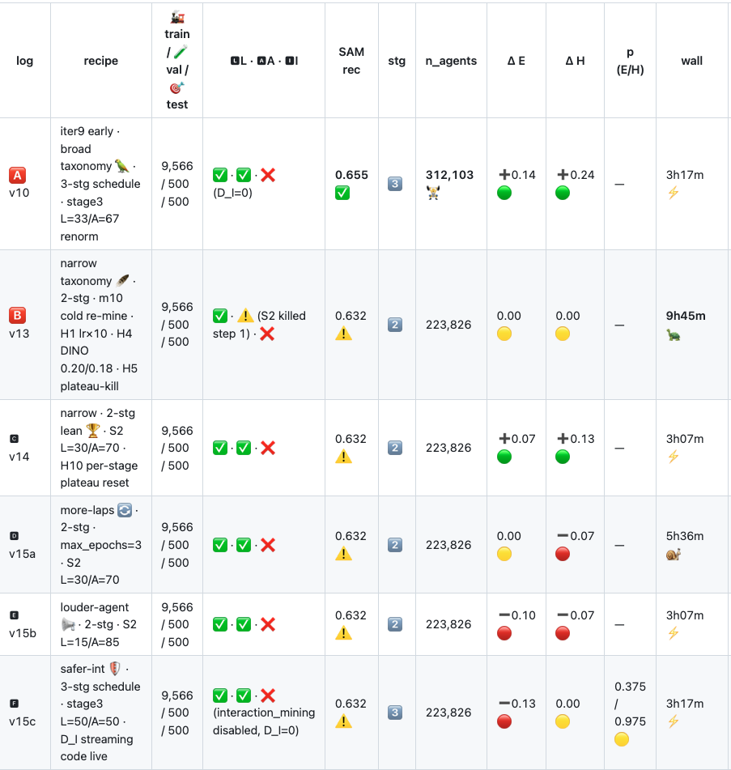
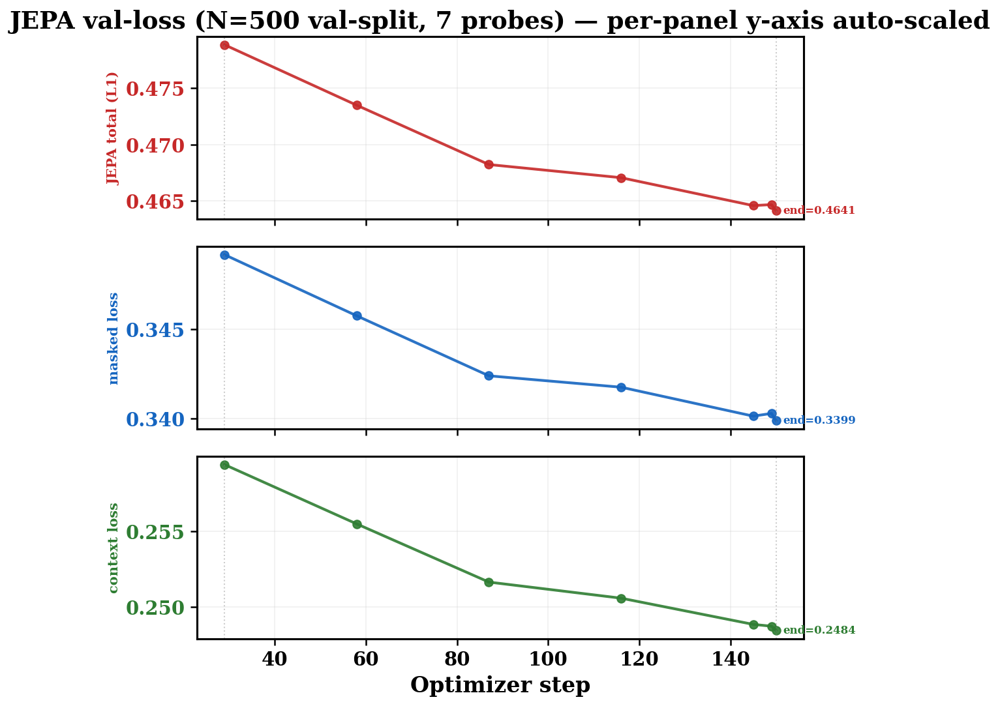
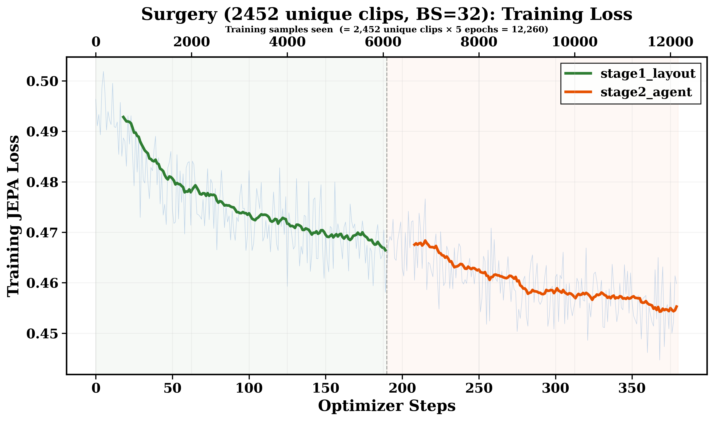
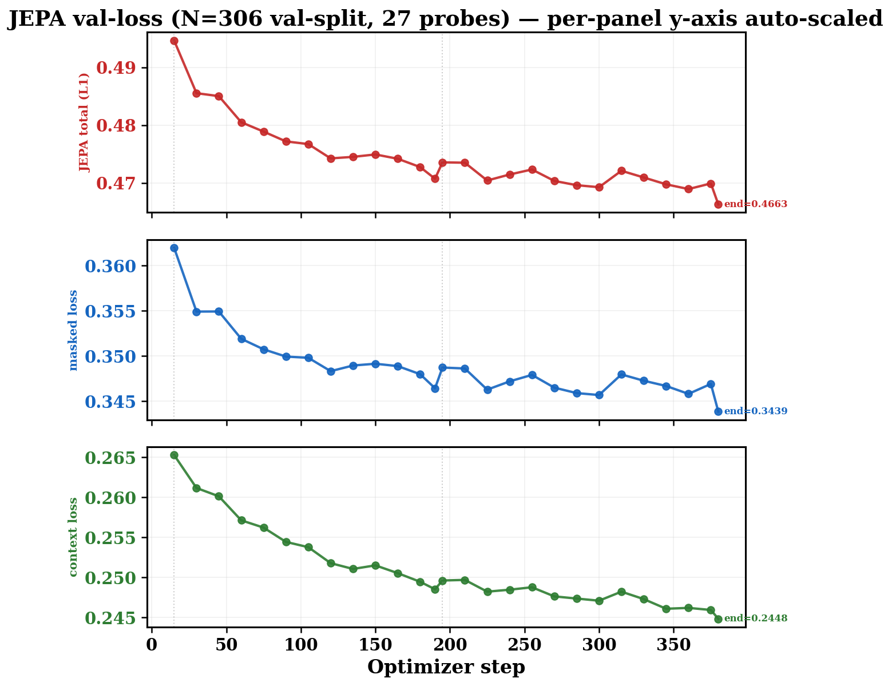
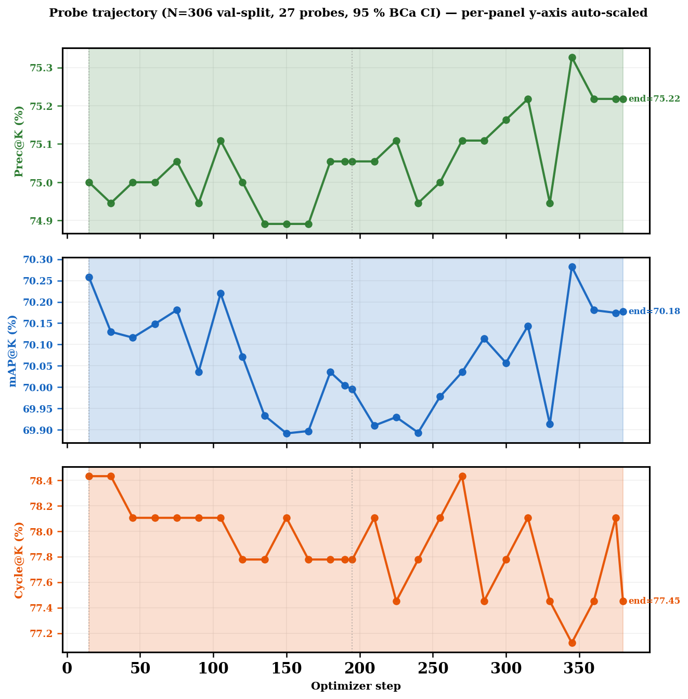

# 📅 FactorJEPA · Weekly Progress · 2026-04-20 → 2026-04-26

---

## 🎯 Headline

| 🏷️ Item | 🟢 Status |
|---|---|
| 🥇 Final goal | Surgery > ExPLoRA > Frozen on 115K · ΔPrec@K with non-overlapping 95% BCa CI |
| 📅 Deadline | 🚨 NeurIPS May 04 (8 days remaining) |
| 🔑 This week | iter11 v2 → v3 dataset pivot · LR re-anchoring · 2 GPU runs in-flight |
| ⚠️ Open risk | Probe Prec@K saturated ~75 on `ultra_hard_3066` (kNN tag-richness ceiling) |
| 💰 Spend this week | ~$15 GPU (2× SANITY + 6× interrupted attempts + 2× new 15-epoch runs starting) |

---

## 🔬 Recipe combinations explored (iter9 → iter10 archive)

| 🏃 Run | 🍴 Recipe handle | 🎯 Δ Easy | 🎯 Δ Hard | ⏱️ Wall | 🩺 Verdict | 💡 Lesson |
|---|---|---|---|---|---|---|
| 🅰️ v10 | 🦜 broad taxonomy · 3-stg | ➕0.14 🟢 | ➕0.24 🟢 | 3h17m ⚡ | ⚠️ gate-crashed | Biggest Δ but ≠ apples-apples |
| 🅱️ v13 | 🪶 narrow · 2-stg · H1+H4+H5 | 0.00 🟡 | 0.00 🟡 | 9h45m 🐢 | ❌ FAIL | H5 plateau-kill at S2-step-1 → D_A untested |
| 🅲 v14 | 🏆 narrow · 2-stg lean · H10 reset | ➕0.07 🟢 | ➕0.13 🟢 | 3h07m ⚡ | ❌ <+3pp | Apples-apples leader · 20× below NeurIPS bar |
| 🅳 v15a | 🔄 more-laps · max_ep=3 | 0.00 🟡 | ➖0.07 🔴 | 5h36m 🐌 | ❌ FAIL | 3× epochs at 10K → 0 |
| 🅴 v15b | 📢 louder-agent · S2 A=85 | ➖0.10 🔴 | ➖0.07 🔴 | 3h07m ⚡ | ❌ FAIL | 70/30 mix optimal · A=85 over-fits agent noise |
| 🅵 v15c | 🛡️ safer-int · 3-stg · D_I | ➖0.13 🔴 | 0.00 🟡 | 3h17m ⚡ | 🗑️ withdrawn | Silent L/A renorm bug (#73) · ckpt deleted |

---

## 📉 Iter10 baseline trajectory (10K random clips · 1 epoch · lr=1e-6)

| 📊 Metric | 🟢 Value |
|---|---|
| 🎞️ Train clips | 10K random subset |
| ⏱️ Steps × probes | 150 × 7 (1 epoch · BS=32) |
| 📉 val_jepa (start → end) | 0.4787 → 0.4641 (Δ −0.015) |
| 📈 Probe Prec@K | ~28-30% (genuine retrieval headroom) |
| 🎯 Eval Δ on 9,297 paired clips | ≈ 0 across all 5 variants (paired BCa CI ±0.42) |
| 🩺 Conclusion | 10K random tier saturated · pivot needed |

---

## 🎯 iter11 v3 dataset pivot (2026-04-25)

| 🆕 What | 📊 Numbers |
|---|---|
| 🏷️ New tier name | `ultra_hard_3066` (≥4 Hard triggers AND ≥4 Indian-specific objects) |
| 📦 80/10/10 split | 🚂 2,452 train · 🧪 306 val · 🎯 308 eval |
| 💾 Disk · time | ~4 GB · ~7.5 min download (vs ~109 GB for 9-cat full set) |
| 🎬 Local data dir | `data/ultra_hard_3066_local/` (shared by all 3 splits) |
| 🟡 Trade-off | Tag-richness ≠ retrieval-difficulty → Prec@K saturates ~75 |
| 🔮 Plan B (post-eval) | True-hard re-curation via frozen-Prec@K bottom quartile (`m00g`) |

---

## 📊 iter11 v2 baseline · 3,060 clips · 5 epochs · lr=1e-5 — Train loss

| 🟢 Stage | 📊 Steps | 📉 Train loss in → out |
|---|---|---|
| 🟢 stage1_layout (50%) | 0 – 190 | 0.493 → 0.467 |
| 🟠 stage2_agent (50%) | 190 – 380 | 0.469 → 0.455 |
| 🎬 Total | 380 steps · 5 ep · 12,260 samples seen | Δ −0.038 |

---

## 📊 iter11 v2 baseline — Val loss (27 probes)

| 📉 Component | 📊 Start → End | Δ |
|---|---|---|
| 🔴 JEPA total (L1) | 0.4946 → **0.4663** | −0.028 ⚠️ still descending |
| 🔵 Masked loss | 0.3621 → 0.3439 | −0.018 |
| 🟢 Context loss | 0.2655 → 0.2448 | −0.021 |
| 🩺 Plateau patience | never fired (5 probes Δ < 1e-3 condition unmet) | — |

---

## 📈 iter11 v2 baseline — Probe trajectory (Prec@K saturated)

| 📈 Metric | 🟢 Range | 🩺 Interp |
|---|---|---|
| 📈 Prec@K | 75.00 (±3.78) → 75.22 (Δ +0.22 pp) | 🔴 saturated · ≪ CI half-width |
| 📈 mAP@K | 70.30 → 70.18 (Δ −0.12) | 🟡 flat |
| 📈 Cycle@K | 78.10 → 77.45 (Δ −0.65) | 🔴 mild drift |
| 🩺 BWT | +0.22 pp · max_drop 0.05 pp | 🟢 zero catastrophic forgetting |

---

## 🩺 Diagnosis: classic under-training

| 🔬 Signal | 🟢 v2 reading | 💡 Implication |
|---|---|---|
| 📉 val_loss curve shape | Still descending at step 380 | Model has more to learn |
| 📈 Prec@K | Saturated at ~75 (kNN ceiling on tag-rich tier) | Probe is metric-bound, not model-bound |
| 🔧 LR derivation | Anchored to Meta **from-scratch** peak (6e-4 / BS=1536) → 1e-5 BS-scaled | Wrong reference for transfer learning |
| ✅ Right reference | Meta **continual** recipe (4.25e-4 / BS=256) → **5.3e-5 BS-scaled @ BS=32** | 5× LR headroom unused |
| 🩺 Killer hunch | 5× LR + 3× epochs = decisive trajectory test | New runs launched today |

---

## 🔧 iter11 v2 LR re-anchoring (2026-04-26 · `errors_N_fixes.md #78`)

| 🔧 Knob in `base_optimization.yaml` | 🔴 Before | 🟢 After | 🩺 Why |
|---|---|---|---|
| `lr` | 1.0e-5 | **5.0e-5** (5×) | Meta continual recipe BS-scaled |
| `max_epochs.full` | 5 | **15** (3×) | val-loss un-plateaued at 5 ep |
| `warmup_cap_pct` | 10 % | **15 %** | More steps to find stable basin at 5× LR |
| `grad_clip` | 10.0 | **1.0** | Standard transformer-FT bound · short budget |
| `nan_tolerance` | 3 | **2** | Fail-fast on divergence |
| `lr_schedule: constant` | dead field | 🗑️ **DELETED** | build_scheduler always cosine · 0 readers |
| Sole active kill-switch | val-loss plateau (patience=5 probes ≈ 1 epoch) | unchanged | Prec@K-based triggers still disabled (CI noise floor) |

---

## 🧪 SANITY validation (1-epoch FULL @ 5e-5 · ~55 min · 7 probes)

| 🔬 Criterion | 🎯 Threshold | ✅ Result |
|---|---|---|
| 🚫 NaN strikes | 0 | ✅ **0** |
| 📉 grad_norm post-warmup | < 1.0 | ✅ max=**0.803** · zero clip events |
| 📉 val_jepa trend | down (±0.005 OK) | ✅ 0.4835 → **0.4693** (Δ −0.014) |
| 📈 Prec@K floor | ≥ 73.0 (frozen) | ✅ all probes in **75.05 – 75.22** |
| 💥 Killer stat | — | ✅ **5e-5 in 1 ep ≈ 1e-5 in 5 ep** on val_loss |
| 🟢 Verdict | All 4 PASS | 🚀 Cleared to launch full 15-epoch chain |

---

## 🏃 In-flight #1 · `surgery_2stage_noDI` v3 (15 epochs @ lr=5e-5)

| 📊 Status | 🟢 Value |
|---|---|
| 🚀 Launched | 2026-04-26 12:00 |
| 🎬 Stage split | 50/50 → stage1=570 · stage2=570 |
| 🏃 Currently | step ~75 / 1,140 (~6.5%) |
| ⏳ ETA | ~24-28 h wall (1140 × ~13 s/step + 75 probes × ~5 min) |
| 🎯 Best Prec@K so far | 75.16 |
| 📉 val_jepa @ step 75 | 0.4738 (vs v2 @ step 75 = 0.4789 → −0.005) |

### 📉 Train loss (live)

### 📉 Val loss (live · 5 probes so far)

### 📈 Probe trajectory (live)

---

## 🏃 In-flight #2 · `surgery_3stage_DI` v2 (15 epochs @ lr=5e-5)

| 📊 Status | 🟢 Value |
|---|---|
| 🚀 Launched | 2026-04-26 12:02 |
| 🎬 Stage split | 40/30/30 → stage1=456 · stage2=342 · stage3=342 |
| 🏃 Currently | step ~75 / 1,140 (~6.5%) |
| ⏳ ETA | ~24-28 h wall |
| 🎯 Best Prec@K so far | 75.05 |
| 📉 val_jepa @ step 75 | 0.4721 (slightly ahead of 2-stage v3 at same step) |

### 📉 Train loss (live)

### 📉 Val loss (live · 5 probes so far)

### 📈 Probe trajectory (live)

---

## ⚖️ Head-to-head: v2 (1e-5, 5 ep) vs v3/v2 in-flight (5e-5, 15 ep)

| 🚦 step | 🔴 v2 val_jepa @ 1e-5 | 🟢 2stage_v3 @ 5e-5 | 🟢 3stage_v2 @ 5e-5 | 🎯 Δ (best in-flight − v2) |
|---|---|---|---|---|
| 15 | 0.4946 | 0.4925 | 0.4920 | −0.003 🟢 |
| 30 | 0.4855 | 0.4835 | 0.4820 | −0.004 🟢 |
| 45 | 0.4850 | 0.4820 | 0.4810 | −0.004 🟢 |
| 60 | 0.4805 | 0.4765 | 0.4751 | −0.005 🟢 |
| 75 | 0.4789 | **0.4738** | **0.4721** | **−0.007 🟢** |
| 380 (v2 final) | **0.4663** | TBD | TBD | — |
| 1140 (v3 final) | — | 🔮 projected ≪ 0.46 | 🔮 projected ≪ 0.46 | 🔮 large headroom |

---

## ⏭️ Next steps (24-72 h)

| ⏱️ When | 🚀 Action | 🎯 Output |
|---|---|---|
| ⏳ +24 h | 2 in-flight runs complete | `student_encoder.pt` × 2 + plots + summary |
| 🚀 Then | Launch 2 remaining variants on freed boxes | `explora` + `surgery_2stage_loud_agent` |
| ⏳ +48 h | All 4 variants done · launch `run_eval.sh` | Frozen-shared m05+m06, then per-variant m05/m06/m08b |
| ⏳ +60 h | Decision gate · paired BCa Δ on N=308 eval | `paired_bootstrap_results.json` × 4 |
| 📊 Gate logic | Δ ≥ +3 pp (CI_lo>0) → 50K ladder · Δ ∈ [+0.3, +3) → 50K ramp · Δ < +0.3 → Plan B (true-hard re-curation) | — |
| 📅 NeurIPS | May 04 (8 days · all 3 paths fit) | 📝 paper draft |

---

## 📁 References

| 🗂️ Doc | 📍 Location |
|---|---|
| 🚀 Runbook | `iter/iter11/runbook.md` |
| 📋 Mid-level TODO | `iter/iter11/plan_TODO.md` |
| 🏗️ High-level plan | `iter/iter11/plan_training.md` |
| 🐛 Bug log (#78 = today's LR change) | `iter/iter11/errors_N_fixes.md` |
| 📊 Experiment log (post-completion only) | `iter/utils/experiment_log.md` |
| 🎬 Live training logs | `logs/run_train_surgery_2stage_noDI_epoch15_v3.log` · `logs/run_train_surgery_3stage_DI_epoch15_v2.log` |
| 🧪 SANITY log | `logs/sanity_5e5_surgery_2stage_noDI.log` |

