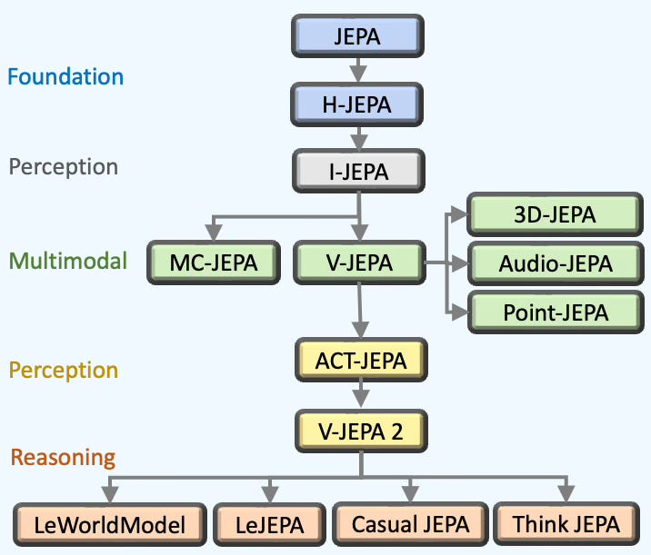

# JEPA Family — Literature Survey (April 2026)

> 15+ JEPA variants surveyed. FactorJEPA novelty confirmed: **no one decomposes INPUT videos into semantic factors for JEPA training.**

## 🌳 JEPA Evolution Tree



*Source: [14 JEPA Milestones as a Map of AI Progress](https://www.turingpost.com/p/jepamap)*

**FactorJEPA operates at the V-JEPA 2 → domain adaptation branch** (not shown in tree). Our novelty: factor-decomposed inputs + progressive curriculum on frozen V-JEPA 2.1.

---

## 🗺️ JEPA Variant Map

| # | Variant | Layer | Modality | Key Innovation | Useful for FactorJEPA? | arXiv | Year |
|---|---|---|---|---|---|---|---|
| 1 | 📜 H-JEPA | Foundation | Conceptual | Hierarchical multi-timescale world modeling | 📖 Theoretical basis | LeCun 2022 | 2022 |
| 2 | 🖼️ I-JEPA | Perception | Image | Aggressive masking (75-90%) + deep predictor | ✅ DONE (predictor depth) | [2301.08243](https://arxiv.org/abs/2301.08243) | 2023 |
| 3 | 🎬 V-JEPA | Multimodal | Video | Video masking + temporal prediction in latent space | ✅ Base model | [2404.08471](https://arxiv.org/abs/2404.08471) | 2024 |
| 4 | 🎭 MC-JEPA | Multimodal | Video | Motion + content features with shared encoder | 🤔 Could separate motion vs content in factors | — | 2024 |
| 5 | 🔊 Audio-JEPA | Multimodal | Audio | Spectrogram masking + curriculum. 1/5 data of wav2vec | ❌ Not audio | — | 2024 |
| 6 | 🏗️ 3D-JEPA | Multimodal | 3D/LiDAR | Context-aware decoder, 150 vs 300 epochs | ❌ Not 3D | — | 2024 |
| 7 | ☁️ Point-JEPA | Multimodal | 3D points | Geometric priors for LiDAR point clouds | ❌ Not point cloud | — | 2025 |
| 8 | 🎮 ACT-JEPA | Perception v2 | Video+Action | Action chunking — dual prediction of actions + latent obs | ❌ No actions | — | 2025 |
| 9 | 🎬 V-JEPA 2 | Perception v2 | Video | 1M+ hours pretraining, zero-shot robot planning | ✅ Base checkpoint | [2506.09985](https://arxiv.org/abs/2506.09985) | 2025 |
| 10 | 🎬 V-JEPA 2.1 | Perception v2 | Video | Dense loss + deep supervision (4-layer) | ✅ DONE (implemented) | [2603.14482](https://arxiv.org/abs/2603.14482) | 2026 |
| 11 | 📐 LeJEPA | Reasoning | Image | SIGReg replaces EMA — 50 lines, provably stable | 🔥 HIGH (steal SIGReg) | [2511.08544](https://arxiv.org/abs/2511.08544) | 2025 |
| 12 | 🌍 LeWorldModel | Reasoning | Video | End-to-end from pixels, Gaussian reg, no EMA | 🔥 MEDIUM (no EMA path) | [2603.19312](https://arxiv.org/abs/2603.19312) | 2026 |
| 13 | ⚖️ Causal-JEPA | Reasoning | Conceptual | Object-level masking → causal reasoning | 🤔 Object masking ≈ our factor decomposition | — | 2025 |
| 14 | 🧠 ThinkJEPA | Reasoning | Video+VLM | Dense JEPA + sparse VLM thinker (dual temporal) | 🔥 MEDIUM (VLM in training) | [2603.22281](https://arxiv.org/abs/2603.22281) | 2026 |
| 15 | 📖 LLM-JEPA | Reasoning | Text | JEPA for LLMs — outperforms standard training | ❌ Not language | — | 2025 |
| 16 | 〰️ Temporal Straight. | Reasoning | Video | Curvature reg → straighter latent trajectories | 🔥 LOW (diagnostic) | [link](https://agenticlearning.ai/temporal-straightening/) | 2025 |
| 17 | 🤖 VLA-JEPA | Action | Video+Action | Leakage-free state prediction for robotics | 🔥 MEDIUM (leakage-free) | [2602.10098](https://arxiv.org/abs/2602.10098) | 2026 |
| 18 | 💬 VL-JEPA | Language | Video+Text | Predicts text embeddings, 50% fewer params | ❌ No language output | [2512.10942](https://arxiv.org/abs/2512.10942) | 2025 |
| 19 | 🎲 Var-JEPA | Generative | Image | Variational formulation — generative + predictive | ❌ Overcomplicated | [2603.20111](https://arxiv.org/abs/2603.20111) | 2026 |
| 20 | 🔄 BiJEPA | Symmetry | Image | Bidirectional symmetry prediction | 🤔 Could improve temporal | — | 2025 |
| 21 | 👥 Social-JEPA | Social | Video | Emergent geometric isomorphism | ❌ Not social dynamics | — | 2025 |
| 22 | 🎵 Le MuMo JEPA | Multi-modal | Multi | Fusion tokens for cross-modal prediction | ❌ Video-only | — | 2025 |
| 23 | 🧬 Laya | Medical | EEG | LeJEPA for EEG — latent prediction > reconstruction | 📖 Domain adaptation pattern | [2603.16281](https://arxiv.org/abs/2603.16281) | 2026 |
| 24 | 🩺 US-JEPA | Medical | Ultrasound | Specialized masking for medical imaging | 📖 Domain adaptation pattern | — | 2025 |

**Total: 24 JEPA variants surveyed.** 6 applicable to FactorJEPA (🔥), 3 share patterns (📖🤔), 15 not applicable (❌).

---

## 🎯 Applicability to FactorJEPA Surgery

| Variant | Applicable? | Technique We Can Steal | Impact | Effort |
|---|---|---|---|---|
| 📐 LeJEPA | ✅ HIGH | SIGReg regularizer — replace EMA teacher with 50-line loss | 🔥🔥🔥 | ⚡ Low |
| 🤖 VLA-JEPA | ✅ MEDIUM | Leakage-free: teacher sees factor-patched clips too | 🔥🔥 | 💪 Medium |
| 🌍 LeWorldModel | ✅ MEDIUM | Gaussian regularizer, emergent temporal straightening | 🔥🔥 | ⚡ Low |
| 🧠 ThinkJEPA | ✅ MEDIUM | Integrate VLM tags INTO training (not just SAM prompts) | 🔥🔥 | 💪 Medium |
| 〰️ Temporal Straightening | ✅ LOW | Curvature as diagnostic metric (paper figure) | 🔥 | ⚡ Low |
| 🔄 BiJEPA | ✅ LOW | Bidirectional prediction → better temporal features | 🔥 | 💪 Medium |
| 🩺 US-JEPA / Laya | ✅ PATTERN | Domain-specific JEPA adaptation (same goal as ours) | 📖 Reference | — |
| 🎬 V-JEPA 2.1 | ✅ DONE | Dense loss + deep supervision | ✅ Implemented | ✅ Done |
| 🖼️ I-JEPA | ✅ DONE | Deep predictor (24-layer) | ✅ Implemented | ✅ Done |
| ☁️ Point-JEPA | ❌ | 3D point clouds ≠ video | — | — |
| 💬 VL-JEPA | ❌ | No language output in our pipeline | — | — |
| 🤖 VLA-JEPA (action) | ❌ | No action prediction | — | — |
| 🎲 Var-JEPA | ❌ | Overcomplicated for retrieval | — | — |
| 👥 Social-JEPA | ❌ | Social dynamics ≠ street scenes | — | — |
| 🎵 Le MuMo JEPA | ❌ | Multi-modal fusion ≠ video-only | — | — |

---

## 🏆 Top 3 Techniques to Steal

### 1️⃣ SIGReg from LeJEPA — 🔥🔥🔥 Impact, ⚡ Low Effort

| Aspect | EMA Teacher (current) | SIGReg (LeJEPA) |
|---|---|---|
| Collapse prevention | EMA momentum + stop-gradient (heuristic) | Isotropic Gaussian constraint (provable) |
| Code complexity | EMA update every step (~10 lines) | Regularizer loss term (~50 lines) |
| Hyperparameters | tau, momentum schedule | Single lambda weight |
| Teacher needed? | ✅ Yes (2B params duplicated) | ❌ No teacher at all |
| Stability | Depends on momentum tuning | Stable across architectures |
| ImageNet accuracy | V-JEPA: ~82% (with EMA) | LeJEPA: 79% (without EMA, ViT-H) |

```python
# Add to JEPA loss:
loss = jepa_loss + 0.1 * sigreg(student_embeddings)
```

📦 Code: [github.com/rbalestr-lab/lejepa](https://github.com/rbalestr-lab/lejepa)

### 2️⃣ Leakage-Free Prediction from VLA-JEPA — 🔥🔥 Impact, 💪 Medium Effort

| Current (leaky) | VLA-JEPA style (clean) |
|---|---|
| Student sees D_L (blurred agents) | Student sees D_L (blurred agents) |
| Teacher sees ORIGINAL clip (with agents!) | Teacher sees D_L too (no agent info) |
| Teacher leaks agent info into target embeddings | Clean factor-specific targets |

### 3️⃣ Temporal Straightening Diagnostic — 🔥 Impact, ⚡ Low Effort

```python
# Monitor during training — paper-quality diagnostic figure:
cos_sim = F.cosine_similarity(z[t+1] - z[t], z[t] - z[t-1], dim=-1).mean()
# If cos_sim → 1.0: trajectories straightening (good training)
# If cos_sim flat: training not learning temporal structure
```

---

## 🆚 Novelty Assessment: FactorJEPA vs JEPA Family

### ✅ NOVEL (no one has done this)

| Claim | Closest | Gap |
|---|---|---|
| 🎬 Factor-decomposed VIDEO INPUTS (D_L/D_A/D_I) | FacT decomposes WEIGHTS, not inputs | ✅ CLEAR |
| 🔪 SAM 3.1 → factor datasets → progressive curriculum | ExPLoRA uses RAW data, no factors | ✅ CLEAR |
| 🔀 Temporal interference diagnosis (shuffled > normal) | No prior work identifies this | ✅ CLEAR |
| 🇮🇳 V-JEPA 2.1 on non-Western street video | Drive-JEPA (driving), NOT factor-based | ✅ PARTIAL |

### ❌ NOT NOVEL (crowded)

| Claim | Prior Art |
|---|---|
| JEPA for video | V-JEPA, V-JEPA 2, V-JEPA 2.1 |
| Continual pretraining on new domain | Drive-JEPA, Surgical V-JEPA, US-JEPA |
| Progressive unfreezing | ExPLoRA, AutoProg, LayerLock |
| LoRA for ViTs | ExPLoRA, C-LoRA, many others |
| Dense loss / deep supervision | V-JEPA 2.1 (Meta) |
| EWC / drift control | Standard continual learning |

### 🏅 Verdict: **NOVEL — the COMBINATION is unique**

> "Decompose video INTO semantic factors (layout/agent/interaction) via SAM 3.1, then use factor-specific curriculum to progressively unfreeze frozen V-JEPA 2.1 on out-of-domain data."

- ❌ NOT a new loss function
- ❌ NOT a new architecture
- ❌ NOT a new regularizer
- ✅ NEW data preparation + training curriculum that works WITH any JEPA variant

### ⚠️ Reviewer Risk

| Risk | Mitigation |
|---|---|
| Confused with FacT (weight decomposition) | Explicitly state: "FacT decomposes weights. FactorJEPA decomposes inputs." |
| "Just ExPLoRA + SAM" dismissal | Show ExPLoRA alone ≠ Surgery. Factor decomposition is the delta. |
| "Only works on Indian data" | If shuffled > normal generalizes to BDD100K/Diving48 → universal finding |

### 🎯 The Real Risk

> The risk is NOT novelty — it's whether Surgery WORKS. If Surgery > ExPLoRA on Prec@K → paper writes itself. If Surgery = ExPLoRA → publish "ExPLoRA on V-JEPA" (weaker but still publishable).

---

## 📚 References

| Paper | arXiv | Key for FactorJEPA |
|---|---|---|
| V-JEPA 2.1 | [2603.14482](https://arxiv.org/abs/2603.14482) | Dense loss + deep supervision (implemented) |
| V-JEPA 2 | [2506.09985](https://arxiv.org/abs/2506.09985) | Base architecture + EMA + masking |
| LeJEPA | [2511.08544](https://arxiv.org/abs/2511.08544) | SIGReg — potential EMA replacement |
| ThinkJEPA | [2603.22281](https://arxiv.org/abs/2603.22281) | VLM-guided JEPA training |
| VLA-JEPA | [2602.10098](https://arxiv.org/abs/2602.10098) | Leakage-free prediction |
| VL-JEPA | [2512.10942](https://arxiv.org/abs/2512.10942) | Embedding prediction for language |
| LeWorldModel | [2603.19312](https://arxiv.org/abs/2603.19312) | Gaussian regularizer, no EMA |
| ExPLoRA | [2406.10973](https://arxiv.org/abs/2406.10973) | LoRA + block unfreezing (our baseline) |
| FacT | [2311.06749](https://arxiv.org/abs/2311.06749) | Weight decomposition (not input — must differentiate) |
| Drive-JEPA | [2601.22032](https://arxiv.org/abs/2601.22032) | V-JEPA on driving video |
| Surgical V-JEPA | [2509.06831](https://arxiv.org/abs/2509.06831) | V-JEPA on surgical video |
| C-JEPA | [2410.19560](https://arxiv.org/abs/2410.19560) | VICReg for JEPA (Meta dropped it) |
| LayerLock | [2509.10156](https://arxiv.org/abs/2509.10156) | Progressive freezing at scale |
| 14 JEPA Milestones | [turingpost.com](https://www.turingpost.com/p/jepamap) | Survey article |
